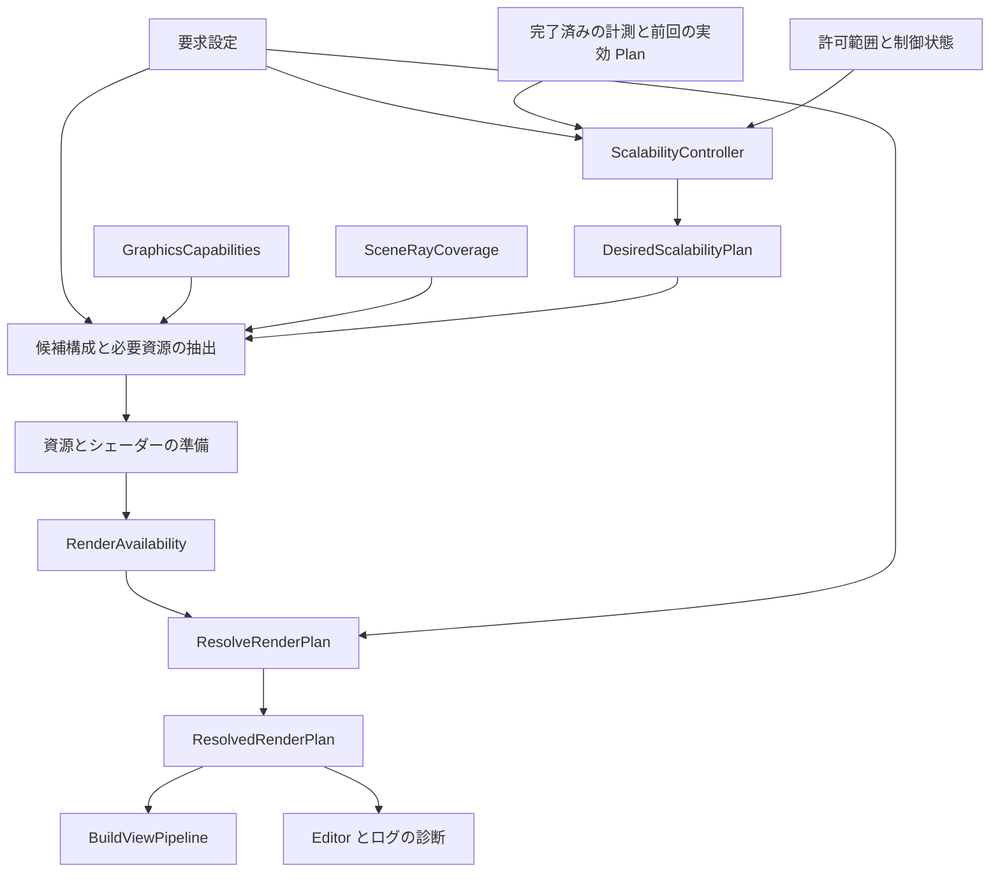
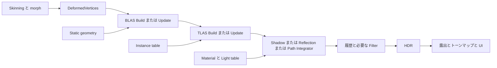
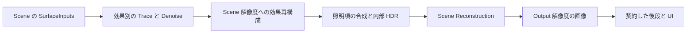

<!-- @file    RayTracing.md -->
<!-- @brief   Raster の継続運用と Hybrid Ray Tracing から Path Tracing への段階導入設計。 -->
<!-- @author  Hasegawa Jin -->
<!-- @date    2026-09-30 -->
# Raster と Ray Tracing と Path Tracing の描画設計

- 状態: 設計案。2026-09-30 の `feature/ray-tracing` を調査し、段 0 の GPU 能力公開と純粋な構成解決 API に着手した。RT の GPU 実行と既存ビューへの接続は未実装。
- 結論: Graphics の既存境界を維持し、ビュー単位の描画モードと効果単位の供給方式を分離する。反射は材質・画面上の寄与・情報の有効度・予算に応じて ReflectionProbe / SSR / RT を選び、カメラ距離は任意の LOD 補助にする。Raster を常設し、Hybrid RT と Path Tracing が交差判定・材質・光源・GPU 資源管理を共有する。
- 初期方針: DX12 の Inline RayQuery を使う。最初の製品向け効果は RT Shadow、最初の Path Tracing は静的シーンの Progressive 表示とする。
- ゲーム向け方針: Hybrid を段階導入し、最終的に InGame の RealTime Path Tracing を選べるようにする。参照用の積分器を先に検証する順序は、Path Tracing を静止画専用に限定する意味ではない。
- スケーリング方針: 全体の内部解像度、効果別の計算解像度、サンプル予算、更新頻度、供給方式を別の軸にする。品質の下限と変更可能な項目を定め、実測から実効 Plan を調整する。Raster にも同じ仕組みを適用する。

Path Tracing は、レイによる交差判定に確率的な光輸送の積分を組み合わせる手法である。交差判定の基盤は先に必要だが、Whitted 型の再帰反射レンダラーを完成させることは必須ではない。ユーザー提供の [Path Tracing 解説](https://rayspace.xyz/CG/contents/path_tracing/) を理論の出発点とし、同じ交差基盤を Hybrid の効果と Path Tracing の双方から使う。

## UE と RE ENGINE の公開設計をどう取り入れるか

2026-09-30 に Epic の公式ドキュメントと CAPCOM 開発者の公開資料を確認した。UE の資料は閲覧時の 5.8、RE ENGINE は RE:2023、GDC 2026 の講演と 2026-07-16 の開発者インタビューを参照する。年代と用途が違う仕組みを、同じ製品構成として扱わない。

以下は資料で確認した事実と、そこから選ぶ FBZZ の設計方針である。右列は本エンジンへの提案であり、UE / RE ENGINE の内部実装そのものではない。

| 公開資料で確認した仕組み | FBZZ への採用方針 |
|---|---|
| UE Lumen は Screen Traces を先に使い、不足分を Hardware / Software Ray Tracing へ送る。ヒット照明には Surface Cache と Hit Lighting がある。[Lumen Technical Details](https://dev.epicgames.com/documentation/unreal-engine/lumen-technical-details-in-unreal-engine) | ゲーム用反射は SCREEN_FIRST を既定案にし、SSR の不足部分を材質・寄与・被覆・予算に応じて RT が補完する。交差判定とヒット照明の評価を分ける |
| UE は間接光と反射を別の品質グループで調整する。roughness と内部解像度で反射コストを制御し、SSR へ置き換える設定もある。[Lumen Performance Guide](https://dev.epicgames.com/documentation/unreal-engine/lumen-performance-guide-for-unreal-engine?lang=en-US) | RT の一括 On / Off だけにしない。Shadow / Diffuse GI / Reflection の供給者と予算を独立に解決する。roughness の閾値は FBZZ で計測して決める |
| UE Path Tracer は共通の RT アーキテクチャを使う参照・制作向けの経路で、リアルタイム向け RT と同じ描画コードではない。[Path Tracer](https://dev.epicgames.com/documentation/en-us/unreal-engine/path-tracer-in-unreal-engine) | Ray Scene と表面・光源の契約を共有し、参照の推定器をゲーム用の近似や再構成から独立して検証する。Lumen をそのままフル Path Tracing と呼ばない |
| RE:2023 は低サンプルでの再構成、disocclusion 用の追加レイ、線形空間の filter、反射に応じた motion の課題を報告する。[Advances in Ray Tracing, slides 19–34](https://www.docswell.com/s/CAPCOM_RandD/K24Y66-RE2023) | denoise を付属処理として後回しにしない。履歴がない領域の予算と、Diffuse / Specular で異なる履歴入力を Reflection 段から設計する |
| RE ENGINE の GDC 2026 資料は GBuffer から最初のヒット情報を取得し、Path 用 Lighting が直接光を含めて置換し、その後に半透明を描く構成を示す。[GDC 2026, slides 9–10](https://www.docswell.com/s/CAPCOM_RandD/5DM2NL-gdc2026-implementing-real-time-path-tracing-in-re-engine) | GAME の開始点は RasterSurface、REFERENCE は CameraRay を初期案にする。ゲーム用の Raster 合成は対応範囲と近似を明示し、参照用の完全性条件と分ける |
| 2026 年の RE ENGINE 開発者インタビューでは、参照 Path Tracer を検証してからゲーム用へ発展させ、RayQuery、NEE、独自 ReSTIR GI、DLSS Ray Reconstruction を使用したと説明する。従来の RT と Probe GI も支える。[CAPCOM 開発者インタビュー](https://developer.nvidia.com/blog/qa-how-capcom-brought-path-tracing-to-re-engine-across-pragmata-and-resident-evil-requiem/) | Inline の共通基盤 → 参照検証 → InGame 用再構成という順序を採る。Raster / Hybrid / Path の並存を前提にする。ReSTIR と外部 denoiser は測定後の拡張候補にする |
| UE の RDG は Texture と Buffer の依存・寿命・同期を管理し、パスの削除やメモリ再利用を行う。[Render Dependency Graph](https://dev.epicgames.com/documentation/en-us/unreal-engine/render-dependency-graph-in-unreal-engine) | 現行 RenderGraph を維持し、Buffer / AS の明示依存を追加する。「画像中心の登録 API」はゲーム用途に不適切という意味ではない |

両エンジンの資料から参考にするのは、限られた予算で複数の情報源を組み合わせる方法と、参照画像を保ちながらゲーム用へ発展させる方法である。Lumen の Surface Cache / SDF / Far Field、RE ENGINE の denoiser や材質対応を丸ごと導入する方針ではない。まず FBZZ にある RenderScene、ReflectionProbe、SSR、LightProbe、RenderGraph を接続する。

### 距離とキャッシュについての適用範囲

「近い反射面は RT を許可し、遠い反射面は Probe を使う」という当初の FBZZ 案は、既定の方式選択には採用しない。カメラ距離は品質配分の安い手掛かりになるが、画面上の大きさ、反射の強さ、Probe の近似誤差を単独では表せない。材質と画面上の寄与を主判断にし、距離 LOD は品質の下限を守る任意の補助にする。

UE の Far Field は遠方シーンへの追跡を低コストで延長する仕組みであり、遠い反射面を cubemap に置き換える規則ではない。今回確認した RE ENGINE の公開資料にも、SSR / RT / ReflectionProbe を同じカメラ距離帯で選ぶ実装の記述はない。方式選択、レイの探索距離、Ray Scene の保持範囲を別々に設計する。[Lumen Performance Guide](https://dev.epicgames.com/documentation/unreal-engine/lumen-performance-guide-for-unreal-engine?lang=en-US)、[RE:2023](https://www.docswell.com/s/CAPCOM_RandD/5RXJP4-RE2023)

RT の hit と、その地点の照明を求める処理を分ける。初期の `HitLightingMode` は `EVALUATED` とし、共通 Surface / BSDF と RayLightTable から評価する。将来の `CACHED` は位置・法線・方向・材質・版を入力とするキャッシュ契約と、miss 時の再評価を備えた後に追加する。キャッシュに正しい表面や照明が入っていない場合を、黒い有効ヒットとして返さない。

既存 LightProbe の L2 データや ReflectionProbe の prefilter は、Lumen の Surface Cache と同じ情報ではない。拡散向けデータを鋭い鏡面方向の放射輝度として直接読み替えず、RT がヒットした物体へカメラ用 HDR の色を投影して正しい照明とみなさない。初期段には新しい大規模キャッシュの実装を要求しない。

参照用 Path は照明キャッシュや SSR / Probe で経路を置換しない。ゲーム用に導入する近似は Plan に記録し、同じ表面・光源条件の参照画像と比較する。SDF による Software RT は現在のデータ基盤にないため、DXR がない環境の初期フォールバックは既存 Raster とする。

## 現在の実装と設計の接続点

以下は作業ツリーのコードで確認した事項。既存文書には移行前の型名や経路の説明も残っているため、実装済みの範囲と今後の提案を区別する。

| 確認した場所 | 現状 | 今回の接続方針 |
|---|---|---|
| `Projects/Graphics/CMakeLists.txt` | `FBZZGraphics` は独立した SHARED ライブラリ。Core / Math に依存し、DX12 は非公開実装 | RT も Graphics 内に置く。Engine / Physics / Fluid への逆依存を作らない |
| `Renderer/RenderSettings.hpp` | Forward / Deferred / ForwardPlus / DeferredPlus と画質設定がある | 既存値を Raster の設定として維持し、描画モードを別に追加 |
| `Renderer/OpaqueRenderPlan.hpp` | 必須資源が欠けた Deferred を Forward へ解決する純粋関数がある | 上位の `ResolvedRenderPlan` にこの結果を含める |
| `Renderer/RenderScene.hpp` | Scene ポインターを含まない描画候補と解決済みハンドルを持つ | 同じ候補から Raster キューと Ray Scene を構築 |
| `Pipeline/GeometryPipeline.cpp` | Forward / Deferred の登録関数が分かれ、同じグラフへパスを積む | Raster の構成を残し、RT の生産者と消費者を組み込む |
| `Pipeline/ViewPipeline.cpp` | ビューの資源宣言・ジオメトリ・水・ポスト処理・UI を構成する | 最終 Plan を受け取り、モード別の HDR 生産者を選ぶ |
| `Assets/Shaders/Pipeline/Deferred/GBuffer.hlsl` | 3 枚に albedo / roughness、shading normal / metallic、線形 HDR emission を保存。材質 ID・幾何法線は出力しない | emission の欠落は修正。GAME Path の SurfaceInputs には依然として追加出力または検証済みの再構築が必要 |
| `Pipeline/PassResources.hpp` | 実体の登録と取得は RenderTarget / Texture が中心 | Buffer と AccelerationStructure を型付きで追加 |
| `Renderer/Platform/DX12/DX12Context.hpp` | DXR Tier、Inline RayQuery、Ray Pipeline の能力を検出済み | 能力をバックエンド非依存の値として `IRenderer` から公開 |
| `Renderer/RenderSettings.hpp` / `Renderer/QualityPreset.cpp` | 手動 `renderScale` と Low / Medium / High / Ultra がある。倍率は 0.5–2.0、内部寸法に床がある | 既存の要求値とプリセットを維持し、自動調整の実効値を別に持つ |
| `Pipeline/RenderResources.cpp` | 内部寸法の変更でビューの中間資源と TAA 履歴を作り直す。露出・霧など一部は維持 | 資源を解像度の領域と用途で分け、効果別の変更を局所化する |
| `Passes/PostProcess/UpscalePass.cpp` / `Pipeline/ViewPipeline.cpp` | 内部解像度で仕上げた LDR を Catmull-Rom 等で拡大し、UI は出力実寸で描く。現行 TAA は内部解像度の LDR | 既存の空間拡大を互換経路として残す。HDR の Temporal Upscale は別契約・別の検証段で追加 |
| `Renderer/IRenderer.hpp` / `DX12Renderer.cpp` | フェンス完了後の GPU パス時間を取得できる。公開結果は名前と ms の組 | 自動制御には計測元のフレーム・ビュー・Plan の版・完全性を追加。現在の遅延結果を今フレームの構成と混同しない |

反射の既存実装には、次の接続点と制約がある。

| 確認した場所 | 現状 | 今回の接続方針 |
|---|---|---|
| `Engine/Scene/Components/ReflectionProbeComponent.hpp` | 球 / box の影響範囲、Static / DynamicSky / DynamicScene、更新間隔を持つ | 捕捉機構を再利用し、反射点で選べる probe table を Graphics へ渡す |
| `Engine/src/Scene/Systems/RenderPasses/Geometry/ReflectionProbeCapturePass.cpp` | 動的な有効 probe のうち、カメラが影響範囲内にいる最寄り一個を選ぶ | まず互換動作を維持し、その後、反射面の worldPos と influence で選択・ブレンドする |
| `Engine/src/Scene/Systems/RenderSystem.cpp` | 選んだ動的 probe がグローバル IBL の irradiance / prefilter スロットを置換する | 鏡面の反射供給と拡散環境光の選択を分離する |
| `Assets/Shaders/Rendering/IBL.hlsli` | roughness に応じた prefilter と BRDF LUT で鏡面環境光を評価 | Probe / IBL の鏡面項だけを反射 resolver へ渡す |
| `Assets/Shaders/PostProcess/Reflections/SSR.cs.hlsl` | HDR と深度を追跡し、画面外・未交差では無効。roughness で confidence を下げる | SSR の出力を共通反射契約へ変換し、材質・寄与・有効度から補完要求を作る |
| `Assets/Shaders/PostProcess/Color/Composite.hlsl` | SSR の alpha と intensity で HDR 全体を lerp する | 新構成では IndirectSpecular だけを置換し、直接光・拡散・発光を保つ |

表の `Engine/Scene/Components/` は `Projects/Engine/include/` に、`Engine/src/` は `Projects/Engine/src/` に対応する。Static probe の読み込み経路は、動的 probe を選ぶ上記関数と別に監査する。Static を現在の動的選択と同じ対応範囲とみなさない。

表の Graphics 内のパスは `Projects/Graphics/include/Graphics/` または `Projects/Graphics/src/` に相対する。

現行の起動条件は SM 6.8 と bindless 対応であり、DXR 対応は起動必須条件ではない。DX11 は撤去済みなので、Raster フォールバックも DX12 上で動く。本設計は既存の起動条件を広げず、DXR のない既存対応環境で Raster を維持する。根拠は `DX12Context.cpp` と [dx11-removal.md](dx11-removal.md)。

既存の [graphics-library.md](graphics-library.md)、[pipeline-boundary.md](pipeline-boundary.md)、[render-graph.md](render-graph.md) の入力・経路・寿命の契約を引き継ぐ。

## 描画モードと効果の分離

バックエンド、描画モード、Raster の不透明方式、光の供給方式、画質を別の軸として扱う。

| 軸 | 値の案 | 意味 |
|---|---|---|
| Backend | 現行 DX12 | GPU API の実装 |
| RenderMode | `RASTER` / `HYBRID` / `PATH_TRACING` | シーンの HDR を作る構成 |
| Raster pipeline | 既存の Forward / Deferred / Plus | Raster の不透明描画とライト供給 |
| Shadow provider | ライトごとの ShadowMap / RayTraced | 直接光の可視性 |
| Specular indirect policy | 材質・画面上の寄与・有効度・予算に応じた SSR / ReflectionProbe / IBL / RayTraced | 鏡面間接光の供給と切替。距離 LOD は補助 |
| Diffuse indirect provider | LightProbe / IBL、または RayTraced | 拡散の間接光 |
| PathTracing profile | `REFERENCE` / `GAME` | 検証用の推定器か、明示した予算・近似を持つゲーム用か |
| Path primary visibility | `CAMERA_RAY` / `RASTER_SURFACE` | 最初の可視面の取得。直接光を計算する方式とは別 |
| PathTracing mode | `PROGRESSIVE` / `REALTIME` | 静止時の蓄積か、動的な画像の再構成か |
| Quality | 既存プリセットと効果別の予算 | 解像度、サンプル数、経路長、更新コスト |
| Scaling policy | 手動固定 / 予算内の自動調整 | 要求設定を維持したまま、許可された項目の実効値を調整 |
| Scene reconstruction | 既存 Spatial / 将来の Temporal | シーンの内部画像を出力解像度へ再構成。効果別の denoise と役割を区別 |

`RenderingPipeline` に RayTracing / PathTracing を継ぎ足さない。既存の ForwardPlus / DeferredPlus は引き続き「不透明方式とクラスタライト供給」の組であり、DXR の能力と独立する。

| モード | 主可視性 | ライティング | 既存表現との関係 |
|---|---|---|---|
| Raster | Raster | 既存の直接光・影・SSR・プローブ | 現在のゲーム描画を継続 |
| Hybrid | Raster | 選択した影・鏡面間接光・拡散間接光を RT へ置換 | 水・透明・VFX 等は既存経路。各効果の対応範囲を診断 |
| Path Reference | カメラからのレイ | Integrator が直接光と間接光を計算 | 参照に必要な全表現を追跡。UI・選択表示は後段 |
| Path Game | 初期は RasterSurface。必要な表面情報を Raster で取得 | 対応した不透明面の直接光と間接光を Integrator が計算 | 許可した透明・VFX 等を Raster 合成。追跡に含まれない寄与は近似として記録 |

Hybrid は「RT Shadow + SSR + LightProbe」のような混在を許す。Path が照明を担当する表面には SSR / IBL の近似照明 / AO / ShadowMap / Raster の直接光を重ねない。GAME で許可した Raster 合成の受け手が使う照明は、その対象の別契約である。環境マップ自体は、ぼかしていない環境の放射輝度として利用できる。

最初の Path 構成は `REFERENCE + PROGRESSIVE + CAMERA_RAY`、InGame 用の到達点は `GAME + REALTIME + RASTER_SURFACE` とする。ゲーム用を静止させて Progressive で比較することもできる。ただし開始面・材質 filter・許可した合成も比較条件へ含め、同じ積分器だけで画像が一致するとはみなさない。

初期 GAME は Deferred / DeferredPlus の対応した不透明 PBR 面から始める。既存 GBuffer を SurfaceInputs に拡張し、照明パスを PathLighting へ置換する。Forward の DepthNormalPrepass を完全な材質入力とはみなさず、Forward 用 SurfaceInputs adapter は別段で追加する。GAME が対応する Raster 方式を暗黙に変更せず、未対応の要求は診断して設定済み Raster へ戻す。PrimaryVisibility の値は Plan に持つが、初期には上記二つの組合せだけを実装する。

## 実効構成とフォールバック

要求設定は保存し、実行可能な構成はビューごとに別の値へ解決する。各パスと UI が要求設定から独自に可否判定する形を増やさない。



`ResolveRenderPlan` は設定・能力・被覆・資源準備結果・スケーリング希望を受ける純粋関数とする。GPU 資源生成、Scene 走査、アセット読み込みは関数の外で済ませる。準備は必要候補に限定し、失敗した任意資源を毎フレーム無制限に再生成しない。Controller の希望が準備結果で修正された場合は、実際に採用した Plan を次回の制御へ返す。

| Plan に含める情報 | 内容 |
|---|---|
| requestedMode / effectiveMode | 要求と実効の描画モード |
| primaryVisibility / compositionPolicy | CameraRay / RasterSurface、Path が担当する面、許可した Raster 合成と省略するレイ寄与 |
| rasterPlan | 既存 `OpaqueRenderPlan` と実効 LINEAR / CLUSTERED |
| shadowProviders | ライト ID ごとの方式と受け手の対応範囲 |
| indirectProviders | 拡散の供給者、鏡面の反射 policy、明示したフォールバック。最終照明項への反映は一回 |
| rayExecution | Inline / 将来の Ray Pipeline / 無効 |
| quality | 実効解像度・サンプル数・経路長・履歴方式 |
| resolutionPlan | 出力・シーン・効果ごとの active extent、allocation extent、valid rect、再構成方式 |
| scalingDecision | 要求の上下限、計測したボトルネック、変更項目、保持期間、予算未達の理由 |
| pathProfile / approximations | 参照 / ゲーム用、照明キャッシュ・radiance clamp 等の実効近似。比較画像にも記録 |
| outputs | HDR・深度・法線・速度・被覆などの利用可否 |
| diagnostics | 縮退した機能、対象 ID、理由コード、復帰条件 |
| historyEpochs | 効果ごとの方式・推定器・資源の世代。履歴の継続 / 再写像 / 棄却を個別に判定 |

初期の解決規則は次のとおり。

| 状況 | 実効動作 |
|---|---|
| Raster を要求 | RT 資源を確保せず、既存 Raster 構成を使用 |
| Hybrid で Inline 非対応 | Raster。影は ShadowMap、反射は SSR / Probe / IBL、拡散間接光は LightProbe / IBL |
| RT の特定効果の資源や対応表現が不足 | その効果を既存供給者へ戻す。他の成立する効果を維持 |
| REFERENCE で必要表現が不足 | ビュー全体を設定済みの Raster pipeline へ戻し、未対応対象を表示 |
| GAME で必要な不透明面・二次レイ対象・RasterSurface 入力が不足 | 許可した近似に含まれなければ、ビュー全体を設定済みの Raster pipeline へ戻す |
| GAME の許可した Raster 合成対象 | 指定した段で合成し、未追跡の遮蔽・反射・発光等を近似として診断。存在だけで全体を縮退しない |
| Path Tracing の資源準備に失敗 | ビュー全体を Raster へ戻す |
| Deferred または Clustered の資源不足 | 既存規則に従い Forward または LINEAR へ縮退 |
| Raster の必須出力も生成できない | 描画失敗を返す。そのフレームを有効な画像として公開しない |

能力・被覆・必須資源の不足による Path Tracing の復帰先は、常設する Raster を初期既定とする。性能予算による GAME → Hybrid の降格は、利用者が許可し、復帰用の画面入力・シェーダー・資源を準備できた場合だけ選ぶ。モード名を切り替えるだけで、未準備の Hybrid を実行可能とみなさない。REFERENCE は性能予算で方式を自動変更しない。

縮退はグラフ登録前に確定する。記録中に回復不能な RT エラーが発生したフレームは成功扱いせず、次フレームを Raster に解決する。GPU の device removal はデバイス復旧の対象であり、壊れたデバイス上で Raster を続ける意味のフォールバックではない。

常設する Raster は復帰可能な構成を持つという意味であり、必要資源が自動的に揃う保証ではない。準備段は共通の出力・深度と最低限の Raster 復帰先を検証し、PSO・材質・active extent・Scene / device 世代が成立することを RenderAvailability に記録する。RT 候補にだけ成功した資源を、Raster の準備成功と読み替えない。ShadowMap や SSR 等への効果別復帰も、選んだフレームで必要な入力を生成する graph とセットにする。古い ShadowMap があるだけで現在の影へ復帰しない。

準備は希望の候補と限定した復帰先に絞り、全プリセット・全方式を常駐させない。失敗後に候補を無制限に確保し直さず、復帰先の必須資源も成立しなければ描画失敗を返す。新旧資源の退役待ちを含めたピーク容量を予算化する。

一時的な予算不足からの復帰には待機期間と閾値の差を設け、毎フレームの往復を防ぐ。能力不足はデバイス再生成まで、シェーダー失敗は版更新まで再試行を抑える。診断は状態変化時にログへ出し、Render Pass Viewer と設定 UI が同じ Plan を表示する。

### GPU 能力とシェーダーの扱い

`IRenderer::GetCapabilities()` で実機の機能を公開する。初回の `GraphicsCapabilities` は bindless / inlineRayQuery / rayTracingPipeline の bool を持ち、D3D の型を Engine やパスへ露出しない。未初期化・終了済みの backend は全項目を false とする。実機能力と描画パス・シェーダー・資源の準備成功は別に解決する。

初期 RT の実行条件は、既存起動条件に加えて DXR Tier 1.1 以上の Inline 対応と、必要なシェーダー・資源の準備成功とする。現行 `DX12Context::SupportsInlineRaytracing()` の判定を公開契約へ接続する。SM の高さだけで DXR 対応を認定しない。DXR Tier は [OPTIONS5 の能力照会](https://learn.microsoft.com/en-us/windows/win32/api/d3d12/ns-d3d12-d3d12_feature_data_d3d12_options5) で取得する。

Inline RT は Compute 内で実行でき、Ray Pipeline と同じ加速構造を利用する。既存 `Dispatch` と bindless に接続しやすいので、初期方式として選ぶ。Path Tracing もまずループ型の Inline 実装を使える。DispatchRays / Shader Binding Table の導入は Path Tracing の前提条件にしない。[Microsoft の Inline RT 説明](https://devblogs.microsoft.com/directx/dxr-1-1/)

RT シェーダーは Raster と別の variant / PSO とし、非対応 GPU で RT PSO を作らない。現在の `RAY_QUERY_SUPPORTED` マクロはシェーダー言語側の条件であり、実機能力の代用にしない。Tier 1.0 だけの環境は初期には Raster とし、Tier 1.0 専用の第二実装は必要性を測ってから判断する。

## 共通入力とマテリアルと光源

### RenderScene から Ray Scene を作る

Engine の既存 `RenderSceneExtractor` が GUID・MaterialSlot・骨・Scene の生存を解決し、Graphics が `RaySceneBuilder` で GPU の交差入力を構築する。Graphics は Scene / Component / AssetDatabase を参照しない。Physics の Raycast / BVH は衝突形状の問い合わせであり、描画用の詳細形状・材質を扱う RT 基盤には使わない。

| 入力の案 | 必要な情報 |
|---|---|
| RayGeometry | 安定した geometry ID と版、頂点・index のハンドルと範囲、stride・位置形式、submesh 範囲、変形方式、opacity 区分 |
| RayInstance | Scene 世代を含む object ID、geometry 参照、現在 / 前回の行列、geometry ごとの material ID、用途別可視性 |
| RayMaterial | 共通の表面モデル・パラメーター・テクスチャ添字・版・対応能力 |
| RayLight / Environment | 解決済み光源と環境の放射輝度、光源選択用データ、版 |
| SceneRayCoverage | 必要な対象の形状・alpha 判定・ヒット時シェーディング・光源が表現できるか |

主カメラの視錐台や Hi-Z の結果で Ray Scene を絞らない。画面外の物体も影・反射・間接光に寄与する。距離で追跡範囲を切る最適化は、効果の最大レイ距離とフォールバックをセットで明示する。

BLAS は Graphics context 内の geometry ごとに共有する。TLAS は Scene 世代・レイヤー等の可視対象集合・フレームの版が同じ場合に共有する。Scene View と Game View の対象集合が違う場合は別 TLAS とし、主カメラの集合を他ビューへ流用しない。GPU 変形は対象インスタンスごとにフレーム一回、蓄積とノイズ履歴はビューごとに持つ。

BLAS の共有キーには geometry の ID / 内容版だけでなく、submesh の構成、頂点形式、geometry ごとの opacity flags と build 方針を含める。同じ mesh を別インスタンスが異なる alpha 材質で使う場合、Opaque の BLAS を共有して candidate 判定を飛ばさない。初期は opacity 構成ごとの variant に分ける。両面区分が混在し instance 単位の culling 設定で表せない構成も、互換な geometry 範囲へ分け、同じ object ID への対応を保持する。

Raster の画面依存 LOD dither を、そのまま二次レイの opacity として使わない。初期の照明比較は LOD と fade を固定し、GAME の RT LOD / fade を追加する段で被覆・一次面との一致・履歴を検証する。Ray Scene の収集前に Raster の visible / lodVisible だけで候補を捨てない。

DXR の InstanceID は 24 bit、InstanceMask は 8 bit なので、EntityID や Engine の layer mask をそのまま切り詰めて格納しない。密な instance table の添字から完全な object ID へ対応させる。レイヤーは TLAS の対象集合へ反映し、8 bit は PRIMARY / SHADOW / SPECULAR / DIFFUSE 等のレイ用途に割り当てる。`castShadows=false` は SHADOW だけを外す。[DXR instance descriptor](https://learn.microsoft.com/en-us/windows/win32/api/d3d12/ns-d3d12-d3d12_raytracing_instance_desc)

`InstanceID + GeometryIndex + PrimitiveIndex` から、index・頂点・material を引ける表を GPU に保持する。表の並び替えと TLAS を同じ版で公開し、前フレームの表を新 TLAS に組み合わせない。行列の格納順、負スケール、非一様スケール、法線変換は Math と DX12 の変換境界で固定する。

### Raster と RT の表面モデル

既存の `.mat` と MaterialSlot を正本として維持する。RT 専用 `.rtmat` や二重のパラメーター編集を作らず、Engine 側が `SurfaceMaterialData` へ解決する。

最初の表面モデルは metallic / roughness の標準 PBR とする。baseColor、metallic、roughness、emission、normal、UV、alpha cutoff、doubleSided を共通データで扱う。`EvaluateBsdf` / `SampleBsdf` / `PdfBsdf` が同じモデルと確率分布を使う契約を追加する。

Surface の構築には texture と定数だけでなく、UV 変換、tint、濡れ等の共有する材質入力も含める。幾何法線と normal map 適用後の shading normal を区別し、交差の表裏・レイ原点の補正に shading normal を代用しない。SpecularAA 等の画面微分に依存する roughness filter は物理的な材質値と区別し、GAME の primary filter と二次レイの footprint を明示する。画面微分を取得できない RT へ Raster の式をそのまま移さない。

現在の `Assets/Shaders/Rendering/BRDF.hlsli` には BRDF 評価があるが、Path Tracing 用の BSDF sampling / PDF 契約は別途必要である。既存の roughness の下限や幾何減衰の近似も監査対象とする。共有化で Raster の絵が変わる修正は独立した変更として検証し、ファイル移動だけの無差分を主張しない。

| 能力 | 意味 |
|---|---|
| geometry / deformation | Raster と同じ面を交差判定できる |
| opacity | alpha clip と交差の表裏の扱いを一致させられる |
| surface / bsdf | ヒット点の表面と BSDF を評価・サンプリングできる |
| screen inputs | 深度・法線・速度等を Raster から得られる |

これらを一個の `supportsRayTracing` にまとめない。独自色シェーダーでも形状と alpha が一致すれば影の遮蔽者にはなれる。BSDF が未定義なら RT Reflection のヒット対象や Path Tracing の表面としては未対応である。

未知の Toon / Dissolve / 特殊ローブ / 頂点変形を、標準 PBR のフラグだけで対応済みにしない。明示した surface variant と検証済みの対応情報を要求する。Raster 内の `ResolveGeometryRoute` は維持し、RT の能力判定と別に扱う。

Alpha clip は Raster と RayQuery の candidate 判定で同じ UV・cutoff・テクスチャを使用する。Opaque として自動確定したヒットを後から捨てる形にはしない。DXR の opaque 区分が変わる場合は BLAS の版も更新する。レイには自動の画面微分がないため、テクスチャの LOD は初期の明示 LOD と、後段の ray footprint による推定を区別して検証する。

### 誘電体の透過・屈折

画像のような閉じたガラス球には反射 BRDF だけでなく、透過 BTDF を含む BSDF が必要である。現在の標準 PBR は物理的な屈折・透過・内部吸収を持たない。`alpha` は被覆・合成の契約として維持し、光の透過率には流用しない。材質へ IOR の数値だけを保存しても、対応する表面評価と積分器がなければガラス対応にはならない。[PBRT Dielectric BSDF](https://pbr-book.org/4ed/Reflection_Models/Dielectric_BSDF)

共通 `.mat` / `SurfaceMaterialData` に追加する候補は次の通り。これらは設計段階の項目であり、今回の標準 PBR とサンプル材質には未実装のキーを記入しない。

| 項目 | 単位・既定と契約 |
|---|---|
| `transmission` | [0, 1]、既定 0。誘電体の透過ローブの量。反射・拡散とエネルギーを分配し、metallic と独立に透過を足し算しない |
| `ior` | 無次元、既定 1.5。材質内の屈折率。境界での相対 IOR は入射側・出射側の媒体から求める |
| `attenuationColor` | 線形 RGB、既定 [1, 1, 1]。指定距離を通過した後の媒体内透過率。baseColor とは分ける |
| `attenuationDistance` | 正の m。吸収係数へ変換し、レイが媒体内で実際に通過した距離へ適用する |
| `thinWalled` | 既定 false。薄い板と閉じた固体を区別する。初期対応は閉じた固体に限定し、薄膜の散乱モデルは別途定義する |

吸収のみの媒体は距離に対する指数減衰を使う。Raster 向け厚みの近似値を追加する場合も、Ray / Path の交差から求めた実距離へ置き換えない。[PBRT Transmittance](https://pbr-book.org/4ed/Volume_Scattering/Transmittance)

最初の実装は、空気中にある重なりのない閉じた滑らかな誘電体とする。幾何法線で入射・出射を区別し、Snell の屈折、Fresnel による反射・透過のサンプリング、全反射、媒体内の距離吸収、radiance の IOR 補正を同じ BSDF 契約で検証する。内側の面も交差対象に含め、外側の面から入った光を一度の交差で背景へ抜かない。roughness のあるガラス、重なった媒体、薄膜、分散は後段で拡張する。

DXR の geometry opaque flag は candidate の alpha 判定を省けるという意味であり、光学的に透過しないことを意味しない。alpha clip がないガラスでも最近接の境界へ交差させ、以後の光輸送は BSDF が決める。影も単純な alpha blend の割合には置き換えず、初期積分器の可視性と対応範囲を明示する。

Raster の常設経路には別途、画面内の屈折と Probe / 環境による補完を検討する。これは閉じた固体の入出射や画面外の遮蔽を完全には再現しない近似である。透明を扱わない初期 GAME の RasterSurface をガラスまで対応済みにしない。Reference の対応を先行し、GAME の透明は専用の表面入力・再構成とともに拡張する。

交差基盤や不透明 RT Reflection の完成を遅らせるための前提にはしない。段 3 で拡張できる材質契約を揃え、段 4 の拡散・金属を確認した後に段 4a として実装する。通常の一方向 Path Tracing で屈折を実装しても、集光模様の収束速度まで保証されるわけではない。caustics 向けのサンプリング最適化は別段とする。

### 光源と数学の契約

Raster のクラスタは主カメラ向けのライト供給なので、画面外のヒット点で使う光源集合には流用しない。Scene 全体の `RayLightTable` を別に構築し、初期は単純な光源選択分布を使う。多数光源向けの選択加速は後から置換する。

`SampleLight` は入射方向、距離、放射輝度、光源選択確率を含む PDF、delta 区分を返す。`PdfLight` は BSDF サンプルとの MIS に必要な確率を返す。点光源・方向光、有限面光源、emissive mesh、環境の違いを明示する。

ワールドの長さは m、方向は正規化、`wo` / `wi` はヒット点から外向きとする。BSDF は立体角に関する PDF を返す。面積 PDF の光源サンプルは距離と光源側 cosine で同じ測度へ変換し、光源選択の PMF を乗算する。delta 光源・delta BSDF は連続 PDF と区別する。[PBRT の Path Tracing](https://pbr-book.org/4ed/Light_Transport_I_Surface_Reflection/Path_Tracing)

二次レイと shadow ray の生成は共通の SpawnRay 契約へ集約する。ヒット点の再構築・座標変換の誤差を考慮して幾何法線方向へ補正し、方向に応じた表裏と有効な TMin / TMax を決める。全シーンに固定の大きな epsilon を掛けて自己交差を隠さない。有限面光源への可視性では到達側の誤差も扱い、光源面自身を遮蔽者にしない。[PBRT の誤差管理](https://pbr-book.org/4ed/Shapes/Managing_Rounding_Error)、[DXR の自己交差対策](https://developer.nvidia.com/blog/solving-self-intersection-artifacts-in-directx-raytracing/)

GAME の RasterSurface からレイを出す場合は depth 復元と Raster / RT の形状差も誤差源になる。初期検証は同じ geometry / LOD で行い、相違がある経路には整合確認と、必要なら検証済みの primary recast を追加する。通常の RayQuery ヒット向け offset だけで GBuffer の位置ずれまで解決したとはみなさない。公開例の数値定数が全 GPU で同じ誤差上限を保証するとも扱わない。

既存ライトの intensity を型ごとに確認し、現在の絵と物理量の対応を文書化してから変換する。数値をそのまま別の単位として解釈しない。環境には未畳み込みの HDR 放射輝度を使う。空の太陽と方向光、emissive mesh と対応する面光源は同じ発光源を二重計上しない。

## 加速構造と GPU の寿命

加速構造 AS はレイと形状の交差を高速化する GPU データである。BLAS は geometry、TLAS はその配置を扱う。本設計では Graphics のキャッシュがハンドルを管理し、ResourceManager が GPU 実体を単独所有する。

| 対象 | 初期構築 | 更新 |
|---|---|---|
| 静的 mesh | geometry と版ごとに BLAS を作り共有 | 頂点・topology・opacity 区分の変化時に再構築 |
| 剛体の移動・回転・scale | BLAS は共有 | TLAS の transform を更新 |
| Skinned / morph | インスタンス固有の変形後頂点で BLAS を作る | topology が同じなら update、変わったら rebuild |
| インスタンス追加・削除・LOD 差し替え | 対象集合の TLAS を作る | instance 数や必要な構成が変われば rebuild |
| material の色・roughness | material table を公開 | 通常は AS を作り直さず、照明履歴を無効化 |

Update は初期に `ALLOW_UPDATE` で構築した AS に限定する。形状数・頂点数・index 内容・geometry flags 等の変更を単なる refit として扱わない。変形後 BLAS が変わった場合は、その BLAS を参照する TLAS も更新する。詳細は [DXR の AS update 契約](https://microsoft.github.io/DirectX-Specs/d3d/Raytracing.html#acceleration-structure-update-constraints) と [build flags](https://learn.microsoft.com/en-us/windows/win32/api/d3d12/ne-d3d12-d3d12_raytracing_acceleration_structure_build_flags) に従う。

静的 BLAS は trace 優先、動的 BLAS は更新と trace の合計時間を測って方針を選ぶ。Compaction、部分更新の予算化、再構築の頻度調整は基礎が正しく動いてから追加する。

初期の trace 用 geometry は Graphics が安定した GPU 読み取り用の vertex / index view を用意する。既存 `IBuffer` は頂点 UAV 添字だけを公開しており、ヒットシェーディング用の SRV は追加が必要である。共有可能な元バッファには view を足し、必要な場合だけ RT 用 GPU local コピーを版ごとにキャッシュする。毎フレーム全静的 mesh を複製しない。

Skinned の RT は compute 変形済み頂点を使う。VS スキニングへ戻っているインスタンスや画面外の未更新インスタンスを bind pose で追跡しない。RT に必要な変形要求は Raster の可視性判定に加えて収集し、未準備なら被覆不足として縮退する。

GPU の使用期間は、ハンドルの生存とは別に守る。

- 動的 AS、instance / material table、scratch、変形頂点はフレームスロットとフェンスで保護する。GPU が前フレームを読んでいる領域へ CPU が書き込まない。
- 同じ DIRECT queue 上の GPU 更新は順序とバリアで保護する。将来の別キューとの共有には Signal / Wait も必要となる。
- Scratch の再利用は直列の build 間の同期を満たす場合に限る。同時実行する build や未完了フレームとの重複を許さない。
- BLAS の交換・compaction・解放では、参照する TLAS・GPU table と旧実体の最後の使用フェンスも追跡する。bindless 添字も同じ期間だけ維持する。
- Asset 公開・shader reload・デバイス再生成は既存のフレーム境界に接続する。壊れた版や古い形状の AS を、今フレームの有効な代替として使わない。

通常のリソースと違い、AS は `RAYTRACING_ACCELERATION_STRUCTURE` 状態を維持し、build → read 等の同期には UAV barrier を使う。現在の `DX12StateTracker::QueueTransitionAllToCommon()` は AS を除外する必要がある。これは RT 自体を DIRECT queue に置いても、他の AO 等が非同期区間へ入る場合に必要な修正である。[DXR の AS メモリと同期](https://microsoft.github.io/DirectX-Specs/d3d/Raytracing.html#synchronizing-acceleration-structure-memory-writesreads)

初期の AS 構築と trace は DIRECT queue で直列記録する。AS を通常の texture / buffer と alias させず、履歴も transient alias の対象にしない。非同期 RT は AS 専用同期と実測を満たした後の追加段とする。[async-compute.md](async-compute.md)

## RenderGraph と照明の合成

### 型付きの資源宣言

現在の RenderGraph はリアルタイムのゲーム描画を構成する基盤であり、本設計でも継続して使う。ここでいう RenderTarget / Texture は毎フレーム GPU が扱う描画先・深度・中間結果であり、保存画像やオフライン処理を指さない。

UE の RDG も Texture と Buffer の読み書きからリアルタイム描画の依存と寿命を管理している。本エンジンで不足しているのは RT 入力の登録契約であり、RenderGraph という方式の適性ではない。[RDG の資源とビュー](https://dev.epicgames.com/documentation/en-us/unreal-engine/render-dependency-graph-in-unreal-engine)

`ResourceKind::Buffer` は既に存在する。一方、`RenderPipeline::DeclareTarget / DeclareTexture` と `PassResources::Target / Texture` の実体登録・取得 API は、この二種類が中心である。RT には頂点・index・GPU table・AS の明示依存も必要なため、この API を拡張する。ゲームに不向きな graph を作り直す変更ではない。

| 変更先 | 追加する契約 |
|---|---|
| `ResourceHandle` / ResourceManager | `AccelerationStructureTag` と所有・解決・退役。Buffer の読み取り view |
| `IRenderer` | 能力取得、AS の生成・build / update の抽象入口。回復可能な失敗は bool と診断 |
| `ComputeCall` | 型付き TLAS ハンドル。bindless 添字に加えて、backend が使用・寿命を把握できる実ハンドルを渡す |
| `RenderGraph::ResourceDesc` / `ResourceAccess` | AS 種別、buffer の byte size / stride、alias 可否と、build input / AS write / trace read / shader read / UAV 等の用途 |
| `RenderResourceRegistry` / `PassResources` | Buffer / StructuredBuffer / AS の型付き登録と取得 |
| `RenderPipeline` | `DeclareBuffer` / `DeclareAccelerationStructure`、記述と access の指紋への反映 |

GPU virtual address、COM 型、SBT のレコード配置は DX12 内部へ閉じる。Graphics のパスも Engine も `IRenderer&` と型付きハンドルを使い、具象レンダラーへダウンキャストしない。

資源は Setup で読み書きを宣言し、Execute は申告した名前から取得する。スキニング → BLAS → TLAS → trace の順序を登録順だけに頼らせない。GPU table が bindless 経由で参照する geometry / texture の集合も追跡対象とし、table 一個の Read 宣言だけで背後の資源の準備・生存が保証されたことにしない。

Read / Write は graph の依存、用途は backend の状態とバリアを決める契約として分ける。BLAS の頂点・index、TLAS の instance 入力、各 build の scratch、AS 出力、trace の AS と hit shading 用 SRV を明示する。同じ AS 状態のままでも write → read / write は同期を要求する。論理的な Read 宣言だけで必要な UAV barrier が発行済みとはみなさない。



共有準備はフレーム内で一回実行し、各ビューは確定した資源を import する。実装段階では `BuildFramePreparation` を同じ RenderPipeline 基盤で組み、共有準備の graph → 各ビューの graph を明示的に順序実行する。別 graph 間の依存は executor の順序と backend の同期が担い、import だけで自動同期されたとみなさない。

共有準備 graph で本フレームに生成する TLAS / table 等は、`SetOutputs` 相当で明示した出力にする。別のビュー graph の import は、この graph のパス生存判定には伝わらない。変更のない永続資源は有効な版として公開し、書き手のない import を必須の生成出力に指定しない。ビューの RT 需要がゼロなら、出力を残すためだけの AS build を登録しない。

影や画面空間処理などのビュー固有準備は各ビューに残す。Forward / Deferred / Hybrid / Path の各構成は一つのビュー graph の登録関数であり、構成ごとに独立した renderer を実行しない。Raster の共有準備の移動は別段で検証し、初期の RT 無効構成のパス順を保つ。

### Hybrid の置換位置

照明を少なくとも `Emission`、`DirectDiffuse`、`DirectSpecular`、`IndirectDiffuse`、`IndirectSpecular` に区別する。最終 HDR の上から影や反射を一律に掛ける実装は採らない。

| 効果 | 生産物 | 消費位置 | Raster への復帰 |
|---|---|---|---|
| RT Shadow | ライトごとの可視性。初期は主方向光一つ | DeferredLighting / 対応 Forward の、そのライトの直接光項 | 同じライトの ShadowMap |
| RT Reflection | BSDF と整合した鏡面間接光と有効度 | 共通 ReflectionPolicy で解決した IndirectSpecular | SSR、ReflectionProbe / IBL |
| RT Diffuse GI | 拡散の間接放射輝度 | IndirectDiffuse の供給者 | LightProbe / IBL |

RT Shadow で発光・環境光・無関係なライトを暗くしない。SS ContactShadow は同じライトの遮蔽を RT が担う範囲では切り、二重に影を掛けない。水・粒子・体積光等の未対応の受け手が ShadowMap を読む間は、主不透明が RT でも必要な ShadowMap を残す。

Reflection は SSR / IBL に RT の色をさらに足さず、同じ鏡面間接光を一つの resolver で解決する。通常は一つを選び、品質の遷移と部分的な有効度の補完では正規化した重みでブレンドする。拡散 GI もプローブとの加算を避け、置換する。

Hybrid の主可視性は Raster なので、Forward でも必要な depth / normal / roughness / material ID を作る。現在の DepthNormalPrepass は出発点だが、反射用の全表面情報を保証するものではない。未対応材質の被覆を有効扱いにせず、効果を適用する受け手を明示する。

### 材質と画面上の寄与に応じた反射の選択

`ReflectionPolicy` を Graphics の共通契約に置き、Forward / Deferred で同じ規則を使う。方式の適否と、適した方式へ配る解像度・サンプル数を分ける。既定では、カメラ距離だけを理由に RT を禁止したり Probe へ降格したりしない。

| 入力 | 定義 | 用途 |
|---|---|---|
| roughness / specular response | 共通 BSDF の粗さと鏡面応答 | 反射の鋭さと寄与の推定。粗いことだけで Probe の誤差が小さいとはみなさない |
| projected footprint / priority | 画面上の画素数と材質・対象の重要度 | 品質予算の配分。小さい強い反射やゲーム上重要な鏡も保護 |
| SSR confidence | 交差・厚み・画面境界等の有効度 | SSR の採否と RT 補完要求 |
| receiverDistance | カメラから反射面の worldPos までの m | 任意の距離 LOD の補助。既定の方式選択の主条件にはしない |
| maxTraceDistance | 反射面から二次レイを追跡する最大 m | SSR / RT の探索範囲。カメラ距離とは別の近似とコスト制御 |
| probe influence / freshness | 反射面と probe の球 / box の位置関係、捕捉内容の版と更新時刻 | 局所環境の選択と更新遅延の判断。鋭い反射の正しさを保証する値ではない |
| Ray Scene coverage / bounds | 対応する形状・材質と保持するシーンの範囲 | RT が参照できる表現と AS の需要。受け手の距離 LOD と別に解決 |

遠い大きな鏡は画面を広く占め、画面外の人物を鮮明に映すことがある。近い粗い壁は Probe の近似で十分な場合がある。遠い反射面が近傍の人物を映し、近い反射面が遠方の建物を映すこともあるため、受け手のカメラ距離から反射レイの探索距離を決めない。既存 `SSRSettings::maxDistance` もレイの探索距離であり、反射面のカメラ距離ではない。

UE Lumen は roughness に応じて専用の反射レイを制限し、反射解像度も調整する。ただし粗い反射の補完には Lumen GI の情報を使っており、FBZZ の通常の ReflectionProbe と同一ではない。RE:2023 の slides 30–31 は粗い鏡面を別の近似へ置換した際の材質の不整合を報告し、roughness とタイトル予算による高・低解像度の追跡とフィルターを説明している。これらを参考に、Probe への置換と低解像度 RT を別の選択肢にする。[Lumen Performance Guide](https://dev.epicgames.com/documentation/unreal-engine/lumen-performance-guide-for-unreal-engine?lang=en-US)、[RE:2023](https://www.docswell.com/s/CAPCOM_RandD/5RXJP4-RE2023)

初期のゲーム向け方式は `SCREEN_FIRST` を既定案とし、高品質用の `RAY_FIRST` を同じ予算・照明契約の上で選べるようにする。

| 状況 | 優先方式・品質 | 無効時または予算不足時の補完 |
|---|---|---|
| SSR が有効で、要求品質を満たす | SSR。不要な RT を発行しない | 不足部分を寄与と予算に応じて RT、次に局所 Probe / IBL |
| 鋭い反射や重要な鏡で SSR が不足 | 対応範囲内の RT。材質の品質床を維持 | SSR の有効部分と局所 Probe / IBL。品質不足を診断 |
| 広い反射ローブで低解像度の誤差を許容できる | 低解像度 RT と再構成、または検証済みの Probe 近似 | 局所 Probe → グローバル IBL |
| 寄与が小さく、Probe 近似を許可した対象 | 局所 Probe | グローバル IBL |
| RT 非対応・被覆不足・許可予算なし | 有効な SSR | 局所 Probe → IBL。重要な反射の表現不足を診断 |

`SCREEN_FIRST` は SSR の有効度と要求品質を判定してから不足部分へ RT を配り、`RAY_FIRST` は RT 対象に選んだ領域で RT を優先して SSR へ復帰する。鏡や画面情報への依存を減らしたい材質は後者を要求できる。両者を同じシーンで A/B 比較し、既定を実測で確定する。RT の対象と品質を決める主判断は、材質・寄与・情報不足・予算である。

Probe は捕捉位置からの cubemap を近似的に再投影する。平らな鏡では位置のずれが見えやすく、粗い面でも局所遮蔽の欠落が光漏れになる場合がある。FBZZ では DynamicScene の更新と捕捉対象にも制約があるため、距離や roughness の閾値だけで Probe を十分な代替と認定しない。[Reflection Captures](https://dev.epicgames.com/documentation/unreal-engine/reflections-captures-in-unreal-engine?lang=en-US)

最初の分類は既存 SurfaceInputs、SSR confidence、材質の priority と Probe の有効性から行う。画面上の寄与は BSDF 応答と画素数等による推定であり、未追跡の反射の正確な誤差を知れるとはみなさない。分類のためだけに全候補へ RT を実行しない。遠い物体の小ささは画面上の画素数にも反映されるので、距離による追加降格を重ねる効果は別に検証する。

重要な鏡や材質には priority と品質の下限を持たせる。能力・被覆・資源が足りない場合に RT を強制する値ではなく、近似への降格を許可するか、品質不足を報告するかを決める契約にする。任意の距離 LOD は低優先度の対象に滑らかに作用させ、距離だけで重要な反射を Probe へ切り替えない。

`ResolvedRenderPlan` は利用可能な供給者・roughness gate・priority・品質床・trace 予算と、任意の距離 LOD / blend 幅を確定する。画素ごとの選択は GPU が同じ `ReflectionPolicy` の値を使って行う。Plan が CPU で全画素の方式を選ぶわけではない。これらの条件を各シェーダーへ別々に埋め込まない。

`ReflectionSampleResult` の出力は受け手の BSDF を適用済みの scene-linear IndirectSpecular、独立した confidence、有効区分、hit distance とする。入力の放射輝度と、受け手へ反映する照明項を同じ型名で混用しない。SSR / RT / Probe はこの出力へ変換し、合成段で Fresnel や BRDF を再び掛けない。現在の SSR alpha は Fresnel と roughness の両方を含むため、新 resolver の confidence としてそのまま再利用しない。

境界では `wRt + wSsr + wProbe + wIbl = 1`、各重みは非負とする。有効でない方式の重みは、policy に従って後続方式へ振り分ける。これは異なる近似の品質切替であり、Path Tracing の MIS と同一の計算ではない。複数方式を blend する領域では候補の計算も必要になるため、blend 幅の増加が無料だとは扱わない。

SSR の未交差・画面外・厚み判定失敗は「反射なし」ではなく補完要求となる。有限の maxTraceDistance で RT が no-hit になった場合も、世界全体での miss と断定せず、遠方の残りを Probe / IBL で近似する。Scene の全探索範囲を含むレイの miss だけを環境の放射輝度として確定する。

Probe の選択は反射面の worldPos を基準にする。現行の「カメラ最寄り一個」から段階移行し、Engine が球 / box、解決済み cube、intensity、版を含む `RenderReflectionProbeRecord` を渡す。新しい blend 幅・priority・box projection は能力と実装を明示して追加し、既存 `boxInfluence` が既に parallax correction をしているとは扱わない。

複数候補は influence と priority から局所環境をブレンドし、影響範囲の外では global IBL に戻す。大量の probe は Graphics 内で空間的に絞り、候補上限を予算として診断する。部屋をまたぐ反射に対して、カメラ位置だけで選んだ一個の probe を全画素へ押し付けない。

既存 DynamicSky / DynamicScene と更新間隔は維持する。更新をフレーム一回にし、利用される範囲・dirty 状態・近さに加えて、全体の capture 予算を持つ。全 probe の 6 面 capture を RT の節約と引き換えに毎フレーム走らせない。DynamicScene の現行の捕捉対象と深度の制約は [light-probe-gi.md](light-probe-gi.md) も参照し、Skinned 等を含む正確な反射が既に得られるとみなさない。

反射パスの依存は SurfaceInputs → ReflectionClassification → 必要な SSR / RT → 各方式の filter → ReflectionResolve → IndirectSpecular 合成とする。SCREEN_FIRST では SSR → Confidence / RT mask → RT の順序を graph に宣言し、RAY_FIRST では RT の有効区分から SSR 補完範囲を求める。最初は mask による early-out、計測後に tile list / indirect dispatch を加える。Probe に解決しても全画素の RT を先に実行していれば、コストを削減したことにはならない。RT 対象画素を減らしても他の効果に必要な AS の build / update は残るため、効果時間と共有準備を分けて測る。

SSR の色入力は、反射解決前に `SSRSourceHDR = BaseLightingHDR + BaselineIndirectSpecular` として確定する。Baseline は当該フレームの Probe / IBL 等で作り、RT / SSR に置換される受け手の既定鏡面項である。SSRSource から鏡面間接光まで除くと、環境を映す金属等が反射内で不当に暗くなる。最終画像は `BaseLightingHDR + ResolvedIndirectSpecular` とし、Baseline をもう一度足さない。

SSR / RT の合成結果を同じ trace の入力へ即時に戻して、graph に循環依存を作らない。SSRSource の色はカメラ方向へ出た放射輝度なので、二次レイ方向への照明の正解ではない。視点依存の強い面と複数回の鏡面反射には近似の誤差が残り、交差 confidence だけで解消しない。必要な材質には RAY_FIRST を使い、将来の前フレームの解決済み色の再利用も別の履歴契約として検証する。

現行 Composite の HDR 全体の lerp から移すと、SSR の絵は変わり得る。この移行は反射の機能変更として切り出し、RT 無効の従来 Raster の互換構成を残して比較する。統一 policy を Raster に適用する段では、直接光・拡散・発光が保持された意図した差分として基準画像を更新する。

方式や品質条件が変わるときは方式ごとの履歴を混用しない。各方式の履歴を検証した後で、そのフレームの重みで合成する。方式を完全に停止していた領域を再開する際は古い履歴を棄却する。任意の距離 LOD による表現切替と、時間的な品質降格の待機期間を区別する。

REFERENCE の Path Tracing は、この Hybrid 用 policy で二次反射を SSR / Probe に置換しない。Hybrid の反射の近似と、Path の光輸送の検証を分ける。将来 GAME に照明キャッシュを導入する場合も、近似を用いた integrator として明示する。

### Path Tracing の出力

Path 用の構成関数は HDR radiance に加え、最初のヒットの深度、法線、albedo、roughness、object / material ID、必要なら速度と hit distance を返す。深度は既存の Reversed-Z へ変換し、背景は最遠値とする。RayQuery が返す距離を depth buffer の値としてそのまま書かない。

CAMERA_RAY は交差から、RASTER_SURFACE は対応した Raster 入力から同じ表面契約を作る。現在の GBuffer には emission・材質 ID・幾何法線がないため、追加出力または検証済みの再構築を用意する。shading normal を幾何法線として読み替えない。GAME の最初の面でも共通 BSDF と光源を使い、既存 DeferredLighting の結果へ Path の直接光を足す構成にしない。

これらを `ViewSurfaceOutputs` の共通契約へ変換する。選択・デバッグ・ポスト処理は mode 判定ではなく入力の利用可否を読む。初期 Progressive はピンホールと静的時刻に限定し、時間的な速度入力は無効とする。

Path が生成した背景と光を Raster の SkyPass / WaterCaustics / SSR 等で再生成しない。GAME の許可した合成では担当する対象と段を限定し、追跡済みの背景・照明を再加算しない。露出、Bloom、トーンマップ、LDR の UI と選択表示は共有できる。TAA、画面空間 AO、ポストの DoF / MotionBlur、カスタム HDR パスは自動流用せず、Path の推定器・履歴・入力と整合するものだけ Plan に載せる。

## Path Tracing の積分器と履歴

### 最初の積分器

最初は Compute の一スレッドが一画素の経路をループで処理する。交差・Surface 構築・BSDF・光源選択・Integrator の部品を分け、後から wavefront のキュー方式へ移せるようにする。レイごとの CPU 仮想呼び出しや、bounce 数を GPU の再帰深度へ直結させる構成は要らない。

経路の状態は radiance `L`、throughput `beta`、前回 BSDF の PDF / delta 区分、bounce、sampler 状態を持つ。通常の散乱では `beta *= f * abs(dot(n, wi)) / pdf` を適用し、非有限値、無効 PDF、表裏の契約違反を検出する。

最初の可視面を取得する部品と、その面から NEE / BSDF sampling を続ける積分器を分ける。RASTER_SURFACE でも直接照明を積分器が評価するので、Raster の主可視性を使うことを「間接光だけの Hybrid」と同一視しない。GAME の camera jitter は RasterSurface と motion の契約へ反映する。

基礎段は拡散反射と明示的な光源サンプルで検証し、標準 PBR を載せる段で BSDF sampling と Next Event Estimation の Multiple Importance Sampling を揃える。光源ヒットと NEE の寄与を無条件に加算しない。カメラから直接見た emission と delta 散乱後の emission は通常の MIS と区別する。Russian Roulette で継続した経路は継続確率で補正する。[PBRT の積分器](https://pbr-book.org/4ed/Light_Transport_I_Surface_Reflection/A_Better_Path_Tracer)

有限 bounce 上限、radiance clamp、denoiser は近似やバイアスを持つため、基準表示での有無を記録する。Russian Roulette を入れただけで固定 bounce 上限の偏りが消えたとは扱わない。屈折の IOR、透過、ray footprint、volume は対応段を別に設ける。

### Progressive と RealTime

| 項目 | Progressive | RealTime |
|---|---|---|
| 対象 | 静止した Scene とカメラの検証・高品質表示 | 動いている Scene とカメラ |
| サンプル | sample index を進めて平均を蓄積 | 少量の新規サンプルと履歴の再構成 |
| 履歴 | 生の線形 HDR の和とサンプル数 | 再投影、深度・法線・ID による棄却、統計 |
| ノイズ低減 | 高サンプル蓄積。初期は denoise 無効 | 効果別の temporal / spatial filter が必要 |
| AA | ピクセル内サンプルで行う。既存 TAA は既定無効 | 再構成方式に合わせて解決し、既存 TAA と二重蓄積しない |

`REFERENCE` の RAW 出力を照明の比較基準として維持する。`GAME` は同じ交差・表面・光源の契約から始め、少数サンプル、有限経路長、内部解像度、再投影と denoise を実測で調整する。参照のサンプル平均へゲーム用の filter 済み履歴を混ぜない。共通部品を使うことと、両経路が同じ最適化コードを通ることを同一視しない。

蓄積は露出とトーンマップの前の scene-linear HDR で行う。単なる露出・色調整・UI の変更では光輸送の蓄積を消さない。Denoise を使う表示でも、生の蓄積を保存し、filter 済み画像を次の Monte Carlo 平均へ混ぜない。

既存 `snapshotSerial` は抽出時に進む識別値であり、シーン内容の変更版ではない。これで蓄積を毎フレームリセットしない。内容に基づく `RaySceneRevision` とビュー側の history key を追加する。

Progressive のリセット条件はカメラ・projection・内部解像度・geometry / transform・material / texture・光源 / environment・integrator / sampler の意味・shader 版・Scene 世代・device 世代の変更とする。AS の再配置だけで物理的な Scene が同じ場合は、蓄積を消す理由にしない。

RealTime は通常の動きに対して画素単位で履歴を検証する。camera cut・出力寸法の変更・Scene / device 世代・推定器の意味の変更で対応する履歴を無効化する。内部の active extent だけの変更は、再構成方式の契約に従って再写像または棄却する。Skinned の速度には前回の変形形状が必要であり、rigid の前回行列だけで代用しない。前回値が不足した領域は履歴を棄却する。

Diffuse と Specular の履歴検証を分ける。鏡面では反射面の motion だけでなく、hit distance とヒット先の前回情報も用意し、反射像の移動を評価する。初期に信頼できる反射 motion がない領域は履歴を短くし、誤った再投影を長く残さない。移動する鏡・鏡の中の人物・カメラ移動を別の検証シーンにする。

Disocclusion と急な照明変化には、通常の履歴が使えない領域用の ray 予算を設ける。総予算内で confidence の低い領域へ新規サンプルを配分し、足りない場合は保守的な空間再構成を行う。Reference の無蓄積表示と camera cut 後の GAME 表示を比較し、静止して数百フレーム待った画像だけを品質の根拠にしない。

再構成の入口は radiance、depth、normal、albedo、roughness、motion、hit distance、confidence と履歴の無効化契約に揃える。初期は自作の効果別 filter、外部 denoiser は後段の backend として選ぶ。ベンダー SDK 固有の入出力変換を積分器へ埋め込まず、非対応時に自作方式へ解決する。Frame Generation は実レンダリング一フレームの RT / AS コストを削減する処理として数えない。

GAME の Path 出力は、発光と最初の受け手における Diffuse / Specular の成分を識別できる形にし、成分に対応する統計・履歴・hit distance を渡す。最終 radiance の一枚だけでは二種類の filter を正しく分けられない。成分ごとの推定器と sampling PDF を揃え、full BSDF の寄与をサンプルで選んだローブ名だけで振り分けない。RAW の成分和が参照の総 radiance と整合することを検証する。

sample index はビューの有効なサンプル生成で進め、ゲームの `Time::frameCount` の巻き戻りと分ける。Scene View / Game View / preview が互いの履歴を使わない。テストでは固定のサンプル列を注入し、実時間・sleep・非決定な乱数に依存させない。

## 表現の対応範囲

RT Shadow が必要とするのは交差と opacity、Reflection / Path が必要とするのはそれに加えてヒット面の BSDF と光源である。各効果の `SceneRayCoverage` は、カメラに映る物体だけでなくレイが届く対象全体で判定する。

| 表現 | 初期の扱い | 追加する対応 |
|---|---|---|
| 静的な標準 PBR mesh | 最初の対応対象 | 拡張ローブと texture footprint |
| 剛体移動 | transform を TLAS に反映 | 更新コストの制御 |
| Skinned / morph | 未対応段では該当 RT 効果を縮退 | 画面外を含む compute 変形、BLAS 更新、前回形状 |
| Alpha clip | 未対応段では opacity 被覆不足 | candidate の alpha 判定とテクスチャ LOD |
| カスタム材質・頂点変形 | 能力ごとの未対応を表示 | 明示した同等 surface / deformation variant |
| Terrain | 未対応段では形状被覆不足 | Raster と一致する高さ・LOD・layer BSDF の RT mesh |
| Water / 半透明 | Hybrid は既存 Raster。REFERENCE は縮退。GAME は許可した合成のみ | 屈折・透過・吸収と変形後水面、未追跡の寄与の明示 |
| Fiber / Particle / Trail / Decal | Hybrid は既存 Raster。REFERENCE は縮退。GAME は許可した合成または surface への反映 | 交差表現、表面または媒体、発光。Decal の材質変更は Path 評価前に反映 |
| 雲・霧・流体 volume | Hybrid は既存 Raster。REFERENCE は縮退。GAME は許可した合成のみ | volume の消散・散乱・発光と medium sampling、背景への二重合成の防止 |

未対応の遮蔽者や発光体を TLAS から黙って外して RT を続けない。初期 Hybrid は被覆を証明できない効果全体を既存方式へ戻す。GAME の省略も許可した対象・レイ用途・失われる寄与を Plan に記録する。見えていない通常の不透明遮蔽者を、Raster 合成対象という理由だけで省略しない。RT Shadow のみ形状と opacity が対応していれば、色シェーダーの未対応を理由に無効化する必要はない。

REFERENCE のビューは Scene の必要表現が揃う場合だけ有効にし、照明に影響する未対応対象を Raster で後から貼らない。GAME は合成を許可した表現を明示し、「GAME Path の不透明照明と Raster 合成」として診断する。画面に存在することと、二次レイ内の反射・遮蔽・発光まで追跡できることを別に報告する。

初期 GAME の Raster 合成は、対応する水・透明・VFX 等を目的ごとに登録した許可リストで制御する。必要な depth・照明・ShadowMap・motion / reactive mask と合成順を宣言し、既存の全パスを無条件に後付けしない。構造物の透過、重要な発光や遮蔽など、省略を許可できないものは未対応のまま縮退する。Reference の検証にはこの許可リストを適用しない。

地形や水・流体が必要な RT データは Engine の描画抽出アダプターから渡す。Fluid ライブラリに Scene、ファイル形式、RHI を持ち込まない。LOD の削減や更新の間引きで形状が古くなる最適化は、近似モードとして品質と診断に表す。

## 画質のスケーリングと保存

画質プリセットは要求の出発点とし、GPU 世代名から固定判定しない。能力、実測 GPU 時間、資源予算、表現の被覆を別に評価する。明示的に RT を無効化したビューは RT 資源の需要を出さず、全ビューの需要がなければ BLAS / TLAS、RT 専用 table、履歴を確保・更新しない。モード切替で退役する GPU 資源はフェンスまで保持する。

| 設定例 | 狙い | 初期の要求構成 |
|---|---|---|
| Raster Low / Medium / High | 現在のゲームの性能と表現 | 既存の影・AA・AO・SSR・Probe の調整 |
| Hybrid Shadow | RT の最小追加 | 主方向光の RT Shadow、他は Raster |
| Hybrid Reflection | 材質と画面上の寄与に応じた映り込みの品質配分 | 有効な SSR、重要な不足部分への RT、検証済みの Probe / IBL 近似。効果別解像度と RAY_FIRST も選択可能 |
| Path Reference | 積分器の正しさと高サンプル表示 | REFERENCE + PROGRESSIVE、静的対応 Scene、RAW HDR 蓄積 |
| Path Game | InGame の動的な Path 表示 | GAME + REALTIME、少数サンプル、必要な再投影とノイズ低減 |

表は実測前の構成案であり、FPS を保証するプリセットではない。最初の比較条件は解像度・GPU・Scene・効果別サンプル数を固定して記録する。

個別効果の解像度倍率、rays / pixel、最大レイ距離、経路長、AS 更新コスト、最大履歴長、RT 用 VRAM 上限を独立に調整できるようにする。変更の順序はボトルネックと品質の下限から決める。画素処理が重い場合は効果の解像度・サンプル数、AS が重い場合は寄与範囲や供給者を優先し、設定した下限でも不足するなら許可された復帰先へ戻す。自動調整は利用者が有効にした場合だけ行い、明示 Raster から勝手に RT を有効化しない。

BVH build / update、trace、denoise、照明合成、フレーム全体の GPU 時間を分けて測る。VRAM は geometry のコピー、静的 / 動的 BLAS、TLAS、scratch、GPU table、ビューごとの履歴を合算し、切替時の新旧資源の同時生存も含める。

予算は一フレームの ms で指定し、CPU の描画抽出・準備と GPU の変形 / AS / trace / cache 更新 / 再構成 / 合成を個別に記録する。重なって実行する区間の時間を単純加算した値と、フレームのクリティカルパスを区別する。UE が挙げる変形 BLAS、TLAS と instance 集合、効果別 traversal の分解も計測の参考にする。[Ray Tracing Performance Guide](https://dev.epicgames.com/documentation/unreal-engine/ray-tracing-performance-guide-in-unreal-engine)

Reflection の距離 mask だけで AS の準備費用まで減ったとみなさない。Ray Scene の保持範囲には shadow / specular / diffuse の全用途を含め、範囲外の近似と復帰先を明示する。静的と動的 geometry の予算を分け、Skinned を画面外という理由だけで止めない。キャッシュを導入した場合も更新遅延・無効率・急な光源変化を診断する。

低品質側でも同じ `.mat` と光源を使い、方式ごとに別の照明アセットを編集させない。物理的な輸送と Probe / IBL の近似の差は残るので、室内・昼夜・金属・人物の切替比較を行い、必要な補正は明示した設定に置く。GPU ごとに scene のライト配置を作り直す運用を初期設計にしない。

ProjectSettings に mode と効果別要求を追加する。既存 `render.pipeline` と enum 数値を維持し、新設定の欠落は Raster とする。実効 Plan を要求設定として上書き保存しない。RT 対応 PC で保存した project を非対応 PC で開いても、希望の設定を失わず実効 Raster を表示する。

`PipelineDiagnostics`、品質プリセット、ProjectSettings の読書き、設定パネル、Render Pass Viewer の表示を同じ Plan に接続する。Editor 操作の追加は既存 `Op/` 登録簿へ集約する。

### ダウンスケーリングを共通機能にする

解像度を下げる操作と、描画方式・更新コストを下げる操作を一つの倍率へ押し込めない。`RenderScalePolicy` に許可範囲を持ち、結果を `ViewResolutionPlan` と効果別の品質へ解決する。Raster / Hybrid / GAME Path のすべてが使う。REFERENCE の Progressive と基準画像の取得では自動調整を停止し、固定条件を記録する。

| 制御軸 | 変更するもの | 主に減るコスト | 品質の下限・注意点 |
|---|---|---|---|
| シーンの解像度 | primary visibility と内部 HDR の active extent | 画素シェーディング、画面空間処理 | UI と出力寸法は固定。draw call・AS・全解像度の後段は同じ比率で減らない |
| 効果の解像度 | Reflection / Diffuse GI / Shadow 等の trace extent | 効果の trace と filter | 表面情報を対応付け、シーン解像度へ再構成してから合成 |
| サンプルの密度 | rays / traced pixel、checkerboard、分類 mask | 発行レイとヒット照明 | 未計算と有効な黒を区別。少ないサンプルに対応した分散・履歴重みが必要 |
| 光輸送の範囲 | bounce、maxTraceDistance | traversal と追加の照明 | 推定対象や近似が変わる。受け手のカメラ距離 LOD と区別し、光の欠落と履歴の意味を明示 |
| 更新の予算 | Probe / 照明 cache の更新対象と頻度 | capture と cache 更新 | dirty と最大更新遅延を管理。動く遮蔽者の現在形状を黙って古い AS に置換しない |
| Ray Scene の表現 | 寄与範囲、検証済み RT LOD / proxy | AS、変形、メモリ、traversal | 現行 Raster と一致しない表現は GAME の近似として診断。初期必須ではない |
| 供給方式 | RT → SSR / Probe、GAME Path → 準備済み Hybrid / Raster | 効果全体、全需要が消えた場合の AS | 照明の変化が大きいため遅い制御と明示した許可が必要 |
| 資源の常駐量 | 非表示ビュー、休止資源、対応済み texture mip の常駐量 | VRAM と必要な帯域 | allocation の縮小・退役が必要。active extent だけでは VRAM が下がらない |

これは FBZZ の設計案である。UE の Dynamic Resolution では過去の GPU 負荷、フレーム予算、変更間隔、余裕量を使い、急な超過時と通常の復帰を区別している。この制御の考え方を参考にする。[Dynamic Resolution](https://dev.epicgames.com/documentation/en-us/unreal-engine/dynamic-resolution-in-unreal-engine)

### 出力・シーン・効果の三つの解像度

倍率は幅と高さに掛ける線形の比率とし、面積比と混同しない。基準と実際の整数寸法を Plan に残す。

| 領域 | 基準 | 契約 |
|---|---|---|
| Output | ウィンドウ / viewport の実寸 | UI・出力・入力座標の基準。自動制御では変更しない |
| Scene | Output × sceneScale | RasterSurface または camera ray による主可視性と内部画像の領域 |
| Effect | Scene × effectScale | 当該効果の trace 領域。シーン全体の倍率とは独立 |
| Allocation | 領域ごとの確保済み容量 | active extent 以上。valid rect の外側の値は無効 |

例えば Output 1920×1080、Scene 1280×720、Reflection 640×360 なら、反射の計算画素数は出力の 1/9、Scene の 1/4 である。これは全画素一レイの場合の画素数比であり、総 GPU 時間が 1/9 になる保証ではない。SSR の補完 mask や disocclusion の追加レイは、さらに別の予算に数える。

`ResolveViewResolutionPlan` が寸法・丸め・床・viewport・dispatch 範囲を一度だけ決める。初期のシーン倍率と床には既存 `ResolveRenderResolution` の結果を使い、現行の 0.5–2.0 と 640×360 の扱いを互換経路で維持する。効果には独立の床と絶対的な最低寸法を持たせ、二つの倍率の積で読み取れないほど小さくならないようにする。既存値を変更する場合は別の画質変更として検証する。

品質の床は Scene と Effect の組合せで満たす。例えば「鏡は Scene と同じ寸法」と「鏡は Output に対して一定以上の細部を保つ」は別の条件である。Scene を下げた後で effectScale を 1.0 に戻すだけでは後者を保証できないため、必要な Scene の床も制約へ含める。倍率の許可範囲は選んだ再構成 backend の範囲と交差させ、存在しない組合せを候補にしない。

Camera の FOV / aspect は Output の表示領域に対応させる。GPU の整数丸めや確保用 alignment を Camera の意味へ反映しない。群サイズへの切り上げは allocation / dispatch で扱い、シェーダーは active extent の外を終了する。最小化した 0 サイズのビューは計測・制御・描画を休止する。

画面 UV、texture UV、pixel、motion の単位を `ViewResolutionPlan` から変換する。現在と前回の active extent / valid rect / jitter を保持する。既存の motion は「現在 UV − 前回 UV」の正規化された値なので、外部 backend が pixel 単位を要求する場合はその契約に合わせて変換する。深度は Reversed-Z、hit distance は m のままとし、解像度の変更で値の単位を変えない。

### 効果を低解像度で計算しても照明を壊さない

低解像度の効果は SurfaceInputs のコピーを単純平均して作らない。depth / normal / material ID / roughness と代表点を対応付け、材質境界をまたいだ法線や ID を合成しない。Checkerboard の coverage と有効性も別に渡す。未計算の画素を黒い観測値として filter や Monte Carlo 平均へ追加しない。

| 効果 | 初期の低解像度方針 | 再構成で守るもの |
|---|---|---|
| Diffuse GI | 半解像度など固定の段から比較する | 深度・法線・ID を使い、壁越しに光を漏らさない。低周波の照明と遮蔽の細部を区別 |
| Reflection | roughness と重要度で許可する床を変える。鏡の品質下限を個別に持つ | hit distance、反射 motion、表面・ヒット先の一致。鋭い鏡面を一律にぼかして埋めない |
| RT Shadow | 全解像度を比較基準にし、輪郭を保持できる段だけ許可 | visibility の深度整合。細い遮蔽者・接触・alpha clip を検証し、不足領域は追加 trace または ShadowMap |
| GAME Path | 内部 HDR を再構成して Output へ渡す | 主ヒットの depth / normal / motion / reactive 情報。主可視性と再構成の jitter を整合 |

Reflection の SCREEN_FIRST では、Scene の SSR confidence から Effect の RT mask を作る。一つの低解像度セルに補完が必要な画素が含まれる場合を見落とさず、結果を Scene へ再構成した後でも各画素の有効度を検証する。別表面のレイ結果で不足が埋まったことにしない。復元できない輪郭には局所的な追加レイ、SSR / Probe の補完を使い、これも総予算へ含める。

低解像度の各効果を Scene へ戻してから、既存の照明項へ一回だけ合成する。confidence は照明の強さと独立し、復元できない画素を暗くする重みとして扱わない。全体を縮小する操作と、Reflection だけを縮小する操作で同じ graph 資源を誤って共有しない。

Texture の LOD / ray footprint も実効解像度に合わせる。Temporal の鮮明さのための mip bias は再構成 backend と streaming 予算に属する設定とし、全モードへ固定の負 bias を掛けない。alpha clip の Raster / ray candidate が参照する opacity 契約は同じに保つ。

### 再構成を選べるパイプライン

現行の `UpscalePass` は LDR の空間拡大であり、TAAU / TSR 相当の入力や動的解像度の履歴継続を保証しない。最初はこの互換経路で固定倍率を検証し、Temporal を別段で実装する。UE が複数の Temporal Upscaler を共通の位置へ接続している点を参考に、FBZZ も入出力と役割を固定する。[Temporal Upscalers](https://dev.epicgames.com/documentation/unreal-engine/temporal-upscalers-in-unreal-engine?lang=en-US)



| 構成 | Scene Reconstruction の入出力 | AA と後段 |
|---|---|---|
| LEGACY_SPATIAL | 既存内部 LDR → Output LDR | 現行 TAA / FXAA / Composite の順序を維持。UI は最後 |
| TEMPORAL | scene-linear HDR、depth、motion、jitter、reactive / 有効性 → Output HDR | この方式が Scene の temporal AA と拡大を担う。契約した露出・トーンマップ・LDR 処理・UI を後段へ |

`ResolvedRenderPlan` が再構成と AA の所有者を決める。Scene に対する Temporal Upscale と現行 TAA を重ねたり、Output に戻した画像を最後の UpscalePass で再度拡大したりしない。効果の denoise は異なる信号の処理として併存できるが、統合 backend が denoise / AA / upscale を一括で担う場合は、それぞれの既存処理を Plan から外す。

Temporal 用 HDR の位置へ現行 Composite を丸ごと移す実装は採らない。照明合成、露出・トーンマップ、LDR 操作の責務を先に分ける。各 post pass / extension は INTERNAL_HDR / OUTPUT_HDR / INTERNAL_LDR / OUTPUT_LDR のどこで働くか、使う寸法を宣言する。DoF、MotionBlur、Bloom、custom post の順序と見た目は別途比較し、後段が Output 解像度で走るコストも計測する。

再構成の公開契約は input / output extent、valid rect、jitter、motion の方向と単位、depth、色空間、必要な露出情報、reactive mask、reset とする。初期は scene-linear を正本にし、pre-exposure を要求する backend は現在 / 前回の倍率をアダプターで扱う。非対応または必要入力の不足では既存 Spatial へ解決し、その方式に対して許可した倍率の床も再解決する。外部 SDK を標準環境の必須依存にしない。

### 実測に基づく自動制御

`ScalabilityController` は Engine / Game の型を知らず、Graphics の要求・品質制約・完了済み計測・前回の実効 Plan・制御状態を受ける。計算の中心を純粋な `ResolveScalingDecision` とし、資源準備と graph 構築から分ける。一回の制御更新で変更する軸を限定し、変更前の計測で何度も連続して品質を下げない。

| 入力・状態の案 | 必要な値 |
|---|---|
| RenderScalePolicy | 有効 / 無効、目標 GPU ms、headroom、倍率の min / max、利用可能な解像度段、効果の優先度・品質床 |
| QualityConstraints | 保護する材質 / 効果、許可する供給者とモード、最大更新遅延、メモリ上限。制御が越えられない条件 |
| RenderTelemetryFrame | frame serial、view ID、Plan 世代、解像度と実効サンプル、CPU / GPU 時間、計測の完全性、メモリと資源準備の状態 |
| AdaptiveRenderState | 直近の適用結果、平滑化した負荷、変更後の待機、過負荷 / 余裕の継続数、復帰試行と準備失敗の待機 |
| DesiredScalabilityPlan | 次に希望する寸法と効果別品質、理由、変更コスト。最終可否は ResolveRenderPlan が確定 |

現在の GPU profiler はフェンスが完了した過去のパス名と ms を返す。Controller に接続する前に、計測元の frame / view / Plan を付け、全体時間の有効性とクエリ容量不足を表す。複数フレームの値を名前だけでまとめたり、未取得を 0 ms にして品質を上げたりしない。同期読み戻しや GPU 完了待ちで今フレームの答えを取らない。

制御用の計測には AS_BUILD / REFLECTION_TRACE / DENOISE / SCENE_RECONSTRUCTION 等の安定した処理区分を付け、表示名の文字列を解析して費用を推測しない。受理した frame serial を記録して同じ結果を二度数えず、計測の古さと device / Scene 世代を検証する。headroom を差し引いたフレーム全体の予算から共有準備と後段の費用を予約し、効果別予算の合計が全体を超えないようにする。

VSync の待ちやゲームの `deltaTime` を GPU 処理時間の代用にしない。CPU の抽出 / submission が律速なら、主に GPU の画素負荷へ効く倍率を下げ続けない。別キューを使う構成では queue ごとの時間とフレームのクリティカルパスを分け、まだ全体を測れない場合はその値を未確定とする。制御対象を測定可能な区間へ限定する。

| 支配する負荷 | 優先する対応 | 効くと決めつけない操作 |
|---|---|---|
| Reflection / GI の trace・filter | 効果の解像度 / rays、低優先領域、許可した供給者 | UI や最終 Output の縮小 |
| Raster の画素処理 | Scene の倍率、重い画面効果の予算 | 動的 BLAS の費用低減 |
| 動的 AS・変形 | RT の需要、寄与範囲、検証済み proxy / LOD、効果の復帰 | 全画面倍率だけの引き下げ |
| Probe / cache の更新 | 対象数・更新予算・最大遅延、必要な dirty の優先 | 動的 geometry の過去形状の流用 |
| VRAM | 非表示 / 休止資源の退役、allocation の段変更、常駐 mip | max extent を確保したままの active extent 縮小 |
| CPU / 不完全な計測 | 診断と制御の保留。測れる対象のみ調整 | GPU 計測なしで最小倍率へ落とし続けること |

通常の降格は平滑化した超過が続いたとき、復帰は別の余裕閾値がより長く続いたときに一段ずつ行う。変更後には、その Plan の新しい計測が得られるまで待つ。異常な超過用の緊急降格も設定した床までとし、初回の AS build、shader 準備、camera cut などの一時費用を定常状態の予測モデルへ混ぜない。待機中の過負荷を放置しないための緊急条件と、通常の負荷窓は分ける。

初期の解像度は少数の段で制御し、連続値は履歴継続と allocation の安定性を検証してから追加する。全画素に近い処理では面積比を予測の初期値に使えるが、`T(scale) ≈ fixedCost + pixelCost × scale²` の係数と mask の量を計測で更新する。AS / draw call 等の固定費用を 0 として目標倍率を逆算しない。

固定の全効果共通の降格順は設けず、品質床を守る候補の中から計測した負荷を減らすものを選ぶ。基本方針は、重要な鏡や輪郭を保ちつつ低優先の効果を先に調整し、大きな照明変更を伴う方式切替を遅い制御に置くことである。許可された最小構成でも超過する場合は `BUDGET_UNMET` を診断し、床を破った構成や目標 FPS の達成を主張しない。

性能による供給者・モードの変更は、復帰先の準備成功後にフレーム境界で反映する。上位方式への復帰は準備費用と新旧資源の同時生存を含めて予算化し、一度に全 RT 効果を再生成しない。初期の準備失敗は常備 Raster への限定した復帰で処理し、同じフレームで無制限に候補を確保し直さない。

### 資源と履歴を局所的に変更する

既存 `ReleaseRenderViewResources` を倍率の細かい変化ごとに呼ぶ形では自動制御を有効化しない。Output、Scene、効果別、固定寸法、永続履歴の資源グループに分け、需要がある資源だけを Plan に従って準備する。Reflection の倍率変更で TAA、露出、霧、他の効果を再生成しない。

固定段の初期方式では、変更したグループだけをプールから交換し、旧実体をフェンスまで維持する。連続変更を導入する方式では、許可した上限の allocation 内の active extent を変更する。両方式とも切替時のピークと VRAM 上限を守り、上限確保では active extent を下げても VRAM が減らないことを UI に表す。全解像度段の全資源を同時常駐させない。

allocation extent は graph の資源記述へ、active extent / valid rect はパスの実行定数と履歴へ反映する。キャッシュした graph の資源寸法、viewport、dispatch を古い値のまま使わない。計画の依存・記述が変われば再構築し、変わらない active rect の更新で済む経路は明示する。valid rect 外をサンプルせず、再び広げた領域を前フレームの有効履歴として読まない。

| 変更 | 履歴の扱い |
|---|---|
| REFERENCE の内部寸法 | RAW の和と sample count をリセット。異なる画素積分領域の平均を混ぜない |
| 現行 LDR TAA の内部寸法 | 初期は再生成して履歴を無効化。動的変更でも継続できると認定しない |
| Temporal backend の Scene active extent | Output に固定した履歴と前回 valid rect から再投影。対応できない backend は reset と変更間隔を要求 |
| 効果の trace extent / checkerboard 位相 | 対応する履歴だけを再写像または棄却。有効性とサンプル数を更新 |
| 同じ分布での rays / pixel の変更 | 推定器は維持。sample count / variance と履歴重みを更新し、表示の平均強度を変えない |
| bounce / 供給者 / hit lighting の変更 | 寄与の意味が変わる履歴を棄却。RGB だけを以前の照明と蓄積しない |
| ray 距離・反射の分類条件・任意の距離 LOD の変更 | 影響領域の mask を更新し、再開領域と無効になった結果の履歴を棄却 |
| Scene / device 世代・camera cut・Output resize | 必要なビュー履歴を無効化し、制御の定常予測も再評価 |

RT を性能上で一時休止する場合は、復帰費用を減らす短い常駐期間を policy で許可できる。この期間もメモリ予算へ数え、動的 AS の build は需要がなければ止める。復帰時は現在形状から準備し直してから trace する。明示 RT 無効、能力不足、ビュー終了ではこの休止用の常駐を続けない。

### 複数ビューと保存の責務

GPU 予算はゲーム描画だけの値と、Editor の全ビューを含むフレーム全体の値を区別する。共有変形 / AS はフレーム一回の費用として数え、各ビューへ重複加算しない。全ビューの RT 需要から共有資源を決め、一ビューの反射品質の降格だけで他ビューに必要な BLAS を解放しない。

ビューには Game / 対話中 Scene / preview 等の優先度と個別の床を持たせ、フレーム全体の配分を一か所で決める。各ビューが独立に「余裕がある」と判定して同時に昇格する形にしない。非表示ビューは計測と履歴の更新を休止し、再開時に時刻と Scene 版を検証する。REFERENCE は固定条件であり、ゲームの自動制御から隔離する。

保存するのは品質の要求と自動調整の許可範囲であり、一時的な倍率・超過履歴・実効供給者ではない。既存の runtime / preview の `renderScale` と Play 停止時の設定復元を維持し、新しい project の既定 policy とユーザー選好の置き場所を分ける。[game-settings.md](game-settings.md) の設定所有・保存の契約を引き継ぐ。

`ApplyQualityPreset` は要求の出発点として一度適用し、Controller が毎フレーム呼んで個別設定を潰さない。要求プリセットの表示を `DetectQualityPreset(effectiveSettings)` で逆算せず、要求と実効を別に表示する。UI には現在の Scene / Effect 寸法、利用中の再構成、ボトルネック、床での予算未達、方式変更の理由を出す。材質編集者が実装の内部値を調べなくても品質の変化を判断できる表示にする。

## 比較用 Cornell Box サンプル

[CornellBox.scene](../../GreenWare/Assets/Scenes/Test/CornellBox.scene) は、赤・緑の側壁、白い床・天井・奥壁、白球・金属球・透明球、天井発光面と矩形 Area Light を持つ開いた箱である。専用の 7 材質を `GreenWare/Assets/Materials/Demo/CornellBox/`、露出・Bloom の設定を `Assets/PostProcess/CornellBox.fzdata` に分け、GUID で参照する。

現在は Raster の動作比較用で、DynamicScene ReflectionProbe を配置している。現行のキャプチャには SkyRenderer が必要なので黒い室外環境を置く。天井は標準 PBR の発光を使い、Deferred の GBuffer に保持してから Bloom へ渡す。Area Light と発光メッシュは一つの光源を二つの入力で表すため、将来の Ray Light Table で重複光源として登録しない。現行の強度値と露出は見た目の比較用であり、物理量が一致する参照条件としては未認定である。

`Glass.mat` は alpha blend による透明近似であり、屈折・透過・内部吸収の物理モデルは未実装である。未実装の transmission / IOR のキーは保存しない。Reference の誘電体を導入する段で、同じ球の光学材質を追加し、既存 Raster 近似と分けて比較する。Raster の現在の画像はカラーブリーディングや屈折の正解画像として扱わない。

2026-09-30 の検証では、正本アセットの一時コピーをビルド済み Editor で非表示実行し、Deferred+ と未実装 PathTracing 要求からの Raster 縮退で 160 フレーム後の shader diagnostics が 0 件であることと画像を確認した。天井の HDR 発光・Bloom と透明球の表示を確認した。数値としての発光契約は `DeferredEmissionTest` の GPU 読み戻しで別途検証する。

## 段階的な実装と検証

各段は Raster を実行できる状態で完了させる。RT GI や完全な Whitted renderer の完成を Path Tracing の着手条件にしない。

初回実装は `GraphicsCapabilities`、`RenderModeRequest`、`SceneRayCoverage`、`RenderAvailability`、`ResolvedRenderPlan` の最小契約と `ResolveRenderPlan` の純粋関数である。既存 `OpaqueRenderPlan` を再利用し、RT 効果ごとの準備不足、Path の被覆不足、復帰先の失敗を区別する。`PrimaryVisibility::RASTER` は最初の可視性が Raster であることを表し、完全な RasterSurface 入力の存在は別の availability で判定する。

段 0 の次の実装では `RenderSettings::modeRequest` と `[render]` の `mode` / `pathProfile` / `rayShadow` / `rayReflection` / `rayDiffuseGi` を追加した。旧設定と不正な値は Raster / Reference / RT 効果なしへ戻す。読み込み自体の失敗では以前の要求を維持する。縮退しても保存した要求を書き換えず、Play の設定コピー・復元も既存の `RenderSettings` 全体の経路を使う。

`PrepareViewRenderPlan` は現在の ResourceManager にある実体と寸法を確認し、ビュー別の `renderPlan` に結果を置く。Engine はこの Plan の不透明方式・クラスタ可否を使い、`BuildViewPipeline` へ渡す。現在の Raster ゲートは出力先・HDR / LDR・基本描画の定数バッファと状態・Composite・必要な再拡大元と filter を対象にする。各材質や任意の既存エフェクトの失敗処理は引き続き各パスが担当し、全材質の対応証明までをこのゲートの成立条件とは扱わない。

Project Settings > Graphics には要求の編集と、Game / Scene View の最終描画時の実効モード・縮退理由を表示する。照会でビューや GPU 資源を生成しない。未実装の Ray Scene / RT パス / 完全な RasterSurface は false のままとし、RT / Path の要求を保存しても現段階の実効モードは Raster になる。効果ごとの品質・解像度・履歴の詳細は、対応する資源とパスを追加する段で Plan を拡張する。

固定の Scene 倍率は既存の `renderScale` と Spatial 経路を維持する。段 0a の `ViewResolutionPlan`、効果別の倍率、資源グループの分割はまだ実装していない。

初回検証では Graphics 単体ターゲットのビルド、`ResolvedRenderPlanTest` の 17 件、既存 `GraphicsStandaloneTest` の 3 件が成功した。後者は実 GPU の Raster 描画・読み戻しと、初期化中 / 終了後の能力照会を含む。段 0 の接続後もこの 20 件が成功し、独立した複数ビュー、resize による Plan 無効化、固定縮小と filter の不足・失効を追加確認した。`RenderModeSettingsTest` の 5 件では旧設定、不正なキー型、要求の保存往復、縮退による要求の不変性、パース失敗を確認した。C++ の変更単位のコンパイルと AgentLint も成功した。RT 追跡と実際のエディター操作の検証は未実施である。

| 段 | 実装範囲 | 完了の判断 |
|---|---|---|
| 0 構成と契約 | Capabilities、RenderMode、ResolvedRenderPlan、被覆診断、保存互換 | RT 未対応・資源失敗を入力した解決テストが成立。Raster 画像とパス構成を維持 |
| 0a 固定スケーリング | ViewResolutionPlan、資源のグループ分割、Scene と Effect の倍率、既存 Spatial 経路 | Raster で複数倍率、Output / UI 固定、奇数・小さい viewport を検証。無関係な資源と履歴を再生成しない |
| 0b 計測と限定した自動制御 | frame / view / Plan 付き telemetry、品質床、固定段と待機、要求と実効の分離 | 遅延計測・欠測・CPU 律速・連続超過を固定入力で検証。Raster のみでも成立 |
| 1 交差基盤 | Buffer / AS の宣言と RHI、静的 BLAS / TLAS、Inline の hit / normal / ID 表示 | 三角形・submesh・複数 instance・負 / 非一様 scale・offscreen の交差が正しい。GPU validation の RT 関連エラーなし |
| 2 RT Shadow | 主方向光の可視性、直接光項への接続、ShadowMap 復帰 | 画面外の遮蔽者が影を作る。発光や他ライトを暗くしない。Forward / Deferred で成立 |
| 2a 動的形状と opacity | Skinned / morph、BLAS / TLAS 更新、alpha clip、複数ビュー | 動く人物と穴あき材質が同じ形で遮蔽。変形は一回、履歴は別。未対応対象は診断付き縮退 |
| 3 表面と Reflection | 共通 Surface / BSDF の評価と PDF、ヒットシェーディング、材質・寄与の policy、Probe 選択、鏡面間接光の分離、効果別解像度と必要な filter | 画面外の反射、roughness、分類の遷移、emission が正しい。遠い重要な鏡の品質床と低解像度の材質境界を守り、SSR / IBL と二重加算しない |
| 4 Reference Path Tracing | 静的対応 Scene、カメラ ray、BSDF sampling、NEE / MIS、RR、RAW Progressive 蓄積 | 拡散箱のカラーブリーディング、面光源、金属を固定サンプル列で検証。変更で履歴が正しくリセット |
| 4a Reference の誘電体 | 滑らかな閉じた固体、入出射、Fresnel、全反射、内部吸収 | 空気中のガラス球と平行な二境界で方向・エネルギー・距離吸収を確認。被覆 alpha と透過を独立に変更して検証 |
| 5 Game Path と表現拡張 | Deferred の RasterSurface と PathLighting、成分別の出力・再構成、動的再投影、disocclusion の予算、許可した Raster 合成、地形等の RT 対応を一件ずつ追加 | InGame の動くシーンで成立。一次面と RT 形状の一致、camera cut、移動光源、鏡の反射 motion、合成の近似と Raster 復帰を検証 |
| 5a Temporal Reconstruction | HDR / LDR の責務分離、Output 固定の履歴、reactive 入力、動的倍率の再投影 | 倍率の変更中も細い形状・人物・透明・UI を比較。AA と拡大を二重適用せず、Spatial への復帰が成立 |
| 6 実測に基づく最適化 | Compaction、光源選択加速、wavefront、Ray Pipeline、非同期 RT の必要なもの | 同じ品質条件で改善を計測し、RAW 参照と Raster 回帰を保つ |

段 2a は通常の GreenWare で Hybrid を利用するために必要になる。一方、静的な専用検証 Scene であれば段 1 の交差基盤から段 4 の拡散積分器を先行試作できる。段 3 の契約を揃えた後で標準 PBR へ拡張する。RT Diffuse GI は段 3 / 4 の共通部品から追加できる独立効果とし、順序を固定しない。

段 0a / 0b は RT より先に Raster で利用でき、ダウンスケーリングを Path の完成まで待たせない。現行 Spatial / LDR TAA での自動解像度変更は頻度を抑えた固定段に限定し、TAA の履歴リセットを含めて許容できることを条件にする。段 5a は独立した再構成の作業であり、RT や Path の最低限の動作の前提にはしない。

初期の着手範囲は構成解決、手動の固定倍率、計測契約とする。CPU / AS / VRAM を判別する全自動 Controller、全方式の復帰、連続解像度を RT の交差試作の前提にはしない。対象の計測と品質床が成立した段から、自動制御の軸を一件ずつ有効にする。

初期の第三者 denoiser 依存は追加しない。Shadow 用の限定した履歴処理から始め、Reflection / Path に必要な統計と filter を別に検証する。外部ライブラリを採る場合は品質・GPU 時間・保守コストで比較し、既存の ThirdParty 管理規則に従う。

### 必要な検証

CPU の純粋関数テストは `TEST_F` と TestKit で、能力なし、被覆不足、任意資源失敗、必須出力失敗、保存の既定値、供給者の排他性、内容版と履歴キーを固定する。新規テストは `Projects/Tests/CMakeLists.txt` の SOURCES に登録する。

スケーリングの純粋関数は、奇数寸法・小さい出力・倍率と床の組合せ、0 サイズ、NaN / 非有限な要求、倍率上限を固定入力で検証する。Policy の倍率と ms は有限で有効範囲内に正規化し、不正な値から GPU の allocation / dispatch を算出しない。既存の手動互換経路と新しい自動 policy の既定を別々に確認する。

Controller は遅延した異なる Plan の計測、欠測、クエリ容量不足、CPU 律速、短い負荷スパイク、持続超過、降格後の余裕、品質床での超過、復帰時の準備失敗を固定列で検証する。計測した構成と判断を対応付け、同じ古い値で連続降格しないことと、要求設定を変更しないことを確かめる。実時間や sleep で履歴を作らない。

GPU のシナリオでは次を分けて検証する。

- Raster 回帰: RT 設定なし、明示無効、強制能力無効の各場合に既存構成を維持する。Forward / Deferred / Plus、Scene View / Game View、Play 往復を含む。
- 交差と寿命: offscreen の遮蔽・反射、動的形状、alpha、LOD、追加削除、asset reload、shader reload、resize、モード切替、複数フレームの GPU 遅延。
- 境界契約: 同じ mesh の Opaque / Alpha clip 材質、submesh ごとの両面区分、小さい形状・大きい座標・負 / 非一様 scale の自己交差、RasterSurface と RT LOD の差を検証する。共有準備の必要パスが出力から生存し、需要ゼロで実行されないことも確認する。
- 照明の分担: ライト一つだけの RT Shadow、emission の保持、SSR / Probe / IBL の置換、未対応受け手の ShadowMap、空の太陽の二重計上防止。
- 反射の配分: 近い粗い壁、遠い大きな鏡、小さい強い反射、反射内の動的な人物、SSR の画面外、複数の部屋と probe 境界、RT 非対応を検証する。同じ面の距離・FOV・Output 解像度を個別に変え、距離だけで重要な反射を降格しないことを確認する。方式別の重みと mask を表示し、Probe に解決した画素で RT を実行していないことも確認する。
- 配分の妥当性: 距離のみの案と材質・寄与の案を固定条件で A/B 比較する。静的な対応 Scene の高品質 RT / Reference を基準に、鏡などの領域別の誤差と動画のちらつき、trace / filter / AS の時間を評価する。画面全体の平均誤差だけで重要な鏡の破綻を隠さない。任意の距離 LOD は追加の節約と品質差が確認できた場合に許可する。
- Screen / Ray の優先: 同一シーンで SCREEN_FIRST と RAY_FIRST を比較し、SSR が有効な画素で RT を抑えた量と画質差を記録する。方式の切替で直接光・拡散光を二重に加算しない。
- Path の正しさ: 固定サンプル列の raw HDR、サンプル数を増やしたときの誤差傾向、NEE / MIS の平均の整合、既知の単純シーン、履歴リセット。高サンプル画像一枚だけを正しさの唯一の根拠にしない。
- Path の開始点と合成: 同じ単純シーンで CameraRay と RasterSurface の一次面・材質値・放射輝度を比較し、filter と jitter の差を記録する。emission の保持、成分和、直接光の二重加算、GAME の許可した合成と未追跡の寄与、REFERENCE の被覆不足時の縮退を検証する。
- Game の再構成: camera cut 直後、動く鏡、反射内の人物、消える遮蔽者、点灯・消灯、明るい emission を検証する。RAW Reference と、蓄積のない領域の GAME 表示を比較する。
- 固定倍率: Scene と Effect を個別に変え、UI・Camera・ピッキングが Output を基準に動くことを確認する。奇数・小さい・縦長・横長の viewport と倍率の床、checkerboard の未計算画素を含む。
- 低解像度の品質: 細い遮蔽者、alpha clip、接触影、鏡、材質境界、壁越しの GI を比較する。黒い無効値や、別の表面からの補間で照明を暗くしたり漏らしたりしない。
- 自動調整: 固定リプレイと段階的な負荷で、倍率・方式・履歴 reset・適用 Plan の列を記録する。最悪のフレーム、再確保の回数、往復切替、資源の切替ピークも確認する。
- スケーリングの費用: 画素処理が重いシーンと AS が重いシーンを分けて計測し、同じ倍率低下でも効果が違うことを確認する。allocation と active extent の両方を記録し、GPU 時間の改善を VRAM の改善と取り違えない。
- 複数ビュー: Game / Scene / preview を同時表示し、共有 AS を一回だけ数える。非表示からの復帰と、一ビューだけの降格で他ビューの資源を解放しないことを検証する。
- 性能: 初回 build と定常 update、trace と filter、VRAM と切替時ピークを Raster と比較する。異なる GPU / driver 間の浮動小数点画像の完全一致は要求せず、許容誤差と比較条件を保存する。

シナリオは `<Project>/Tests/Playtests/`、基準は `Tests/Golden/`、結果は `Library/Playtests/` に置く。画像だけでなく実効 Plan、縮退理由、Scene / sample 条件も結果に残す。性能の合格条件は対象 GPU と目標解像度が決まった段で設定する。

C++ を変えた段では `Tools/AgentBuild.ps1 check <変更ファイル...>`、必要な unit test も同じ入口で実行する。ビルドは一回に一本とし、起動中の DLL と衝突するフルビルドや再起動は既存の開発タスクを使う。本書だけの追加ではコンパイルを実行しない。

### 予定する配置

```text
Projects/Graphics/include/Graphics/
  Renderer/GraphicsCapabilities.hpp
  Renderer/AccelerationStructure.hpp
  Renderer/SurfaceMaterialData.hpp
  Renderer/ReflectionPolicy.hpp
  Renderer/RenderScalePolicy.hpp
  Renderer/RenderTelemetryFrame.hpp
  RayTracing/RayScene.hpp
  Pipeline/ResolvedRenderPlan.hpp
  Pipeline/ViewResolutionPlan.hpp
  Pipeline/ScalabilityController.hpp
  Pipeline/SceneReconstruction.hpp
  Pipeline/RayTracingPipeline.hpp
Projects/Graphics/src/
  RayTracing/RaySceneBuilder.cpp
  RayTracing/RayGeometryCache.cpp
  Pipeline/ResolvedRenderPlan.cpp
  Pipeline/ViewResolutionPlan.cpp
  Pipeline/ScalabilityController.cpp
  Pipeline/SceneReconstruction.cpp
  Pipeline/RayTracingPipeline.cpp
  Passes/RayTracing/AccelerationStructureBuildPass.cpp
  Passes/RayTracing/RayDebugPass.cpp
  Passes/RayTracing/RayShadowPass.cpp
  Passes/RayTracing/RayReflectionPass.cpp
  Passes/RayTracing/PathTracingPass.cpp
  Renderer/Platform/DX12/DX12AccelerationStructure.hpp
  Renderer/Platform/DX12/DX12AccelerationStructure.cpp
Assets/Shaders/RayTracing/
  RayScene.hlsli
  ReflectionPolicy.hlsli
  Surface.hlsli
  Bsdf.hlsli
  LightSampling.hlsli
  RayDebug.cs.hlsl
  RayShadow.cs.hlsl
  RayReflection.cs.hlsl
  ReflectionResolve.cs.hlsl
  PathTracing.cs.hlsl
```

上記は最終的な候補配置であり、初回実装は Renderer / Pipeline の最小契約に限定する。RayTracing の GPU パスや新規ディレクトリは未追加。Engine は後段で既存の抽出アダプターを拡張する。シェーダーを追加・変更する段ではエンジンと GreenWare の全コピー、GUID と SDK 配布を確認する。数式・API の参照 URL は、実装の該当宣言・処理の直近にも Doxygen `@see` として残す。

## 初期の判断と後で測る項目

本案で選ぶのは、Raster を既定として常設、効果単位の Hybrid、ゲーム用の SCREEN_FIRST と材質・画面上の寄与による品質配分、共通 Ray Scene と Surface / BSDF、Inline による初期 RT、CameraRay の Reference から RasterSurface の Game への Path 導入である。Reference の表現不足はビュー全体を Raster へ戻し、Game の許可した Raster 合成は近似を明示する。距離 LOD は任意の補助に留める。スケーリングは Raster から導入し、Scene / Effect の独立倍率、品質床、計測元を識別する自動制御、資源と履歴の局所変更を共通基盤にする。

対象 GPU、目標解像度 / FPS、効果ごとの倍率の床と制御の待機期間、通常ゲームで Path を使う範囲、既存ライトの物理量への対応は未確定である。これらは段 0 / 1 の調査と計測で埋める。DispatchRays、wavefront、ReSTIR、SER、外部 denoiser、volume Path Tracing は最初の基盤の必須要件にせず、共通部品と測定結果から必要なものを追加する。
