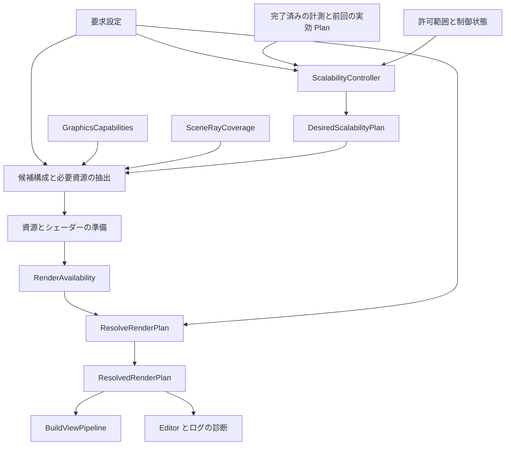
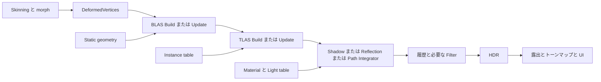
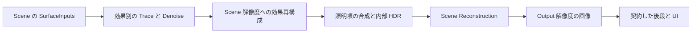

<!-- @file    RayTracing.md -->
<!-- @brief   Raster の継続運用と Hybrid Ray Tracing から Path Tracing への段階導入設計。 -->
<!-- @author  Hasegawa Jin -->
<!-- @date    2026-09-30 -->
# Raster と Ray Tracing と Path Tracing の描画設計

- 状態: 段階導入中。DX12 の BLAS / TLAS、Ray Scene、交差診断、一段不透明 RT Reflection、texture / alpha / 現在の GPU 変形を実装した。Reference Path は raw HDR・面/形状光源・粗面/薄板/入れ子媒体と FP32 RAW 蓄積に対応し、Game Path は定数不透明材質の初期再構成まで。Hybrid Reflection は SSR との鏡面-only 合成、限定 smooth dielectric 輸送、静止時 HDR 蓄積と限定空間再構成に対応した。RenderPipelineAsset で方式・品質を共有し、Volume・Scene・runtime 設定とは所有を分離する。主可視面 RT Shadow / RT Diffuse GI、Forward 反射、統一 ReflectionPolicy、動く鏡像の専用 denoiser、Raster ガラスは未実装。
- 結論: Graphics の既存境界を維持し、ビュー単位の描画モードと効果単位の供給方式を分離する。反射は材質・画面上の寄与・情報の有効度・予算に応じて ReflectionProbe / SSR / RT を選び、カメラ距離は任意の LOD 補助にする。Raster を常設し、Hybrid RT と Path Tracing が交差判定・材質・光源・GPU 資源管理を共有する。
- 初期方針: DX12 の Inline RayQuery を使う。最初の製品向け効果は RT Shadow、最初の Path Tracing は静的シーンの Progressive 表示とする。
- ゲーム向け方針: InGame の主軸を Hybrid とし、対応範囲・安全な復帰・合成・動的シーンの品質と予算を先に完成させる。Reference Path は比較基準として維持し、Game Path は任意の追加方式として扱う。Path の対応拡大を Hybrid の完成条件にはしない。
- 計測方針 (2026-10-02): Windows / DX12 の性能検証は PIX に統一する。CodSpeed は使用しない。起動接続・イベント・GPU / Timing Capture の契約は [pix-profiling.md](pix-profiling.md) を正本とし、過去の CodSpeed 取得記録は実施履歴としてのみ残す。
- スケーリング方針: 全体の内部解像度、効果別の計算解像度、サンプル予算、更新頻度、供給方式を別の軸にする。品質の下限と変更可能な項目を定め、実測から実効 Plan を調整する。Raster にも同じ仕組みを適用する。

Path Tracing は、レイによる交差判定に確率的な光輸送の積分を組み合わせる手法である。交差判定の基盤は先に必要だが、Whitted 型の再帰反射レンダラーを完成させることは必須ではない。ユーザー提供の [Path Tracing 解説](https://rayspace.xyz/CG/contents/path_tracing/) を理論の出発点とし、同じ交差基盤を Hybrid の効果と Path Tracing の双方から使う。

### Hybrid 優先の実装順序

2026-10-01 に InGame の実装優先を Hybrid へ変更した。「完成」は全設定で RT を有効化することではなく、対応した入力の正しさ、未対応入力の診断、Raster へ戻る画像の整合、動きと解像度変更の履歴、実測した予算を満たすこととする。

1. 現在の一段 Reflection の correctness。光源ごとの artist shadow 設定、Dispatch 未記録時の stale 出力拒否、camera-independent の効果被覆、provider 切替時の TAA 履歴を検証する。
2. 主可視面の RT Shadow。BSDF / hit lighting の対応と切り離し、geometry / opacity の証明で主方向光から追加する。同じライトの ShadowMap / ContactShadow と二重に適用しない。
3. 共通 ReflectionPolicy と品質。SSR / RT / Probe / IBL の鏡面項だけを解決し、confidence・材質境界・探索距離・SCREEN_FIRST / RAY_FIRST の mask と効果別再構成を供給する。動く反射像を受け手の motion だけで再投影しない。
4. Forward の SurfaceInputs と、LOD 切替・ガラス・地形・水・VFX の入力契約を一件ずつ拡張する。Raster の見た目を維持する対象と、RT の遮蔽/反射で追跡できる対象は別に証明する。ガラスの Raster 屈折と RT 二次輸送は別の明示設計が必要。
5. 拡散 GI の provider 置換と実測に基づく最適化。既存 LightProbe / IBL と加算しない。共有 AS 準備、各効果、再構成の GPU 時間と VRAM を分けて計測し、品質を揃えて比較する。

## UE と RE ENGINE の公開設計をどう取り入れるか

2026-09-30 に Epic の公式ドキュメントと CAPCOM 開発者の公開資料を確認した。UE の資料は閲覧時の 5.8、RE ENGINE は RE:2023、GDC 2026 の講演と 2026-07-16 の開発者インタビューを参照する。年代と用途が違う仕組みを、同じ製品構成として扱わない。

以下は資料で確認した事実と、そこから選ぶ FBZZ の設計方針である。右列は本エンジンへの提案であり、UE / RE ENGINE の内部実装そのものではない。

| 公開資料で確認した仕組み | FBZZ への採用方針 |
|---|---|
| UE Lumen は Screen Traces を先に使い、不足分を Hardware / Software Ray Tracing へ送る。ヒット照明には Surface Cache と Hit Lighting がある。[Lumen Technical Details](https://dev.epicgames.com/documentation/unreal-engine/lumen-technical-details-in-unreal-engine) | ゲーム用反射は SCREEN_FIRST を既定案にし、SSR の不足部分を材質・寄与・被覆・予算に応じて RT が補完する。交差判定とヒット照明の評価を分ける |
| UE は間接光と反射を別の品質グループで調整する。roughness と内部解像度で反射コストを制御し、SSR へ置き換える設定もある。[Lumen Performance Guide](https://dev.epicgames.com/documentation/unreal-engine/lumen-performance-guide-for-unreal-engine?lang=en-US) | RT の一括 On / Off だけにしない。Shadow / Diffuse GI / Reflection の供給者と予算を独立に解決する。roughness の閾値は FBZZ で計測して決める |
| UE Path Tracer は共通の RT アーキテクチャを使う参照・制作向けの経路で、リアルタイム向け RT と同じ描画コードではない。[Path Tracer](https://dev.epicgames.com/documentation/en-us/unreal-engine/path-tracer-in-unreal-engine) | Ray Scene と表面・光源の契約を共有し、参照の推定器をゲーム用の近似や再構成から独立して検証する。Lumen をそのままフル Path Tracing と呼ばない |
| RE:2023 は低サンプルでの再構成、disocclusion 用の追加レイ、線形空間の filter、反射に応じた motion の課題を報告する。[Advances in Ray Tracing, slides 19–34](https://www.docswell.com/s/CAPCOM_RandD/K24Y66-RE2023) | denoise を付属処理として後回しにしない。履歴がない領域の予算と、Diffuse / Specular で異なる履歴入力を Reflection 段から設計する |
| RE ENGINE の GDC 2026 資料は GBuffer から最初のヒット情報を取得し、Path 用 Lighting が直接光を含めて置換し、その後に半透明を描く構成を示す。[GDC 2026, slides 9–10](https://www.docswell.com/s/CAPCOM_RandD/5DM2NL-gdc2026-implementing-real-time-path-tracing-in-re-engine) | GAME の開始点は RasterSurface、REFERENCE は CameraRay を初期案にする。ゲーム用の Raster 合成は対応範囲と近似を明示し、参照用の完全性条件と分ける |
| 2026 年の RE ENGINE 開発者インタビューでは、参照 Path Tracer を検証してからゲーム用へ発展させ、RayQuery、NEE、独自 ReSTIR GI、DLSS Ray Reconstruction を使用したと説明する。従来の RT と Probe GI も支える。[CAPCOM 開発者インタビュー](https://developer.nvidia.com/blog/qa-how-capcom-brought-path-tracing-to-re-engine-across-pragmata-and-resident-evil-requiem/) | Inline の共通基盤 → 参照検証 → InGame 用再構成という順序を採る。Raster / Hybrid / Path の並存を前提にする。ReSTIR と外部 denoiser は測定後の拡張候補にする |
| UE の RDG は Texture と Buffer の依存・寿命・同期を管理し、パスの削除やメモリ再利用を行う。[Render Dependency Graph](https://dev.epicgames.com/documentation/en-us/unreal-engine/render-dependency-graph-in-unreal-engine) | 現行 RenderGraph を維持し、Buffer / AS の明示依存を追加する。「画像中心の登録 API」はゲーム用途に不適切という意味ではない |

両エンジンの資料から参考にするのは、限られた予算で複数の情報源を組み合わせる方法と、参照画像を保ちながらゲーム用へ発展させる方法である。Lumen の Surface Cache / SDF / Far Field、RE ENGINE の denoiser や材質対応を丸ごと導入する方針ではない。まず FBZZ にある RenderScene、ReflectionProbe、SSR、LightProbe、RenderGraph を接続する。

### 距離とキャッシュについての適用範囲

「近い反射面は RT を許可し、遠い反射面は Probe を使う」という当初の FBZZ 案は、既定の方式選択には採用しない。カメラ距離は品質配分の安い手掛かりになるが、画面上の大きさ、反射の強さ、Probe の近似誤差を単独では表せない。材質と画面上の寄与を主判断にし、距離 LOD は品質の下限を守る任意の補助にする。

UE の Far Field は遠方シーンへの追跡を低コストで延長する仕組みであり、遠い反射面を cubemap に置き換える規則ではない。今回確認した RE ENGINE の公開資料にも、SSR / RT / ReflectionProbe を同じカメラ距離帯で選ぶ実装の記述はない。方式選択、レイの探索距離、Ray Scene の保持範囲を別々に設計する。[Lumen Performance Guide](https://dev.epicgames.com/documentation/unreal-engine/lumen-performance-guide-for-unreal-engine?lang=en-US)、[RE:2023](https://www.docswell.com/s/CAPCOM_RandD/5RXJP4-RE2023)

RT の hit と、その地点の照明を求める処理を分ける。初期の `HitLightingMode` は `EVALUATED` とし、共通 Surface / BSDF と RayLightTable から評価する。将来の `CACHED` は位置・法線・方向・材質・版を入力とするキャッシュ契約と、miss 時の再評価を備えた後に追加する。キャッシュに正しい表面や照明が入っていない場合を、黒い有効ヒットとして返さない。

既存 LightProbe の L2 データや ReflectionProbe の prefilter は、Lumen の Surface Cache と同じ情報ではない。拡散向けデータを鋭い鏡面方向の放射輝度として直接読み替えず、RT がヒットした物体へカメラ用 HDR の色を投影して正しい照明とみなさない。初期段には新しい大規模キャッシュの実装を要求しない。

参照用 Path は照明キャッシュや SSR / Probe で経路を置換しない。ゲーム用に導入する近似は Plan に記録し、同じ表面・光源条件の参照画像と比較する。SDF による Software RT は現在のデータ基盤にないため、DXR がない環境の初期フォールバックは既存 Raster とする。

## 現在の実装と設計の接続点

以下は作業ツリーのコードで確認した事項。既存文書には移行前の型名や経路の説明も残っているため、実装済みの範囲と今後の提案を区別する。

| 確認した場所 | 現状 | 今回の接続方針 |
|---|---|---|
| `Projects/Graphics/CMakeLists.txt` | `FBZZGraphics` は独立した SHARED ライブラリ。Core / Math に依存し、DX12 は非公開実装 | RT も Graphics 内に置く。Engine / Physics / Fluid への逆依存を作らない |
| `Renderer/RenderSettings.hpp` | Forward / Deferred / ForwardPlus / DeferredPlus と画質設定がある | 既存値を Raster の設定として維持し、描画モードを別に追加 |
| `Renderer/OpaqueRenderPlan.hpp` | 必須資源が欠けた Deferred を Forward へ解決する純粋関数がある | 上位の `ResolvedRenderPlan` にこの結果を含める |
| `Renderer/RenderScene.hpp` | Scene ポインターを含まない描画候補と解決済みハンドルを持つ | 同じ候補から Raster キューと Ray Scene を構築 |
| `Pipeline/GeometryPipeline.cpp` | Forward / Deferred の登録関数が分かれ、同じグラフへパスを積む | Raster の構成を残し、RT の生産者と消費者を組み込む |
| `Pipeline/ViewPipeline.cpp` | ビューの資源宣言・ジオメトリ・水・ポスト処理・UI を構成する | 最終 Plan を受け取り、モード別の HDR 生産者を選ぶ |
| `Assets/Shaders/Pipeline/Deferred/GBuffer.hlsl` | 3 枚に albedo / roughness、shading normal / metallic、線形 HDR emission を保存。材質 ID・幾何法線は出力しない | emission の欠落は修正。GAME Path の SurfaceInputs には依然として追加出力または検証済みの再構築が必要 |
| `Pipeline/PassResources.hpp` | RenderTarget / Texture / Buffer / StructuredBuffer / AccelerationStructure の型付き登録・取得を持つ | Ray Scene の共有準備と追跡パスから同じ名前で宣言・取得する |
| `Renderer/Platform/DX12/DX12Context.hpp` | DXR Tier、Inline RayQuery、Ray Pipeline の能力を検出済み | 能力をバックエンド非依存の値として `IRenderer` から公開 |
| `Renderer/RenderSettings.hpp` / `Renderer/QualityPreset.cpp` | 手動 `renderScale` と Low / Medium / High / Ultra がある。倍率は 0.5–2.0、内部寸法に床がある | 既存の要求値とプリセットを維持し、自動調整の実効値を別に持つ |
| `Pipeline/RenderResources.cpp` | 内部寸法の変更でビューの中間資源と TAA 履歴を作り直す。露出・霧など一部は維持 | 資源を解像度の領域と用途で分け、効果別の変更を局所化する |
| `Passes/PostProcess/UpscalePass.cpp` / `Pipeline/ViewPipeline.cpp` | 内部解像度で仕上げた LDR を Catmull-Rom 等で拡大し、UI は出力実寸で描く。現行 TAA は内部解像度の LDR | 既存の空間拡大を互換経路として残す。HDR の Temporal Upscale は別契約・別の検証段で追加 |
| `Renderer/IRenderer.hpp` / `DX12Renderer.cpp` | フェンス完了後の GPU パス時間を取得できる。公開結果は名前と ms の組 | 自動制御には計測元のフレーム・ビュー・Plan の版・完全性を追加。現在の遅延結果を今フレームの構成と混同しない |

反射の既存実装には、次の接続点と制約がある。

| 確認した場所 | 現状 | 今回の接続方針 |
|---|---|---|
| `Engine/Scene/Components/ReflectionProbeComponent.hpp` | 球 / box の影響範囲、Static / DynamicSky / DynamicScene、更新間隔を持つ | 捕捉機構を再利用し、反射点で選べる probe table を Graphics へ渡す |
| `Engine/src/Scene/Systems/RenderPasses/Geometry/ReflectionProbeCapturePass.cpp` | 動的な有効 probe のうち、カメラが影響範囲内にいる最寄り一個を選ぶ | まず互換動作を維持し、その後、反射面の worldPos と influence で選択・ブレンドする |
| `Engine/src/Scene/Systems/RenderSystem.cpp` | 選んだ動的 probe がグローバル IBL の irradiance / prefilter スロットを置換する | 鏡面の反射供給と拡散環境光の選択を分離する |
| `Assets/Shaders/Rendering/IBL.hlsli` | roughness に応じた prefilter と BRDF LUT で鏡面環境光を評価 | Probe / IBL の鏡面項だけを反射 resolver へ渡す |
| `Assets/Shaders/PostProcess/Reflections/SSR.cs.hlsl` | HDR と深度を追跡し、画面外・未交差では無効。roughness で confidence を下げる | SSR の出力を共通反射契約へ変換し、材質・寄与・有効度から補完要求を作る |
| `Assets/Shaders/PostProcess/Color/Composite.hlsl` | SSR の alpha と intensity で HDR 全体を lerp する | 新構成では IndirectSpecular だけを置換し、直接光・拡散・発光を保つ |

表の `Engine/Scene/Components/` は `Projects/Engine/include/` に、`Engine/src/` は `Projects/Engine/src/` に対応する。Static probe の読み込み経路は、動的 probe を選ぶ上記関数と別に監査する。Static を現在の動的選択と同じ対応範囲とみなさない。

表の Graphics 内のパスは `Projects/Graphics/include/Graphics/` または `Projects/Graphics/src/` に相対する。

現行の起動条件は SM 6.8 と bindless 対応であり、DXR 対応は起動必須条件ではない。DX11 は撤去済みなので、Raster フォールバックも DX12 上で動く。本設計は既存の起動条件を広げず、DXR のない既存対応環境で Raster を維持する。根拠は `DX12Context.cpp` と [dx11-removal.md](dx11-removal.md)。

既存の [graphics-library.md](graphics-library.md)、[pipeline-boundary.md](pipeline-boundary.md)、[render-graph.md](render-graph.md) の入力・経路・寿命の契約を引き継ぐ。

## 描画モードと効果の分離

バックエンド、描画モード、Raster の不透明方式、光の供給方式、画質を別の軸として扱う。

| 軸 | 値の案 | 意味 |
|---|---|---|
| Backend | 現行 DX12 | GPU API の実装 |
| RenderMode | `RASTER` / `HYBRID` / `PATH_TRACING` | シーンの HDR を作る構成 |
| Raster pipeline | 既存の Forward / Deferred / Plus | Raster の不透明描画とライト供給 |
| Shadow provider | ライトごとの ShadowMap / RayTraced | 直接光の可視性 |
| Specular indirect policy | 材質・画面上の寄与・有効度・予算に応じた SSR / ReflectionProbe / IBL / RayTraced | 鏡面間接光の供給と切替。距離 LOD は補助 |
| Diffuse indirect provider | LightProbe / IBL、または RayTraced | 拡散の間接光 |
| PathTracing profile | `REFERENCE` / `GAME` | 検証用の推定器か、明示した予算・近似を持つゲーム用か |
| Path primary visibility | `CAMERA_RAY` / `RASTER_SURFACE` | 最初の可視面の取得。直接光を計算する方式とは別 |
| PathTracing mode | `PROGRESSIVE` / `REALTIME` | 静止時の蓄積か、動的な画像の再構成か |
| Quality | 既存プリセットと効果別の予算 | 解像度、サンプル数、経路長、更新コスト |
| Scaling policy | 手動固定 / 予算内の自動調整 | 要求設定を維持したまま、許可された項目の実効値を調整 |
| Scene reconstruction | 既存 Spatial / 将来の Temporal | シーンの内部画像を出力解像度へ再構成。効果別の denoise と役割を区別 |

`RenderingPipeline` に RayTracing / PathTracing を継ぎ足さない。既存の ForwardPlus / DeferredPlus は引き続き「不透明方式とクラスタライト供給」の組であり、DXR の能力と独立する。

| モード | 主可視性 | ライティング | 既存表現との関係 |
|---|---|---|---|
| Raster | Raster | 既存の直接光・影・SSR・プローブ | 現在のゲーム描画を継続 |
| Hybrid | Raster | 選択した影・鏡面間接光・拡散間接光を RT へ置換 | 水・透明・VFX 等は既存経路。各効果の対応範囲を診断 |
| Path Reference | カメラからのレイ | Integrator が直接光と間接光を計算 | 参照に必要な全表現を追跡。UI・選択表示は後段 |
| Path Game | 初期は RasterSurface。必要な表面情報を Raster で取得 | 対応した不透明面の直接光と間接光を Integrator が計算 | 許可した透明・VFX 等を Raster 合成。追跡に含まれない寄与は近似として記録 |

Hybrid は「RT Shadow + SSR + LightProbe」のような混在を許す。Path が照明を担当する表面には SSR / IBL の近似照明 / AO / ShadowMap / Raster の直接光を重ねない。GAME で許可した Raster 合成の受け手が使う照明は、その対象の別契約である。環境マップ自体は、ぼかしていない環境の放射輝度として利用できる。

最初の Path 構成は `REFERENCE + PROGRESSIVE + CAMERA_RAY`、InGame 用の到達点は `GAME + REALTIME + RASTER_SURFACE` とする。ゲーム用を静止させて Progressive で比較することもできる。ただし開始面・材質 filter・許可した合成も比較条件へ含め、同じ積分器だけで画像が一致するとはみなさない。

初期 GAME は Deferred / DeferredPlus の対応した不透明 PBR 面から始める。既存 GBuffer を SurfaceInputs に拡張し、照明パスを PathLighting へ置換する。Forward の DepthNormalPrepass を完全な材質入力とはみなさず、Forward 用 SurfaceInputs adapter は別段で追加する。GAME が対応する Raster 方式を暗黙に変更せず、未対応の要求は診断して設定済み Raster へ戻す。PrimaryVisibility の値は Plan に持つが、初期には上記二つの組合せだけを実装する。

## 実効構成とフォールバック

要求設定は保存し、実行可能な構成はビューごとに別の値へ解決する。各パスと UI が要求設定から独自に可否判定する形を増やさない。



`ResolveRenderPlan` は設定・能力・被覆・資源準備結果・スケーリング希望を受ける純粋関数とする。GPU 資源生成、Scene 走査、アセット読み込みは関数の外で済ませる。準備は必要候補に限定し、失敗した任意資源を毎フレーム無制限に再生成しない。Controller の希望が準備結果で修正された場合は、実際に採用した Plan を次回の制御へ返す。

| Plan に含める情報 | 内容 |
|---|---|
| requestedMode / effectiveMode | 要求と実効の描画モード |
| primaryVisibility / compositionPolicy | CameraRay / RasterSurface、Path が担当する面、許可した Raster 合成と省略するレイ寄与 |
| rasterPlan | 既存 `OpaqueRenderPlan` と実効 LINEAR / CLUSTERED |
| shadowProviders | ライト ID ごとの方式と受け手の対応範囲 |
| indirectProviders | 拡散の供給者、鏡面の反射 policy、明示したフォールバック。最終照明項への反映は一回 |
| rayExecution | Inline / 将来の Ray Pipeline / 無効 |
| quality | 実効解像度・サンプル数・経路長・履歴方式 |
| resolutionPlan | 出力・シーン・効果ごとの active extent、allocation extent、valid rect、再構成方式 |
| scalingDecision | 要求の上下限、計測したボトルネック、変更項目、保持期間、予算未達の理由 |
| pathProfile / approximations | 参照 / ゲーム用、照明キャッシュ・radiance clamp 等の実効近似。比較画像にも記録 |
| outputs | HDR・深度・法線・速度・被覆などの利用可否 |
| diagnostics | 縮退した機能、対象 ID、理由コード、復帰条件 |
| historyEpochs | 効果ごとの方式・推定器・資源の世代。履歴の継続 / 再写像 / 棄却を個別に判定 |

初期の解決規則は次のとおり。

| 状況 | 実効動作 |
|---|---|
| Raster を要求 | RT 資源を確保せず、既存 Raster 構成を使用 |
| Hybrid で Inline 非対応 | Raster。影は ShadowMap、反射は SSR / Probe / IBL、拡散間接光は LightProbe / IBL |
| RT の特定効果の資源や対応表現が不足 | その効果を既存供給者へ戻す。他の成立する効果を維持 |
| REFERENCE で必要表現が不足 | ビュー全体を設定済みの Raster pipeline へ戻し、未対応対象を表示 |
| GAME で必要な不透明面・二次レイ対象・RasterSurface 入力が不足 | 許可した近似に含まれなければ、ビュー全体を設定済みの Raster pipeline へ戻す |
| GAME の許可した Raster 合成対象 | 指定した段で合成し、未追跡の遮蔽・反射・発光等を近似として診断。存在だけで全体を縮退しない |
| Path Tracing の資源準備に失敗 | ビュー全体を Raster へ戻す |
| Deferred または Clustered の資源不足 | 既存規則に従い Forward または LINEAR へ縮退 |
| Raster の必須出力も生成できない | 描画失敗を返す。そのフレームを有効な画像として公開しない |

能力・被覆・必須資源の不足による Path Tracing の復帰先は、常設する Raster を初期既定とする。性能予算による GAME → Hybrid の降格は、利用者が許可し、復帰用の画面入力・シェーダー・資源を準備できた場合だけ選ぶ。モード名を切り替えるだけで、未準備の Hybrid を実行可能とみなさない。REFERENCE は性能予算で方式を自動変更しない。

縮退はグラフ登録前に確定する。記録中に回復不能な RT エラーが発生したフレームは成功扱いせず、次フレームを Raster に解決する。GPU の device removal はデバイス復旧の対象であり、壊れたデバイス上で Raster を続ける意味のフォールバックではない。

常設する Raster は復帰可能な構成を持つという意味であり、必要資源が自動的に揃う保証ではない。準備段は共通の出力・深度と最低限の Raster 復帰先を検証し、PSO・材質・active extent・Scene / device 世代が成立することを RenderAvailability に記録する。RT 候補にだけ成功した資源を、Raster の準備成功と読み替えない。ShadowMap や SSR 等への効果別復帰も、選んだフレームで必要な入力を生成する graph とセットにする。古い ShadowMap があるだけで現在の影へ復帰しない。

準備は希望の候補と限定した復帰先に絞り、全プリセット・全方式を常駐させない。失敗後に候補を無制限に確保し直さず、復帰先の必須資源も成立しなければ描画失敗を返す。新旧資源の退役待ちを含めたピーク容量を予算化する。

一時的な予算不足からの復帰には待機期間と閾値の差を設け、毎フレームの往復を防ぐ。能力不足はデバイス再生成まで、シェーダー失敗は版更新まで再試行を抑える。診断は状態変化時にログへ出し、Render Pass Viewer と設定 UI が同じ Plan を表示する。

### GPU 能力とシェーダーの扱い

`IRenderer::GetCapabilities()` で実機の機能を公開する。初回の `GraphicsCapabilities` は bindless / inlineRayQuery / rayTracingPipeline の bool を持ち、D3D の型を Engine やパスへ露出しない。未初期化・終了済みの backend は全項目を false とする。実機能力と描画パス・シェーダー・資源の準備成功は別に解決する。

初期 RT の実行条件は、既存起動条件に加えて DXR Tier 1.1 以上の Inline 対応と、必要なシェーダー・資源の準備成功とする。現行 `DX12Context::SupportsInlineRaytracing()` の判定を公開契約へ接続する。SM の高さだけで DXR 対応を認定しない。DXR Tier は [OPTIONS5 の能力照会](https://learn.microsoft.com/en-us/windows/win32/api/d3d12/ns-d3d12-d3d12_feature_data_d3d12_options5) で取得する。

Inline RT は Compute 内で実行でき、Ray Pipeline と同じ加速構造を利用する。既存 `Dispatch` と bindless に接続しやすいので、初期方式として選ぶ。Path Tracing もまずループ型の Inline 実装を使える。DispatchRays / Shader Binding Table の導入は Path Tracing の前提条件にしない。[Microsoft の Inline RT 説明](https://devblogs.microsoft.com/directx/dxr-1-1/)

RT シェーダーは Raster と別の variant / PSO とし、非対応 GPU で RT PSO を作らない。現在の `RAY_QUERY_SUPPORTED` マクロはシェーダー言語側の条件であり、実機能力の代用にしない。Tier 1.0 だけの環境は初期には Raster とし、Tier 1.0 専用の第二実装は必要性を測ってから判断する。

## 共通入力とマテリアルと光源

### RenderScene から Ray Scene を作る

Engine の既存 `RenderSceneExtractor` が GUID・MaterialSlot・骨・Scene の生存を解決し、Graphics が `RaySceneBuilder` で GPU の交差入力を構築する。Graphics は Scene / Component / AssetDatabase を参照しない。Physics の Raycast / BVH は衝突形状の問い合わせであり、描画用の詳細形状・材質を扱う RT 基盤には使わない。

| 入力の案 | 必要な情報 |
|---|---|
| RayGeometry | 安定した geometry ID と版、頂点・index のハンドルと範囲、stride・位置形式、submesh 範囲、変形方式、opacity 区分 |
| RayInstance | Scene 世代を含む object ID、geometry 参照、現在 / 前回の行列、geometry ごとの material ID、用途別可視性 |
| RayMaterial | 共通の表面モデル・パラメーター・テクスチャ添字・版・対応能力 |
| RayLight / Environment | 解決済み光源と環境の放射輝度、光源選択用データ、版 |
| SceneRayCoverage | 必要な対象の形状・alpha 判定・ヒット時シェーディング・光源が表現できるか |

主カメラの視錐台や Hi-Z の結果で Ray Scene を絞らない。画面外の物体も影・反射・間接光に寄与する。距離で追跡範囲を切る最適化は、効果の最大レイ距離とフォールバックをセットで明示する。

BLAS は Graphics context 内の geometry ごとに共有する。TLAS は Scene 世代・レイヤー等の可視対象集合・フレームの版が同じ場合に共有する。Scene View と Game View の対象集合が違う場合は別 TLAS とし、主カメラの集合を他ビューへ流用しない。GPU 変形は対象インスタンスごとにフレーム一回、蓄積とノイズ履歴はビューごとに持つ。

BLAS の共有キーには geometry の ID / 内容版だけでなく、submesh の構成、頂点形式、geometry ごとの opacity flags と build 方針を含める。同じ mesh を別インスタンスが異なる alpha 材質で使う場合、Opaque の BLAS を共有して candidate 判定を飛ばさない。初期は opacity 構成ごとの variant に分ける。両面区分が混在し instance 単位の culling 設定で表せない構成も、互換な geometry 範囲へ分け、同じ object ID への対応を保持する。

Raster の画面依存 LOD dither を、そのまま二次レイの opacity として使わない。初期の照明比較は LOD と fade を固定し、GAME の RT LOD / fade を追加する段で被覆・一次面との一致・履歴を検証する。Ray Scene の収集前に Raster の visible / lodVisible だけで候補を捨てない。

DXR の InstanceID は 24 bit、InstanceMask は 8 bit なので、EntityID や Engine の layer mask をそのまま切り詰めて格納しない。密な instance table の添字から完全な object ID へ対応させる。レイヤーは TLAS の対象集合へ反映し、8 bit は PRIMARY / SHADOW / SPECULAR / DIFFUSE 等のレイ用途に割り当てる。`castShadows=false` は SHADOW だけを外す。[DXR instance descriptor](https://learn.microsoft.com/en-us/windows/win32/api/d3d12/ns-d3d12-d3d12_raytracing_instance_desc)

`InstanceID + GeometryIndex + PrimitiveIndex` から、index・頂点・material を引ける表を GPU に保持する。表の並び替えと TLAS を同じ版で公開し、前フレームの表を新 TLAS に組み合わせない。行列の格納順、負スケール、非一様スケール、法線変換は Math と DX12 の変換境界で固定する。

### Raster と RT の表面モデル

既存の `.mat` と MaterialSlot を正本として維持する。RT 専用 `.rtmat` や二重のパラメーター編集を作らず、Engine 側が `SurfaceMaterialData` へ解決する。

最初の表面モデルは metallic / roughness の標準 PBR とする。baseColor、metallic、roughness、emission、normal、UV、alpha cutoff、doubleSided を共通データで扱う。`EvaluateBsdf` / `SampleBsdf` / `PdfBsdf` が同じモデルと確率分布を使う契約を追加する。

Surface の構築には texture と定数だけでなく、UV 変換、tint、濡れ等の共有する材質入力も含める。幾何法線と normal map 適用後の shading normal を区別し、交差の表裏・レイ原点の補正に shading normal を代用しない。SpecularAA 等の画面微分に依存する roughness filter は物理的な材質値と区別し、GAME の primary filter と二次レイの footprint を明示する。画面微分を取得できない RT へ Raster の式をそのまま移さない。

現在の `Assets/Shaders/Rendering/BRDF.hlsli` には BRDF 評価があるが、Path Tracing 用の BSDF sampling / PDF 契約は別途必要である。既存の roughness の下限や幾何減衰の近似も監査対象とする。共有化で Raster の絵が変わる修正は独立した変更として検証し、ファイル移動だけの無差分を主張しない。

| 能力 | 意味 |
|---|---|
| geometry / deformation | Raster と同じ面を交差判定できる |
| opacity | alpha clip と交差の表裏の扱いを一致させられる |
| surface / bsdf | ヒット点の表面と BSDF を評価・サンプリングできる |
| screen inputs | 深度・法線・速度等を Raster から得られる |

これらを一個の `supportsRayTracing` にまとめない。独自色シェーダーでも形状と alpha が一致すれば影の遮蔽者にはなれる。BSDF が未定義なら RT Reflection のヒット対象や Path Tracing の表面としては未対応である。

未知の Toon / Dissolve / 特殊ローブ / 頂点変形を、標準 PBR のフラグだけで対応済みにしない。明示した surface variant と検証済みの対応情報を要求する。Raster 内の `ResolveGeometryRoute` は維持し、RT の能力判定と別に扱う。

Alpha clip は Raster と RayQuery の candidate 判定で同じ UV・cutoff・テクスチャを使用する。Opaque として自動確定したヒットを後から捨てる形にはしない。DXR の opaque 区分が変わる場合は BLAS の版も更新する。レイには自動の画面微分がないため、テクスチャの LOD は初期の明示 LOD と、後段の ray footprint による推定を区別して検証する。

### 誘電体の透過・屈折

画像のような閉じたガラス球には反射 BRDF だけでなく、透過 BTDF を含む BSDF が必要である。Reference Path は滑らかな固体の屈折・透過・内部吸収を実装したが、Raster の標準 PBR はこれらを持たない。`alpha` は被覆・合成の契約として維持し、光の透過率には流用しない。材質へ IOR の数値だけを保存しても、対応する表面評価と積分器がなければガラス対応にはならない。[PBRT Dielectric BSDF](https://pbr-book.org/4ed/Reflection_Models/Dielectric_BSDF)

共通 `MaterialAsset` / runtime `Material` / `SurfaceMaterialData` は `SolidDielectricSettings` を保持する。`.mat` は reflection の `[params]` と独立した `[dielectric]` に `transmission` / `ior` / `attenuation_color` / `attenuation_distance` / `thin_walled` を保存する。表なしは不透明の既定値を維持し、型が不正なら読み込みを失敗させて以前の材質を保持する。範囲外の数値は保存時に対応済みへ clamp せず、表面の能力判定で拒否する。

| 項目 | 単位・既定と契約 |
|---|---|
| `transmission` | [0, 1]、既定 0。初期実装は 0 または 1 のみ。1 は metallic=0 / roughness=0 / alpha=1 の非発光な固体 BSDF。部分透過の混合ローブは未実装 |
| `ior` | 無次元、既定 1.5。材質内の屈折率。境界での相対 IOR は入射側・出射側の媒体から求める |
| `attenuationColor` | 線形 RGB、既定 [1, 1, 1]。指定距離を通過した後の媒体内透過率。baseColor とは分ける |
| `attenuationDistance` | 正の m、既定 1。吸収係数へ変換し、レイが媒体内で実際に通過した距離へ適用する |
| `thinWalled` | 既定 false。薄い板と閉じた固体を区別する。初期対応は閉じた固体に限定し、薄膜の散乱モデルは別途定義する |

吸収のみの媒体は距離に対する指数減衰を使う。Raster 向け厚みの近似値を追加する場合も、Ray / Path の交差から求めた実距離へ置き換えない。[PBRT Transmittance](https://pbr-book.org/4ed/Volume_Scattering/Transmittance)

初期実装は、空気中にある重なりのない閉じた滑らかな誘電体とする。幾何法線で入射・出射を区別し、Snell の屈折、厳密な非偏光 Fresnel による反射・透過のサンプリング、全反射、媒体内の距離吸収、radiance の IOR 補正を同じ BSDF 契約で扱う。内側の面も交差対象に含め、外側の面から入った光を一度の交差で背景へ抜かない。roughness のあるガラス、重なった媒体、薄膜、分散は後段で拡張する。

DXR の geometry opaque flag は candidate の alpha 判定を省けるという意味であり、光学的に透過しないことを意味しない。alpha clip がないガラスでも最近接の境界へ交差させ、以後の光輸送は BSDF が決める。影も単純な alpha blend の割合には置き換えず、初期積分器の可視性と対応範囲を明示する。

Raster の常設経路には別途、画面内の屈折と Probe / 環境による補完を検討する。これは閉じた固体の入出射や画面外の遮蔽を完全には再現しない近似である。透明を扱わない初期 GAME の RasterSurface をガラスまで対応済みにしない。Reference の対応を先行し、GAME の透明は専用の表面入力・再構成とともに拡張する。

交差基盤や不透明 RT Reflection の完成を遅らせるための前提にはしない。段 3 で拡張できる材質契約を揃え、段 4 の拡散・金属を確認した後に段 4a として実装する。通常の一方向 Path Tracing で屈折を実装しても、集光模様の収束速度まで保証されるわけではない。caustics 向けのサンプリング最適化は別段とする。

### 光源と数学の契約

Raster のクラスタは主カメラ向けのライト供給なので、画面外のヒット点で使う光源集合には流用しない。Scene 全体の `RayLightTable` を別に構築し、初期は単純な光源選択分布を使う。多数光源向けの選択加速は後から置換する。

`SampleLight` は入射方向、距離、放射輝度、光源選択確率を含む PDF、delta 区分を返す。`PdfLight` は BSDF サンプルとの MIS に必要な確率を返す。点光源・方向光、有限面光源、emissive mesh、環境の違いを明示する。

ワールドの長さは m、方向は正規化、`wo` / `wi` はヒット点から外向きとする。BSDF は立体角に関する PDF を返す。面積 PDF の光源サンプルは距離と光源側 cosine で同じ測度へ変換し、光源選択の PMF を乗算する。delta 光源・delta BSDF は連続 PDF と区別する。[PBRT の Path Tracing](https://pbr-book.org/4ed/Light_Transport_I_Surface_Reflection/Path_Tracing)

二次レイと shadow ray の生成は共通の SpawnRay 契約へ集約する。ヒット点の再構築・座標変換の誤差を考慮して幾何法線方向へ補正し、方向に応じた表裏と有効な TMin / TMax を決める。全シーンに固定の大きな epsilon を掛けて自己交差を隠さない。有限面光源への可視性では到達側の誤差も扱い、光源面自身を遮蔽者にしない。[PBRT の誤差管理](https://pbr-book.org/4ed/Shapes/Managing_Rounding_Error)、[DXR の自己交差対策](https://developer.nvidia.com/blog/solving-self-intersection-artifacts-in-directx-raytracing/)

GAME の RasterSurface からレイを出す場合は depth 復元と Raster / RT の形状差も誤差源になる。初期検証は同じ geometry / LOD で行い、相違がある経路には整合確認と、必要なら検証済みの primary recast を追加する。通常の RayQuery ヒット向け offset だけで GBuffer の位置ずれまで解決したとはみなさない。公開例の数値定数が全 GPU で同じ誤差上限を保証するとも扱わない。

既存ライトの intensity を型ごとに確認し、現在の絵と物理量の対応を文書化してから変換する。数値をそのまま別の単位として解釈しない。環境には未畳み込みの HDR 放射輝度を使う。空の太陽と方向光、emissive mesh と対応する面光源は同じ発光源を二重計上しない。

### Reference の光源供給と代理面

Reference は active / enabled な全 Scene 光源を所有者・layer とともに収集する。Raster のクラスタ、256 本の上限、主カメラの視錐台、影タイルや Cookie の準備状態に依存した部分集合を使わない。未対応 source は無視せず診断する。方向光は最後の一つだけでなく全件を評価し、光源がない Scene へ Raster 用の既定方向光を追加しない。Point / Spot / Directional は delta 光源として t5 の 64 byte record、有限 Area は t3 の 96 byte emitter record を使う。

| 型 | Reference の単位と評価 |
|---|---|
| Directional | `color * intensity * pi` の放射照度。全形状への可視性 ray を使い、delta のため連続 BSDF と MIS しない |
| Point / Spot | `color * intensity * pi` の放射強度。既存の逆二乗減衰・0.01 m² の特異点ガード・Spot の cone を維持。Raster の sourceRadius による highlight 拡張は持ち込まない |
| Area | `color * intensity` の放射輝度。Raster の面積形態係数は既に `1/pi` で正規化済みなので、追加の pi 換算をしない。一様面積 sampling と立体角 PDF、BSDF 到達側の MIS を同じ面で評価する |

Point / Spot / Area の正の range は `(1 - (d/r)^4)^2` の滑らかな窓を持つ artist cutoff、0 は無限とする。負・非有限な値は拒否する。Area の窓は NEE と BSDF-hit の直前の実区間に同じ式で適用する。これは距離に依存しない純粋な発光面からの演出的変更であり、Reference の物理的な逆二乗減衰とは区別する。castShadow / shadowStrength による Raster の opt-out を、光輸送の壁の穴にはしない。

Area が同じ所有者の追跡対象メッシュを持たない場合は矩形を二つの virtual triangle にし、一次レイ・反射・屈折・可視性でも TLAS の最近接面と比較する。光源の表裏は emission と遮蔽を分け、片面光源の裏側は放射せず遮蔽する。NEE にだけ現れる、鏡やガラスから見えない光源にはしない。[PBRT Area Lights](https://pbr-book.org/4ed/Light_Sources/Area_Lights)

同じ所有者に Area とメッシュがある場合は、平行・共面な二つの三角形が指定幅高さの矩形四隅と共有対角線を構成すると確認できたときだけ、メッシュ面を照明の代理面とする。元の材質 emission が 0 の面・別 submesh も含めて所有者の全形状を確認し、発光面より前の不明な遮蔽面を見落とさない。面の位置は薄い灯具の境界面、放射輝度は LightComponent を正本とし、同じ所有者の元の材質 emission を置換する。側面など、矩形に属さない元 emission も加算しない。発光材質の正本はファイルに残り、Area を無効にすれば通常の mesh emission に戻る。曖昧な形状対応、CPU snapshot を読めない形状、両面メッシュ代理面は縮退し、単に所有者や法線が一致しただけでは認定しない。メッシュを持たない virtual Area の両面放射は対応する。別の所有者の emission は保持する。CornellBox の天井はこの灯具契約を使い、Area の輝度 18 と材質の emission `18*pi` を二重加算しない。

代理面の角・共面判定の許容誤差は短辺の `1e-4` とし、固定の絶対下限を置かない。保存された float 頂点からの座標差と投影は double で検証する。極小光源に大きなメッシュを対応付けたり、大座標の量子化で失われた矩形を証明済みと扱わない。forward 面の中心からの距離は短辺の 5% 以下であることを求める。これは薄い灯具の境界面契約であり、任意の厚い立体光源の受理ではない。

Point / Spot の区間は最大成分で正規化して距離を求め、距離二乗を先に作らない。逆二乗の係数は正の FP32 を有界仮数と二進指数へ分け、最終 normal 値の指数ビットを構築する。近距離の `0.01 m²` 下限、0 成分、subnormal 入力から normal への復帰を区別する。最終 subnormal は D3D の FTZ に合わせ正常な 0 とし、表現できない距離・放射照度・Area の立体角 PDF は sticky 診断にする。表現可能な遠距離照明を小さな逆数二乗の underflow で捨てない。

## 加速構造と GPU の寿命

加速構造 AS はレイと形状の交差を高速化する GPU データである。BLAS は geometry、TLAS はその配置を扱う。本設計では Graphics のキャッシュがハンドルを管理し、ResourceManager が GPU 実体を単独所有する。

| 対象 | 初期構築 | 更新 |
|---|---|---|
| 静的 mesh | geometry と版ごとに BLAS を作り共有 | 頂点・topology・opacity 区分の変化時に再構築 |
| 剛体の移動・回転・scale | BLAS は共有 | TLAS の transform を更新 |
| Skinned / morph | インスタンス固有の変形後頂点で BLAS を作る | topology が同じなら update、変わったら rebuild |
| インスタンス追加・削除・LOD 差し替え | 対象集合の TLAS を作る | instance 数や必要な構成が変われば rebuild |
| material の色・roughness | material table を公開 | 通常は AS を作り直さず、照明履歴を無効化 |

Update は初期に `ALLOW_UPDATE` で構築した AS に限定する。形状数・頂点数・index 内容・geometry flags 等の変更を単なる refit として扱わない。変形後 BLAS が変わった場合は、その BLAS を参照する TLAS も更新する。詳細は [DXR の AS update 契約](https://microsoft.github.io/DirectX-Specs/d3d/Raytracing.html#acceleration-structure-update-constraints) と [build flags](https://learn.microsoft.com/en-us/windows/win32/api/d3d12/ne-d3d12-d3d12_raytracing_acceleration_structure_build_flags) に従う。

静的 BLAS は trace 優先、動的 BLAS は更新と trace の合計時間を測って方針を選ぶ。Compaction、部分更新の予算化、再構築の頻度調整は基礎が正しく動いてから追加する。

初期の trace 用 geometry は Graphics が安定した GPU 読み取り用の vertex / index view を用意する。既存 `IBuffer` は頂点 UAV 添字だけを公開しており、ヒットシェーディング用の SRV は追加が必要である。共有可能な元バッファには view を足し、必要な場合だけ RT 用 GPU local コピーを版ごとにキャッシュする。毎フレーム全静的 mesh を複製しない。

Skinned の RT は compute 変形済み頂点を使う。VS スキニングへ戻っているインスタンスや画面外の未更新インスタンスを bind pose で追跡しない。RT に必要な変形要求は Raster の可視性判定に加えて収集し、未準備なら被覆不足として縮退する。

GPU の使用期間は、ハンドルの生存とは別に守る。

- 動的 AS、instance / material table、scratch、変形頂点はフレームスロットとフェンスで保護する。GPU が前フレームを読んでいる領域へ CPU が書き込まない。
- 同じ DIRECT queue 上の GPU 更新は順序とバリアで保護する。将来の別キューとの共有には Signal / Wait も必要となる。
- Scratch の再利用は直列の build 間の同期を満たす場合に限る。同時実行する build や未完了フレームとの重複を許さない。
- BLAS の交換・compaction・解放では、参照する TLAS・GPU table と旧実体の最後の使用フェンスも追跡する。bindless 添字も同じ期間だけ維持する。
- Asset 公開・shader reload・デバイス再生成は既存のフレーム境界に接続する。壊れた版や古い形状の AS を、今フレームの有効な代替として使わない。

通常のリソースと違い、AS は `RAYTRACING_ACCELERATION_STRUCTURE` 状態を維持し、build → read 等の同期には UAV barrier を使う。現在の `DX12StateTracker::QueueTransitionAllToCommon()` は AS を除外する必要がある。これは RT 自体を DIRECT queue に置いても、他の AO 等が非同期区間へ入る場合に必要な修正である。[DXR の AS メモリと同期](https://microsoft.github.io/DirectX-Specs/d3d/Raytracing.html#synchronizing-acceleration-structure-memory-writesreads)

初期の AS 構築と trace は DIRECT queue で直列記録する。AS を通常の texture / buffer と alias させず、履歴も transient alias の対象にしない。非同期 RT は AS 専用同期と実測を満たした後の追加段とする。[async-compute.md](async-compute.md)

## RenderGraph と照明の合成

### 型付きの資源宣言

現在の RenderGraph はリアルタイムのゲーム描画を構成する基盤であり、本設計でも継続して使う。ここでいう RenderTarget / Texture は毎フレーム GPU が扱う描画先・深度・中間結果であり、保存画像やオフライン処理を指さない。

UE の RDG も Texture と Buffer の読み書きからリアルタイム描画の依存と寿命を管理している。本エンジンで不足しているのは RT 入力の登録契約であり、RenderGraph という方式の適性ではない。[RDG の資源とビュー](https://dev.epicgames.com/documentation/en-us/unreal-engine/render-dependency-graph-in-unreal-engine)

`ResourceKind::Buffer` は既に存在する。段 1 の入口で `RenderPipeline::DeclareBuffer / DeclareStructuredBuffer / DeclareAccelerationStructure` と、対応する `PassResources` の型付き取得を追加した。Buffer の byte size / stride、alias の許可と access の用途は graph の指紋へ含め、AS は alias を禁止する。用途の宣言は graph の依存と分離し、宣言だけで backend の同期が自動生成されるとは扱わない。

| 変更先 | 追加する契約 |
|---|---|
| `ResourceHandle` / ResourceManager | `AccelerationStructureTag` と所有・解決・退役。Buffer の読み取り view |
| `IRenderer` | 能力取得、AS の生成・build / update の抽象入口。回復可能な失敗は bool と診断 |
| `ComputeCall` | 型付き TLAS ハンドル。bindless 添字に加えて、backend が使用・寿命を把握できる実ハンドルを渡す |
| `RenderGraph::ResourceDesc` / `ResourceAccess` | AS 種別、buffer の byte size / stride、alias 可否と、build input / AS write / trace read / shader read / UAV 等の用途 |
| `RenderResourceRegistry` / `PassResources` | Buffer / StructuredBuffer / AS の型付き登録と取得 |
| `RenderPipeline` | `DeclareBuffer` / `DeclareAccelerationStructure`、記述と access の指紋への反映 |

GPU virtual address、COM 型、SBT のレコード配置は DX12 内部へ閉じる。Graphics のパスも Engine も `IRenderer&` と型付きハンドルを使い、具象レンダラーへダウンキャストしない。

資源は Setup で読み書きを宣言し、Execute は申告した名前から取得する。スキニング → BLAS → TLAS → trace の順序を登録順だけに頼らせない。GPU table が bindless 経由で参照する geometry / texture の集合も追跡対象とし、table 一個の Read 宣言だけで背後の資源の準備・生存が保証されたことにしない。

Read / Write は graph の依存、用途は backend の状態とバリアを決める契約として分ける。BLAS の頂点・index、TLAS の instance 入力、各 build の scratch、AS 出力、trace の AS と hit shading 用 SRV を明示する。同じ AS 状態のままでも write → read / write は同期を要求する。論理的な Read 宣言だけで必要な UAV barrier が発行済みとはみなさない。



共有準備はフレーム内で一回実行し、各ビューは確定した資源を import する。実装段階では `BuildFramePreparation` を同じ RenderPipeline 基盤で組み、共有準備の graph → 各ビューの graph を明示的に順序実行する。別 graph 間の依存は executor の順序と backend の同期が担い、import だけで自動同期されたとみなさない。

共有準備 graph で本フレームに生成する TLAS / table 等は、`SetOutputs` 相当で明示した出力にする。別のビュー graph の import は、この graph のパス生存判定には伝わらない。変更のない永続資源は有効な版として公開し、書き手のない import を必須の生成出力に指定しない。ビューの RT 需要がゼロなら、出力を残すためだけの AS build を登録しない。

影や画面空間処理などのビュー固有準備は各ビューに残す。Forward / Deferred / Hybrid / Path の各構成は一つのビュー graph の登録関数であり、構成ごとに独立した renderer を実行しない。Raster の共有準備の移動は別段で検証し、初期の RT 無効構成のパス順を保つ。

### Hybrid の置換位置

照明を少なくとも `Emission`、`DirectDiffuse`、`DirectSpecular`、`IndirectDiffuse`、`IndirectSpecular` に区別する。最終 HDR の上から影や反射を一律に掛ける実装は採らない。

| 効果 | 生産物 | 消費位置 | Raster への復帰 |
|---|---|---|---|
| RT Shadow | ライトごとの可視性。初期は主方向光一つ | DeferredLighting / 対応 Forward の、そのライトの直接光項 | 同じライトの ShadowMap |
| RT Reflection | BSDF と整合した鏡面間接光と有効度 | 共通 ReflectionPolicy で解決した IndirectSpecular | SSR、ReflectionProbe / IBL |
| RT Diffuse GI | 拡散の間接放射輝度 | IndirectDiffuse の供給者 | LightProbe / IBL |

RT Shadow で発光・環境光・無関係なライトを暗くしない。SS ContactShadow は同じライトの遮蔽を RT が担う範囲では切り、二重に影を掛けない。水・粒子・体積光等の未対応の受け手が ShadowMap を読む間は、主不透明が RT でも必要な ShadowMap を残す。

Reflection は SSR / IBL に RT の色をさらに足さず、同じ鏡面間接光を一つの resolver で解決する。通常は一つを選び、品質の遷移と部分的な有効度の補完では正規化した重みでブレンドする。拡散 GI もプローブとの加算を避け、置換する。

Hybrid の主可視性は Raster なので、Forward でも必要な depth / normal / roughness / material ID を作る。現在の DepthNormalPrepass は出発点だが、反射用の全表面情報を保証するものではない。未対応材質の被覆を有効扱いにせず、効果を適用する受け手を明示する。

### 材質と画面上の寄与に応じた反射の選択

`ReflectionPolicy` を Graphics の共通契約に置き、Forward / Deferred で同じ規則を使う。方式の適否と、適した方式へ配る解像度・サンプル数を分ける。既定では、カメラ距離だけを理由に RT を禁止したり Probe へ降格したりしない。

| 入力 | 定義 | 用途 |
|---|---|---|
| roughness / specular response | 共通 BSDF の粗さと鏡面応答 | 反射の鋭さと寄与の推定。粗いことだけで Probe の誤差が小さいとはみなさない |
| projected footprint / priority | 画面上の画素数と材質・対象の重要度 | 品質予算の配分。小さい強い反射やゲーム上重要な鏡も保護 |
| SSR confidence | 交差・厚み・画面境界等の有効度 | SSR の採否と RT 補完要求 |
| receiverDistance | カメラから反射面の worldPos までの m | 任意の距離 LOD の補助。既定の方式選択の主条件にはしない |
| maxTraceDistance | 反射面から二次レイを追跡する最大 m | SSR / RT の探索範囲。カメラ距離とは別の近似とコスト制御 |
| probe influence / freshness | 反射面と probe の球 / box の位置関係、捕捉内容の版と更新時刻 | 局所環境の選択と更新遅延の判断。鋭い反射の正しさを保証する値ではない |
| Ray Scene coverage / bounds | 対応する形状・材質と保持するシーンの範囲 | RT が参照できる表現と AS の需要。受け手の距離 LOD と別に解決 |

遠い大きな鏡は画面を広く占め、画面外の人物を鮮明に映すことがある。近い粗い壁は Probe の近似で十分な場合がある。遠い反射面が近傍の人物を映し、近い反射面が遠方の建物を映すこともあるため、受け手のカメラ距離から反射レイの探索距離を決めない。既存 `SSRSettings::maxDistance` もレイの探索距離であり、反射面のカメラ距離ではない。

UE Lumen は roughness に応じて専用の反射レイを制限し、反射解像度も調整する。ただし粗い反射の補完には Lumen GI の情報を使っており、FBZZ の通常の ReflectionProbe と同一ではない。RE:2023 の slides 30–31 は粗い鏡面を別の近似へ置換した際の材質の不整合を報告し、roughness とタイトル予算による高・低解像度の追跡とフィルターを説明している。これらを参考に、Probe への置換と低解像度 RT を別の選択肢にする。[Lumen Performance Guide](https://dev.epicgames.com/documentation/unreal-engine/lumen-performance-guide-for-unreal-engine?lang=en-US)、[RE:2023](https://www.docswell.com/s/CAPCOM_RandD/5RXJP4-RE2023)

初期のゲーム向け方式は `SCREEN_FIRST` を既定案とし、高品質用の `RAY_FIRST` を同じ予算・照明契約の上で選べるようにする。

| 状況 | 優先方式・品質 | 無効時または予算不足時の補完 |
|---|---|---|
| SSR が有効で、要求品質を満たす | SSR。不要な RT を発行しない | 不足部分を寄与と予算に応じて RT、次に局所 Probe / IBL |
| 鋭い反射や重要な鏡で SSR が不足 | 対応範囲内の RT。材質の品質床を維持 | SSR の有効部分と局所 Probe / IBL。品質不足を診断 |
| 広い反射ローブで低解像度の誤差を許容できる | 低解像度 RT と再構成、または検証済みの Probe 近似 | 局所 Probe → グローバル IBL |
| 寄与が小さく、Probe 近似を許可した対象 | 局所 Probe | グローバル IBL |
| RT 非対応・被覆不足・許可予算なし | 有効な SSR | 局所 Probe → IBL。重要な反射の表現不足を診断 |

`SCREEN_FIRST` は SSR の有効度と要求品質を判定してから不足部分へ RT を配り、`RAY_FIRST` は RT 対象に選んだ領域で RT を優先して SSR へ復帰する。鏡や画面情報への依存を減らしたい材質は後者を要求できる。両者を同じシーンで A/B 比較し、既定を実測で確定する。RT の対象と品質を決める主判断は、材質・寄与・情報不足・予算である。

Probe は捕捉位置からの cubemap を近似的に再投影する。平らな鏡では位置のずれが見えやすく、粗い面でも局所遮蔽の欠落が光漏れになる場合がある。FBZZ では DynamicScene の更新と捕捉対象にも制約があるため、距離や roughness の閾値だけで Probe を十分な代替と認定しない。[Reflection Captures](https://dev.epicgames.com/documentation/unreal-engine/reflections-captures-in-unreal-engine?lang=en-US)

最初の分類は既存 SurfaceInputs、SSR confidence、材質の priority と Probe の有効性から行う。画面上の寄与は BSDF 応答と画素数等による推定であり、未追跡の反射の正確な誤差を知れるとはみなさない。分類のためだけに全候補へ RT を実行しない。遠い物体の小ささは画面上の画素数にも反映されるので、距離による追加降格を重ねる効果は別に検証する。

重要な鏡や材質には priority と品質の下限を持たせる。能力・被覆・資源が足りない場合に RT を強制する値ではなく、近似への降格を許可するか、品質不足を報告するかを決める契約にする。任意の距離 LOD は低優先度の対象に滑らかに作用させ、距離だけで重要な反射を Probe へ切り替えない。

`ResolvedRenderPlan` は利用可能な供給者・roughness gate・priority・品質床・trace 予算と、任意の距離 LOD / blend 幅を確定する。画素ごとの選択は GPU が同じ `ReflectionPolicy` の値を使って行う。Plan が CPU で全画素の方式を選ぶわけではない。これらの条件を各シェーダーへ別々に埋め込まない。

`ReflectionSampleResult` の出力は受け手の BSDF を適用済みの scene-linear IndirectSpecular、独立した confidence、有効区分、hit distance とする。入力の放射輝度と、受け手へ反映する照明項を同じ型名で混用しない。SSR / RT / Probe はこの出力へ変換し、合成段で Fresnel や BRDF を再び掛けない。現在の SSR alpha は Fresnel と roughness の両方を含むため、新 resolver の confidence としてそのまま再利用しない。

境界では `wRt + wSsr + wProbe + wIbl = 1`、各重みは非負とする。有効でない方式の重みは、policy に従って後続方式へ振り分ける。これは異なる近似の品質切替であり、Path Tracing の MIS と同一の計算ではない。複数方式を blend する領域では候補の計算も必要になるため、blend 幅の増加が無料だとは扱わない。

SSR の未交差・画面外・厚み判定失敗は「反射なし」ではなく補完要求となる。有限の maxTraceDistance で RT が no-hit になった場合も、世界全体での miss と断定せず、遠方の残りを Probe / IBL で近似する。Scene の全探索範囲を含むレイの miss だけを環境の放射輝度として確定する。

Probe の選択は反射面の worldPos を基準にする。現行の「カメラ最寄り一個」から段階移行し、Engine が球 / box、解決済み cube、intensity、版を含む `RenderReflectionProbeRecord` を渡す。新しい blend 幅・priority・box projection は能力と実装を明示して追加し、既存 `boxInfluence` が既に parallax correction をしているとは扱わない。

複数候補は influence と priority から局所環境をブレンドし、影響範囲の外では global IBL に戻す。大量の probe は Graphics 内で空間的に絞り、候補上限を予算として診断する。部屋をまたぐ反射に対して、カメラ位置だけで選んだ一個の probe を全画素へ押し付けない。

既存 DynamicSky / DynamicScene と更新間隔は維持する。更新をフレーム一回にし、利用される範囲・dirty 状態・近さに加えて、全体の capture 予算を持つ。全 probe の 6 面 capture を RT の節約と引き換えに毎フレーム走らせない。DynamicScene の現行の捕捉対象と深度の制約は [light-probe-gi.md](light-probe-gi.md) も参照し、Skinned 等を含む正確な反射が既に得られるとみなさない。

2026-10-02 の DynamicScene capture は、現在のライト配列・Area / Sphere / Tube の形状と Point / Spot の sourceRadius、world-space cloud shadow を保持する。主カメラ用 ShadowMap / punctual atlas / cookie / screen AO は捕捉ビューに対して unavailable とし、捕捉専用 b4 / b12 へその状態を明示する。主ビューの定数や古い atlas を再利用しない。初期 capture と Play 停止後の再 capture で、前の shadow ON/OFF によって IBL が変わることを防ぐ。これはプローブ位置からの正確な遮蔽を追加する修正ではなく、probe-local shadow provider と未準備 geometry を含む捕捉完了性は後続段とする。

反射パスの依存は SurfaceInputs → ReflectionClassification → 必要な SSR / RT → 各方式の filter → ReflectionResolve → IndirectSpecular 合成とする。SCREEN_FIRST では SSR → Confidence / RT mask → RT の順序を graph に宣言し、RAY_FIRST では RT の有効区分から SSR 補完範囲を求める。最初は mask による early-out、計測後に tile list / indirect dispatch を加える。Probe に解決しても全画素の RT を先に実行していれば、コストを削減したことにはならない。RT 対象画素を減らしても他の効果に必要な AS の build / update は残るため、効果時間と共有準備を分けて測る。

SSR の色入力は、反射解決前に `SSRSourceHDR = BaseLightingHDR + BaselineIndirectSpecular` として確定する。Baseline は当該フレームの Probe / IBL 等で作り、RT / SSR に置換される受け手の既定鏡面項である。SSRSource から鏡面間接光まで除くと、環境を映す金属等が反射内で不当に暗くなる。最終画像は `BaseLightingHDR + ResolvedIndirectSpecular` とし、Baseline をもう一度足さない。

SSR / RT の合成結果を同じ trace の入力へ即時に戻して、graph に循環依存を作らない。SSRSource の色はカメラ方向へ出た放射輝度なので、二次レイ方向への照明の正解ではない。視点依存の強い面と複数回の鏡面反射には近似の誤差が残り、交差 confidence だけで解消しない。必要な材質には RAY_FIRST を使い、将来の前フレームの解決済み色の再利用も別の履歴契約として検証する。

現行 Composite の HDR 全体の lerp から移すと、SSR の絵は変わり得る。この移行は反射の機能変更として切り出し、RT 無効の従来 Raster の互換構成を残して比較する。統一 policy を Raster に適用する段では、直接光・拡散・発光が保持された意図した差分として基準画像を更新する。

方式や品質条件が変わるときは方式ごとの履歴を混用しない。各方式の履歴を検証した後で、そのフレームの重みで合成する。方式を完全に停止していた領域を再開する際は古い履歴を棄却する。任意の距離 LOD による表現切替と、時間的な品質降格の待機期間を区別する。

REFERENCE の Path Tracing は、この Hybrid 用 policy で二次反射を SSR / Probe に置換しない。Hybrid の反射の近似と、Path の光輸送の検証を分ける。将来 GAME に照明キャッシュを導入する場合も、近似を用いた integrator として明示する。

### Hybrid SCREEN_FIRST の初期実装

HYBRID を要求した通常 Lit・非 Wireframe の Deferred ビューでは、一般的な低粗さの表面は SSR の有効な画素を先に使い、残りを ReflectionTracing、未解決分を既存 IBL で補う。強い金属鏡面は後述の RT 優先例外を使う。SSR を無効にした場合は ReflectionTracing → IBL となる。RT の被覆不足では実効 Raster と縮退理由を保持したまま、対応済み Deferred 表面の SSR → IBL を同じ鏡面-only resolver で解決する。Forward・診断表示・RASTER を要求した場合の既存 SSR 合成は互換経路として維持する。任意の RAY_FIRST 設定・Probe を独立した鏡面 provider として選ぶ共通 policy は後続段とする。

SSR を使う Hybrid は `ReflectionSourceLighting → Sky / SunMoon → SSR → RayReflection → reconstruction → DeferredLighting → VolumetricCloud` の順とする。最初の Lighting は RT / SSR を読まず BaselineIndirectSpecular を含む HDR を生成し、SSR の記録が終わるまでこの HDR を変更しない。最後の Lighting は BaseLightingHDR を再評価し、鏡面間接光だけを解決する。雲は不透明物の手前にも散乱・透過を合成するため source から除外し、最終 Lighting 後に一度だけ描く。独立した全解像度 source texture の追加を避ける代わりに、SSR 有効時の Deferred Lighting が一回増える。これは正しさを優先した初期構成であり、速度改善を意味しない。

SSR の RGB は receiver の Schlick Fresnel を一度適用した scene-linear IndirectSpecular の近似とし、alpha は材質の F0 と独立した交差・画面端・roughness による hit confidence とする。鋭い単一反射レイの近似であり、粗い面の GGX convolution を実装済みとは扱わない。`q = saturate(confidence * ssrIntensity)` に対し SSR の重みを q、RT の重みを `rayValid ? 1-q : 0`、IBL の重みを `1-q-rayWeight` として、同じ鏡面成分を二重加算しない。直接光・拡散・emission・後段 Bloom はこの重みで減衰させない。

Hybrid の SSR 候補は深度横切り区間を最大 6 回二分し、2 pixel 未満の移動・背景・反射方向に対する裏面を棄却する。レイ位置と同 UV の深度面の視空間距離を固定 `ssrThickness` で検証し、距離に応じた二乗 confidence で RT へ移行する。探索ステップの大きさでこの受理窓を拡大しない。色・法線・深度は検証済みの同じ画素から取得し、輪郭の別表面を線形補間で混ぜない。単一レイでは粗い反射ローブを表せないため roughness 0.05 から confidence を下げ、0.25 以上は SSR を採用しない。従来 Raster の探索・roughness 契約は変更しない。[FidelityFX SSSR hit validation](https://github.com/GPUOpen-Effects/FidelityFX-SSSR/blob/master/ffx-sssr/ffx_sssr.h)

metallic 0.9 以上・GBuffer の filtered roughness 0.25 以下の高反射金属では、RT の当該フレーム receipt がある場合に q を 0 とする。GBuffer の roughness は `FilterSpecularRoughness` 後の値であり、曲面の法線分散で authored roughness より上がるため、authoring 値 0.05 の判定をここへ代用しない。カメラ方向の Raster source と二次方向の RT 照明・幾何法線安全性が一致するとは限らず、Cornell の鏡面球で反射の帯と facet の差を確認したための固定品質例外である。RT の有効な黒も優先し、primary が無効な画素は IBL へ戻す。RT 自体の縮退・記録失敗ではこの例外を外し、SSR → IBL の補完を保持する。共通 `Rendering/ReflectionPolicy.hlsli` の同じ判定を trace の early-out と最終 resolver で使う。

上の鏡面例外に該当せず SSR confidence が十分な画素は RayReflection の交差処理前に除外し、RAW と surface metadata を無効で上書きする。SSR の無効化・pass override・記録失敗では当該ビューの receipt を false とし、永続 SSR テクスチャの前フレーム内容を読まない。SSR から RT に戻る画素は既存の無効 surface 判定によって古い RT 履歴を棄却する。SSR 自身の temporal reconstruction と動く表面への motion-vector 再投影は未実装のままとする。

TAA の provider key は実効 mode・RT receipt に加えて resolver の有無と SSR receipt も比較する。実効 Raster のまま旧合成から鏡面-only 合成へ切り替わる場合や SSR の停止・復旧でも古い LDR 履歴を混用しない。SSR source は Deferred 不透明物と Sky / SunMoon までとし、後段の雲・Forward 透明物・粒子・水面は含めない。これは Hybrid の物理ガラス輸送を追加するものではなく、未対応 transmission は引き続き RT の縮退理由になる。

2026-10-01 の Release 変更単位コンパイル、Graphics / Engine テストと Editor ビルドはエラー・警告 0。最終の重点 126 / integration 229 / transport 95 の計 450 件が成功した。実 SSR シェーダーは到達できる傾斜面で RGB・F0 非依存 confidence・画面端を検証し、自己交差・裏面・背景・固定厚み外・粗さ・非有限設定の拒否を確認した。実 GPU の二ビュー・pass override・RT 被覆不足、TAA の実効 Raster 内の provider 切替、RT の完全 confidence / 部分 confidence と metadata のクリアも検証した。高反射金属の filtered roughness 0.1 / 0.2 と half-float の 0.25 / 0.9 境界、RT の有効黒・無効画素・全体記録失敗時の選択、完全 SSR confidence でも鏡面の実 trace と新 metadata を保持するケースを追加した。

隔離プロジェクトの `OutputHybridFinalMaterialPolicyRelease20261001/` は 35 step / 6 枚で成功し、SSR → RT → resolve、Scene View 往復、ガラスによる RT 縮退と復旧を確認した。ガラス OFF の Hybrid で SSR 合成由来の鏡面球下部の白帯・facet 差が消えたことを画像確認した。原本 CornellBox の SSR は承認に従い ON、intensity 0.8 は維持した。原本のガラス・シーンはこの段で変更せず、ガラス有効時の RT 縮退は残る。SSR OFF の最終互換撮影 `OutputHybridPolicyCompatibilityRelease20261001/` の 32 step / 6 枚と `OutputHybridPolicyCompatibilityAccumulatedRelease20261001/` の 10 step / 2 枚は成功した。前段の profiler 撮影に対し 7 枚は PNG / RGB 完全一致、残る Scene View 往復後の 1 枚は床の (658,866) の B 成分だけ 227 → 228、最大差 1/255 だった。各撮影前後で原本 9 ファイルの hash を保護した。Game 1548 x 871 / Scene 1263 x 435 の画像検証であり、1080p / 60 fps の性能認定ではない。Release debug layer はコンパイル時無効で、雲の実色合成は今回の CornellBox 撮影では検証せず、登録・実行順と一回性の回帰テストで保護する。

### Hybrid の dielectric 輸送

typed glass の Opaque / alpha=1 は被覆を表し、光学的な不透明を意味しない。
Hybrid は constant・full transmission・nonmetal・nonemissive の solid
(`roughness` 0..1) と、roughness=0・無吸収の thin sheet を受理する。
smooth solid (`roughness * roughness < 1e-3`) は分岐木を保持する。
rough solid は共通 GGX VNDF dielectric の反射・透過を `f * cos / pdf` でサンプリングし、
null sample も分母に数える。画面ぼかしの代用ではなく、有限経路予算を持つ確率推定である。
部分透過、rough thin、テクスチャ付き dielectric は明示的な縮退対象を維持する。

canonical MaterialCB の予約 float@84 と GBuffer emission.a は、0=opaque、
1=supported glass、2=authored but unsupported glass の validated marker とする。
typed glass は ReflectionSourceLighting の RGB を 0 にし、SSR の receiver と
hit target の両方から除外する。Raster fallback の glass を SSR source へ混ぜない。
PostProcCB の reflectionResolveEnabled は 0=legacy、1=final、2=source とする。

RAW reflection.a は光学透過率でなく result kind を表す。0=invalid、
1=opaque indirect specular、2=glass/media full outgoing radiance。
当該フレームの RT dispatch receipt と marker=1 と kind=2 が一致する場合、または
初期媒体解決と Raster depth 照合済みの媒体内 opaque primary (marker=0 / kind=2) だけ、
Deferred の全 lighting を置換する。direct / diffuse / AO / IBL / emission を
さらに加算しない。有効な黒は黒のまま採用する。kind=2 を opaque specular として
採用せず、記録失敗・非有限値は Raster fallback へ戻す。

smooth Fresnel の反射・透過を決定論的に分岐し、Snell、全反射、実境界距離の
Beer 吸収と owner / generation を比較する LIFO 媒体 stack (最大8) を使う。
opaque reflection が二次 glass に当たった場合も界面輸送を続ける。
thin sheet は2界面の有効 Fresnel と直進透過を使い、架空の内部距離を作らない。
境界上限は品質設定の1..16、上限後の残余は0とする有限輸送の近似であり、無限 bounce の収束ではない。
camera-inside は同じ owner の逆方向出口と前方向境界順で初期 stack を検証する。
閉じた一貫した winding の著者形状を前提とし、全 mesh の watertight topology を証明しない。
光学最初の ray は TMin=0、Raster primary の照合は near/far を保持し、近クリップ前の出口を飛ばさない。
媒体内 opaque terminal の実 segment に Beer を一度適用し、直接光は別 segment の減衰・遮蔽を使う。
work > 512 / pending overflow、開いた媒体、非 LIFO の重なり、depth0 の媒体内背景など、
保証外の経路は画素を invalid として部分結果を公開しない。
8段の構造を受理しても全ての入れ子経路が work budget 内で完了するとは保証しない。

glass metadata.w=2 は opaque の履歴と隔離する。RAW kind と metadata kind の一致を
必須とし、全 consumed content key・非 jitter カメラ・連続 frame・成功 receipt が
一致する静止時は品質設定の historyLimit (1..64、既定32) の平均、その後同じ上限の EMA を使う。
履歴は read/write の別資源へ書き、再投影による inter-pixel race を避ける。
移動時は平面 smooth opaque の鏡像位置、または smooth thin の直接 opaque terminal 位置を
前カメラへ投影し、owner / generation / primitive、界面平面、法線、pixel footprint を照合する。
thin は既知 constant 環境へ直接 miss する反射枝と直接 terminal の透過枝だけを受理し、
透過信号を demod/remod、現在の Fresnel 反射を保持する。再利用は最大4 frame の近似であり、
terminal 自身の視線依存 BRDF まで不変とするものではない。
物体・光・材質・配置・未知 provider の変更、camera cut、記録失敗は reset する。
rough / curved / solid / nested / inside / multiple-path は移動時 current-only とし、
無効画素の穴埋めや glass の空間ぼかしは行わない。
rough interface NEE / MIS、一般動的物体の屈折像再構成、透過 caustics は別の対応段とする。

2026-10-02 の Release 撮影 `OutputHybridGlassStaticHistoryRelease20261002/` は
27 step / 6 枚で成功した。inline Raster / Forward の隔離プロジェクトへ GUID の
RenderPipelineAsset を指定し、Hybrid / Deferred+、SSR と RT の実行、Scene View 往復、
非交差の物体移動、glass OFF と復旧、shader error 0 を確認した。Game は1548 x 871、
Scene は1263 x 435であり、原本9ファイルの hash を前後で保護した。
媒体 stack は immutable な instance / material data を参照する ID へ縮小し、
輸送式・分岐・上限を変えずに path の媒体保持を簡素化した。
この撮影と GPU 回帰は、CodSpeed による性能比較や1080p / 60 fps の達成証明ではない。
Release の debug layer はコンパイル時無効で、strict resource declarations は有効にした。

最終 Release は Editor と Graphics / Engine / Editor のテスト実行ファイルを再リンクし、
エラー・警告0。重点141、統合252、transport95、Editor保存・操作34の計522件が成功した。
追加の probe GPU 3件は旧 shadow / cookie / AO の状態からの独立、Area 直接光の保持、
主ビュー b4 / b12 の byte 不変、manager / Reset の寿命を検証する。
`OutputHybridGlassFinalRelease20261002/` の再撮影も27 step / 6枚で成功し、shader error 0。
`OutputPipelineRuntimeFinalRelease20261002/` は78 step / 6枚で Play中の shadow変更、
pause、Stop、再開始を確認した。原本9ファイルと clone の設定・asset 2ファイルは不変。
初期 / Play / Stop / 再Playの天井・背面壁・拡散球の固定領域比較9件は、RGB成分の
平均絶対差が最大0.271/255で許容3/255以内だった。全画像の一致や物理的GIの証明ではない。

2026-10-02 の shared diffuse indirect 段では、Hybrid の primary Raster と opaque secondary
hit が同じ `FBZZ_DiffuseIndirectResponse` を使う。照明値は当該ビューの irradiance cube と
最大2つの選択済み SH volume を hit の world position / normal で引く既存近似であり、
DDGI、可視性付きの新規拡散レイ、完全な diffuse multi-bounce GI ではない。
local ReflectionProbe cube の選択は引き続きビュー単位で、二次点ごとに別の cube を選択し直さない。
SH は world-space 箱と境界 fade に従って混合するので、二次点が選択 volume の外なら cube へ戻る。

生きた finite b8 snapshot、irradiance SRV、active SH の寸法 / grid / 全配置値を確認できる
フレームだけ、この shared approximation を有効にする。二次点には material AO を一度だけ
適用し、primary の screen-space AO を転用しない。既存 Raster の中立 floor 0.025 は同じ
artist approximation として一度だけ保持する。shared diffuse 使用中は、known/raw environment
NEE の diffuse と unknown IBL/ambient の diffuse / floor を置換し、環境 specular、直接光、
emission は別に保持する。したがって同じ環境 diffuse を NEE と probe の両方から加算しない。

履歴キーは環境が known black でも、実際に消費した irradiance / active SH の handle・世代・
content version、IBL intensity / diffuse scale、SH volume 全配置値を含む。GPU生成 cube の
version 0 は、成功した bake が新しい never-again-written 結果を公開した explicit publication
（元 handle、ResourceManager owner、resource epoch が完全一致）の場合だけ不変入力として扱う。
新しい bake は新 handle に交換し履歴を reset、解放 / manager変更 / Reset / 不一致 proof は
再利用を許可しない。in-place GPU 書込 SH の version 0 をこの publication で救済しない。

媒体内の opaque terminal には距離を持たない probe / ambient / floor を加算しない。
known/raw 環境と直接光は実 hit-to-light segment の Beer 減衰を使い、straight NEE を塞ぐ
光学境界は artist shadow strength が0でも physical PRIMARY mask で検証する。
閉じた屈折界面を曲がって接続する caustic NEE は別段であり、未知環境の媒体内 terminal は
finite alpha0 に縮退する。camera / 最後の界面から hit までの Beer は別 segment として一度だけ適用する。
旧撮影の媒体内不透明物は当時の対応範囲外だった。現在は閉じた solid の粗面、
初期媒体内カメラ、媒体内 opaque terminal を下記の制限付きで扱う。
移動履歴は対応を検証できる平面鏡・滑らかな薄板の短期近似に限定し、複雑な経路は current-only。
rough thin、非 LIFO 重なり、depth0 の媒体内背景、caustics、DDGI と性能目標は未完了として残す。
設定の永続化と実行時の所有権は [Render Pipeline Asset](render-pipeline-asset.md) に従う。

2026-10-02 の追加実装は Release の Editor と Graphics / Engine / Editor テストを再リンクし、
最終ビルドはエラー・警告0。関連483件と Inspector 保存6件の計489件が成功した。
新しい GPU 検証は shared diffuse / SH配置 / 環境 diffuse の排他性、内容公開の寿命、
rough solid / null sample / 初期媒体 / 近クリップ前の出口 / nested owner / 媒体内opaqueの
実 Beer 距離、motion terminal / thin demodulation / ping-pong race回避 / RAW復帰、品質上限を含む。
人工 GBuffer の片面 Raster と TLAS 両面 flag の不一致を修正し、解析 Beer / TIR 期待は緩和していない。

隔離撮影 `OutputHybridSharedLightingRelease20261002/` は27 step / 6枚、
`OutputHybridLightingRuntimeRelease20261002/` は78 step / 6枚、
`OutputHybridRoughInsideRelease20261002/` は14 step / 4枚で成功した。
通常ガラスの室内照明の変化、粗い透過像、内部カメラ、Scene View往復とPlay開始・停止を確認した。
旧 clone 設定には保存時に新既定の `[render.hybrid]` が追加された。その後の再検証
`OutputHybridLightingNormalizedRuntimeRelease20261002/` は78 step / 6枚で成功し、
clone の設定と Pipeline Asset の2ファイルは byte 不変、各撮影の原本9ファイルも不変だった。
計197 step / 22枚、Game1548 x871 / Scene1263 x435の品質検証である。
rough glass の粒状感は残り、一般動的屈折 denoiser、DDGI、効果別低解像度、1080p/60fpsを
達成済みとは扱わない。Release debug layerはコンパイル時無効、GPU-Based Validationも検証していない。

### Path Tracing の出力

Path 用の構成関数は HDR radiance に加え、最初のヒットの深度、法線、albedo、roughness、object / material ID、必要なら速度と hit distance を返す。深度は既存の Reversed-Z へ変換し、背景は最遠値とする。RayQuery が返す距離を depth buffer の値としてそのまま書かない。

CAMERA_RAY は交差から、RASTER_SURFACE は対応した Raster 入力から同じ表面契約を作る。現在の GBuffer には emission・材質 ID・幾何法線がないため、追加出力または検証済みの再構築を用意する。shading normal を幾何法線として読み替えない。GAME の最初の面でも共通 BSDF と光源を使い、既存 DeferredLighting の結果へ Path の直接光を足す構成にしない。

これらを `ViewSurfaceOutputs` の共通契約へ変換する。選択・デバッグ・ポスト処理は mode 判定ではなく入力の利用可否を読む。初期 Progressive はピンホールと静的時刻に限定し、時間的な速度入力は無効とする。

Path が生成した背景と光を Raster の SkyPass / WaterCaustics / SSR 等で再生成しない。GAME の許可した合成では担当する対象と段を限定し、追跡済みの背景・照明を再加算しない。露出、Bloom、トーンマップ、LDR の UI と選択表示は共有できる。TAA、画面空間 AO、ポストの DoF / MotionBlur、カスタム HDR パスは自動流用せず、Path の推定器・履歴・入力と整合するものだけ Plan に載せる。

## Path Tracing の積分器と履歴

### 最初の積分器

最初は Compute の一スレッドが一画素の経路をループで処理する。交差・Surface 構築・BSDF・光源選択・Integrator の部品を分け、後から wavefront のキュー方式へ移せるようにする。レイごとの CPU 仮想呼び出しや、bounce 数を GPU の再帰深度へ直結させる構成は要らない。

経路の状態は radiance `L`、throughput `beta`、前回 BSDF の PDF / delta 区分、bounce、sampler 状態を持つ。通常の散乱では `beta *= f * abs(dot(n, wi)) / pdf` を適用し、非有限値、無効 PDF、表裏の契約違反を検出する。

最初の可視面を取得する部品と、その面から NEE / BSDF sampling を続ける積分器を分ける。RASTER_SURFACE でも直接照明を積分器が評価するので、Raster の主可視性を使うことを「間接光だけの Hybrid」と同一視しない。GAME の camera jitter は RasterSurface と motion の契約へ反映する。

基礎段は拡散反射と明示的な光源サンプルで検証し、標準 PBR を載せる段で BSDF sampling と Next Event Estimation の Multiple Importance Sampling を揃える。光源ヒットと NEE の寄与を無条件に加算しない。カメラから直接見た emission と delta 散乱後の emission は通常の MIS と区別する。Russian Roulette で継続した経路は継続確率で補正する。[PBRT の積分器](https://pbr-book.org/4ed/Light_Transport_I_Surface_Reflection/A_Better_Path_Tracer)

有限 bounce 上限、radiance clamp、denoiser は近似やバイアスを持つため、基準表示での有無を記録する。Russian Roulette を入れただけで固定 bounce 上限の偏りが消えたとは扱わない。屈折の IOR、透過、ray footprint、volume は対応段を別に設ける。

### Progressive と RealTime

| 項目 | Progressive | RealTime |
|---|---|---|
| 対象 | 静止した Scene とカメラの検証・高品質表示 | 動いている Scene とカメラ |
| サンプル | sample index を進めて平均を蓄積 | 少量の新規サンプルと履歴の再構成 |
| 履歴 | 生の線形 HDR の和とサンプル数 | 再投影、深度・法線・ID による棄却、統計 |
| ノイズ低減 | 高サンプル蓄積。初期は denoise 無効 | 効果別の temporal / spatial filter が必要 |
| AA | ピクセル内サンプルで行う。既存 TAA は既定無効 | 再構成方式に合わせて解決し、既存 TAA と二重蓄積しない |

`REFERENCE` の RAW 出力を照明の比較基準として維持する。`GAME` は同じ交差・表面・光源の契約から始め、少数サンプル、有限経路長、内部解像度、再投影と denoise を実測で調整する。参照のサンプル平均へゲーム用の filter 済み履歴を混ぜない。共通部品を使うことと、両経路が同じ最適化コードを通ることを同一視しない。

蓄積は露出とトーンマップの前の scene-linear HDR で行う。単なる露出・色調整・UI の変更では光輸送の蓄積を消さない。Denoise を使う表示でも、生の蓄積を保存し、filter 済み画像を次の Monte Carlo 平均へ混ぜない。

既存 `snapshotSerial` は抽出時に進む識別値であり、シーン内容の変更版ではない。これで蓄積を毎フレームリセットしない。内容に基づく `RaySceneRevision` とビュー側の history key を追加する。

Progressive のリセット条件はカメラ・projection・内部解像度・geometry / transform・material / texture・光源 / environment・integrator / sampler の意味・shader 版・Scene 世代・device 世代の変更とする。AS の再配置だけで物理的な Scene が同じ場合は、蓄積を消す理由にしない。

RealTime は通常の動きに対して画素単位で履歴を検証する。camera cut・出力寸法の変更・Scene / device 世代・推定器の意味の変更で対応する履歴を無効化する。内部の active extent だけの変更は、再構成方式の契約に従って再写像または棄却する。Skinned の速度には前回の変形形状が必要であり、rigid の前回行列だけで代用しない。前回値が不足した領域は履歴を棄却する。

Diffuse と Specular の履歴検証を分ける。鏡面では反射面の motion だけでなく、hit distance とヒット先の前回情報も用意し、反射像の移動を評価する。初期に信頼できる反射 motion がない領域は履歴を短くし、誤った再投影を長く残さない。移動する鏡・鏡の中の人物・カメラ移動を別の検証シーンにする。

Disocclusion と急な照明変化には、通常の履歴が使えない領域用の ray 予算を設ける。総予算内で confidence の低い領域へ新規サンプルを配分し、足りない場合は保守的な空間再構成を行う。Reference の無蓄積表示と camera cut 後の GAME 表示を比較し、静止して数百フレーム待った画像だけを品質の根拠にしない。

再構成の入口は radiance、depth、normal、albedo、roughness、motion、hit distance、confidence と履歴の無効化契約に揃える。初期は自作の効果別 filter、外部 denoiser は後段の backend として選ぶ。ベンダー SDK 固有の入出力変換を積分器へ埋め込まず、非対応時に自作方式へ解決する。Frame Generation は実レンダリング一フレームの RT / AS コストを削減する処理として数えない。

GAME の Path 出力は、発光と最初の受け手における Diffuse / Specular の成分を識別できる形にし、成分に対応する統計・履歴・hit distance を渡す。最終 radiance の一枚だけでは二種類の filter を正しく分けられない。成分ごとの推定器と sampling PDF を揃え、full BSDF の寄与をサンプルで選んだローブ名だけで振り分けない。RAW の成分和が参照の総 radiance と整合することを検証する。

sample index はビューの有効なサンプル生成で進め、ゲームの `Time::frameCount` の巻き戻りと分ける。Scene View / Game View / preview が互いの履歴を使わない。テストでは固定のサンプル列を注入し、実時間・sleep・非決定な乱数に依存させない。

## 表現の対応範囲

RT Shadow が必要とするのは交差と opacity、Reflection / Path が必要とするのはそれに加えてヒット面の BSDF と光源である。各効果の `SceneRayCoverage` は、カメラに映る物体だけでなくレイが届く対象全体で判定する。

| 表現 | 初期の扱い | 追加する対応 |
|---|---|---|
| 静的な標準 PBR mesh | 最初の対応対象 | 拡張ローブと texture footprint |
| 剛体移動 | transform を TLAS に反映 | 更新コストの制御 |
| Skinned / morph | 未対応段では該当 RT 効果を縮退 | 画面外を含む compute 変形、BLAS 更新、前回形状 |
| Alpha clip | 未対応段では opacity 被覆不足 | candidate の alpha 判定とテクスチャ LOD |
| カスタム材質・頂点変形 | 能力ごとの未対応を表示 | 明示した同等 surface / deformation variant |
| Terrain | 未対応段では形状被覆不足 | Raster と一致する高さ・LOD・layer BSDF の RT mesh |
| Water / 半透明 | Hybrid は既存 Raster。REFERENCE は縮退。GAME は許可した合成のみ | 屈折・透過・吸収と変形後水面、未追跡の寄与の明示 |
| Fiber / Particle / Trail / Decal | Hybrid は既存 Raster。REFERENCE は縮退。GAME は許可した合成または surface への反映 | 交差表現、表面または媒体、発光。Decal の材質変更は Path 評価前に反映 |
| 雲・霧・流体 volume | Hybrid は既存 Raster。REFERENCE は縮退。GAME は許可した合成のみ | volume の消散・散乱・発光と medium sampling、背景への二重合成の防止 |

未対応の遮蔽者や発光体を TLAS から黙って外して RT を続けない。初期 Hybrid は被覆を証明できない効果全体を既存方式へ戻す。GAME の省略も許可した対象・レイ用途・失われる寄与を Plan に記録する。見えていない通常の不透明遮蔽者を、Raster 合成対象という理由だけで省略しない。RT Shadow のみ形状と opacity が対応していれば、色シェーダーの未対応を理由に無効化する必要はない。

REFERENCE のビューは Scene の必要表現が揃う場合だけ有効にし、照明に影響する未対応対象を Raster で後から貼らない。GAME は合成を許可した表現を明示し、「GAME Path の不透明照明と Raster 合成」として診断する。画面に存在することと、二次レイ内の反射・遮蔽・発光まで追跡できることを別に報告する。

初期 GAME の Raster 合成は、対応する水・透明・VFX 等を目的ごとに登録した許可リストで制御する。必要な depth・照明・ShadowMap・motion / reactive mask と合成順を宣言し、既存の全パスを無条件に後付けしない。構造物の透過、重要な発光や遮蔽など、省略を許可できないものは未対応のまま縮退する。Reference の検証にはこの許可リストを適用しない。

地形や水・流体が必要な RT データは Engine の描画抽出アダプターから渡す。Fluid ライブラリに Scene、ファイル形式、RHI を持ち込まない。LOD の削減や更新の間引きで形状が古くなる最適化は、近似モードとして品質と診断に表す。

## 画質のスケーリングと保存

画質プリセットは要求の出発点とし、GPU 世代名から固定判定しない。能力、実測 GPU 時間、資源予算、表現の被覆を別に評価する。明示的に RT を無効化したビューは RT 資源の需要を出さず、全ビューの需要がなければ BLAS / TLAS、RT 専用 table、履歴を確保・更新しない。モード切替で退役する GPU 資源はフェンスまで保持する。

| 設定例 | 狙い | 初期の要求構成 |
|---|---|---|
| Raster Low / Medium / High | 現在のゲームの性能と表現 | 既存の影・AA・AO・SSR・Probe の調整 |
| Hybrid Shadow | RT の最小追加 | 主方向光の RT Shadow、他は Raster |
| Hybrid Reflection | 材質と画面上の寄与に応じた映り込みの品質配分 | 有効な SSR、重要な不足部分への RT、検証済みの Probe / IBL 近似。効果別解像度と RAY_FIRST も選択可能 |
| Path Reference | 積分器の正しさと高サンプル表示 | REFERENCE + PROGRESSIVE、静的対応 Scene、RAW HDR 蓄積 |
| Path Game | InGame の動的な Path 表示 | GAME + REALTIME、少数サンプル、必要な再投影とノイズ低減 |

表は実測前の構成案であり、FPS を保証するプリセットではない。最初の比較条件は解像度・GPU・Scene・効果別サンプル数を固定して記録する。

個別効果の解像度倍率、rays / pixel、最大レイ距離、経路長、AS 更新コスト、最大履歴長、RT 用 VRAM 上限を独立に調整できるようにする。変更の順序はボトルネックと品質の下限から決める。画素処理が重い場合は効果の解像度・サンプル数、AS が重い場合は寄与範囲や供給者を優先し、設定した下限でも不足するなら許可された復帰先へ戻す。自動調整は利用者が有効にした場合だけ行い、明示 Raster から勝手に RT を有効化しない。

BVH build / update、trace、denoise、照明合成、フレーム全体の GPU 時間を分けて測る。VRAM は geometry のコピー、静的 / 動的 BLAS、TLAS、scratch、GPU table、ビューごとの履歴を合算し、切替時の新旧資源の同時生存も含める。

予算は一フレームの ms で指定し、CPU の描画抽出・準備と GPU の変形 / AS / trace / cache 更新 / 再構成 / 合成を個別に記録する。重なって実行する区間の時間を単純加算した値と、フレームのクリティカルパスを区別する。UE が挙げる変形 BLAS、TLAS と instance 集合、効果別 traversal の分解も計測の参考にする。[Ray Tracing Performance Guide](https://dev.epicgames.com/documentation/unreal-engine/ray-tracing-performance-guide-in-unreal-engine)

Reflection の距離 mask だけで AS の準備費用まで減ったとみなさない。Ray Scene の保持範囲には shadow / specular / diffuse の全用途を含め、範囲外の近似と復帰先を明示する。静的と動的 geometry の予算を分け、Skinned を画面外という理由だけで止めない。キャッシュを導入した場合も更新遅延・無効率・急な光源変化を診断する。

低品質側でも同じ `.mat` と光源を使い、方式ごとに別の照明アセットを編集させない。物理的な輸送と Probe / IBL の近似の差は残るので、室内・昼夜・金属・人物の切替比較を行い、必要な補正は明示した設定に置く。GPU ごとに scene のライト配置を作り直す運用を初期設計にしない。

ProjectSettings に mode と効果別要求を追加する。既存 `render.pipeline` と enum 数値を維持し、新設定の欠落は Raster とする。実効 Plan を要求設定として上書き保存しない。RT 対応 PC で保存した project を非対応 PC で開いても、希望の設定を失わず実効 Raster を表示する。

`PipelineDiagnostics`、品質プリセット、ProjectSettings の読書き、設定パネル、Render Pass Viewer の表示を同じ Plan に接続する。Editor 操作の追加は既存 `Op/` 登録簿へ集約する。

### ダウンスケーリングを共通機能にする

2026-10-02 の `HybridQualitySettings` は Pipeline Asset / inline fallback に
同じ typed codec で保存する。Inspector の Low / Balanced / High は負荷の出発点であり、
FPS の保証ではない。reflection samples、履歴長、spatial radius、glass boundary limit、
opaque reflection の有限距離、ビューごとの再構成 working set、全ビュー共通の
probe capture attempt 上限を個別に適用する。既定距離0は既知環境の全探索を維持する。
有限距離 no-hit は unresolved として SSR / IBL へ戻し、有効な黒や確定環境 miss にしない。
Shadow / diffuse visibility と glass の媒体経路へ同じ距離を適用しない。
履歴が MiB 上限を超えた場合は fence-safe に退役し、同フレーム RAW の反射を維持する。
これは AS、材質 texture、driver heap、退役待ちとの同時生存を含む全 VRAM 上限ではない。
Hybrid の probe 更新は ResourceManager の frame / reset epoch を共有して6面＋畳み込みを
一回の attempt と数え、失敗も予算を消費する。owner 順の巡回で未更新・失敗・毎フレーム更新
probe の starvation を防ぎ、待機中は既存の有効結果を保持する。更新0はrefresh停止を意味する。
frame / AS / trace / reconstruction / probe の ms は保存する目標値のみで、自動調整や
未計測の準備時間・GPU critical path を実装済みとは扱わない。CodSpeed 比較は未実施。

解像度を下げる操作と、描画方式・更新コストを下げる操作を一つの倍率へ押し込めない。`RenderScalePolicy` に許可範囲を持ち、結果を `ViewResolutionPlan` と効果別の品質へ解決する。Raster / Hybrid / GAME Path のすべてが使う。REFERENCE の Progressive と基準画像の取得では自動調整を停止し、固定条件を記録する。

| 制御軸 | 変更するもの | 主に減るコスト | 品質の下限・注意点 |
|---|---|---|---|
| シーンの解像度 | primary visibility と内部 HDR の active extent | 画素シェーディング、画面空間処理 | UI と出力寸法は固定。draw call・AS・全解像度の後段は同じ比率で減らない |
| 効果の解像度 | Reflection / Diffuse GI / Shadow 等の trace extent | 効果の trace と filter | 表面情報を対応付け、シーン解像度へ再構成してから合成 |
| サンプルの密度 | rays / traced pixel、checkerboard、分類 mask | 発行レイとヒット照明 | 未計算と有効な黒を区別。少ないサンプルに対応した分散・履歴重みが必要 |
| 光輸送の範囲 | bounce、maxTraceDistance | traversal と追加の照明 | 推定対象や近似が変わる。受け手のカメラ距離 LOD と区別し、光の欠落と履歴の意味を明示 |
| 更新の予算 | Probe / 照明 cache の更新対象と頻度 | capture と cache 更新 | dirty と最大更新遅延を管理。動く遮蔽者の現在形状を黙って古い AS に置換しない |
| Ray Scene の表現 | 寄与範囲、検証済み RT LOD / proxy | AS、変形、メモリ、traversal | 現行 Raster と一致しない表現は GAME の近似として診断。初期必須ではない |
| 供給方式 | RT → SSR / Probe、GAME Path → 準備済み Hybrid / Raster | 効果全体、全需要が消えた場合の AS | 照明の変化が大きいため遅い制御と明示した許可が必要 |
| 資源の常駐量 | 非表示ビュー、休止資源、対応済み texture mip の常駐量 | VRAM と必要な帯域 | allocation の縮小・退役が必要。active extent だけでは VRAM が下がらない |

これは FBZZ の設計案である。UE の Dynamic Resolution では過去の GPU 負荷、フレーム予算、変更間隔、余裕量を使い、急な超過時と通常の復帰を区別している。この制御の考え方を参考にする。[Dynamic Resolution](https://dev.epicgames.com/documentation/en-us/unreal-engine/dynamic-resolution-in-unreal-engine)

### 出力・シーン・効果の三つの解像度

倍率は幅と高さに掛ける線形の比率とし、面積比と混同しない。基準と実際の整数寸法を Plan に残す。

| 領域 | 基準 | 契約 |
|---|---|---|
| Output | ウィンドウ / viewport の実寸 | UI・出力・入力座標の基準。自動制御では変更しない |
| Scene | Output × sceneScale | RasterSurface または camera ray による主可視性と内部画像の領域 |
| Effect | Scene × effectScale | 当該効果の trace 領域。シーン全体の倍率とは独立 |
| Allocation | 領域ごとの確保済み容量 | active extent 以上。valid rect の外側の値は無効 |

例えば Output 1920×1080、Scene 1280×720、Reflection 640×360 なら、反射の計算画素数は出力の 1/9、Scene の 1/4 である。これは全画素一レイの場合の画素数比であり、総 GPU 時間が 1/9 になる保証ではない。SSR の補完 mask や disocclusion の追加レイは、さらに別の予算に数える。

`ResolveViewResolutionPlan` が寸法・丸め・床・viewport・dispatch 範囲を一度だけ決める。初期のシーン倍率と床には既存 `ResolveRenderResolution` の結果を使い、現行の 0.5–2.0 と 640×360 の扱いを互換経路で維持する。効果には独立の床と絶対的な最低寸法を持たせ、二つの倍率の積で読み取れないほど小さくならないようにする。既存値を変更する場合は別の画質変更として検証する。

品質の床は Scene と Effect の組合せで満たす。例えば「鏡は Scene と同じ寸法」と「鏡は Output に対して一定以上の細部を保つ」は別の条件である。Scene を下げた後で effectScale を 1.0 に戻すだけでは後者を保証できないため、必要な Scene の床も制約へ含める。倍率の許可範囲は選んだ再構成 backend の範囲と交差させ、存在しない組合せを候補にしない。

Camera の FOV / aspect は Output の表示領域に対応させる。GPU の整数丸めや確保用 alignment を Camera の意味へ反映しない。群サイズへの切り上げは allocation / dispatch で扱い、シェーダーは active extent の外を終了する。最小化した 0 サイズのビューは計測・制御・描画を休止する。

画面 UV、texture UV、pixel、motion の単位を `ViewResolutionPlan` から変換する。現在と前回の active extent / valid rect / jitter を保持する。既存の motion は「現在 UV − 前回 UV」の正規化された値なので、外部 backend が pixel 単位を要求する場合はその契約に合わせて変換する。深度は Reversed-Z、hit distance は m のままとし、解像度の変更で値の単位を変えない。

### 効果を低解像度で計算しても照明を壊さない

低解像度の効果は SurfaceInputs のコピーを単純平均して作らない。depth / normal / material ID / roughness と代表点を対応付け、材質境界をまたいだ法線や ID を合成しない。Checkerboard の coverage と有効性も別に渡す。未計算の画素を黒い観測値として filter や Monte Carlo 平均へ追加しない。

| 効果 | 初期の低解像度方針 | 再構成で守るもの |
|---|---|---|
| Diffuse GI | 半解像度など固定の段から比較する | 深度・法線・ID を使い、壁越しに光を漏らさない。低周波の照明と遮蔽の細部を区別 |
| Reflection | roughness と重要度で許可する床を変える。鏡の品質下限を個別に持つ | hit distance、反射 motion、表面・ヒット先の一致。鋭い鏡面を一律にぼかして埋めない |
| RT Shadow | 全解像度を比較基準にし、輪郭を保持できる段だけ許可 | visibility の深度整合。細い遮蔽者・接触・alpha clip を検証し、不足領域は追加 trace または ShadowMap |
| GAME Path | 内部 HDR を再構成して Output へ渡す | 主ヒットの depth / normal / motion / reactive 情報。主可視性と再構成の jitter を整合 |

Reflection の SCREEN_FIRST では、Scene の SSR confidence から Effect の RT mask を作る。一つの低解像度セルに補完が必要な画素が含まれる場合を見落とさず、結果を Scene へ再構成した後でも各画素の有効度を検証する。別表面のレイ結果で不足が埋まったことにしない。復元できない輪郭には局所的な追加レイ、SSR / Probe の補完を使い、これも総予算へ含める。

低解像度の各効果を Scene へ戻してから、既存の照明項へ一回だけ合成する。confidence は照明の強さと独立し、復元できない画素を暗くする重みとして扱わない。全体を縮小する操作と、Reflection だけを縮小する操作で同じ graph 資源を誤って共有しない。

Texture の LOD / ray footprint も実効解像度に合わせる。Temporal の鮮明さのための mip bias は再構成 backend と streaming 予算に属する設定とし、全モードへ固定の負 bias を掛けない。alpha clip の Raster / ray candidate が参照する opacity 契約は同じに保つ。

### 再構成を選べるパイプライン

現行の `UpscalePass` は LDR の空間拡大であり、TAAU / TSR 相当の入力や動的解像度の履歴継続を保証しない。最初はこの互換経路で固定倍率を検証し、Temporal を別段で実装する。UE が複数の Temporal Upscaler を共通の位置へ接続している点を参考に、FBZZ も入出力と役割を固定する。[Temporal Upscalers](https://dev.epicgames.com/documentation/unreal-engine/temporal-upscalers-in-unreal-engine?lang=en-US)



| 構成 | Scene Reconstruction の入出力 | AA と後段 |
|---|---|---|
| LEGACY_SPATIAL | 既存内部 LDR → Output LDR | 現行 TAA / FXAA / Composite の順序を維持。UI は最後 |
| TEMPORAL | scene-linear HDR、depth、motion、jitter、reactive / 有効性 → Output HDR | この方式が Scene の temporal AA と拡大を担う。契約した露出・トーンマップ・LDR 処理・UI を後段へ |

`ResolvedRenderPlan` が再構成と AA の所有者を決める。Scene に対する Temporal Upscale と現行 TAA を重ねたり、Output に戻した画像を最後の UpscalePass で再度拡大したりしない。効果の denoise は異なる信号の処理として併存できるが、統合 backend が denoise / AA / upscale を一括で担う場合は、それぞれの既存処理を Plan から外す。

Temporal 用 HDR の位置へ現行 Composite を丸ごと移す実装は採らない。照明合成、露出・トーンマップ、LDR 操作の責務を先に分ける。各 post pass / extension は INTERNAL_HDR / OUTPUT_HDR / INTERNAL_LDR / OUTPUT_LDR のどこで働くか、使う寸法を宣言する。DoF、MotionBlur、Bloom、custom post の順序と見た目は別途比較し、後段が Output 解像度で走るコストも計測する。

再構成の公開契約は input / output extent、valid rect、jitter、motion の方向と単位、depth、色空間、必要な露出情報、reactive mask、reset とする。初期は scene-linear を正本にし、pre-exposure を要求する backend は現在 / 前回の倍率をアダプターで扱う。非対応または必要入力の不足では既存 Spatial へ解決し、その方式に対して許可した倍率の床も再解決する。外部 SDK を標準環境の必須依存にしない。

### 実測に基づく自動制御

`ScalabilityController` は Engine / Game の型を知らず、Graphics の要求・品質制約・完了済み計測・前回の実効 Plan・制御状態を受ける。計算の中心を純粋な `ResolveScalingDecision` とし、資源準備と graph 構築から分ける。一回の制御更新で変更する軸を限定し、変更前の計測で何度も連続して品質を下げない。

| 入力・状態の案 | 必要な値 |
|---|---|
| RenderScalePolicy | 有効 / 無効、目標 GPU ms、headroom、倍率の min / max、利用可能な解像度段、効果の優先度・品質床 |
| QualityConstraints | 保護する材質 / 効果、許可する供給者とモード、最大更新遅延、メモリ上限。制御が越えられない条件 |
| RenderTelemetryFrame | frame serial、view ID、Plan 世代、解像度と実効サンプル、CPU / GPU 時間、計測の完全性、メモリと資源準備の状態 |
| AdaptiveRenderState | 直近の適用結果、平滑化した負荷、変更後の待機、過負荷 / 余裕の継続数、復帰試行と準備失敗の待機 |
| DesiredScalabilityPlan | 次に希望する寸法と効果別品質、理由、変更コスト。最終可否は ResolveRenderPlan が確定 |

現在の GPU profiler はフェンスが完了した過去のパス名と ms を返す。Controller に接続する前に、計測元の frame / view / Plan を付け、全体時間の有効性とクエリ容量不足を表す。複数フレームの値を名前だけでまとめたり、未取得を 0 ms にして品質を上げたりしない。同期読み戻しや GPU 完了待ちで今フレームの答えを取らない。

制御用の計測には AS_BUILD / REFLECTION_TRACE / DENOISE / SCENE_RECONSTRUCTION 等の安定した処理区分を付け、表示名の文字列を解析して費用を推測しない。受理した frame serial を記録して同じ結果を二度数えず、計測の古さと device / Scene 世代を検証する。headroom を差し引いたフレーム全体の予算から共有準備と後段の費用を予約し、効果別予算の合計が全体を超えないようにする。

VSync の待ちやゲームの `deltaTime` を GPU 処理時間の代用にしない。CPU の抽出 / submission が律速なら、主に GPU の画素負荷へ効く倍率を下げ続けない。別キューを使う構成では queue ごとの時間とフレームのクリティカルパスを分け、まだ全体を測れない場合はその値を未確定とする。制御対象を測定可能な区間へ限定する。

| 支配する負荷 | 優先する対応 | 効くと決めつけない操作 |
|---|---|---|
| Reflection / GI の trace・filter | 効果の解像度 / rays、低優先領域、許可した供給者 | UI や最終 Output の縮小 |
| Raster の画素処理 | Scene の倍率、重い画面効果の予算 | 動的 BLAS の費用低減 |
| 動的 AS・変形 | RT の需要、寄与範囲、検証済み proxy / LOD、効果の復帰 | 全画面倍率だけの引き下げ |
| Probe / cache の更新 | 対象数・更新予算・最大遅延、必要な dirty の優先 | 動的 geometry の過去形状の流用 |
| VRAM | 非表示 / 休止資源の退役、allocation の段変更、常駐 mip | max extent を確保したままの active extent 縮小 |
| CPU / 不完全な計測 | 診断と制御の保留。測れる対象のみ調整 | GPU 計測なしで最小倍率へ落とし続けること |

通常の降格は平滑化した超過が続いたとき、復帰は別の余裕閾値がより長く続いたときに一段ずつ行う。変更後には、その Plan の新しい計測が得られるまで待つ。異常な超過用の緊急降格も設定した床までとし、初回の AS build、shader 準備、camera cut などの一時費用を定常状態の予測モデルへ混ぜない。待機中の過負荷を放置しないための緊急条件と、通常の負荷窓は分ける。

初期の解像度は少数の段で制御し、連続値は履歴継続と allocation の安定性を検証してから追加する。全画素に近い処理では面積比を予測の初期値に使えるが、`T(scale) ≈ fixedCost + pixelCost × scale²` の係数と mask の量を計測で更新する。AS / draw call 等の固定費用を 0 として目標倍率を逆算しない。

固定の全効果共通の降格順は設けず、品質床を守る候補の中から計測した負荷を減らすものを選ぶ。基本方針は、重要な鏡や輪郭を保ちつつ低優先の効果を先に調整し、大きな照明変更を伴う方式切替を遅い制御に置くことである。許可された最小構成でも超過する場合は `BUDGET_UNMET` を診断し、床を破った構成や目標 FPS の達成を主張しない。

性能による供給者・モードの変更は、復帰先の準備成功後にフレーム境界で反映する。上位方式への復帰は準備費用と新旧資源の同時生存を含めて予算化し、一度に全 RT 効果を再生成しない。初期の準備失敗は常備 Raster への限定した復帰で処理し、同じフレームで無制限に候補を確保し直さない。

### 資源と履歴を局所的に変更する

既存 `ReleaseRenderViewResources` を倍率の細かい変化ごとに呼ぶ形では自動制御を有効化しない。Output、Scene、効果別、固定寸法、永続履歴の資源グループに分け、需要がある資源だけを Plan に従って準備する。Reflection の倍率変更で TAA、露出、霧、他の効果を再生成しない。

固定段の初期方式では、変更したグループだけをプールから交換し、旧実体をフェンスまで維持する。連続変更を導入する方式では、許可した上限の allocation 内の active extent を変更する。両方式とも切替時のピークと VRAM 上限を守り、上限確保では active extent を下げても VRAM が減らないことを UI に表す。全解像度段の全資源を同時常駐させない。

allocation extent は graph の資源記述へ、active extent / valid rect はパスの実行定数と履歴へ反映する。キャッシュした graph の資源寸法、viewport、dispatch を古い値のまま使わない。計画の依存・記述が変われば再構築し、変わらない active rect の更新で済む経路は明示する。valid rect 外をサンプルせず、再び広げた領域を前フレームの有効履歴として読まない。

| 変更 | 履歴の扱い |
|---|---|
| REFERENCE の内部寸法 | RAW の和と sample count をリセット。異なる画素積分領域の平均を混ぜない |
| 現行 LDR TAA の内部寸法 | 初期は再生成して履歴を無効化。動的変更でも継続できると認定しない |
| Temporal backend の Scene active extent | Output に固定した履歴と前回 valid rect から再投影。対応できない backend は reset と変更間隔を要求 |
| 効果の trace extent / checkerboard 位相 | 対応する履歴だけを再写像または棄却。有効性とサンプル数を更新 |
| 同じ分布での rays / pixel の変更 | 推定器は維持。sample count / variance と履歴重みを更新し、表示の平均強度を変えない |
| bounce / 供給者 / hit lighting の変更 | 寄与の意味が変わる履歴を棄却。RGB だけを以前の照明と蓄積しない |
| ray 距離・反射の分類条件・任意の距離 LOD の変更 | 影響領域の mask を更新し、再開領域と無効になった結果の履歴を棄却 |
| Scene / device 世代・camera cut・Output resize | 必要なビュー履歴を無効化し、制御の定常予測も再評価 |

RT を性能上で一時休止する場合は、復帰費用を減らす短い常駐期間を policy で許可できる。この期間もメモリ予算へ数え、動的 AS の build は需要がなければ止める。復帰時は現在形状から準備し直してから trace する。明示 RT 無効、能力不足、ビュー終了ではこの休止用の常駐を続けない。

### 複数ビューと保存の責務

GPU 予算はゲーム描画だけの値と、Editor の全ビューを含むフレーム全体の値を区別する。共有変形 / AS はフレーム一回の費用として数え、各ビューへ重複加算しない。全ビューの RT 需要から共有資源を決め、一ビューの反射品質の降格だけで他ビューに必要な BLAS を解放しない。

ビューには Game / 対話中 Scene / preview 等の優先度と個別の床を持たせ、フレーム全体の配分を一か所で決める。各ビューが独立に「余裕がある」と判定して同時に昇格する形にしない。非表示ビューは計測と履歴の更新を休止し、再開時に時刻と Scene 版を検証する。REFERENCE は固定条件であり、ゲームの自動制御から隔離する。

保存するのは品質の要求と自動調整の許可範囲であり、一時的な倍率・超過履歴・実効供給者ではない。既存の runtime / preview の `renderScale` と Play 停止時の設定復元を維持し、新しい project の既定 policy とユーザー選好の置き場所を分ける。[game-settings.md](game-settings.md) の設定所有・保存の契約を引き継ぐ。

`ApplyQualityPreset` は要求の出発点として一度適用し、Controller が毎フレーム呼んで個別設定を潰さない。要求プリセットの表示を `DetectQualityPreset(effectiveSettings)` で逆算せず、要求と実効を別に表示する。UI には現在の Scene / Effect 寸法、利用中の再構成、ボトルネック、床での予算未達、方式変更の理由を出す。材質編集者が実装の内部値を調べなくても品質の変化を判断できる表示にする。

## 比較用 Cornell Box サンプル

[CornellBox.scene](../../GreenWare/Assets/Scenes/Test/CornellBox.scene) は、赤・緑の側壁、白い床・天井・奥壁、白球・金属球・透明球、天井発光面と矩形 Area Light を持つ開いた箱である。専用の 7 材質を `GreenWare/Assets/Materials/Demo/CornellBox/`、露出・Bloom の設定を `Assets/PostProcess/CornellBox.fzdata` に分け、GUID で参照する。

Raster / Reference Path の動作比較用で、DynamicScene ReflectionProbe を配置している。Raster のキャプチャには SkyRenderer が必要なので黒い室外環境を置く。天井は標準 PBR の発光を使い、Deferred の GBuffer に保持してから Bloom へ渡す。Reference では Area Light と発光メッシュを一つの矩形代理面として扱い、LightComponent の放射輝度を正本にする。現行の強度値と露出は見た目の比較用であり、Raster と Reference の物理量が一致する参照条件としては未認定である。

`Glass.mat` は Reference Path 用の全面被覆・滑らかな固体に更新した。`[dielectric]` は transmission=1 / IOR=1.5 / attenuationColor=[0.96, 0.98, 1] / attenuationDistance=1 m を持つ。旧 alpha blend と異なり、Raster fallback では通常の不透明 PBR として表示され、屈折は再現しない。シーン正本の Area Light / ReflectionProbe / Sky は維持している。初期の撮影では未対応だった Area を隔離コピーの runtime だけで無効にしていたが、矩形代理面対応後は有効のまま Reference を要求する。Raster の画像はカラーブリーディングや屈折の正解画像として扱わない。

2026-09-30 の検証では、正本アセットの一時コピーをビルド済み Editor で非表示実行し、Deferred+ と未実装 PathTracing 要求からの Raster 縮退で 160 フレーム後の shader diagnostics が 0 件であることと画像を確認した。天井の HDR 発光・Bloom と透明球の表示を確認した。数値としての発光契約は `DeferredEmissionTest` の GPU 読み戻しで別途検証する。

## 段階的な実装と検証

各段は Raster を実行できる状態で完了させる。RT GI や完全な Whitted renderer の完成を Path Tracing の着手条件にしない。

初回実装は `GraphicsCapabilities`、`RenderModeRequest`、`SceneRayCoverage`、`RenderAvailability`、`ResolvedRenderPlan` の最小契約と `ResolveRenderPlan` の純粋関数である。既存 `OpaqueRenderPlan` を再利用し、RT 効果ごとの準備不足、Path の被覆不足、復帰先の失敗を区別する。`PrimaryVisibility::RASTER` は最初の可視性が Raster であることを表し、完全な RasterSurface 入力の存在は別の availability で判定する。

段 0 の次の実装では `RenderSettings::modeRequest` と `[render]` の `mode` / `pathProfile` / `rayShadow` / `rayReflection` / `rayDiffuseGi` を追加した。旧設定と不正な値は Raster / Reference / RT 効果なしへ戻す。読み込み自体の失敗では以前の要求を維持する。縮退しても保存した要求を書き換えず、Play の設定コピー・復元も既存の `RenderSettings` 全体の経路を使う。

`PrepareViewRenderPlan` は現在の ResourceManager にある実体と寸法を確認し、ビュー別の `renderPlan` に結果を置く。Engine はこの Plan の不透明方式・クラスタ可否を使い、`BuildViewPipeline` へ渡す。現在の Raster ゲートは出力先・HDR / LDR・基本描画の定数バッファと状態・Composite・必要な再拡大元と filter を対象にする。各材質や任意の既存エフェクトの失敗処理は引き続き各パスが担当し、全材質の対応証明までをこのゲートの成立条件とは扱わない。

Project Settings > Graphics には要求の編集と、Game / Scene View の最終描画時の実効モード・縮退理由を表示する。照会でビューや GPU 資源を生成しない。`Hybrid + rayReflection` は対応する Deferred / DeferredPlus ビューで有効になり、未対応の形状・表面・照明では設定を保ったまま Raster へ戻る。未実装の RT Shadow / Diffuse GI / Game Path の availability は false のままである。

固定の Scene 倍率は既存の `renderScale` と Spatial 経路を維持する。段 0a の `ViewResolutionPlan`、効果別の倍率、資源グループの分割はまだ実装していない。

初回検証では Graphics 単体ターゲットのビルド、`ResolvedRenderPlanTest` の 17 件、既存 `GraphicsStandaloneTest` の 3 件が成功した。後者は実 GPU の Raster 描画・読み戻しと、初期化中 / 終了後の能力照会を含む。段 0 の接続後もこの 20 件が成功し、独立した複数ビュー、resize による Plan 無効化、固定縮小と filter の不足・失効を追加確認した。`RenderModeSettingsTest` の 5 件では旧設定、不正なキー型、要求の保存往復、縮退による要求の不変性、パース失敗を確認した。C++ の変更単位のコンパイルと AgentLint も成功した。その段階では RT 追跡と実際のエディター操作の検証は未実施であった。

段 1 の RHI は `AccelerationStructure.hpp` のバックエンド非依存契約から静的三角形 BLAS / instance TLAS を生成する。`ResourceManager` が実体を単独所有し、`IRenderer::BuildAccelerationStructure` がフレーム内の DIRECT queue へ一度だけ build を記録する。TLAS は build 済み BLAS の GPU storage を保持し、AS 本体・scratch・bindless descriptor とともに最後の使用フェンスまで退役を遅らせる。Scratch は現在 AS ごとの専用確保であり、メモリ台帳のサイズへ含む。共有 scratch・update・compaction は未実装である。

三角形は float3 position と uint32 index、頂点・index の開始位置と範囲を明示する。CPU 更新後の Buffer は Raster と同じ UploadArena の最新 snapshot を使い、容量だけで実際の入力範囲を認定しない。instance transform は Math の column-vector 行列の先頭 3 行を DXR の row-major 3x4 へ渡す。24 bit instance ID、非有限・非 affine・特異 transform、不正な index と範囲は GPU 記録前に拒否する。AS の状態は COMMON へ移さず、build の直後に AS の UAV barrier を発行する。初期の ray Dispatch は型付き TLAS を `ComputeCall::accelerationStructures` から受け取り、未構築・失効・slot の型衝突と非同期区間での使用を拒否する。

`RayTracingTest` は専用の Inline RayQuery シェーダーと実際の診断パスで交差 ID / 距離 / 幾何法線を読み戻す。non-opaque candidate を扱うテストは candidate API の検証であり、材質 alpha clip の対応証明ではない。

段 1 の基盤検証は RTX 4070 で実施し、`RayTracingTest` の 4 件を含む描画構成・RenderGraph・型付き PassResources・Raster 回帰の計 88 件が成功した。D3D12 debug layer を有効にし、RT テストは WARNING / ERROR / CORRUPTION の出力がないことも検査する。GPU-Based Validation は無効であり、実ビューの操作・自動収集した Scene の交差は未検証である。変更単位のコンパイル、Graphics 単体 / Engine 自動テストのビルド、AgentLint はすべてエラー・警告なしで成功した。

2026-10-01 の追加実装は次の範囲に限定する。

- `RaySceneBuilder` はカメラの可視性・HiZ・距離カリングと独立に静的メッシュを収集し、layer / authoring slot を適用する。Scene 世代と完全な Entity ID を保存し、dense InstanceID はヒット表の索引にだけ使う。
- `RayGeometryCache` は Buffer 内容版と形状範囲が一致する BLAS をビュー間で共有する。変換・mask・ヒット表が変わると TLAS を交換し、定数材質だけの変更では Surface 表だけを交換する。旧 GPU 実体はフェンス完了まで保持し、需要がなくなったキャッシュを退役させる。
- `IBuffer` の raw SRV と `ComputeCall::indirectReadBuffers` は table 背後の頂点・index を型付きで申告する。CPU 更新は新しい immutable snapshot / descriptor を公開し、既に記録した読み取りを上書きしない。
- Viewport の `RayT` / `RayN` / `RayID` は通常のポスト処理後に交差距離・実三角形の幾何法線・完全な Object ID の色を表示する。未対応形状は診断色を付け、Path の準備済みとは扱わない。
- `RayReflectionPass` は GBuffer の一次面をカメラ ray と深度で照合し、フル内部解像度で isotropic GGX VNDF の固定 4 サンプルによる一段反射を計算する。hit は standard Vertex の補間法線、linear baseColor / metallic / roughness / emission、主方向光の可視性、ambient またはグローバル IBL で評価する。
- Reflection 出力は primary の鏡面 BRDF で重み付け済み RGB と有効性 alpha を持つ。有効な画素だけ Deferred の IBL 鏡面項へ置換し、Composite の SSR を抑止する。直接光・拡散 IBL・発光は保持する。miss / 未対応 hit / 裏面 / 深度不一致 / RGBA16F overflow の画素は alpha=0 として従来 SSR / IBL へ戻す。
- 初期 Reflection は static / opaque / canonical constant PBR / standard Vertex / dry-only。テクスチャ、追加ローブ、Skinned / morph、alpha clip、地形・水・VFX・decal、LODGroup / dither、点・スポット・形状光源、cookie / cloud shadow、LightProbe GI、camera-selected ReflectionProbe、fog / volumetric / cloud / underwater はビュー全体を従来反射へ戻す。反射内の方向光遮蔽は hit shading の一部であり、主可視面の RT Shadow 実装ではない。

段 3 の全体は未完了である。画面上の寄与に応じた予算配分、Probe の hit-point 選択、効果別解像度、動く鏡像の temporal denoise / history は次段に残る。初期 Reflection は 4 サンプルの raw 表示と既存 LDR TAA だけを使っていたが、現在は後述の静止時 HDR 再構成を追加する。Reference Path の初期対応は以下に記す。全 Scene 対応や Game Path の完成を意味しない。

追加検証では `RayReflectionTest` の 7 件を含む関連 130 件が RTX 4070 上ですべて成功した。発光・Fresnel・roughness・補間法線、far / orthographic / jitter、画面外の方向光遮蔽、部分 shadowStrength、実 IBL cube / LUT / 強度、裏面・未対応・半精度 overflow の無効値、SSR / IBL の排他性、Scene / 内容版 / 材質版 / LOD 所属と複数ビューを確認した。D3D12 debug layer と strict resource declarations を有効にし、GPU-Based Validation は無効。IBL テストの意図的な HDR クリアに伴う性能メタデータ警告 ID 820 だけを限定して除外し、RT / barrier / descriptor の警告は除外しない。

Reflection 段の変更単位コンパイル・Graphics / Engine 自動テスト・Development Editor ビルドと AgentLint が成功した。その時点で残った `AssetBrowserImport.cpp` の C4834 警告 3 件は、保存結果を確認し失敗を通知する修正を追加した。元の CornellBox をコピーして旧バイナリで撮影した基準画像は、ガラス・Area Light を含む原本の Raster fallback である。shader errorCount=0、撮影前後で元シーン・meta・PostProcess・ProjectSettings の SHA256 一致を確認した。

### Hybrid のゲーム向け安定化

2026-10-01 の優先変更後は、既存の一段 Reflection の契約を先に固める。主可視面 RT Shadow / RT Diffuse GI や統一 ReflectionPolicy の完成とは区別する。

- Hybrid の反射内直接光は Directional / Point / Spot / Area / Sphere / Tube ごとに `castShadows` と有限な `shadowStrength` を受け取り、Raster と同じ 0–1 clamp を適用する。全体の影設定は authored light ごとに合成し、選ばれた主方向光の設定を他のライトへ流用しない。Area の mesh 代理面と virtual 面にも owner の設定を使う。
- Reference は `RayPathSceneBuilder::Build` の既定契約を維持し、artist shadow 値を transport・検証・内容キーへ含めない。共有光源 record は Emitter 112 / Delta 64 / Shape 80 byte とし、Reference の shadow strength は 1 に正規化する。Hybrid だけが artist 設定を有効化する。
- 通常の mesh emission と raw HDR の NEE は全 PRIMARY geometry で可視性を求め、artist light の弱い影や `object.castShadow=false` で光輸送へ穴を開けない。authored light は SHADOW mask、primary 鏡面環境サンプルは SPECULAR mask を使う。
- `IRenderer::TryDispatch` の true は実際の Compute command の記録を示す。既存 void `Dispatch` の仮想関数位置と利用者を維持し、未対応 backend は false とする。Reflection はこの receipt が得られたフレームだけ有効とし、旧フレームの出力が残っていても Deferred / Composite が採用しない。GPU 完了や全画素の有効性の保証ではない。
- 未対応の Particle / Fiber は Raster の可視 draw-list とは別の owner / layer メタデータで被覆を診断する。粒子の simulation・draw budget・カメラ cull は変更しない。CPU の実粒子ゼロと非描画 mesh 粒子は除外し、GPU の正の最大容量だけでは alive=0 を証明しない。Fiber の renderer LOD 非表示を「反射に影響しない形状」の証明に使わない。
- TAA はビューごとの実効 mode・Reflection receipt・連続 frame stamp を記録し、方式変更・縮退・停止再開・フレーム欠落で feedback を 0 にする。Reflection の実行後、TAA の直前に typed `AdvancedGraphicsCB` snapshot から更新し、先行 Draw / Dispatch の immutable 定数を上書きしない。これは既存 LDR TAA の履歴安全性であり、反射像専用 motion や denoiser の実装ではない。
- Standard / Terrain / Fiber の GBuffer 出力側で面内の法線分散を roughness に畳み込み、Deferred と RT はその確定値を同じ下限で読む。DeferredLighting だけで GBuffer の別オブジェクト境界を跨ぐ二段目の微分補正を行わない。Fiber は GBuffer 変種だけで、coverage clip より前に微分を確定する。
- 先行する輪郭修正では、smooth shading / normal map の法線には表側でも実三角形の幾何法線には裏側となる一次鏡面サンプルを被覆不足として alpha=0 に戻した。太い黒斑は別の深度修正で解消したが、この per-sample の binary fallback が最外周の細い破線を残すことを理由別診断で確認した。現在の Hybrid は後述の反射用法線整合と元の count を保つ null sample に置き換える。Reference の shading-normal transport は変更しない。
- GBuffer の一次面照合は ray の距離差だけで判定せず、確認した三角形の法線方向へ位置差を射影する。D32 の距離誤差も同方向へ射影し、FP32 の復元・RT 交差誤差と、画素寸法・射影に応じた 1/256 pixel の Raster snap footprint を加える。Raster は頂点 XY を n.8 固定小数点へ丸め、その座標で補間するため、浅い角度では従来の距離差判定が正しい面を拒否し、IBL fallback の黒い輪郭を生じていた。[Direct3D Spec 3.2.4.1 / 3.4.1](https://microsoft.github.io/DirectX-Specs/d3d/archive/D3D11_3_FunctionalSpec.htm)
- レイ構築・正規化と幾何法線の cross / 逆転置 / 正規化の前進誤差で、極端に条件の悪い grazing は引き続き拒否する。固定 world epsilon や scene-wide の深度割合は使わず、反射 ray の始点は確認済みの RT 交差位置と従来の SpawnOffset を保持する。誤差上限を超える別深度は拒否するが、Raster ID がない現在の GBuffer だけで数値的に区別できない別オブジェクトの同一性まで証明するものではない。

被覆 collector は追加の Fiber GPU 形状を生成しない。Shell の存在証明は定数時間、通常 Blade は CPU 三角形面積の走査、未解決 Fin は既存生成器と同じ position-weld edge / 非多様体検査を行う。一時 edge map の構築コストは残り、内容版を証明できない既存 GPU 形状 cache を誤って再利用しない。被覆の正しさとゲーム向けの CPU 予算は別に計測する。

輪郭修正後は Release の Graphics / Engine 自動テスト・Editor をビルドし、変更単位コンパイルを含めエラー・警告 0。関連テストは重点 100 / transport 90 / integration 187 の計 377 件がすべて成功した。実 production GBuffer で浅い三角形を描画し、perspective / orthographic と 3 種の jitter の照合成功、誤差上限を超える別 Raster 深度の拒否、極端に条件の悪い grazing の拒否を確認する。Ns / Ng 不一致の confidence fallback と正当な GGX null sample の元サンプル数による積分も区別して検査する。

Release Editor の隔離 Cornell シーンでは 30 step が成功し、剛体移動・Scene View 往復・未対応ガラスによる Raster 縮退と回復を含む 6 枚を撮影した。shader errorCount=0、保護した原本 9 ファイルの SHA256 は撮影前後で一致した。球体の輪郭内側にあった太い三角形状の黒斑は解消したが、鏡面球の最外周には細い破線状の境界が残り、4 spp の粒状ノイズも残る。これらは反射被覆・再構成の残課題であり、輪郭全体の無欠陥や denoiser の完成は主張しない。Release では D3D12 debug layer の初期化がコンパイル時に無効なため、環境変数を設定しただけで debug layer 検証済みとは扱わない。先行する Development の重点 96 件では debug layer / strict declarations を有効、GPU-Based Validation を無効にして確認した。

### Hybrid 反射の初期ノイズ再構成

2026-10-01 の追加品質段は raw の一段輸送と再構成出力を分離する。反射像の motion をまだ証明できないため、受け手の velocity による specular 再投影は導入しない。シーンの実内容、ジッター前のカメラの全入力、shader / device 世代、内部寸法が厳密一致し、成功した Reflection dispatch が連続した場合だけ scene-linear HDR RGB を平均する。最初の 32 frame は算術平均、以後は oldMean 31 : current 1 の bounded EMA とする。厳密な直近 32 frame の移動平均や Reference の生の和ではない。いずれかのキーが変わればビュー全体の履歴を破棄する。照明や反射対象が動いたときも受け手が静止しているだけで古い反射像を再利用しない。

Trace が確認した primary の完全 owner / dense surface ID、位置、法線、roughness、SpawnOffset を再構成へ渡す。jitter による画素内変化にも表面・法線・深度の検証を行う。空間処理は GBuffer の albedo / metallic 境界も検証し、同じ対応表面の粗い反射だけを対象とする。roughness < 0.4 の鋭い鏡像を混ぜない。current raw の alpha=0 は履歴や近傍で alpha=1 に変えず、未対応輸送をぼかして対応済みと見せない。再構成 dispatch が記録できないフレームは current raw へ戻し、履歴の連続性を失効する。既存 LDR TAA は画面 AA の所有者を維持する。この段は静止時蓄積と境界停止フィルターであり、moving specular denoiser / variance-guided wavelet の完成ではない。[SVGF](https://research.nvidia.com/labs/rtr/publication/schied2017spatiotemporal/)

再構成とは別に、primary の補間 shading normal と実三角形の Ng による鏡面方向の不整合を扱う。一次面の被覆は HW front-face と深度で確認し、Ns dot V の符号だけでは補正前に拒否しない。Ns dot Ng が正のまま view tangent を跨ぐ極端な輪郭でも、後段の整合後に Ns dot V を判定する。Hybrid だけで、鏡面ローブ中心の Ng cosine が入射 Ng cosine の半分を下回る場合、Ns を Ng へ最小方向に寄せる二分探索で反射用法線を決める。その法線を GGX sampling / PDF / Fresnel / geometry に一貫して使い、サンプリング後のレイ方向や確認済みの始点は曲げない。残る Ns / Ng 半球外サンプルはゼロ寄与として元のサンプル数へ残し、画素全体を別 provider に切り替えない。これは view-dependent なゲーム向け近似であり、相反的な Reference transport や論文の per-vertex 曲率補間をそのまま実装したものではない。HW 裏面・不正材質・逆向きの Ns を対応済みとして修復せず、secondary の判定も変更しない。[Consistent Normal Interpolation](https://doi.org/10.1145/1866158.1866168)

環境は raw HDR / 完成した定数 / 未解決を区別する。黒い Sky と実際に clear される camera background の scene-linear RGB は定数環境として供給し、全探索範囲の miss を有効な黒または定数放射輝度として元の count と NEE / BSDF MIS へ含める。既知の定数と raw HDR は secondary hit の環境 NEE にも一貫して使い、Raster Probe / ambient へ差し替えない。これらを消費しないときは、その GPU 更新や強度変更を反射履歴のキーにも含めない。未知環境の secondary lighting だけが従来の Raster IBL / ambient 近似を使う。procedural Sky・太陽/月 disk・cloud・未準備 raw cube・不明な DepthOnly 背景の miss は従来通り無効にする。黒い miss の存在による binary RT / IBL 切替を、ノイズ低減による穴埋めで隠さない。

2026-10-01 時点では primary metadata 64 byte の2面と、同画素更新の FP32 history 16 byte の計144 byte / pixel を使っていた。2026-10-02 の terminal motion guide 追加後は Surface96 の2面、history16 の2面に変更した。read/write 履歴の分離は移動画素間の競合を避けるためであり、以前の容量削減率を現構成へ適用しない。消費する provider の不変内容を証明できない場合は temporal を許可せず current-only へ戻す。immutable publication による cube の例外と shared GI のキーは上記の共通照明節に従う。一般動的シーンの履歴再投影、効果別低解像度化、metadata 圧縮、計測に基づく予算制御は残課題とする。

追加品質段の最終 Release ビルドは Graphics / Engine テストと Editor を含めエラー・警告 0。重点 115 / transport 95 / integration 187 の計 397 件がすべて成功した。新規 20 件には既知環境の CPU 5 件、primary の Ng / Ns 整合と固定 count / MIS / secondary 環境の GPU 4 件、再構成の GPU / production prepare 11 件を含む。一次面の Ns dot V が負・零・正を跨ぐ同じ Ng 表面のテストは修正前に失敗し、判定遅延後は HDR 値と alpha の連続性を保って成功した。逆向き Ns は引き続き拒否する。

最新の隔離 Release Cornell 撮影は `Scratch/CornellGlassCapture/OutputHybridRimFixedRelease20261001/` に保存した。移動・Scene View 切替・ガラスによる縮退と回復の 32 step が成功し、shader errorCount=0、原本 9 ファイルの SHA256 一致を確認した。鏡面球の最外周の細い破線は、HW front-face にもかかわらず Ns dot V 判定で補正前に落ちる画素として理由別に確認し、修正画像で解消を目視確認した。固定した壁 3 領域の表示上の高周波 RMS は先行最終画像から約 52--63% 低下した。この指標は画面上の粒状感の比較であり、環境照明の評価変更も含むため、RAW 分散やフィルター単体の無偏性の証明ではない。

`Scratch/CornellGlassCapture/OutputHybridAccumulatedRelease20261001/` では 32 frame 待機後と追加 64 frame 後の静止像を比較した。これを受理された履歴 count や厳密な spp と同一視しない。鋭い鏡像を空間ぼかしせず粒状感は低下したが、鏡面内の強い明暗境界には微細な Monte Carlo ノイズが残る。secondary の未対応面、極端な数値条件の alpha0 は穴埋めせず維持する。完全な moving specular denoiser やゼロノイズ表示の完成は主張しない。Release の debug layer は引き続きコンパイル時に無効であり、今回の合格は実 GPU 実行と strict resource declarations の検証である。

### Hybrid InGame の省コスト化

初期の目標は RTX 4070 の 1920 x 1080 / 60 fps、フレーム全体の 16.67 ms 以内とする。Editor の二ビュー、起動・shader compilation・readback のコストを Game の定常フレームへ混ぜない。playtest の固定 dt に由来する `profiler.snapshot.frameMs` は実処理時間ではなく、これだけで 60 fps を達成したとは判定しない。

移動対応後は表面と RGB/count の両方を ping-pong する。temporal は前履歴を SRV、別の現履歴を UAV とし、検証済みの任意 old index から読める。spatial は UAV ordering 後の現履歴だけを読み、別出力へ書く。in-place halo 融合は group 間の競合を生むため行わない。Surface/history index、frameStamp、jitter、前カメラの commit は spatial の成功だけで行う。raw / temporal / spatial の失敗は RAW fallback と次フレーム reset を保持する。[D3D12 Resource Barriers](https://learn.microsoft.com/windows/win32/direct3d12/using-resource-barriers-to-synchronize-resource-states)

現構成の上限判定対象は Surface96 x2 + History16 x2 + filtered RGBA16F8 = 232 byte / pixel。1920 x1080 では約458.8 MiB / view、RAW RGBA16Fを含めると約474.6 MiB / viewとなる。GBuffer / AS / texture / allocation alignment / fence-retired allocations を含む全 VRAM 使用量ではない。以前の331.8 MB / viewは静止専用の小さい構成の記録であり、現在値ではない。`maxHistoryMiB` を超えると再構成資源を退役し、current RAW を維持する。型サイズによる容量上限は GPU 時間の改善率や1080p/60fpsの達成を意味しない。

既知の定数環境が RGB=(0,0,0) の場合だけ、primary / secondary の環境 NEE の可視性レイを省く。3 回の RNG 更新は残し、後続 Area / Shape の標本列・元の GGX sample count・miss の alpha を変えない。raw HDR / 未知環境 / 非ゼロ定数は既存の評価を維持する。剛体 transform の変更は TLAS 更新へ限定し、交差・材質 GPU 表は現在の exact 内容と live descriptor が一致する場合だけ独立に再利用する。新規作成の一部が失敗した場合は今回の新規資源だけを破棄し、失敗フレームに旧 TLAS を公開しない。

速度の比較は未計測であり、60 fps 達成・全動的シーンでの使用可能性は未認定。CPU scene / emitter 分布の再生成、照明表の全体 revision 連動 upload、TLAS refit / scratch reuse、低解像度 trace と specular motion を伴う動的再構成は後段の計測対象とする。

この省コスト段の Release 変更単位コンパイル 8 件と Graphics / Engine テスト・Editor ビルドはエラー・警告 0。重点 119 / transport 95 / integration 190 の計 404 件がすべて成功した。追加 7 件は、256 frame の bounded EMA・途中失敗後の metadata 上書きと current-only 復帰・144 byte / pixel と resize / 部分欠損 / 不正 stride または容量からの再確保、黒環境 NEE の Area / Shape 標本列と RGBA 完全一致、剛体移動と表の独立変更・失効 / reset / 二ビュー・両方向の TLAS build 失敗を検査する。Release の debug layer はコンパイル時に無効であり、strict declarations と実 GPU の成功である。

隔離 Editor の `OutputHybridOptimizedRelease20261001/` は 32 step / 6 枚、`OutputHybridOptimizedAccumulatedRelease20261001/` は 10 step / 2 枚が成功し、原本 9 ファイルの SHA256 を各撮影前後で維持した。剛体移動・Scene View 往復・ガラスによる縮退と回復・32 frame と追加 64 frame の静止像を含む 8 枚の PNG は、それぞれ最適化前の `OutputHybridRimFixedRelease20261001/` / `OutputHybridAccumulatedRelease20261001/` と SHA256 が完全一致した。Game 像は 1548 x 871、Scene 像は 1263 x 435 であり、1920 x 1080 の性能合格とは扱わない。描画品質維持の検査と CodSpeed / Game 定常時間による速度検査を区別する。

### Hybrid 計測の提出・ビュー分離

次段では速度変更を加える前に、Scene / Game の同一物理フレームの query 領域がビュー開始で上書きされ、未提出領域を以前の slot fence で回収できた問題を修正する。query の開始と Resolve は renderer の物理 BeginFrame / EndFrame に一度だけ置き、ビューは末尾へ追記する。Resolve を含む command list を実際に提出して Signal した fence 値をその領域に保存し、それが完了するまで mapped readback の値を公開しない。完了した複数 slot を連結せず、最大の physical serial 一件だけを公開する。古い slot の遅延完了・二重回収・device reset / removal・不正 timestamp は未計測として扱う。[D3D12 Fence-Based Resource Management](https://learn.microsoft.com/en-us/windows/win32/direct3d12/fence-based-resource-management)、[D3D12 Timing](https://learn.microsoft.com/en-us/windows/win32/direct3d12/timing)

各パスは記録時の application frame、view、Scene 世代、ResourceManager reset 世代、出力 RT の ID / generation、内部寸法、最終解決済み描画構成と実 Graph の計画世代を保持する。ray 準備前の暫定 Plan ではなく `BuildViewPipeline` 後の最終 Plan を採用する。Graph が不変でも構成・縮退理由が変われば計画世代を進める。Scene + Game の通常構成が常時溢れないよう容量を 128 pass / physical frame へ拡張する。超過・Begin / End 不一致・欠損値・command list 境界を跨ぐ区間は complete=false とし dropped count を返す。部分結果を完全なフレーム時間として使わない。[D3D12 Queries: Disjoint Timestamps](https://learn.microsoft.com/en-us/windows/win32/direct3d12/queries)

パス Viewer の現在画像には application frame を含め出自が完全一致した値だけを結合する。通常の非同期結果はまだ過去フレームのため画像の GPU 時間は unavailable であり、同名パスの重複も推測して対応付けない。Overlay / `profiler.snapshot` の過去 GPU sample は現在と view / Scene / resources / 出力 / Plan / 寸法が一致し、遅延 8 application frame 以内の値を source frame 付きの別情報として返す。自動品質制御への入力にはまだ使わない。`frameMsSource` / `lockstep` で固定 dt を区別し、全体 GPU 時間・AS 準備・別 queue 時間は unavailable / null を明示する。パス合計や固定 dt をフレーム全体の速度へ代用しない。

CodSpeed CLI は公式 v5.3.1 の Linux x86_64 archive を `Scratch/CodSpeed/` に取得し、公式 release の SHA256 と照合した。CLI は未インストール・未実行、この Windows 環境は WSL 未導入。Linux の CPU benchmark 環境と Windows / DX12 の GPU 測定は別の検証経路であり、archive の取得だけでどちらも実測済みとは扱わない。CPU emitter / GPU 照明表の更新削減は baseline が整うまで調査案として保留する。[CodSpeed CLI](https://codspeed.io/docs/cli)

この計測段の Release 変更単位コンパイル 10 件は、Engine の接続修正後にエラー・警告 0。Graphics / Engine テストと Editor の Release ビルドもエラー・警告 0。重点 119 / transport 95 / integration 220 の計 434 件が成功した。新規は GPU 不要の Ledger / metadata 境界 19 件、capture の厳密結合 7 件、実 GPU の二ビュー・旧 API 呼び出し・最終 Plan と Graph 世代・失敗時クリア 1 件で、既存 capture 3 件も再検証した。速度の大小をテストの条件にしない。

`OutputHybridProfilerRelease20261001/` の 32 step / 6 枚と `OutputHybridProfilerAccumulatedRelease20261001/` の 10 step / 2 枚が成功し、原本 9 ファイルを各撮影前後で保護した。8 枚の PNG はこの段の前の `OutputHybridOptimizedRelease20261001/` / `OutputHybridOptimizedAccumulatedRelease20261001/` と SHA256 が一致した。4 件の profiler 応答で source と現在ビューの世代・Plan・寸法の対応、古い / 未来 frame の拒否、全体時間 null と lockstep 識別を検査した。計測値の大小は比較しない。画像寸法は Game 1548 x 871 / Scene 1263 x 435、Release debug layer はコンパイル時無効であり、1080p / 60 fps の性能合格や debug layer 合格を意味しない。

### Reference Path の初期対応

`RayPathTracePass` は Compute の画素内ループで、定数 diffuse + isotropic GGX の full BSDF / mixture PDF、発光三角形・矩形 Area と定数環境の NEE / power-heuristic MIS、delta Directional / Point / Spot、Russian Roulette を評価する。初期設定は 1 spp / frame、8 scattering bounce 上限、3 bounce 以降の RR。camera AA は独立した画素内サンプル、補助可視面は中心レイで生成する。生の和は clamp / denoise しない。有限 bounce 上限による切り詰めは残る。

`RayPathSceneBuilder` は内容版付き CPU Buffer snapshot から world-space 発光三角形と面積・放射輝度による選択 PMF / CDF を作る。ヒットの instance / primitive と同じ PDF を emission MIS に使う。負・非一様 scale の面積と DXR の local winding に従う法線を区別する。transport の可視性は全 PRIMARY opaque geometry で判定し、Raster 用 castShadow=false を光輸送の穴にしない。

`RayPathHistory` は exact 内容版、Scene 世代、カメラ・射影、内部寸法、推定器 / sampler、shader reload 版を比較する。device 再生成はビュー資源ごと破棄する。snapshotSerial / frameStamp / previousWorld / AS 再配置は内容版へ含めず、露出・Bloom・色調整・UI は履歴キーへ含めない。各ビューの FP32 RGB 和 + uint sample count は専用 UAV StructuredBuffer に保持し、表示だけ RGBA16F の平均へ変換する。表示範囲の制限は RAW に戻さない。

不正 PDF / geometry / 非有限経路はサンプルを除外して条件付き平均にせず、sampleCount / IDs.valid の UINT32_MAX と magenta 表示で sticky 診断にする。内容キーの reset で回復する。sample count は MAX-1 までを通常値として予約し、GPU 全体の診断を CPU availability へ読み戻す仕組みは未実装である。カメラ ray も transport の全 Scene 距離を追跡し、far の外側は補助深度で最遠値に丸める。Raster の far clip と同じ主可視性ではない。

専用 Path graph は主可視面の法線・幾何法線・Reversed-Z・albedo / roughness・object / material ID を生成し、HDR へ照明と深度を転写する。深度なし Color の clear / 背景転写を、部分深度更新 Resolve の HDR ReadWrite 依存で保持する。Raster の Sky / DeferredLighting / AO / SSR / TAA / MotionBlur / DoF / HDR 拡張は登録せず、Bloom・露出・トーンマップ・LDR overlay / UI だけを共有する。古い Raster の FroxelFog 定数も無効化する。GPU 資源と descriptor の準備がすべて成功したフレームだけ Path availability を公開する。

Reference の production gate は one-sided authoring / canonical PBR / standard Vertex / dry-only を基礎にする。2026-10-01 の追加拡張は後述のテクスチャ・変形・canonical LOD・誘電体・HDR 環境・形状光源を接続する。alpha blend・追加ローブ・独自 shader・Cookie・粒子光源・Sky の昼夜照明カーブ・volume 等は全体を Raster へ戻す。Raster 用 ReflectionProbe / LightProbe の近似照明は Reference で使わず、その準備状態では縮退しない。CornellBox の天井 Area は前述の矩形代理面契約で対応する。

### 未対応入力の監査

2026-10-01 の追加拡張の実装範囲は次のとおり。CPU で認識できる未対応入力は、一部だけ捨てた Path 画像にはせず、選択 layer 内の被覆不足として要求を保持したまま Raster へ縮退する。ガラスの authoring 前提違反など CPU が事前証明しないものは、後述の遭遇時 sticky 診断で区別する。

| 分野 | 今回対応した範囲 | 残る未対応・前提 |
|---|---|---|
| 光源 | 全 Directional、Point、Spot、矩形 Area、Sphere、capsule Tube、通常の mesh emission。画面外・Raster 上限外も供給 | Cookie、粒子光源、Sky の昼夜カーブ、Sphere / Tube と同 owner mesh の代理面。Point / Spot の有限半径は delta に近似 |
| Area の形状 | virtual 矩形の片面/両面、矩形と全 owner geometry を証明した mesh 代理面、NEE / BSDF 到達 / 可視性 | 任意形状との自動対応、両面 mesh 代理面、CPU snapshot を取得できない owner |
| ガラス | 滑らか/粗い GGX solid、smooth thin sheet、8 段 LIFO の入れ子媒体、Fresnel / Snell / 全反射 / 距離吸収 | 部分透過、texture glass、粗い thin sheet、色付き thin absorption、薄膜干渉、分散、非 LIFO の重なり、カメラ内包。閉形状の authoring 前提は CPU では証明しない |
| 不透明材質 | canonical PBR の albedo / normal / metallic-roughness / emission / AO texture、alpha clip。明示 ray LOD0 | alpha blend、clearcoat 等の追加ローブ、独自 shader、動的/GPU texture、RGBA8 UNORM 以外の material texture、ray footprint filtering |
| 形状 | static / rigid、GPU skinning / morph の現在形状、全ビュー共通 canonical LOD0 | ambiguous / unresolved LOD、Raster と異なる LOD の Game primary、両面 authoring、地形、水、VFX、decal、未知の VS 変形 |
| 環境 | 定数背景、black Sky、明示 raw HDR DDS cube と重要度分布。Raster Probe の準備から独立 | 太陽/月 disk、雲/雲影、DynamicSky raw capture、湿潤/水溜まり。畳み込み irradiance/prefilter cube は raw 環境に代用しない |
| 再構成 | Reference FP32 RAW progressive、限定した Game RasterSurface、diffuse 短期 temporal / 境界停止 spatial | Game texture / glass / virtual primary light、specular hit motion、previous skinned deformation、完全 SVGF / variance 推定、fog / volume / underwater、caustics 専用 sampling |
| Hybrid Reflection | 一段不透明 Reflection の全 Directional / Point / Spot / Area / Sphere / Tube、texture / alpha、明示 raw HDR | 誘電体の二次輸送、未知の BSDF / geometry。Raster Probe を Reference hit lighting の代わりに使わない |

昼夜カーブは Raster の主方向光の色・強度を後段で変更するため、未解決の authored Directional を Path へ渡さない。primary owner に未対応 flag を残し、方向光がない場合は Sky owner の診断 source を記録する。完全な Scene 光源入力を偽って Raster の既定太陽へ戻さない。

光源拡張の最終検証では関連 218 件が RTX 4070 上ですべて成功した (32.70 秒)。CPU の Area 代理面・所有者・layer・入力版の検査、Engine の全光源供給、実 GPU の Path 30 件を含む。virtual Area の表裏・range・一次/鏡面/ガラス到達・NEE と BSDF の整合、灯具の発光置換、部分遮蔽と到達点の前後の遮蔽、極小/大座標の矩形証明、極端距離の Point / Spot と FP32 限界値、ガラス越しの高コントラスト像を確認した。二ビュー production 回帰は完全な Scene 光源表を使い、光源変更で履歴を reset し、Raster 側の不完全なライト集合に依存しないことも検査する。D3D12 debug layer / strict declarations 有効、GPU-Based Validation 無効。変更単位コンパイル、Graphics / Engine テストと Development Editor ビルド、AgentLint はエラー・警告なし。

Path の追加検証では CPU 内容版 / emitter の 10 件、履歴キーの 5 件、実 GPU の 5 件を含む関連 150 件が RTX 4070 上ですべて成功した。FP32 RAW の半精度範囲超過、中心 Reversed-Z / orthographic depth、鏡面と負 scale の発光 MIS、BSDF-only 比較、RR と dispatch 分割の同じサンプル列、sticky 不正履歴の内容変更による回復を確認した。専用 graph は実行 profiles の Color→Resolve と、旧 HDR から背景全画素の置換を検査する。D3D12 debug layer / strict declarations 有効、GPU-Based Validation 無効。変更単位コンパイル・Graphics / Engine テスト・Development Editor ビルド・AgentLint はエラー・ビルド警告なし。

実ビュー撮影は `Scratch/CornellPathCapture/OutputClearFix/` の Early / Accumulated 画像と report に保存した。隔離コピーの runtime だけで Glass を非表示、Area Light / ReflectionProbe / Sky を無効、カメラ背景を black とし、天井 mesh の emission は維持した。25 step が成功し、shader errorCount=0、runtime 設定と実行した Trace→Color→Resolve を表明した。撮影は frame 14 / 273 であり、フレーム番号を厳密な spp とは呼ばない。後者でノイズ低下と間接反射を目視確認した。元の Scene / meta / PostProcess / ProjectSettings / EditorSettings / project 記述の 7 SHA256 は撮影前後で一致した。起動時の既存 orphan meta / 隔離環境の Script DLL 未構成警告は、コンパイル警告とは別に残る。

### Reference Path の初期固体ガラス

以下は初期滑面実装の経緯であり、追加拡張の現在の契約は次節を正本とする。Inspector の Solid Glass は共通材質の typed settings を編集し、有効化時の既定値を opaque coverage / depthWrite / single-sided authoring / metallic=0 / roughness=0 / alpha=1 にする。IOR・線形吸収色・吸収距離は独立して編集できる。

共有 `RaySurfaceRecord` は 64 byte に拡張し、不透明=1 / 固体ガラス=2 を区別する。Path だけが固体ガラスの収集を明示的に許可し、既存の一段 RT Reflection は引き続き不透明面だけを認定する。光学設定の変更は exact Scene 内容キーを更新して蓄積を reset し、形状が同じなら BLAS / TLAS を変更しない。積分器版はガラス段で 2、所有者付き光源供給段で 3 とする。

delta 境界は Fresnel の確率で反射または透過を選び、確率と寄与の相殺後、透過 throughput に `(etaI / etaT)^2` を掛ける。RR は別の eta scale でこの補正を相殺して判定する。delta の直後に当たる emission / environment の MIS weight は 1 とし、delta 境界自身では NEE を行わない。NEE の可視性レイにとってガラス境界は遮蔽面であり、屈折 caustics は BSDF の経路だけから得る。有限 8 bounce と通常の一方向追跡による収束の制限は残る。

IOR が一致する境界は方向を変えず weight=1 で透過し、grazing cosine の FP32 桁落ちによる偽の全反射を避ける。hit position と spawn point の誤差上界に合わせ、edge 補間後の基準頂点、線形変換後の translation を最後に加える順序を Path / Reflection の両方で保つ。組み込み Sphere は UV seam と極の position を bit-exact に一致させる。材質ファイルの有限 double 値が float の表現範囲外なら、値を clamp せず読み込み失敗とし、呼び出し元の出力を維持する。

媒体は一経路に一つの active solid とし、所有者の Object index / generation と光学設定を一致させて退出する。吸収距離は直前の真の hit position から次の hit までの world-space 距離を使い、ray offset を厚みに加減しない。吸収色 0 / 1 も明示的に扱う。カメラは空気中、形状は閉じた非交差 solid という authoring 前提であり、CPU が watertight topology や point containment を証明する実装ではない。遭遇した camera-inside / nested / overlap / opaque-inside / medium 内の miss は sticky 診断にする。通常の補間法線と幾何法線の半球不一致による null sample はゼロ寄与として sample count に含め、条件付き平均や geometry failure にしない。

閉じた Sphere の輪郭では、隣接する入口・出口の T が FP32 の 1 ULP 以内になり、空気中のレイでも出口が先に確定する場合がある。媒体のない背面 hit に限り、同じレイを front-only で狭く再検索し、同じ Object 所有者と光学設定の前面 hit が 1 ULP 以内にある場合だけ未解像の境界対を null sample とする。再検索範囲は報告された T の次の 2 ULP までで、受理範囲は 1 ULP のまま。距離を normal cosine で割った大きな許容幅は使わない。これは数値解像度内のゼロ寄与近似であり、薄い境界の厳密な輸送や watertight の証明ではない。対を確認できない背面 hit の診断は維持し、null sample を平均の分母から除外しない。

### 追加拡張の現在契約

`RaySurfaceRecord` は 128 bytes。共通 `.mat` と instance override の解決後に、版付き immutable RGBA8 UNORM 2D texture と UV tiling / offset を渡す。albedo / emission は Raster と同じ gamma 2.2 の色復号、metallic-roughness は G/B、normal は元の normal と tangent を使う。幾何法線は分離し、normal map で ray offset や表裏を変えない。AO は取得するが Reference の実輸送へ Raster ambient の近似として掛けない。ray LOD は初期 0 を明示し、Raster derivatives や ray footprint の代用品とは呼ばない。

alpha clip は nonopaque BLAS と RayQuery candidate の barycentric UV で `alpha >= cutoff` を判定する。主 ray、continuation、shadow で同じ規則を使う。発光三角形の NEE は full triangle の面積 PDF を保ち、穴は分母から除外せず null sample にする。textured emission の選択分布は定数 emission と面積による推定であり、寄与はサンプル点の実 texture 値を読む。hit MIS と同じ PMF を使う。Area mesh proxy は constant authoritative Le と full coverage の証明を維持し、emission texture を代理面へ暗黙に置き換えない。

raw HDR は `EnvironmentLightComponent.rawEnvironmentPath` に明示した線形 DDS cube から供給する。元 mip0 の輝度を最大 128 x 128 / face の分布へ縮約し、texel solid angle を掛け、5% の uniform-solid-angle mixture で全方向を覆う。FP32 CDF の実区間長を PMF として用い、cell 内は cube UV 一様、方向 PDF は cube Jacobian を含める。NEE と BSDF 到達は同じ rotation / intensity / PDF を使う。実放射輝度は GPU の raw cube mip0 から読み、分布用縮約画像を背景へ表示しない。露出は輸送版に含めない。畳み込み cube の名前から raw path を推測しない。

DX12 の file loader は native HDR format と六面・全 mip の cube SRV を保持し、RGBA8 2D へ平坦化しない。CPU snapshot は縮小前の原 mip0 全 texel の有限・非負 RGB を検証する。公開 stream revision と GPU texture 内容版を別々に照合し、同 handle の同期 reload でも immutable snapshot と照明履歴を更新する。2D 材質・GPU 書込み cube を raw file provenance として受理しない。

solid glass の粗面は GGX の反射・屈折の評価、sampling、PDF を同じ radiance-mode eta 補正で揃える。Ns と Ng の向きが不整合なら null sample とし、物理的な幾何面の向きを Ns で反転しない。選択した反射/透過枝と出射方向の半球が一致しない場合も、別枝として再評価せず null sample にし、媒体を更新しない。smooth thin sheet は二界面の有効 Fresnel と直進 transmission のみ。厚みを持たないため、色付き吸収や rough thin を受理しない。solid medium stack は最大 8、owner の Scene / index / generation と光学値で LIFO 退出を照合する。入れ子ごとに IOR / Beer / RR eta scale を追跡し、NEE の反射/透過方向には出射側の媒体を使う。カメラ内包の初期 stack、非 LIFO の重なり、overflow は対応したことにせず診断する。

Inspector の Glass / Thin Walled が共通 typed settings を編集する。Thin Walled を有効化した時点では roughness=0 / 無吸収へ初期化し、厚みを持つ場合だけ吸収色・距離の操作を表示する。rough thin や texture glass の未対応設定を入力した場合は、通常の被覆診断を維持する。

Sphere は面積 `4*pi*r^2`、Tube は円柱と両端半球の capsule。寸法は world m、表面 sampling と intersection と可視性と hit MIS を揃える。Sphere `Le=intensity/r^2`、Tube `Le=4*pi*intensity/area` とし、既存 Point の全 flux と一致させる。Raster の代表点による角度方向の見え方まで一致するとは主張しない。同 owner の任意 mesh を Sphere / Tube 代理面と認定しない。

GPU skinning は現在の morph source と bone palette の exact 内容が同じなら再 Dispatch せず、全ビューで共有する。ray 需要は camera cull / Raster LOD 表示から独立。記録済み DIRECT queue 書込みだけが GPU vertex 内容版を進め、AS と後続読取りへ同じ順序で供給する。未初期化出力、stale resource、部分 submesh の失敗を現在形状として公開しない。shader / constant buffer の実体を前検査し、新規 Dispatch を要求した renderer は全出力の内容版が実際に進んだことを後検査する。void Dispatch が書込みを記録しない場合も、旧版が非ゼロという理由だけで古いポーズを現在として公開しない。頂点数も内容キーに含め、入力/出力の stride・要素数・容量と出力 UAV を公開前/Dispatch 前の双方で検査する。same-handle の頂点数増加で出力が不足した場合は再確保し、失敗は renderer 全体の未対応形状として扱う。Reference の LOD は全ビュー共通の authored level0。参照切れ・複数 group の曖昧な所有は被覆診断にし、下位 LOD をすべて重ねたり bind pose を代用したりしない。

初期 Game は full resolution の center sample を専用 GBuffer と same-ray recast で照合し、ID / emission policy / 幾何法線を補完する。通常 Raster が Forward 設定でも専用 GBuffer を準備する。constant opaque / canonical matching LOD のみ受理し、glass / texture / virtual primary light は whole-view Raster fallback。texture なし・constant alpha=1・opaque の全被覆を証明した材質では、無作用の alpha cutoff 0.5 や 1 も受理する。一次面は Raster の near/far と backface cull に合わせる。Raster depth の復元位置は同じ中心面の照合だけに使い、transport / spawn / history には検証済み RT barycentric 位置とその誤差上界を保持する。復元位置で上書きすると、depth の丸めがその上界から外れて自己交差を生むためである。BSDF の Ns / albedo / roughness / metallic は照合済み GBuffer 値を使う。数値的な中心境界の tie は current camera-ray RAW を無加工で表示し、その画素の再構成履歴を拒否する限定近似とする。形状や材質の被覆不足をこの近似で隠さない。

Game transport は first receiver の評価済み full BSDF を diffuse / specular 成分へ分け、NEE と continuation の weight を保持する。選んだ sample lobe のタグでは分類しない。primary emission / background は独立成分。合計は current FP32 RAW と一致させ、Reference progressive の和と履歴には filter を戻さない。diffuse は完全 ID / 材質 / camera-relative 位置 / 法線で検証し、履歴長を 8 で制限した短期 EMA とする。厳密な 8 frame の移動窓ではなく、動く遮蔽者による照明変化には残像が残りうる。specular は反射 hit motion 未供給のため temporal reuse 0。境界停止 spatial は最大 3 x 3、鋭い specular は混ぜない。rigid は previousWorld、skinned は previous deformation 未供給のため temporal reject。通常 camera motion は再投影、cut・frame gap・光源/材質/static geometry 内容・shader・寸法変更は reset する。skinned の現在頂点版は各表面の temporal reject で扱い、他の検証済み表面まで毎 frame reset しない。

この Game filter は variance 推定と階層 wavelet を持つ完全 SVGF ではない。初期 FP32 transport / 表面 / ping-pong 履歴は VRAM 費用が大きく、packed history、light 選択加速、BLAS refit、denoiser 品質と GPU 時間の測定は後続の最適化として残す。実測なしで高速化率を主張しない。

### 追加拡張の検証

最新版の関連 326 件は RTX 4070 上ですべて成功した (121.02 秒)。証拠は `build/agent/test-20261001-151406-42624.log` の全ケースと完了行。実行ラッパーは 120 秒で出力回収を打ち切ったが、ctest の完了ログは 326 件成功・失敗 0 を示す。texture / alpha / normal、raw HDR DDS と reload、Hybrid の全光源、粗面/薄板/入れ子媒体、Sphere / Tube、現在の skinning / morph / LOD、Game の RAW 成分和・再投影・履歴拒否を含む。Game の本物 GBuffer depth を 40 micrometer 内向きに摂動しても、検証済み primary と直接光が変わらず自己交差しないことを実 GPU で確認した。解放済み shader / constant buffer と書込み未記録の Dispatch は古い非ゼロ頂点版を公開せず、復旧後の現在ポーズを GPU で読む。D3D12 debug layer / strict declarations 有効、GPU-Based Validation 無効。変更単位の check と Graphics / Engine テスト・Development Editor の build はエラー・警告 0。

同じ完成バイナリと production HLSL / CSO の実ビュー撮影は `Scratch/CornellGlassCapture/OutputExpansionCompleteReference20261001/` と `OutputExpansionCompleteGame20261001/` に保存した。Reference は原本の Area / 灯具 emission / ガラス / Probe / black Sky を維持し、24 step・frame 550 が成功。Scene View 操作の前後も Trace → Color → Resolve が実行された。初期 Game は隔離 runtime のガラスだけを非表示にし、21 step・frame 54 が成功。球の rigid 移動と Scene View 操作の前後で専用 GBuffer → Trace → Temporal → Spatial が実行された。両 report の shader errorCount は 0、原本 9 SHA256 は撮影前後で一致した。非加工 native PNG 8 枚を目視確認し、Game の黒い自己影斑点・壁の黒い帯が解消した。magenta 色ヒューリスティックも全画像 0 だが、これは GPU RAW status の証明とは区別する。フレーム番号は厳密な spp ではない。既存 orphan meta / 隔離環境の Script DLL 未構成の起動警告と、Game の短期 EMA・specular temporal 未対応によるノイズは別に残る。

### ビュー切替後の Reference 継続

Scene View で ReflectionProbe の bake が完了すると、その共有状態を Game View も選択する。従来は一段 Reflection の hit lighting gate を Reference と共有していたため、数フレーム後や Scene View を一度表示した後に Path も Raster へ縮退した。Reference の gate を分離し、天候の wetness / puddle と光源・材質の実際の対応範囲だけで判定する。プローブの近似照明は Path に加算しない。当初は Hybrid Reflection の未対応プローブ判定を維持したが、追加拡張では明示 raw 環境と Scene 光源表で hit lighting を独立させた。天候判定は AdvancedGraphics 定数バッファの準備前にも適用し、起動直後だけ未対応表現を受理しない。

2026-10-01 の検証では関連 188 件が RTX 4070 上ですべて成功した (19.99 秒)。二つのビューを使う回帰テストで、Raster 側の ReflectionProbe / LightProbe 準備後も Reference の RAW sample count が継続し、Hybrid の縮退と wetness / puddle / 未対応光源による Reference の縮退は維持することを確認した。実測した Sphere の入口・出口が 1 ULP だけ逆転するレイも固定し、null sample を数えたまま 64 → 128 sample へ進み、sticky failure にならないことを確認した。D3D12 debug layer / strict resource declarations 有効、GPU-Based Validation 無効。変更単位コンパイルと Development Editor / Graphics / Engine テストのビルドはエラー・コンパイル警告なし。

既存の DEFAULT Buffer 作成時の D3D12 警告 ID 1328 は、初期状態を COMMON とし、最初のコピーで COPY_DEST へ暗黙昇格することで除去した。二ビュー回帰テストは shutdown まで warning / error / corruption を検査し、既知の HDR clear 性能メタデータ警告 ID 820 だけを限定して除外する。ID 1328 や RT / barrier / descriptor の警告は除外しない。

追加拡張の最終確認で、Raster fallback の cube capture が DepthOn PSO に DSV を供給しない D3D12 error ID 615 を修正した。cube の各 mip と同寸法の共有深度を持ち、各 face の capture 開始時だけ明示 clear する。再 bind や async restore はその深度を保持し、6 face x 2 mip の実 GPU 読取りで検査する。shader 解放後のアドレス再利用による PSO 誤選択も、Graphics / Compute の cache key を初期化ごとの非ゼロ識別子へ変更して修正した。6 回の resource reset と shader 作成順の反転を含む現在形状の読取りを、許容値を広げずに検査する。shader 解放時は一致する世代の path cache も取り除き、失効 handle の再読込み・一括 reload への混入を防ぐ。live shader の hot-reload による handle 維持は変更しない。

ビュー切替修正時の撮影は `Scratch/CornellGlassCapture/OutputSceneViewVerified/` に保存した。完成した Development バイナリと production HLSL / CSO を隔離コピーへ揃え、runtime の Area Light だけを無効にし、ガラス・天井 emission・RoomReflectionProbe・black Sky は維持した。33 step が成功し、Scene View のカメラ操作と撮影後にも Game View の Trace → Color → Resolve が frame 33 / 548 で継続し、shader errorCount=0 を確認した。Game 画像は frame 14 / 35 / 550、Scene 画像は frame 16 であり、フレーム番号を厳密な spp とは呼ばない。全画素の magenta 色ヒューリスティックは Early / Accumulated とも 0、固定した壁領域の隣接画素 RMS は後者で約 0.254 倍になった。これは画像上の観測であり、GPU RAW の状態検証は前述の回帰テストで行う。撮影直前と直後の元 Scene / meta / PostProcess / Glass / EditorSettings / ProjectSettings / project 記述の 9 SHA256 は一致した。隔離環境の既存 orphan meta と Script DLL 未構成の起動警告は別に残る。

光源拡張後の最終撮影は `Scratch/CornellGlassCapture/OutputNativeAreaFinal/` に保存した。原本と同じ有効な Area Light (強度 18)、灯具 Mesh / Material、ガラス、RoomReflectionProbe、black Sky を維持し、最新版 Development バイナリと production HLSL / CSO を隔離コピーへ揃えた。24 step が成功し、frame 550 まで Scene View 操作後も Game の Trace → Color → Resolve が継続、shader errorCount=0、撮影前後の原本 9 SHA256 一致を確認した。4 枚の native PNG を目視確認し、光源代理面・色壁の間接光・ガラスの反射と屈折境界が見える。

ガラスの白さを切り分けるため、元ファイルを編集せず `Scratch/CornellGlassAB/` のコピーだけに白/黒/赤/緑の背景を追加し、他の二球を runtime 非表示にした。非表示・IOR=1/白吸収・IOR=1.5/白吸収・現在の IOR=1.5/吸収色 (.96,.98,1) を露出 1 / .25 で比較した。全 8 条件は各 22 step、frame 529 で成功し、各 shader errorCount=0、CPU/GPU の Path 3 パスと原本 9 SHA256 一致を確認した。結果は `OutputAreaGlassFinal-{case}/` に保存した。原本撮影と合わせた全 20 枚の native PNG は非加工で、magenta 色ヒューリスティックは 0。画像の検査と GPU RAW の回帰証明を混同しない。

表示 RGB の固定 ROI では、中央の赤黒コントラストが露出 1 で非表示 +.585 / IOR=1 +.591 / 無吸収 IOR=1.5 -.564 / 現材質 -.562 となり、露出 .25 でも符号の関係を維持した。IOR 一致では帯位置と色を保持し、IOR=1.5 では鮮明な像の反転がある。現在の吸収色は無吸収に比べ赤が約 3〜4% 低く、青はほぼ維持された。IOR=1 と非表示の画素一致は要求しない。ガラスによる NEE の遮蔽、追加境界と有限 bounce によりノイズと切り詰め条件が異なり、ここでの表示統計は RAW の Beer 則推定や信頼区間ではない。この比較に白い diffuse lobe が混ざる根拠は見えず、原本の白壁像・露出/トーンマップが白い見た目を強めると判断した。

中央付近の小さな像の再反転は、同じカメラ・背景の解析球へ Snell の二界面を適用した double 計算でも再現する。現 Sphere32 の三角形交差と radial 補間法線では境界が多角形へずれ、mesh128 の数値比較では解析球へ近づいた。焦点近傍の像と曲面の平面近似で説明できる残差であり、GPU 全経路の同値証明や完全な球面描画の保証ではない。元の primitive 密度や材質を見た目だけで変更していない。

| 段 | 実装範囲 | 完了の判断 |
|---|---|---|
| 0 構成と契約 | Capabilities、RenderMode、ResolvedRenderPlan、被覆診断、保存互換 | RT 未対応・資源失敗を入力した解決テストが成立。Raster 画像とパス構成を維持 |
| 0a 固定スケーリング | ViewResolutionPlan、資源のグループ分割、Scene と Effect の倍率、既存 Spatial 経路 | Raster で複数倍率、Output / UI 固定、奇数・小さい viewport を検証。無関係な資源と履歴を再生成しない |
| 0b 計測と限定した自動制御 | frame / view / Plan 付き telemetry、品質床、固定段と待機、要求と実効の分離 | 遅延計測・欠測・CPU 律速・連続超過を固定入力で検証。Raster のみでも成立 |
| 1 交差基盤 | Buffer / AS の宣言と RHI、静的 BLAS / TLAS、Inline の hit / normal / ID 表示 | 三角形・submesh・複数 instance・負 / 非一様 scale・offscreen の交差が正しい。GPU validation の RT 関連エラーなし |
| 2 RT Shadow | 主方向光の可視性、直接光項への接続、ShadowMap 復帰 | 画面外の遮蔽者が影を作る。発光や他ライトを暗くしない。Forward / Deferred で成立 |
| 2a 動的形状と opacity | Skinned / morph、BLAS / TLAS 更新、alpha clip、複数ビュー | 動く人物と穴あき材質が同じ形で遮蔽。変形は一回、履歴は別。未対応対象は診断付き縮退 |
| 3 表面と Reflection | 共通 Surface / BSDF の評価と PDF、ヒットシェーディング、材質・寄与の policy、Probe 選択、鏡面間接光の分離、効果別解像度と必要な filter | 画面外の反射、roughness、分類の遷移、emission が正しい。遠い重要な鏡の品質床と低解像度の材質境界を守り、SSR / IBL と二重加算しない |
| 4 Reference Path Tracing | 静的対応 Scene、カメラ ray、BSDF sampling、NEE / MIS、RR、RAW Progressive 蓄積 | 拡散箱のカラーブリーディング、面光源、金属を固定サンプル列で検証。変更で履歴が正しくリセット |
| 4a Reference の誘電体 | 滑らかな閉じた固体、入出射、Fresnel、全反射、内部吸収 | 空気中のガラス球と平行な二境界で方向・エネルギー・距離吸収を確認。被覆 alpha と透過を独立に変更して検証 |
| 5 Game Path と表現拡張 | Deferred の RasterSurface と PathLighting、成分別の出力・再構成、動的再投影、disocclusion の予算、許可した Raster 合成、地形等の RT 対応を一件ずつ追加 | InGame の動くシーンで成立。一次面と RT 形状の一致、camera cut、移動光源、鏡の反射 motion、合成の近似と Raster 復帰を検証 |
| 5a Temporal Reconstruction | HDR / LDR の責務分離、Output 固定の履歴、reactive 入力、動的倍率の再投影 | 倍率の変更中も細い形状・人物・透明・UI を比較。AA と拡大を二重適用せず、Spatial への復帰が成立 |
| 6 実測に基づく最適化 | Compaction、光源選択加速、wavefront、Ray Pipeline、非同期 RT の必要なもの | 同じ品質条件で改善を計測し、RAW 参照と Raster 回帰を保つ |

段 2a は通常の GreenWare で Hybrid を利用するために必要になる。一方、静的な専用検証 Scene であれば段 1 の交差基盤から段 4 の拡散積分器を先行試作できる。段 3 の契約を揃えた後で標準 PBR へ拡張する。RT Diffuse GI は段 3 / 4 の共通部品から追加できる独立効果とし、順序を固定しない。

段 0a / 0b は RT より先に Raster で利用でき、ダウンスケーリングを Path の完成まで待たせない。現行 Spatial / LDR TAA での自動解像度変更は頻度を抑えた固定段に限定し、TAA の履歴リセットを含めて許容できることを条件にする。段 5a は独立した再構成の作業であり、RT や Path の最低限の動作の前提にはしない。

初期の着手範囲は構成解決、手動の固定倍率、計測契約とする。CPU / AS / VRAM を判別する全自動 Controller、全方式の復帰、連続解像度を RT の交差試作の前提にはしない。対象の計測と品質床が成立した段から、自動制御の軸を一件ずつ有効にする。

初期の第三者 denoiser 依存は追加しない。Shadow 用の限定した履歴処理から始め、Reflection / Path に必要な統計と filter を別に検証する。外部ライブラリを採る場合は品質・GPU 時間・保守コストで比較し、既存の ThirdParty 管理規則に従う。

### 必要な検証

CPU の純粋関数テストは `TEST_F` と TestKit で、能力なし、被覆不足、任意資源失敗、必須出力失敗、保存の既定値、供給者の排他性、内容版と履歴キーを固定する。新規テストは `Projects/Tests/CMakeLists.txt` の SOURCES に登録する。

スケーリングの純粋関数は、奇数寸法・小さい出力・倍率と床の組合せ、0 サイズ、NaN / 非有限な要求、倍率上限を固定入力で検証する。Policy の倍率と ms は有限で有効範囲内に正規化し、不正な値から GPU の allocation / dispatch を算出しない。既存の手動互換経路と新しい自動 policy の既定を別々に確認する。

Controller は遅延した異なる Plan の計測、欠測、クエリ容量不足、CPU 律速、短い負荷スパイク、持続超過、降格後の余裕、品質床での超過、復帰時の準備失敗を固定列で検証する。計測した構成と判断を対応付け、同じ古い値で連続降格しないことと、要求設定を変更しないことを確かめる。実時間や sleep で履歴を作らない。

GPU のシナリオでは次を分けて検証する。

- Raster 回帰: RT 設定なし、明示無効、強制能力無効の各場合に既存構成を維持する。Forward / Deferred / Plus、Scene View / Game View、Play 往復を含む。
- 交差と寿命: offscreen の遮蔽・反射、動的形状、alpha、LOD、追加削除、asset reload、shader reload、resize、モード切替、複数フレームの GPU 遅延。
- 境界契約: 同じ mesh の Opaque / Alpha clip 材質、submesh ごとの両面区分、小さい形状・大きい座標・負 / 非一様 scale の自己交差、RasterSurface と RT LOD の差を検証する。共有準備の必要パスが出力から生存し、需要ゼロで実行されないことも確認する。
- 照明の分担: ライト一つだけの RT Shadow、emission の保持、SSR / Probe / IBL の置換、未対応受け手の ShadowMap、空の太陽の二重計上防止。
- 反射の配分: 近い粗い壁、遠い大きな鏡、小さい強い反射、反射内の動的な人物、SSR の画面外、複数の部屋と probe 境界、RT 非対応を検証する。同じ面の距離・FOV・Output 解像度を個別に変え、距離だけで重要な反射を降格しないことを確認する。方式別の重みと mask を表示し、Probe に解決した画素で RT を実行していないことも確認する。
- 配分の妥当性: 距離のみの案と材質・寄与の案を固定条件で A/B 比較する。静的な対応 Scene の高品質 RT / Reference を基準に、鏡などの領域別の誤差と動画のちらつき、trace / filter / AS の時間を評価する。画面全体の平均誤差だけで重要な鏡の破綻を隠さない。任意の距離 LOD は追加の節約と品質差が確認できた場合に許可する。
- Screen / Ray の優先: 同一シーンで SCREEN_FIRST と RAY_FIRST を比較し、SSR が有効な画素で RT を抑えた量と画質差を記録する。方式の切替で直接光・拡散光を二重に加算しない。
- Path の正しさ: 固定サンプル列の raw HDR、サンプル数を増やしたときの誤差傾向、NEE / MIS の平均の整合、既知の単純シーン、履歴リセット。高サンプル画像一枚だけを正しさの唯一の根拠にしない。
- Path の開始点と合成: 同じ単純シーンで CameraRay と RasterSurface の一次面・材質値・放射輝度を比較し、filter と jitter の差を記録する。emission の保持、成分和、直接光の二重加算、GAME の許可した合成と未追跡の寄与、REFERENCE の被覆不足時の縮退を検証する。
- Game の再構成: camera cut 直後、動く鏡、反射内の人物、消える遮蔽者、点灯・消灯、明るい emission を検証する。RAW Reference と、蓄積のない領域の GAME 表示を比較する。
- 固定倍率: Scene と Effect を個別に変え、UI・Camera・ピッキングが Output を基準に動くことを確認する。奇数・小さい・縦長・横長の viewport と倍率の床、checkerboard の未計算画素を含む。
- 低解像度の品質: 細い遮蔽者、alpha clip、接触影、鏡、材質境界、壁越しの GI を比較する。黒い無効値や、別の表面からの補間で照明を暗くしたり漏らしたりしない。
- 自動調整: 固定リプレイと段階的な負荷で、倍率・方式・履歴 reset・適用 Plan の列を記録する。最悪のフレーム、再確保の回数、往復切替、資源の切替ピークも確認する。
- スケーリングの費用: 画素処理が重いシーンと AS が重いシーンを分けて計測し、同じ倍率低下でも効果が違うことを確認する。allocation と active extent の両方を記録し、GPU 時間の改善を VRAM の改善と取り違えない。
- 複数ビュー: Game / Scene / preview を同時表示し、共有 AS を一回だけ数える。非表示からの復帰と、一ビューだけの降格で他ビューの資源を解放しないことを検証する。
- 性能: 初回 build と定常 update、trace と filter、VRAM と切替時ピークを Raster と比較する。異なる GPU / driver 間の浮動小数点画像の完全一致は要求せず、許容誤差と比較条件を保存する。

シナリオは `<Project>/Tests/Playtests/`、基準は `Tests/Golden/`、結果は `Library/Playtests/` に置く。画像だけでなく実効 Plan、縮退理由、Scene / sample 条件も結果に残す。性能の合格条件は対象 GPU と目標解像度が決まった段で設定する。

C++ を変えた段では `Tools/AgentBuild.ps1 check <変更ファイル...>`、必要な unit test も同じ入口で実行する。ビルドは一回に一本とし、起動中の DLL と衝突するフルビルドや再起動は既存の開発タスクを使う。本書だけの追加ではコンパイルを実行しない。

### 予定する配置

```text
Projects/Graphics/include/Graphics/
  Renderer/GraphicsCapabilities.hpp
  Renderer/AccelerationStructure.hpp
  Renderer/SurfaceMaterialData.hpp
  Renderer/ReflectionPolicy.hpp
  Renderer/RenderScalePolicy.hpp
  Renderer/RenderTelemetryFrame.hpp
  RayTracing/RayScene.hpp
  Pipeline/ResolvedRenderPlan.hpp
  Pipeline/ViewResolutionPlan.hpp
  Pipeline/ScalabilityController.hpp
  Pipeline/SceneReconstruction.hpp
  Pipeline/RayTracingPipeline.hpp
Projects/Graphics/src/
  RayTracing/RaySceneBuilder.cpp
  RayTracing/RayGeometryCache.cpp
  Pipeline/ResolvedRenderPlan.cpp
  Pipeline/ViewResolutionPlan.cpp
  Pipeline/ScalabilityController.cpp
  Pipeline/SceneReconstruction.cpp
  Pipeline/RayTracingPipeline.cpp
  Passes/RayTracing/AccelerationStructureBuildPass.cpp
  Passes/RayTracing/RayDebugPass.cpp
  Passes/RayTracing/RayShadowPass.cpp
  Passes/RayTracing/RayReflectionPass.cpp
  Passes/RayTracing/PathTracingPass.cpp
  Renderer/Platform/DX12/DX12AccelerationStructure.hpp
  Renderer/Platform/DX12/DX12AccelerationStructure.cpp
Assets/Shaders/RayTracing/
  RayScene.hlsli
  ReflectionPolicy.hlsli
  Surface.hlsli
  Bsdf.hlsli
  LightSampling.hlsli
  RayDebug.cs.hlsl
  RayShadow.cs.hlsl
  RayReflection.cs.hlsl
  ReflectionResolve.cs.hlsl
  PathTracing.cs.hlsl
```

上記は最終的な候補配置であり、初回実装は Renderer / Pipeline の最小契約に限定する。RayTracing の GPU パスや新規ディレクトリは未追加。Engine は後段で既存の抽出アダプターを拡張する。シェーダーを追加・変更する段ではエンジンと GreenWare の全コピー、GUID と SDK 配布を確認する。数式・API の参照 URL は、実装の該当宣言・処理の直近にも Doxygen `@see` として残す。

## 初期の判断と後で測る項目

本案で選ぶのは、Raster を既定として常設、効果単位の Hybrid、ゲーム用の SCREEN_FIRST と材質・画面上の寄与による品質配分、共通 Ray Scene と Surface / BSDF、Inline による初期 RT、CameraRay の Reference から RasterSurface の Game への Path 導入である。Reference の表現不足はビュー全体を Raster へ戻し、Game の許可した Raster 合成は近似を明示する。距離 LOD は任意の補助に留める。スケーリングは Raster から導入し、Scene / Effect の独立倍率、品質床、計測元を識別する自動制御、資源と履歴の局所変更を共通基盤にする。

対象 GPU と初期目標は RTX 4070 / 1920 x 1080 / 60 fps とする。効果ごとの倍率の床と制御の待機期間、通常ゲームで Path を使う範囲、既存ライトの物理量への対応は未確定である。これらは段 0 / 1 の調査と計測で埋める。DispatchRays、wavefront、ReSTIR、SER、外部 denoiser、volume Path Tracing は最初の基盤の必須要件にせず、共通部品と測定結果から必要なものを追加する。
