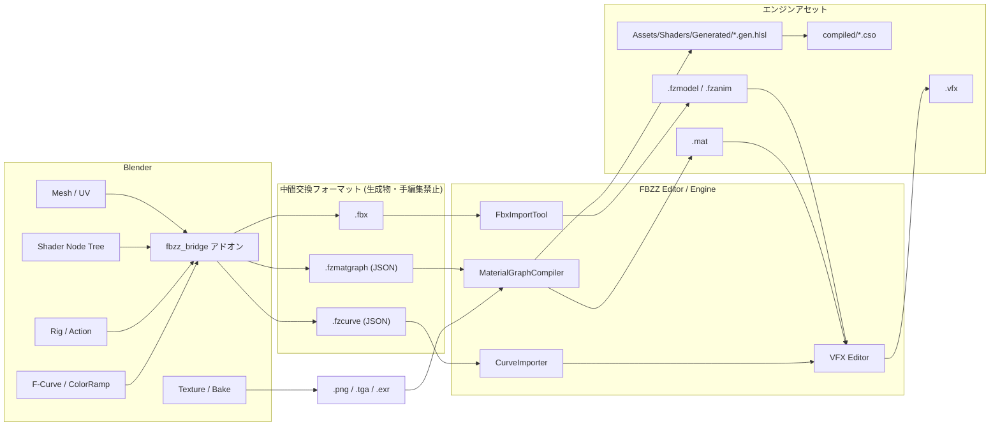

# Blender × FBZZ Engine — DCC 分業パイプライン設計

- Status: Draft
- Author: Hasegawa Jin
- Date: 2026-08-22
- Scope: アセット制作の責務境界、交換フォーマット、Blender アドオン、マテリアルノード → HLSL 生成、カーブ変換

---

## 1. 方針

### 1.1 なぜ分けるのか

エンジンを自作している以上「全部自作」は選択肢としてありうるが、
**再実装しても差別化にならない領域に工数を払うと、差別化になる領域が痩せる。**

以下の 3 軸で領域ごとに判定する。

| 判定軸 | 説明 |
|--------|------|
| A. エンジン結合度 | その領域の仕様が FBZZ の実装（GPU レイアウト・レンダーパス・スケジューラー）に依存するか |
| B. 既製品との実力差 | 既存 DCC が圧倒的に強いか。追いつくのに何年かかるか |
| C. 差別化価値 | 自作したときにエンジンの技術的価値として説明できるか |

### 1.2 判定結果

| 領域 | A 結合度 | B 実力差 | C 差別化 | 担当 |
|------|:---:|:---:|:---:|------|
| モデル編集 (mesh / modifier) | 低 | 極大 | なし | **Blender** |
| UV 展開 | 低 | 極大 | なし | **Blender** |
| テクスチャ制作 / ベイク | 低 | 極大 | なし | **Blender** |
| ノードベースのマテリアル制作 | 中 | 大 | 小 | **Blender**（UI のみ。翻訳は自作） |
| アニメーション (rig / skin / action) | 低 | 極大 | なし | **Blender** |
| カーブ編集 (F-Curve / Graph Editor) | 低 | 大 | なし | **Blender** |
| エフェクト構成 (VFX Graph) | **極大** | 小（Blender は不得手） | **極大** | **自作** |
| Particle System (spawn / lifetime) | **極大** | 小 | **大** | **自作** |
| Billboard / GPU Particle | **極大** | なし | **極大** | **自作** |
| 再生制御 (event / scrub / timeline) | **極大** | 小 | **大** | **自作** |
| エンジン固有パラメータ | **極大** | — | 中 | **自作** |
| HLSL 生成 | **極大** | — | **極大** | **自作** |
| 独自アセット形式への変換 | **極大** | — | 大 | **自作** |

### 1.3 この分担が含む切り捨て

**ノードベースのシェーダーグラフ・エディター UI は自作しない。**
Blender の Shader Editor を上流に据え、自作側は「ノードグラフを HLSL へ落とすコンパイラ」を持つ。

WHY:
- ノード UI そのものは既に ImGui ベースで [VFXGraphCanvas.cpp](../../Projects/Editor/src/VFXEditor/Views/VFXGraphCanvas.cpp) に実装済みで、
  同じものをマテリアル用にもう一つ作っても得るものが薄い。
- 一方、グラフ → HLSL のコード生成（型解決・定数畳み込み・cbuffer 割り付け・
  既存の差分コンパイルとリフレクション基盤への接続）は本作のレンダラー実装と密結合で、
  エンジンの中核として説明できる。

これは VFX エディターの否定ではない。**VFX は A/C ともに最大で、自作以外に選択肢がない。**

---

## 2. 責務境界

### 2.1 Blender の責務

| 項目 | 成果物 | 備考 |
|------|--------|------|
| メッシュ編集 | `.fbx` | トポロジー・法線・スムージング |
| UV 展開 | `.fbx` に同梱 | UV0=ベース、UV1=ライトマップ／ディテール |
| テクスチャ | `.png` / `.tga` / `.exr` | ベイク結果も含む |
| マテリアルノード | `.fzmatgraph`（アドオン出力） | Blender は**オーサリング UI のみ**担当。実行時の意味論は保証しない |
| リグ / スキン / アクション | `.fbx` | 既存 [AnimSubExporter.cpp](../../Projects/Editor/src/Import/AnimSubExporter.cpp) が受ける |
| カーブ / ColorRamp | `.fzcurve`（アドオン出力） | VFX の size-over-life / color-over-life 用 |

### 2.2 自作ツールの責務

| 項目 | 実装先 | 既存 / 新規 |
|------|--------|------|
| VFX グラフ構成 | `Projects/Editor/src/VFXEditor/` | 既存 |
| Particle Spawn / Burst / Lifetime | [ParticleEmitter.hpp](../../Projects/Engine/include/Engine/Scene/Components/ParticleEmitter.hpp) | 既存 |
| Billboard / GPU Particle | `ParticleGpuSim.cs.hlsl` + `GpuParticle` | 既存 |
| 再生制御・決定論スクラブ | [VFXPreviewController.hpp](../../Projects/Editor/include/Editor/VFXEditor/Services/VFXPreviewController.hpp) | 既存 |
| エンジン固有パラメータ | `MaterialAsset` / `VFXGraphAsset` | 既存 |
| **マテリアルグラフ → HLSL 生成** | `Projects/Engine/src/Asset/MaterialGraphCompiler.cpp` | **新規** |
| **F-Curve → ParticleCurve 変換** | `Projects/Engine/src/Asset/CurveImporter.cpp` | **新規** |
| **Blender アドオン** | `Tools/BlenderAddon/fbzz_bridge/` | **新規** |
| FBX → `.fzmodel` / `.fzanim` | `Projects/Editor/src/Import/` | 既存 |

### 2.3 境界にあるもの（＝自作ツールが「翻訳者」になる部分）

この設計の実装量はほぼここに集中する。

```
Blender の意味論          翻訳器（自作）                FBZZ の意味論
─────────────────         ──────────────                ─────────────
Shader Node Tree     →   MaterialGraphCompiler    →   .gen.hlsl + .mat
F-Curve / ColorRamp  →   CurveImporter            →   ParticleCurve / ParticleGradient
FBX Scene            →   FbxImportTool（既存）     →   .fzmodel / .fzanim
```

---

## 3. データフロー全体図



---

## 4. 交換フォーマット

### 4.1 一覧

| ファイル | 種別 | 真実の源 | 手編集 | Git |
|---------|------|---------|--------|-----|
| `.blend` | 作業ファイル | ✅ Blender | ✅ | LFS（`Assets/_src/`） |
| `.fbx` | 中間 | ❌ 生成物 | ❌ | LFS |
| `.fzmatgraph` | 中間 | ❌ 生成物 | ❌ | ✅ テキスト |
| `.fzcurve` | 中間 | ❌ 生成物 | ❌ | ✅ テキスト |
| `*.gen.hlsl` | 生成コード | ❌ 生成物 | ❌ | ✅ **コミットする** |
| `.mat` | エンジン資産 | 併合 | △ 手追加分のみ | ✅ |
| `.vfx` | エンジン資産 | ✅ VFX Editor | ✅ | ✅ |

### 4.2 生成 HLSL をコミットする理由

本リポジトリはポートフォリオ公開用であり、**Blender をインストールしていない閲覧者が clone してビルドできる**必要がある。
中間フォーマットと生成 HLSL をコミットしておけば、`.blend` を開かずに完全なビルドが通る。

### 4.3 `.mat` の併合規約

`.mat` は生成部分と手編集部分が混ざる唯一のファイル。オーバーレイ方式で分離する。

```toml
# Assets/Materials/Rock.mat
[generated]              # MaterialGraphCompiler が毎回上書きする。手で触らない
source_graph = "guid:8f2c..."
graph_hash   = "a91e4c07"
shader       = "Assets/Shaders/Generated/Rock.gen.hlsl"
[generated.textures]
albedoTex = "guid:1d33..."
[generated.params]
baseColorTint = [1.0, 1.0, 1.0]

[override]               # 人間 / Editor Inspector が書く。再生成でも保持される
render_queue = 2450
double_sided = true
```

ロード時は `generated` → `override` の順に適用する。
WHY: 再インポートのたびに Inspector で詰めたエンジン固有値が消えるのが最大の事故要因になるため。

---

## 5. Blender アドオン `fbzz_bridge`

### 5.1 構成

```
Tools/BlenderAddon/fbzz_bridge/
  __init__.py            # bl_info / register
  prefs.py               # プロジェクトルート、エンジン接続先の設定
  ui/
    panel_main.py        # 3D View N-panel "FBZZ"
    panel_material.py    # Shader Editor サイドバー（対応状況の表示）
  export/
    export_fbx.py        # エクスポート設定を固定した FBX 出力
    export_matgraph.py   # Shader Node Tree → .fzmatgraph
    export_curve.py      # F-Curve / ColorRamp → .fzcurve
  validate/
    rules.py             # 命名・スケール・UV・非対応ノードの検査
    report.py            # 検査結果の UI 表示
  link/
    pipe_client.py       # エンジンの Named Pipe へ通知（ライブリンク）
  schema/
    matgraph_schema.json # .fzmatgraph の JSON Schema（C++ 側と共有）
```

### 5.2 FBX エクスポート設定の固定

既存の [IFbxSubExporter.hpp](../../Projects/Editor/include/Editor/Import/IFbxSubExporter.hpp) は
Blender 由来の root 焼き込み（-90°X 回転 + scale 100）を検出して補正する実装が入っている。
アドオン側でエクスポート設定を固定し、**インポーター側の推測を不要にする**。

| 設定 | 値 | 理由 |
|------|-----|------|
| `apply_scale_options` | `FBX_SCALE_ALL` | 既存の `NormalizeBlenderRootTransforms` が想定する形 |
| `bake_anim_step` | `1.0` | `AnimSubExporter.cpp:394` のベイク前提と一致 |
| `add_leaf_bones` | `False` | 末端ボーンがスケルトン一致判定を壊す |
| `use_space_transform` | `True` | Z-up → Y-up を root に集約 |
| `path_mode` | `COPY` + `embed_textures=False` | テクスチャはエンジン側 `.meta` で管理 |

出力と同時に `<name>.fbx.fzhint` を書き、`sourceDcc = "blender"` と使用した設定値を明示する。
インポーターはヒントがあれば推測をスキップする（無い場合は既存の推測経路にフォールバック）。

### 5.3 Validate

エクスポート前に走らせる静的検査。**同じ規則を C++ 側にも実装して二重化する**
（Blender が無い CI でも中間ファイルを検査できるようにするため）。

| レベル | 例 |
|--------|-----|
| Error | 非対応ノードが出力へ寄与している / UV0 が無い / 循環参照 |
| Warning | 8 キーを超える F-Curve / スケール未適用 / 命名規約違反 |
| Info | 未接続ソケットが既定値で埋められた |

### 5.4 ライブリンク（Phase 4）

既存の AI Editor Command Bus（Named Pipe）に相乗りする。
Blender で保存 → アドオンがエクスポート → パイプへ `asset.reimport` を投げる → エディターが即座に再読込。

WHY 既存バスに乗せるか: 新しい IPC 経路を増やすと、権限・再接続・エラー通知をもう一組作ることになる。

---

## 6. マテリアルノード → HLSL 生成（コア）

### 6.1 二段構えにする理由

Blender 側では **HLSL を一切書かない。** ノードツリーを忠実に JSON へ写すだけ。
コード生成は全て C++ 側の `MaterialGraphCompiler` が行う。

WHY:
- Blender Python API はバージョン間で壊れる。壊れる範囲を「読み取り」だけに閉じ込める。
- 生成規則を C++ に置けば、`.fzmatgraph` さえあれば Blender 無しで再生成・再検証できる。
- 生成規則のユニットテストが GoogleTest 側で書ける。

### 6.2 対応ノードのサブセット（第 1 版）

| Blender ノード | IR ノード | HLSL 展開 |
|---------------|-----------|-----------|
| Principled BSDF | `Output` | 出力ソケットへのマッピング（下表） |
| Image Texture | `SampleTex` | `tex.Sample(samp, uv)` + テクスチャスロット割当 |
| UV Map | `UV` | `input.uv0` / `input.uv1` |
| Mapping | `Transform2D` | scale / rotate / translate の合成 |
| Normal Map | `NormalMap` | 接空間 → ワールド変換（既存 Surface シェーダーと同一式） |
| Mix Color | `Mix` | `lerp` / `Multiply` / `Screen` / `Overlay` などモード別展開 |
| Math | `Math` | 1:1 の組み込み関数 |
| Vector Math | `VecMath` | 同上 |
| Color Ramp | `Ramp` | 8 キー以内なら定数展開、超過は 1D LUT テクスチャへベイク |
| Value / RGB | `Const` | 定数、または露出パラメータ |
| Fresnel / Layer Weight | `Fresnel` | `pow(1 - saturate(dot(N, V)), p)` |
| Separate / Combine XYZ・RGB | `Swizzle` | スウィズル |
| Vertex Color (Color Attribute) | `VertexColor` | 頂点入力（要 `.fzmodel` 側の対応確認） |
| Bump | `Bump` | 高さ → 法線の近似（要 ddx/ddy、Warning を出す） |
| Noise / Voronoi | `Proc` | 固定実装へ写像。パラメータは一部のみ対応（Warning） |

**Principled BSDF の出力マッピング:**

| Blender ソケット | FBZZ サーフェス出力 |
|-----------------|-------------------|
| Base Color | `albedo`（sRGB オーサリング → シェーダー直前で 1 回だけリニア化） |
| Metallic | `metallic` |
| Roughness | `roughness` |
| Normal | `normalWS` |
| Emission Color × Emission Strength | `emissive`（[ライト強度規約](#) `LIGHT_UNIT_SCALE` に従う） |
| Alpha | `alpha` |
| IOR / Specular | 無視（Warning） |

**非対応（Error）:** Displacement / Volume 系 / Subsurface / Mix Shader の任意合成 /
Geometry Nodes 依存の Attribute / Cycles 専用ノード。

### 6.3 コンパイルパイプライン

```
.fzmatgraph
  │
  ├─ 1. パース & Schema 検証
  ├─ 2. DAG 検証        （循環・孤立・出力未接続）
  ├─ 3. 型解決          （Blender の暗黙変換規則を模した coercion 挿入）
  ├─ 4. 定数畳み込み・デッドコード除去
  ├─ 5. リソース割り付け（テクスチャ → t0..tN、露出値 → CB_MATERIAL）
  ├─ 6. HLSL 生成       （テンプレートへ EvaluateSurface() 本体を差し込む）
  │
  ├──> Assets/Shaders/Generated/<name>.gen.hlsl
  └──> Assets/Materials/<name>.mat  ([generated] セクションのみ更新)
```

生成後は**既存の経路にそのまま乗る**：

```
*.gen.hlsl → Editor/CMake の自動収集・差分コンパイル → compiled/*.cso
           → DX11Shader::Init() のリフレクション
           → ShaderDescriptor（vars / textures / cbufferSize）
           → .mat の params が名前で束縛される
```

ここが重要な設計上の利点で、**`.mat` は既にバイトオフセットではなく変数名で値を持っている**
（[MaterialAsset.hpp:53](../../Projects/Engine/include/Engine/Asset/MaterialAsset.hpp#L53) の WHY コメント）。
生成シェーダーの cbuffer レイアウトが変わっても、名前が一致していれば値が生き残る。

### 6.4 生成コードの形

Surface シェーダー本体は既存のものを共有し、**マテリアル固有部分だけを関数として差し込む**。

```hlsl
// Assets/Shaders/Generated/Rock.gen.hlsl
// GENERATED by MaterialGraphCompiler — DO NOT EDIT
// source : Assets/_src/Rock.blend  (guid:8f2c...)
// hash   : a91e4c07

#include "../Surface/SurfaceCommon.hlsli"

Texture2D albedoTex : register(t0);
Texture2D normalTex : register(t1);

cbuffer CB_MATERIAL : register(b1)
{
    float3 baseColorTint;   // exposed: Blender の RGB ノード "Tint"
    float  roughnessScale;  // exposed: Value ノード "Rough"
    uint   textureMask;
};

SurfaceOutput EvaluateSurface(SurfaceInput input)
{
    float2 uv0 = input.uv0;
    float2 n1  = uv0 * float2(2.0, 2.0);            // Mapping
    float4 n2  = albedoTex.Sample(g_samplerLinear, n1);
    float3 n3  = n2.rgb * baseColorTint;            // Mix Color (Multiply)
    float3 n4  = UnpackNormalMap(normalTex.Sample(g_samplerLinear, n1), input);

    SurfaceOutput o = (SurfaceOutput)0;
    o.albedo    = n3;
    o.metallic  = 0.0;
    o.roughness = saturate(0.8 * roughnessScale);
    o.normalWS  = n4;
    o.emissive  = 0.0.xxx;
    o.alpha     = 1.0;
    return o;
}
```

変数名は `n<node_id>` で決定論的に振る。
WHY: 名前を安定させないと、無関係な編集で生成差分が全面的に発生し、Git のレビューが不可能になる。

### 6.5 露出パラメータ

Blender 側でノードに custom property `fbzz_param` を付けたものだけを cbuffer 変数に昇格する。
それ以外は定数畳み込みで消える。

WHY: 全ノードを露出させると cbuffer が肥大し、Inspector も使い物にならない。
露出は「ゲーム中／エディターで触りたい値」だけという明示的な意思表示にする。

これは既に VFX 側で採用している「公開パラメーター + インスタンス override」と同じ考え方で揃える。

### 6.6 決定論とキャッシュ

- `.fzmatgraph` の正規化 JSON を FNV-1a でハッシュ → `.mat` の `graph_hash` と比較。
- 一致すれば HLSL 生成もシェーダーコンパイルもスキップ。
- JSON はキー順ソート・浮動小数点を固定書式で出力し、Blender の再エクスポートで無意味な差分が出ないようにする。

### 6.7 非対応ノードのフォールバック

Validate が Error を出したとき、**Blender 側にベイク導線を提示する**。

```
[Error] "Rock" マテリアル: Voronoi Texture の 'Distance to Edge' は非対応です。
  → [このノード網を Image Texture へベイク] ボタン
    （Blender の bake 機能で 2048² を焼き、Image Texture 1 枚に置換する）
```

複雑なプロシージャルは「Blender で焼いて 1 枚の画像にする」のが最も現実的な解であり、
コンパイラの対応ノードを無限に増やす方向へは進まない。

---

## 7. カーブ変換

### 7.1 制約

エンジン側 [ParticleCurve](../../Projects/Engine/include/Engine/Scene/Components/ParticleEmitter.hpp#L134) は
GPU 定数バッファ転送のため固定長：

- 最大 8 キー（`kMaxParticleCurveKeys`）
- 補間はキー単位ではなく**カーブ単位**（`Linear` / `Step` / `Smooth`）
- CPU の `ApplyCurveInterpolation` と GPU の `ParticleGpuSim.cs.hlsl` が同一式でなければならない

Blender の F-Curve は任意キー数の Bezier なので、**間引きが必須**。

### 7.2 変換手順

```
Blender F-Curve
  │
  ├─ 1. X 軸を [0,1] へ正規化（フレーム範囲 → 正規化時間）
  ├─ 2. Bezier を N=256 点でサンプリング
  ├─ 3. Douglas-Peucker で最大誤差基準に間引き → 8 キー以内へ
  ├─ 4. 元カーブとの最大誤差を計算
  │      誤差 > 2% なら Warning（「Smooth 補間へ変更」または「形状を単純化」を提案）
  └─ 5. 補間モード推定
         全区間が直線 → Linear / 階段状 → Step / それ以外 → Smooth
```

### 7.3 ColorRamp → ParticleGradient

- 8 キー以内ならそのまま `ParticleGradient` へ。
- **色空間規約を守る**: キーの RGB は sRGB オーサリング値のまま書き出し、`colorSpace = Gamma` を立てる
  （[ParticleEmitter.hpp:166-171](../../Projects/Engine/include/Engine/Scene/Components/ParticleEmitter.hpp#L166-L171) の規約）。
  Blender の ColorRamp は内部でリニアを持つため、**アドオン側で sRGB へ戻してから書き出す**。
  ここを間違えると CPU/GPU 双方で色が食い違う。
- Blender の `Constant` 補間 → `Step`、`Linear` → `Linear`、`Ease`/`B-Spline` → `Smooth`。

### 7.4 `.fzcurve` の使われ方

VFX Editor のカーブ編集欄に「`.fzcurve` を読み込む」導線を足す。
**カーブは VFX の資産として `.vfx` に埋め込まれ、`.fzcurve` への参照は残さない。**

WHY: カーブは VFX Editor 上で微調整するのが常態であり、リンクを保つと
「Blender 側で変えたら VFX が壊れる」逆流が起きる。Blender は**初期値の供給元**に留める。

---

## 8. VFX 側の責務（自作）

### 8.1 Blender 由来は「素材」として扱う

| VFX 機能 | Blender から受け取るもの | 自作が持つもの |
|---------|----------------------|--------------|
| `VFXMeshSettings` | メッシュ | 配置・スケール・LOD・インスタンシング |
| `VFXAnimatedMeshSettings` | スケルタルアニメ | 再生速度・ブレンド・イベント |
| Particle 描画 | テクスチャ / マテリアル | Billboard モード・ソート・ブレンド |
| Curve / Gradient | 初期形状 | 8 キー化・GPU パッキング・スクラブ |

### 8.2 Blender の Particle System は使わない

WHY:
- Blender のパーティクルはレンダリング（Cycles/EEVEE）前提で、実行時 GPU シミュレーションへ写せない。
- スポーン・寿命・力場の意味論が FBZZ の `ParticleGpuSim.cs.hlsl` と一致せず、
  「Blender で見えた絵」と「ゲーム内の絵」が乖離する。乖離するパイプラインは使われなくなる。
- 決定論スクラブ・budget 可視化・イベントリンクといった、既に自作側にある強みが全て失われる。

**プレビューの真実の源は常に FBZZ の VFX Editor。** Blender 内では VFX をプレビューしない。

---

## 9. 命名・GUID・フォルダ規約

既存の `.meta` / GUID 基盤にそのまま乗せる。

```
Assets/
  _src/                      # .blend 置き場（Git LFS）。エンジンは読まない
    Rock.blend
  Models/
    Rock.fbx        Rock.fbx.meta        Rock.fbx.fzhint
    Rock.fzmodel
  Materials/
    Rock.mat        Rock.mat.meta
    Rock.fzmatgraph Rock.fzmatgraph.meta
  Shaders/
    Generated/
      Rock.gen.hlsl                      # 生成物。手編集禁止
    compiled/
      Rock.gen.ps.cso
  Curves/
    FireSize.fzcurve
```

- `.fzmatgraph` → `.mat` → `.gen.hlsl` の対応は **GUID 参照**で保持する（パス依存にしない）。
  リネーム随伴は既存の仕組みがそのまま効く。
- `.blend` のファイル名がアセット名の起点。Blender 側の Validate で命名規約を検査する。

---

## 10. 実装フェーズ

| Phase | 内容 | 完了条件 |
|-------|------|---------|
| **0** | 本設計の確定・規約合意 | このドキュメントのレビュー完了 |
| **1** | `fbzz_bridge` 骨格 + FBX エクスポート設定固定 + `.fzhint` | Blender からワンボタンで出した FBX が、インポーター側の推測補正なしで正しく取り込める |
| **2** | `.fzcurve` エクスポート + `CurveImporter` | Blender の F-Curve / ColorRamp を VFX Editor のカーブ欄へ読み込める。誤差警告が出る |
| **3** | `.fzmatgraph` エクスポート + `MaterialGraphCompiler`（静的サブセット） | Principled + Image Texture + Mapping + Mix + Math + ColorRamp + Normal Map で構成したマテリアルが、エンジンで Blender とほぼ同じ絵になる |
| **4** | 露出パラメータ / ベイクフォールバック / Validate UI | 非対応ノードが Blender 上で事前に分かり、ベイク導線で解決できる |
| **5** | ライブリンク（Named Pipe 相乗り） | Blender で保存 → エディターが自動再読込 |
| **6**（任意） | VFX への形状供給（mesh shape emitter / animated mesh） | Blender メッシュ表面からのパーティクル放出 |

Phase 3 が最も重く、ここだけで他フェーズの合計を超える想定。
Phase 1・2 は Phase 3 の依存ではないので、先に通してパイプラインの往復を体感してから 3 に入る。

---

## 11. 非目標

- **Blender 内での VFX プレビュー** — 真実の源を二重化しない。
- **エンジン → Blender の逆同期** — 一方向のみ。逆流を許すと衝突解決が破綻する。
- **Geometry Nodes / Volume / Cycles 専用機能の互換** — ベイクして画像／メッシュに落としてから渡す。
- **Blender の物理シミュレーション結果の持ち込み** — 将来 Alembic を検討する余地だけ残し、本設計の範囲外。
- **任意ノードグラフの完全互換** — サブセットを定義し、外は Error + ベイク導線で受ける。

---

## 12. リスクと対策

| リスク | 影響 | 対策 |
|--------|------|------|
| Blender と FBZZ で絵が一致しない | パイプラインが信用されず使われなくなる | Phase 3 の完了条件に「参照シーンの比較スクリーンショットが一致」を含める。差分が出る要因（トーンマップ・色空間・ライト単位）を先に文書化する |
| Blender Python API の破壊的変更 | アドオンが動かなくなる | アドオンは読み取りのみに責務を絞る。生成規則は C++ 側にあるため、アドオンが壊れても既存の中間ファイルからは再生成できる |
| 生成 HLSL の差分ノイズ | Git レビューが不能に | 変数名を `n<node_id>` で決定論的に、JSON をキー順ソート・固定書式で出力 |
| コンパイラの対応ノードが際限なく増える | 工数が膨張 | サブセットを明示的に凍結。追加は「ベイクで代替できないか」を必ず先に検討 |
| `.mat` の手編集値が再生成で消える | 作業のやり直しが頻発 | `[generated]` / `[override]` のオーバーレイ分離（§4.3） |
| カーブ 8 キー制約で表現が落ちる | 意図した動きにならない | 変換時に最大誤差を計算し、閾値超で Warning。最終調整は VFX Editor 側で行う運用にする |
| `.blend` / `.fbx` のリポジトリ肥大 | clone が重くなる | `Assets/_src/` と `.fbx` を Git LFS へ。テキスト中間ファイルは通常管理 |

---

## 13. 参照

- [ParticleEmitter.hpp](../../Projects/Engine/include/Engine/Scene/Components/ParticleEmitter.hpp) — `ParticleCurve` / `ParticleGradient` / `GpuParticle`
- [MaterialAsset.hpp](../../Projects/Engine/include/Engine/Asset/MaterialAsset.hpp) — `.mat` のスキーマと名前束縛の設計意図
- [ShaderDescriptor.hpp](../../Projects/Engine/include/Engine/Renderer/ShaderDescriptor.hpp) — リフレクション結果。生成 HLSL の接続先
- [VFXGraphAsset.hpp](../../Projects/Engine/include/Engine/Asset/VFXGraphAsset.hpp) — `.vfx` のノード種別
- [IFbxSubExporter.hpp](../../Projects/Editor/include/Editor/Import/IFbxSubExporter.hpp) — `FbxSourceDcc::Blender` の補正仕様
- [FbxImportTool.cpp](../../Projects/Editor/src/Import/FbxImportTool.cpp) — root 焼き込み正規化の実装
