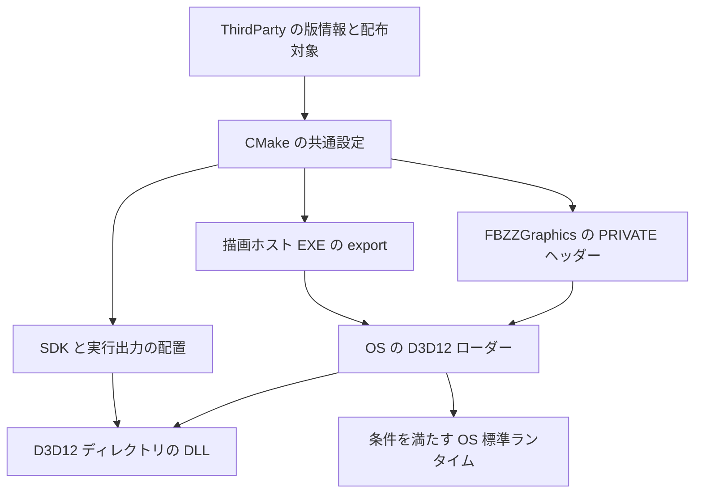

<!-- @file    dx12-agility-sdk.md -->
<!-- @brief   Agility SDK の選択、DX12 の非公開依存、SDK とゲームへの配布設計。 -->
<!-- @author  Hasegawa Jin -->
<!-- @date    2026-10-03 -->
# DirectX 12 Agility SDK の導入設計

- 状態: 実装済み・受入検証中。固定依存、C++ / CMake、SDK / ゲーム配布と GameHub の変更を実装し、コンパイル検証、全シェーダーの再生成、Graphics 単独描画、SDK 配置回帰、Debug / Release SDK 公開、SDK 版 Editor の Play / Edit 往復、開発ツリー外のゲームの同梱 Core / DXC 使用を確認した。BuildPipeline による最終組立と streaming bake、基準画像との比較、PIX の受入確認は未完了。
- 採用: 安定版 `Microsoft.Direct3D.D3D12 1.619.6` をベンダー管理し、描画ホスト EXE が `D3D12SDKVersion=619` と `D3D12SDKPath=.\D3D12\` を export する。
- 対象: Windows x64 の DX12 有効構成、Graphics 単独利用、Editor、Sandbox、SDK を使うゲーム、描画テストとベンチ。

Agility SDK を、現行の SM 6.8 / Bindless 要求に対応する D3D12 ランタイムの配布基盤として導入する。EXE の指定、Graphics のヘッダー、開発用の検証レイヤー、SDK と最終ゲーム出力を一つの版管理契約で揃える。完了条件は、開発ツリーと配布物の両方で起動と描画を検証できること。

## 実装・検証状況 (2026-10-03)

| 対象 | 実装 | 確認済み・未確認 |
|---|---|---|
| 固定依存と告知 | Agility 1.619.6、DXC 1.9.2609 を取り込み、各 `VERSION` にアーカイブと全取り込みファイルの SHA256 を保存 | 公式取得物と x64 ファイル版を確認。Core 1.619.6.0、DXC 一式 1.9.2609.5 |
| Graphics と描画ホスト | PRIVATE ヘッダー、EXE helper、事前 PE / ファイル版検証、実ロード元・ドライバー診断、プロセス単位の検証設定 | Graphics の変更 C++ は `AgentBuild check` 合格。Graphics 単独 EXE のリンクと export / 固定 runtime 正常・Core 単独欠落拒否・描画 / GPU 読戻しの 3 テストが合格 |
| シェーダー | 両コンパイルスクリプトと実行時キャッシュに DXC 一式・profile・entry・引数の生成契約を追加。SHA256 は PowerShell のモジュール探索に依存しない .NET 実装。固定配布を端末の環境値より優先 | 固定 DXC で source 304 件、GreenWare 344 件を全再生成し両方終了コード 0。既定選択で `stale=0` / `orphans=0` を確認。旧 Windows SDK の `FBZZ_DXC` が残る端末でも CMake configure と両スクリプトの選択計画が合格。旧版を明示 `-CompilerPath` に指定した両スクリプトは終了コード 1。全シェーダーの実 GPU 検証は未確認 |
| SDK / GameHub | schema 2、共通・構成別 fingerprint、公開失敗時の無効状態、Stage / Validate、通常起動・配布コピー先の契約検査 | GameHub の構文・型検査、本番契約関数を使う Node fixture 126 ケースと `SharedSDKTemplates` が合格。SDK を正本にした起動、8 DLL の一致、欠落・改ざん、古い公開元 DLL、構成の保存・無効化を確認。配置回帰の拒否ケースは 49 件。Electron UI 起動は未確認 |
| Editor と最終ゲーム配布 | 共通 validator、初回ゲームビルド前の SDK 構成検査、Core の明示コピー、Layers 除外、runtime / 告知の SHA256 検査 | Editor の C++ 検査は事前判定の最終修正 2 本を含め合格。元ツリーの EditorLauncher と Debug / Release SDK 公開ビルドはエラー・警告 0。両 SDK Editor の Play / Edit 往復は画像比較 skip で各 8 / 8 steps、終了コード 0。SDK 内の 8 DLL・Core・DXC の実ロードを確認。専用 GreenWareStandalone Debug の consumer ビルドも合格。隔離コピーで 115 scripts、同梱 Core / DXC、1099 frames 後の shutdown を確認。BuildPipeline 本体の組立と streaming bake、隔離ゲームの終了コードは未確認 |
| GPU なし構成 | Agility / DXC 依存と export を省き、source-tree 配布には `dx12_enabled=false` の最小契約だけ生成 | 依存元が存在しない source-tree runtime Stage で最小契約のみの生成を確認。SDK と source-tree 全体の GPU なし configure / build 回帰は未確認 |
| 受入シナリオ | 既存 Graphics 単独描画、`TitleSmoke.playtest.json`、SDK fixture と PIX の検証経路を維持 | Graphics 単独描画・GPU 読戻しと SDK fixture の 4 テストが合格。SDK 版 Editor の `AgilityStartup` は 7 / 7 steps、896 frames で合格。Play の実行可否を待つ `TitleSmoke` の追加確認で Play・90 frames 後のシーン・タイトル描画は成功。既存の `Tests/Golden/Title_90f.png` が存在せず画像比較は未検証。隔離ゲームでは開発 PATH と SDK / DXC / EngineAssets の環境指定を除去し、app-local Core 1.619.6.0 と DXC 1.9.2609 の使用を確認。OS 標準 Core の選択経路と PIX capture / timing は未確認 |

実装済みであることと受入合格は区別する。未確認の経路を合格に数えず、以下の受入条件を満たした結果で本表を更新する。

検証ログは `build/agent/build-20261003-170526-66136.log` (EditorLauncher と source 304 件の再生成)、`GreenWare/Assets/Shaders/compile_log.txt` (344 件再生成)、`build/agent/build-20261003-171433-65180.log` (Debug SDK 公開)、`build/agent/test-20261003-165221-58884.log` (Graphics / SDK の 4 テスト)、`build/agent/configure-20261003-184849-62816.log` (旧 DXC 環境値のある端末の configure)、`build/agent/build-20261003-184615-68304.log` (専用 GreenWareStandalone の consumer ビルド)、`Scratch/AgilityStartupReport.json` (SDK 版 Editor の Play / Edit 往復)、`Scratch/AgilityTitleSmokeReadyReport.json` (タイトル描画と基準画像欠落の記録)。起動対象は `SDK/0.9.1/tools/Debug/Editor/FBZZEditor.exe`。

旧 DXC 環境値を変更しない EditorLauncher と SDK 公開のビルドは `build/agent/build-20261003-185313-54716.log` でエラー・警告 0。開発ツリー外のゲームは `Scratch/AgilityGameAcceptanceLaunch.json`、`Scratch/AgilityGameAcceptanceReport.json`、`Scratch/AgilityGameAcceptance.log` に配置・環境・実ロード元を記録した。配布契約に沿う検証用コピーであり、BuildPipeline 本体を実行した出力とは区別する。

SDK を正本にした起動と更新は [shared-engine-sdk.md](shared-engine-sdk.md) に実装・検証を記録した。Debug / Release の実公開、公開した全記録の SHA256、Editor の起動・Play・90 frames 後のシーン・Stop、DLL 実ロード元の一致が合格した。`SharedSDKTemplates` の最終回帰は `build/agent/test-20261003-194245-49756.log`、実起動は `Scratch/CanonicalSDKEditor{Debug,Release}.Report.json` と同名 Modules / stdout の記録を参照する。

## 導入の目的と範囲

`Projects/Graphics/src/Renderer/Platform/DX12/DX12Context.cpp` は SM 6.8 と Resource Binding Tier 3 を必須にしている。同じディレクトリの `DX12Shader.cpp` は標準の `cs_6_8` / `vs_6_8` / `ps_6_8` を使う。導入前は Agility SDK の選択指定と同梱ランタイムがなかったため、本実装で両方を追加した。

対応する D3D12 ランタイムを配布し、OS 側の更新状況への依存を減らす。GPU / ドライバーの能力不足と、同梱物の不足・不整合を区別して診断する。GPU やドライバーの能力を SDK 導入で補えるとは扱わない。

既存の [Graphics の境界](graphics-library.md)、[Bindless](bindless.md)、[DX11 撤去](dx11-removal.md)を維持する。SM 6.8 の変更、DX11 の復活、シェーダー・アセット形式の変更は今回の範囲に含めない。

Enhanced Barriers、Work Graphs、GPU Upload Heaps、Advanced Shader Delivery は後続の個別設計とする。[RenderGraph の設計](render-graph.md)に従い、バリア最適化はコストが実測で確認された場合に着手する。SDK 導入だけの性能向上を受入条件にしない。

## 版と実行環境の契約

| 項目 | 初期導入の指定 |
|---|---|
| NuGet パッケージ | `Microsoft.Direct3D.D3D12` |
| パッケージ版 | `1.619.6`。2026-10-03 に確認した安定版を固定 |
| `D3D12SDKVersion` | `619`。パッケージ版文字列とは別の整数 |
| `D3D12SDKPath` | EXE からの相対パス `.\D3D12\`。末尾の区切りを含む |
| アーキテクチャ | x64。x86 / ARM64 は今回の対象外 |
| シェーダー契約 | 現行の SM 6.8 / Resource Binding Tier 3 |
| リンク | Windows SDK の `d3d12.lib`。OS の `D3D12.dll` を使用 |

指定版の根拠は [Microsoft のリリース一覧](https://devblogs.microsoft.com/directx/directx12agility/)と[版を指定した NuGet ページ](https://www.nuget.org/packages/Microsoft.Direct3D.D3D12/1.619.6)。configure / build 時の自動ダウンロード、最新版の自動選択、プレビュー版は導入しない。

**固定するのは配布パッケージと EXE の要求版であり、実際にロードされる DLL の完全一致ではない。** OS 標準ランタイムが同等以上なら OS 側が使われるのは正常な選択規則である。要求した版と実ロード元を別々に記録する。[公式の版選択仕様](https://microsoft.github.io/DirectX-Specs/d3d/D3D12Redistributable.html#using-the-redist)

Agility のローダー対応は更新済み Windows 10 1909 以降が前提。この条件だけで FBZZ の SM 6.8 / Tier 3 要求を満たすとは保証しない。FBZZ の対応 OS / GPU / ドライバーは実機検証結果と併記する。[公式の OS とドライバー要件](https://devblogs.microsoft.com/directx/gettingstarted-dx12agility/#setting-up-your-machine)

`FBZZ_ENABLE_DX12=OFF` の GPU なし構成には、export ソース、Agility ヘッダー、ランタイム配置、必須ファイル検証を適用しない。外部 SDK 利用側には SDK の DX12 有効状態を公開し、無効 SDK に helper を適用しても描画依存を持ち込まない。

## 依存物と版情報の管理

取り込み先は `ThirdParty/AgilitySDK/`。以下を実装し、パッケージ原文の `distributable files.txt` も保存した。

```text
ThirdParty/AgilitySDK/
  VERSION
  LICENSE
  LICENSE.txt
  LICENSE-CODE.txt
  build/native/include/
  build/native/bin/x64/
    D3D12Core.dll
    d3d12SDKLayers.dll
```

`VERSION` を版情報の正本とする。パッケージ名・版・SDK 整数版・取得元・取得日・パッケージと各取り込みファイルの SHA256・アーキテクチャ・更新手順を記録する。ハッシュは実際の取得物から計算し、設計段階では値を作らない。CMake の export ソース、Graphics の内部診断用定数、SDK manifest はこの正本から生成する。ホストごとに `619` を手書きしない。

パッケージ原文の `LICENSE.txt` はバイナリ、`LICENSE-CODE.txt` はヘッダーに適用される。両方を保持し、`LICENSE` は対象との対応を案内する。追加告知と再配布対象一覧も取り込み時に確認・保存する。[パッケージのライセンス区分](https://www.nuget.org/packages/Microsoft.Direct3D.D3D12/1.619.6)、[バイナリの配布条件](https://www.nuget.org/packages/Microsoft.Direct3D.D3D12/1.619.6/License)

`THIRD-PARTY-NOTICES.md` に追記する。既存の PIX と同じ経路で、SDK の `share/fbzz/licenses/AgilitySDK/` と実行出力・ゲーム配布物の `EngineLicenses/AgilitySDK/` に版情報と適用ライセンス・告知を運ぶ。PDB、SDK 付属の開発用 EXE、他アーキテクチャは初期取り込みと通常ゲーム配布の対象にしない。

## Graphics とホストの責務



### Graphics の非公開依存

`Projects/Graphics/CMakeLists.txt` で Agility の include を `FBZZGraphics` の PRIVATE に追加し、Windows SDK の D3D12 ヘッダーより優先する。既存の `d3d12` / `dxgi` / `dxguid` の PRIVATE リンクと、Graphics の公開依存 Core / Math を維持する。Editor、Engine、Script、外部ゲームの公開ヘッダーに DX 型や Agility の include パスを流さない。

`D3D12.dll` を同梱したり、Core を独自に `LoadLibrary` して生成関数を差し替えたりしない。Graphics は通常の `D3D12CreateDevice` を呼び、ロード先の選択を OS ローダーへ委ねる。[公式の組み込み手順](https://devblogs.microsoft.com/directx/gettingstarted-dx12agility/#how-to-use-the-agility-sdk)

DXC は独立した依存として維持する。Agility の取り込みだけでは、シェーダーコンパイラーと DXIL validator は揃わない。公式 [DXC 1.9.2609](https://github.com/microsoft/DirectXShaderCompiler/releases/tag/v1.9.2609) の x64 `dxc.exe` / `dxcompiler.dll` / `dxil.dll` を `ThirdParty/DXC/` に固定し、版・取得元・ハッシュを SDK の配布契約へ記録した。SM 6.8 の全コンパイルは確認済みで、実 GPU での反射・描画確認を受入条件として残す。[DXC の公式配布と構成](https://github.com/microsoft/DirectXShaderCompiler#pre-built-binaries)

導入前の CMake、`Assets/Shaders/compile_shaders.ps1`、実行時ロードは独立に DXC を探索し、同じ端末でも別の版を選び得た。本実装は固定一式を選び、CMake と両コンパイルスクリプトで `VERSION` 正本の SHA256 と照合する。CMake は `FBZZ_DXC_ROOT` の一式を使用し、端末に残る `FBZZ_DXC` で置き換えない。シェーダースクリプトは明示 `-CompilerPath`、配布済み固定一式、固定一式が見つからない場合の `FBZZ_DXC` の順で選ぶ。明示した配置変更と環境値の fallback も同じ検証済み一式だけを許可し、異なる版・欠落・ハッシュ不一致は失敗とする。実際のコンパイル版とロード元を記録し、配布物は EXE 基準の明示パスからロードする。PATH や環境変数で配布物の欠落を補わない。

導入前の CSO 再生成判定は依存ファイルの時刻だけを比較し、DXC の更新だけでは以前の成果物が残った。本実装は DXC 一式のハッシュ、profile、entry、コンパイル引数を生成判定へ含め、変更時は対象 CSO を再生成する。初期移行で既存 CSO を全再生成し、エンジン側と GreenWare 側の両 `compile_shaders.ps1` に同じ契約を適用する。CSO のファイル形式は変更しない。

ゲームが SDK と別のディレクトリにある場合も、`FBZZ_SDK_ROOT` の配布から固定 DXC を選ぶ。祖先にある SDK も同じ判定を使う。schema 2、DX12 有効状態、共通 runtime fingerprint と一致する `validated=true` の構成を要求し、Debug、Development、Release の順で tool を探す。更新前の無効構成に残った DXC は使わず、選択後は三つのファイルを `VERSION` の SHA256 と照合する。

両スクリプトの外部ゲーム PlanOnly 検証は 16 / 16 ケース合格 (`Scratch/ShaderSdkProbeReport.json`)。実 SDK Debug、Development-only と旧 fingerprint Debug の残存、Release-only と未検証 Debug の残存、祖先 SDK、source vendor 優先、明示パス優先、環境値の最終 fallback、明示旧版の拒否を確認した。候補選択の検査であり、この fixture では DXC 自体は起動しない。

### ホスト EXE の選択指定

`fbzz_enable_agility_sdk(target)` を EXECUTABLE 型専用の共通 CMake helper として実装した。版情報から生成した短い `.cpp` を EXE の直接ソースへ追加し、C linkage のデータシンボル `D3D12SDKVersion` / `D3D12SDKPath` を `__declspec(dllexport)` で export する。整数は 32 bit、パスは NUL 終端文字列へのポインター。生成ソースは DX / Windows ヘッダーを必要としない。

Graphics / Engine / Script DLL に export を置かず、STATIC archive 内の参照されない翻訳単位にも閉じ込めない。helper は二重適用で重複せず、DLL 型への適用は configure 時に拒否する。DX12 無効構成では省略する。[EXE export の公式契約](https://microsoft.github.io/DirectX-Specs/d3d/D3D12Redistributable.html#application-and-games)

| ホスト | 適用先 |
|---|---|
| Editor | `Projects/EditorLauncher` の `FBZZEditorLauncher`。成果物は `FBZZEditor.exe` |
| Sandbox | `Sandbox` / `SandboxStandalone` |
| GreenWare | `GreenWareStandalone` |
| SDK から作るゲーム | `standard` / `empty` テンプレートの Standalone EXE |
| テストとベンチ | Graphics を初期化する EXE。Graphics 単独テストも含む |
| 外部の Graphics 単独利用 | 公開 helper を描画ホスト EXE に適用 |

Electron の GameHub 本体と Scripts DLL は描画ホストに含めない。`fbzz_stage_runtime(Scripts)` は現行でも使われるため、汎用配置関数へ無条件に export を追加しない。

SDK の `cmake/FBZZ/` に helper と `.cpp.in` テンプレートを収録する。`fbzz_stage_runtime` は DLL にも使える配置関数のまま、SDK 指定は別 helper が担う。描画 EXE のテンプレートは両方を呼ぶ。既存 SDK consumer は helper を追加して移行し、C++ の起動コードへ export をコピーしない。

既存ゲームの CMake は SDK 更新だけでは書き換わらない。起動前の配置確認と配布検証で、ホスト EXE の両データ export の存在・整数版・パスを Graphics の要求契約と照合する。Core が置かれているだけでは移行済みと判定しない。OS 標準 Core が新しい環境でも、export の欠落・旧版・旧パスは consumer の移行不足として失敗し、helper の適用と EXE の再リンクを案内する。

`ID3D12SDKConfiguration::SetSDKVersion` は Windows Developer Mode を要求するため通常の方式に採らない。FBZZ の [DeveloperMode](developer-mode.md) と Windows の Developer Mode は別の設定であり、導入のためにどちらも要求しない。[API の制約](https://learn.microsoft.com/en-us/windows/win32/api/d3d12/nf-d3d12-id3d12sdkconfiguration-setsdkversion)

## ランタイムと配布物の配置

配置基準は全て EXE の親ディレクトリとする。CWD、Assets、PATH から Agility ランタイムを探さない。

```text
実行出力またはゲーム配布先/
  <Host>.exe
  FBZZGraphics.dll
  dxcompiler.dll
  dxil.dll
  D3D12/
    D3D12Core.dll
    d3d12SDKLayers.dll          開発用出力のみ
  EngineLicenses/AgilitySDK/
    LICENSE
    LICENSE.txt
    LICENSE-CODE.txt
    VERSION
    <同梱パッケージの追加告知>
```

| 出力 | Core | SDK Layers |
|---|---|---|
| 開発ツリー、SDK runtime / Editor の Debug / Development | 必須 | 必須。現行の GPU 検証設定用 |
| 開発ツリー、SDK runtime / Editor の Release | 必須 | 通常配置しない |
| 最終ゲーム配布物 | 必須 | 配布構成名によらず除外 |

Layers は Core と同じパッケージから取る。OS 標準 Core が選ばれる場合は対応する OS のレイヤーも使われるため、同梱 Layers の存在だけでは検証の成立を保証しない。開発検証では Windows の Graphics Tools (FoD) と同梱レイヤーを用意し、実際の有効状態を確認する。通常のゲーム利用者には Graphics Tools を要求しない。[開発レイヤーと配布の公式方針](https://microsoft.github.io/DirectX-Specs/d3d/D3D12Redistributable.html#d3d12-debug-layer)

検証の明示要求 `FBZZ_GPU_VALIDATION=1` と、Debug 構成による既定 ON を区別する。明示要求を満たせない場合は起動失敗とする。既定 ON だけの場合は現行どおり警告と検証無効を記録して通常描画を続ける。この扱いで、Layers を除外した最終 Debug ゲームも通常起動できる。SDK / 開発出力の配置検査は別に行い、必要な Layers の欠落を検出する。検証テストは明示要求を使い、有効化できなかった実行を合格に数えない。

配置と検証を次の各段階で保証する。

1. 開発ツリーでは EXE 出力先へ明示配置する。`$<TARGET_RUNTIME_DLLS>` だけでは動的選択と子ディレクトリを保証できない。
2. `StageFBZZSDK.cmake` は `bin/<Config>/D3D12/` と `tools/<Config>/Editor/D3D12/` を個別に配置する。Editor の過去の POST_BUILD 成否に依存しない。
3. `ValidateFBZZSDK.cmake` は manifest、helper / テンプレート、Core、必要な Layers、検証済み DXC 一式、版情報・ライセンス・告知を必須検証する。現行の DXC optional 検査も、DX12 有効構成では必須検査へ変更する。
4. `FBZZConfig.cmake.in` の `fbzz_stage_runtime` は runtime の再帰コピーで階層を維持する。SDK manifest にパッケージ版・SDK 整数版・相対パス・DX12 有効状態・対象ファイルの版とハッシュを記録する。
5. `BuildPipeline.cpp` は EXE 直下の DLL 列挙に加え、D3D12 の配布対象を明示してサブフォルダーへ同期する。フォルダーの丸ごとコピーで Layers や PDB を運ばない。
6. `BuildSettingsPanel.cpp` の事前確認と最終配布は manifest の同じ必須契約を使い、欠落をファイル名つきで示す。
7. GameHub は開発時の `SdkFreshness.mjs`、通常起動の `configStore.ts`、配布生成の `AssembleDistribution.mjs` を同じ manifest 契約へ合わせる。schema、DX12 有効状態、選択構成の公開状態と必須ファイルを確認し、manifest と Editor EXE の存在だけで有効 SDK と判定しない。配布生成ではコピー先も検証する。

同期時は SDK が所有する `D3D12/` のファイルに限って古い版と配布対象外を除去する。EXE ディレクトリ全体を清掃しない。Core だけ旧版、または Release に旧 Layers が残る組合せを許さない。

### 構成単位の公開と混在防止

現行の `CMake/FBZZSDK.cmake` は `SDK/<Engine version>/` を再利用し、共通の manifest / helper を上書きする一方、バイナリは公開した一構成だけを更新する。Agility 更新後に Release だけを再公開すると、Debug / Development の EXE と Core が旧版のまま残り得る。Engine の版一致だけで同じランタイム契約と判定しない。

manifest に共通のランタイム契約 fingerprint と、構成ごとの fingerprint・検証完了状態・ファイル版 / ハッシュを記録する。共通 fingerprint は Agility パッケージ、Core のハッシュ、SDK 整数版、相対パス、DX12 有効状態、DXC 一式、helper / manifest schema、publisher / validator から決める。共通契約が変わった場合は未更新構成を無効とし、個別の再公開と検証が済むまで GameHub、CMake consumer、配布生成の選択対象にしない。

公開開始時は共通ファイルの更新に備えて全構成を一時的に無効化する。Stage と Validate が成功した後、公開した構成と、既存記録の必須行・実ファイル SHA256・DLL の一致を再検査できた構成だけを有効へ戻す。失敗時に古い成功状態を残さない。ファイルを削除して構成を無効化する必要はなく、構成別記録で判定する。SDK 全構成を毎回ビルドすることは要求しない。GameHub 起動時は必要な構成の存在と版情報、Editor の 8 DLL の実ファイル SHA256 を確認し、全ファイルのハッシュ検査は公開・配布生成時に行う。Editor の起動先と更新の統一は [共有 Engine SDK](shared-engine-sdk.md) に従う。

## 起動順序と失敗時の扱い

Graphics の DX12 初期化に、版情報から生成した内部定数に基づく配置確認を追加する。ホスト EXE のデータ export と、EXE の親にある Core の存在・アーキテクチャ・ファイル版を、DXGI factory、debug layer、デバイスを作る前に確認する。確認は EXE の PE データとファイルメタデータの読取りで行い、D3D12 API や Core の追加ロードを使わない。OS 標準 Core が選ばれる環境でも確認し、壊れた配布物が開発機だけで成功することを防ぐ。ファイルのハッシュ整合は SDK 検証と最終配布で確認する。

順序は、既存の PIX 起動準備、Agility の配置確認、必要な debug layer、DXGI / デバイス生成、SM / Tier の照会、資源・シェーダー初期化。[PIX の契約](pix-profiling.md)どおり capturer は `D3D12GetDebugInterface` を含む最初の D3D12 API より前に準備する。[PIX の公式起動条件](https://devblogs.microsoft.com/pix/taking-a-capture/)

初期導入のサポート対象は、Graphics がプロセスの最初の DX12 初期化を所有するホストとする。検証設定は最初のデバイス生成前に一度確定し、同じプロセスで Graphics の context を追加・再生成しても debug layer の有効化を繰り返さない。他 DLL の先行デバイス生成後に FBZZ が検証設定を変更する利用は対象外とし、外部 consumer にこの起動契約を公開する。既存デバイスの後で `EnableDebugLayer` を呼ぶと device removed になるため、独立 DeviceFactory や外部プラグインとの共有初期化は別設計とする。[EnableDebugLayer の公式契約](https://learn.microsoft.com/en-us/windows/win32/api/d3d12sdklayers/nf-d3d12sdklayers-id3d12debug-enabledebuglayer)

| 状況 | 扱い |
|---|---|
| EXE export の欠落、Graphics の要求版・パスと不一致 | 起動失敗。consumer の helper 適用と EXE 再リンクを案内 |
| Core 欠落、x64 でない、指定パッケージと版不一致 | 起動失敗。EXE、期待する配置・版、見つかった値を記録 |
| 検証の明示要求に対して Layers / Graphics Tools が欠落・不整合、または検証コード未収録 | 起動失敗。検証を有効化できない理由を明示 |
| Debug の既定 ON だけでレイヤーを使用できない | 警告と実際の検証無効状態を記録し、通常描画を続行 |
| `D3D12_ERROR_INVALID_REDIST` | 要求版・パス・配置状況・HRESULT を記録。アダプター交換で隠さない |
| SM 6.8 / Tier 3 を満たさない | 現行の能力不足として停止し、SDK 配布不足と区別 |
| DXC 欠落 / コンパイル失敗 | DXC 側の診断として記録し、Agility の失敗と混同しない |
| Agility ローダーに未対応の OS | OS の対応不足を記録。自動インストールや設定変更をしない |

失敗は既存の `bool` と Logger へ返し、HRESULT 診断は `FBZZ_HR_CHECK` の規約に従う。DX11 や低い Shader Model へ縮退しない。OS の正式な規則による同等以上のランタイム選択は許容する。

デバイス生成後に、ロードされた `D3D12Core.dll` の絶対パスとファイル版、要求パッケージ / SDK 版、GPU / ドライバー、SM、Binding Tier、debug layer の有効状態を記録する。Windows の診断 API は Graphics の非公開 `.cpp` に閉じる。未取得項目は未取得とし、要求版を実ロード版として代入しない。診断のために Core を追加ロードしたり、プロセスの SDK 指定を変更したりしない。

SDK 指定はプロセス開始時から有効であり、Editor 設定、Script DLL ホットリロード、Play 開始・停止で切り替えない。版更新は EXE と DLL と配置物を更新し、プロセスを再起動する作業とする。

## 実装の変更範囲

以下を実装し、変更の責務をこの範囲へ対応させた。

| 場所 | 変更する責務 |
|---|---|
| `ThirdParty/AgilitySDK/`、`THIRD-PARTY-NOTICES.md` | 固定パッケージ、版・ハッシュ、適用ライセンス・告知 |
| 共通 CMake module と export 用 `.cpp.in` | 版情報の読取、EXE 専用 helper、ソース生成、明示配置 |
| `Projects/Graphics/CMakeLists.txt`、`DX12Context.cpp`、`GpuValidation.hpp` / `.cpp`、`DX12Shader.cpp` | PRIVATE ヘッダー、EXE / 配置確認、プロセス初期化、明示検証要求と既定値の区別、Core / DXC のロード元診断 |
| `Assets/Shaders/compile_shaders.ps1`、`GreenWare/Assets/Shaders/compile_shaders.ps1` | DXC 一式の選択、コンパイラーと引数の変更による CSO 再生成 |
| `Projects/EditorLauncher/CMakeLists.txt`、`Projects/Sandbox/CMakeLists.txt`、`CMake/FBZZTests.cmake` | 描画ホスト・ベンチへの適用 |
| `GreenWare/CMakeLists.txt`、`Projects/GameHub/Templates/{standard,empty}/CMakeLists.txt` | ゲーム EXE の適用。Scripts に適用しない |
| `CMake/FBZZSDK.cmake`、`CMake/SDK/fbzz-sdk.toml.in`、`FBZZConfig.cmake.in` | helper・テンプレート・配布契約の SDK 公開、構成別の契約一致と有効状態 |
| `CMake/SDK/StageFBZZSDK.cmake`、`ValidateFBZZSDK.cmake` | runtime / Editor の独立配置と必須検証 |
| `Projects/Editor/src/BuildPipeline.cpp`、`Panels/BuildSettingsPanel.cpp` | 同じ必須契約による事前確認、階層付き配布・告知 |
| `Projects/GameHub/scripts/SdkFreshness.mjs`、`Projects/GameHub/src/main/configStore.ts`、`Projects/GameHub/scripts/AssembleDistribution.mjs` | 開発時・通常起動・配布生成の SDK 完全性と構成一致の判定 |
| `CMake/SDK/TestSharedSDKTemplates.cmake`、既存 Graphics 単独テスト | export、階層・版・告知の回帰と単独描画 |
| `Tools/AgentBuild.ps1`、`Tools/README.md` | リポジトリ内の構成済み SDK consumer を、既存 VS 環境・全体 BUSY 検査を使ってビルド |

新しい調査・検証用ツールは追加せず、既存 SDK fixture と [AI 検証ループ](ai-verification-loop.md)を使う。実装の API 契約コメントには、対応する Microsoft 公式仕様を `/// @see` / `# @see` で残す。

## 検証と受入条件

確認状況は上表へ記録する。受入時はパッケージ、OS、GPU / ドライバー、DXC、実ロード元を記録して次を確認する。

| 検証 | 合格条件 |
|---|---|
| PRIVATE 境界 | 公開 Graphics / Engine / Script ヘッダーと SDK consumer に Agility の include パスや DX 型が漏れない |
| EXE 指定 | export 表の両データシンボルと版・パスが一致。二重適用は一組、DLL 適用は拒否 |
| 既存 consumer 移行 | OS 標準 Core が新しくても、export 未追加・旧版・旧パスの EXE と新版 Graphics の組合せを起動・配布検証で拒否 |
| GPU なし構成 | DX12 無効構成の configure / 検証に Agility を要求しない |
| SDK 配布回帰 | 既存 `SharedSDKTemplates` に完備、単独欠落、版不一致の fixture を追加。SDK と consumer の階層・告知・ハッシュが一致 |
| SDK 構成更新 | Release だけ新契約で再公開した fixture で、旧 Debug / Development は選択不可。公開失敗後も有効状態へ戻らない |
| GameHub の SDK 判定 | 通常起動と配布生成でも、必須ファイル欠落、未対応 schema、構成の契約不一致を拒否。コピー先の SDK も検証済み |
| DXC と CSO | offline compile と実行時 compile / reflection が検証済み一式を使用。DXC / 引数の変更で CSO が再生成され、配布先で環境変数による補完を使わない |
| プロセス初期化 | 複数 Graphics context と再初期化で、debug layer 設定は最初のデバイス生成前の一度だけ。PIX 準備前に D3D12 API を呼ばない |
| Graphics 単独描画 | `GraphicsStandaloneTest.DrawsAndReadsBackWithoutEngine` で Engine をリンクせず SM 6.8 のコンパイル・描画・GPU 読戻しが成功 |
| Editor と SDK 版 Editor | 既存 `TitleSmoke.playtest.json` で Play、描画、画像比較、Stop 復帰が成功。異なる CWD でも EXE 基準の配置を使用 |
| 最終ゲーム配布 | BuildPipeline の出力が開発ディレクトリ外で起動・描画。開発機の PATH / `FBZZ_DXC` / SDK 原本に依存しない |
| 不正配置 | 隔離したコピーで Core、必須告知、必要な Layers の単独欠落と Core の版・アーキテクチャ不一致を検出し、ファイル名つきで失敗 |
| 検証レイヤー | 明示要求時に実際の有効化を確認。Graphics Tools 未導入などで要求を満たせなければ失敗。最終 Debug ゲームの既定 ON による検証無効の警告は通常起動と区別 |
| OS の選択規則 | app-local Core と同等以上の OS 標準 Core の両経路で診断・描画を確認。未確認の側を合格に数えない |
| 通常配布 | Layers / PDB / SDK 付属ツールが残らず、Core と適用ライセンス・告知が存在 |
| PIX | 既存 PIX-ready 起動、capture 保存、再生、代表パスの GPU timing 取得が成立。通常起動の検証と区別し、PIX の版と GPU / ドライバー、実ロード元を記録 |

WARP は、その環境で SM 6.8 / Tier 3 を満たすと確認できた場合に `--batch --hidden --warp --skip-images` の補助検証へ使う。Core 同梱だけで OS の WARP が更新されるとは扱わない。WARP 非対応を成功に数えず、実 GPU 描画の確認は別に行う。WARP パッケージの取り込みは今回の必須範囲に含めない。

C++ の変更は `Tools/AgentBuild.ps1 check <変更ファイル>`、回帰は同じ入口の `test -Filter <regex>` で確認する。EXE のリンクと SDK 公開は実行中の Editor と競合し得るため、停止・再起動は既存作業を保存して調整する。ビルドは一度に一つとし、busy / CONTENDED をコードの誤りとして修正しない。

構成済み GreenWare SDK consumer は `Tools/AgentBuild.ps1 build GreenWareStandalone -Preset debug -BuildDirectory GreenWare/Build/VS` で検証する。指定先と cache のソースはリポジトリ内に限定し、同じ VS 環境入口と全体 BUSY 検査を使う。構成・生成先・Visual Studio generator が一致する既存 cache を要求し、consumer の自動 configure や別 preset への回避は行わない。GreenWare のスクリプトは専用 EXE へ静的登録されるため、Sandbox EXE に Scripts.dll を置く代用はゲーム配布の受入に数えない。

## 導入の順序と更新単位

1. 依存物と共通 helper を用意し、Graphics 単独テストで EXE export、PRIVATE ヘッダー、同梱 Core の描画を成立させる。
2. 全描画ホスト、SDK の Stage / Validate、ゲームテンプレートへ適用する。現行シェーダーとバリア方式を維持して回帰を確認する。
3. Editor の事前確認・最終配布・GameHub の完全性判定を揃え、開発ツリー外のゲーム出力を検証する。ここまでを初期導入の完了条件とする。
4. 新しい描画機能は必要性と計測結果に基づく別変更として設計する。

更新単位はパッケージ、ヘッダー、Core / 開発用 Layers、export 指定、SDK manifest、ライセンス・告知の一式。DLL だけ、またはホスト起動中の差し替えを更新手順に含めない。更新ごとに同じ受入条件を確認し、復帰が必要な場合も一式の変更として扱う。
