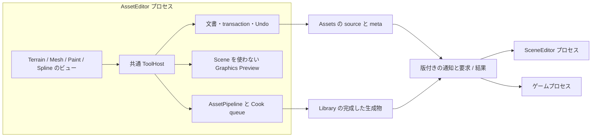
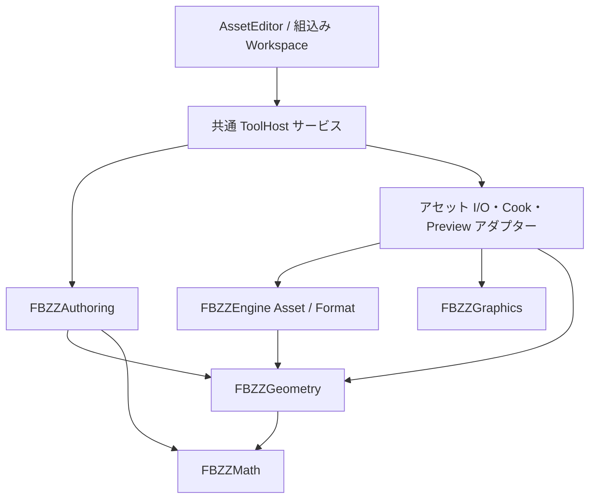
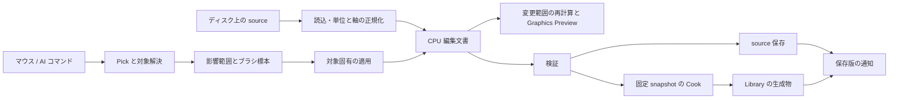
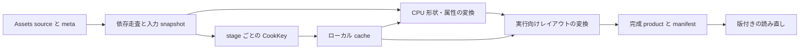

<!-- @file    geometry-authoring.md -->
<!-- @brief   RE ENGINE の公開設計を参考にした Terrain と Mesh の編集基盤とアセット制作パイプライン。 -->
<!-- @author  Hasegawa Jin -->
<!-- @date    2026-10-03 -->
# RE ENGINE を参考にした Terrain と Mesh の編集基盤

- 状態: 実装見送り。2026-10-03、今回の用途では開発・保守コストに対する効果が小さいと判断。実装・依存ライブラリの導入は未着手。
- 検討案: **共通 ToolHost 上の AssetEditor が編集正本を所有し、SceneEditor とゲームは版付きの描画・実行データを利用する。** Geometry は形状、Authoring は編集、AssetPipeline は変換を所有する。
- 検討時の完了条件: SceneEditor を起動せず、Scene / GameObject / Component を生成せずに地形アセットを編集できる。ゲーム側の停止・切断後も編集文書と Undo が残る。

## 見送りの判断

独立ツール化は、形状計算の分離に加え、文書・Undo・保存・描画資源・旧アセットの移行・復旧の整備を伴う。AI を併用しても、この整合性の確認と保守が必要になる。今回の用途では、そのコストに見合う制作上の効果が小さいため、独立 AssetEditor と Mesh / Paint の共通基盤の実装を見送る。

現行 TerrainTool を継続利用する。以下は検討記録として残す構成・移行案であり、採用済みの実装方針ではない。

TerrainTool をライブラリ化する方向は妥当である。ただし、現在のウィンドウを丸ごと移すと Scene の列挙、Transform、Undo、保存への依存も移る。地形の計算と編集セッションを分け、Terrain と Mesh が同じ操作基盤を使える構造を提案する。

完成形は独立した FBZZAssetEditor.exe とする。Terrain / Mesh / 将来の Paint / Spline のワークスペースを同じホストに載せ、文書、Undo、保存、ジョブ、UI 部品を共有する。単体地形の独立編集を最初の完成単位にし、各ツールに別の小型 SceneEditor を作らない。

移行中は同じワークスペースを FBZZEditor 内に組み込んで比較できるようにする。専用アプリと組込みホストは同じ Authoring とホストサービス契約を使い、Scene View の選択や activeScene を必須にしない。専用アプリの予定配置は Projects/DevTools/AssetEditor、共通ライブラリは Projects/Authoring とし、アプリ側の入口を薄くする。

## 現在の実装で分離する箇所

以下は作業ツリーの観察であり、本設計の実装済み機能ではない。

| 現在の場所 | 観察と分離の意味 |
|---|---|
| [ViewportPanel.cpp](../../Projects/Editor/src/Panels/ViewportPanel.cpp) | Scene View から activeScene、カメラ、入力、Scene dirty、共通 UndoStack を TerrainTool へ渡している |
| [TerrainTool.cpp](../../Projects/Editor/src/Tools/TerrainTool.cpp) | Scene 内の地形検索、raycast、ストローク、全 TerrainComponent の before / after コピーをまとめて持つ |
| [TerrainBrush.hpp](../../Projects/Editor/src/Tools/TerrainBrush.hpp) | 人と AI が共有する計算は分離済み。ただし TerrainComponent / scene::Transform が引数に入る |
| [TerrainComponent.hpp](../../Projects/Engine/include/Engine/Scene/Components/TerrainComponent.hpp) / [TerrainSplat.hpp](../../Projects/Engine/include/Engine/Scene/TerrainSplat.hpp) | 高さ・穴・層重み・格子操作と、Component / asset path / dirty が混在する |
| [SceneSerializer.cpp](../../Projects/Engine/src/Scene/SceneSerializer.cpp) | Scene 保存時に .terrain / .mat も保存する。ロード後には Scene の layerMaterials をアセットへ上書きする |
| [InspectorPanel_Asset.cpp](../../Projects/Editor/src/Panels/Inspector/InspectorPanel_Asset.cpp) | .terrain を一時 TerrainComponent として開く経路がある。複数文書・専用 viewport の出発点になる |
| [RenderScene.hpp](../../Projects/Graphics/include/Graphics/Renderer/RenderScene.hpp) / [ViewPipeline.hpp](../../Projects/Graphics/include/Graphics/Pipeline/ViewPipeline.hpp) | Scene 非依存の描画入力と BuildViewPipeline が既にあり、専用ビューの基盤にできる |
| [FbxImportTool.hpp](../../Projects/Editor/include/Editor/Import/FbxImportTool.hpp) | FBX + .meta が source、Library/Baked/<guid> の .fzasset が cache という既存パイプラインがある |

特に保存の責任を先に決める。アセット編集画面が保存した後、古い Scene 側のコピーを保存すると編集結果を巻き戻せる。単なるコード移設では解消しない問題である。

## RE ENGINE の公開資料から採る考え方

以下の CAPCOM 公式講演を根拠とする。CEDEC2015 / 2016 と GCC2017 は当時の設計であり、Docswell の掲載年を実装年と取り違えない。現在の RE ENGINE の DLL 構成や、Math のみの Geometry ライブラリを確認したという意味ではない。右列以降の具体的な型・名前・手順は FBZZ 向けの提案である。

| 公開資料で確認できること | FBZZ への設計提案 |
|---|---|
| GCC2017 のスライド 14–20 はツールとランタイムを別プロセスにし、Query / Response で通信する | AssetEditor の文書をゲームプロセスから独立させる。まず値による要求 / 結果の境界を作り、実機接続は同じ境界の transport として足す |
| CEDEC2015 前半のスライド 21–24 / 39–45 はアセット中心の複数エディター、データ変更と Undo・通知、transaction を扱う | 一個の文書モデルを複数ビューで共有する。ビューは入力と表示、編集は文書の transaction を通す |
| GCC2017 のスライド 40–42 は Reference と Include を区別する | 実行時参照と Cook 入力依存を別の graph にする。再変換と package 収録の範囲を分ける |
| CEDEC2016 のスライド 32–38 / 43 は source・内包依存・変換条件・版を考慮したキャッシュを扱う | 内容に基づくローカル Cook cache と、変換 stage ごとの依存を作る |
| RE:2023 のペイントは Pick、ブラシマップ、合成を分け、別エディターでも利用する | 共通ストローク・影響範囲と対象固有の適用を分ける。地形、頂点色、将来の texture / grooming を同じ操作基盤に載せる |
| RE:2023 の道制作はカーブから複数の実行表現へベイクし、全世界の再ベイクを課題として挙げる | Spline を編集正本として残し、変形 Mesh・instance 配置・地形処理を選択できる変換工程にする |
| RE:2023 の UX 改善は共通の基本コントロールとデザインライブラリ、動くカタログを整備する | 操作感、単位表示、dirty / Cook 状態、エラー表示をホストで揃える |
| REAC2025 の Meshlet はオフライン変換済みデータを使う | GPU 順序・圧縮・meshlet は Cook の成果物とし、編集 ID と配列添字を分ける |

出典: CAPCOM [GCC2017 ラピッドイテレーション](https://www.docswell.com/s/CAPCOM_RandD/KQQWMK-2022-07-15-133419)、[CEDEC2015 エディター群とバックエンド 前半](https://www.docswell.com/s/CAPCOM_RandD/5RX4PJ-cedec2015)、[CEDEC2016 アセット変換とキャッシュ共有](https://www.docswell.com/s/CAPCOM_RandD/K7VM82-cedec2016)、[ライブペイント](https://www.docswell.com/s/CAPCOM_RandD/ZM12P9-RE2023) のスライド 15–22、[道の制作フロー](https://www.docswell.com/s/CAPCOM_RandD/5YWLJL-RE2023) のスライド 15–30、[UX 改善](https://www.docswell.com/s/CAPCOM_RandD/5Q87JX-RE2023) のスライド 43–47、[REAC2025 Meshlet](https://enginearchitecture.org/downloads/REAC_2025_Capcom.pdf) のスライド 10–11。

RE のペイント講演が重視する最終ルックは、FBZZ でも同じ Graphics と材質を使うことで活かす。初期の編集場所は専用アセットビューとし、Scene 内の照明や配置を見ながら調整する必要が出た場合だけ、参照表示用の Scene アダプターを追加する。GPU Pick や Meshlet 描画を初期移行の必須条件にはしない。

## プロセスと編集データの所有者

AssetEditor が未保存文書・履歴・回復用 journal を所有する。SceneEditor とゲームは編集内容の利用先であり、アセットの書き込み窓口にしない。ゲームプロセスの終了によって編集文書を閉じない。これは GCC2017 のプロセス分離を FBZZ の規模に合わせて適用する提案である。

最初は AssetEditor 内で Graphics Preview と CPU Cook を動かす。実行中ゲームの必須接続、汎用リモートオブジェクト、WPF / C# の導入、共有キャッシュサーバーは要求しない。別プロセスのゲーム停止から文書を守る境界と、AssetEditor 自身の終了から journal で回復する仕組みを分けて検証する。

プロジェクト ID + asset GUID を文書の識別に使い、一個の source に対して書き込み可能なセッションは一個とする。専用アプリと組込みビューが同じ source を開いた場合は既存セッションへ誘導するか、後から開いたビューを読み取り専用にする。プロセス内の singleton だけで二重書き込みを防いだとは扱わず、保存時の内容 hash と writer lease の確認をホストで行う。

回復用 journal はホストが Library の回復領域へ記録し、project ID・GUID・source baseline hash・文書と patch の schema・checkpoint・確定 transaction・Undo / Redo cursor・連番と checksum を持つ。ブラシの未確定標本を保存済み編集として再生しない。耐久化済み checkpoint と完全な記録までを回復範囲とし、破損した末尾以降は不完全記録として扱う。複数アセットの compound transaction は同じ group ID と完了記録で扱い、片側だけを確定済みとして回復しない。

復旧時は schema と baseline を検証する。外部 source が変わっていれば復旧内容を別の dirty 文書 / conflict として開き、原本へ直接 replay しない。明示保存が成功して baseline を更新した後に checkpoint を整理し、明示破棄では対応する回復記録を破棄する。保存失敗やプロセス終了だけでは回復記録を消さない。journal の I/O と codec を Geometry / Authoring へ入れない。

Preview は Editor 独自のカメラと照明を使える。Scene の最終的な配置・照明を見たい場合は、読み取り専用の ContextSnapshot を受けて表示する。asset 文書の変更、Scene の配置変更、ゲーム中の一時的変更は保存対象と履歴を区別する。

## ライブラリと依存方向

矢印は利用側から依存先へ向く。新しい名前・配置は提案であり、本変更ではターゲットやディレクトリを作らない。

| 層 | 所有するもの | 依存の制限 |
|---|---|---|
| Projects/Geometry、FBZZGeometry、fbzz::geometry | CPU 高さ場、穴、層重み、形状検証、サンプリング、三角形生成、ブラシ計算。後続段階の CPU メッシュ型 | Math と標準ライブラリのみ。Scene、Physics、Graphics、Core、GUID、形式、ImGui を知らない |
| Projects/Authoring、FBZZAuthoring、fbzz::authoring | 文書 ID・内容版、選択、ストローク、編集 transaction、Undo 用 patch、変更範囲 | Geometry / Math と標準ライブラリのみ。EditorContext、ファイルパス、保存処理、GPU を知らない |
| Editor のアダプター、Engine の Asset / Format | .terrain などの codec、GUID / 材質解決、import、Cook、保存調停、Preview 用描画入力の組み立て | 下位へ FBZZ の CPU 型を渡す。外部ライブラリ型・Engine 型を Geometry / Authoring の公開 API に漏らさない |
| 共通 ToolHost とワークスペース | ImGui、文書登録、操作登録、ファイル選択、履歴ホスト、ジョブ調停、カメラ・描画資源の寿命 | Authoring とアダプターを利用する。EditorApp / ViewportPanel を下位ライブラリへ渡さない |
| Engine の実行時アダプター | TerrainComponent、ScriptTerrainProxy、Physics collider、NavMesh、Fiber、Scene からの描画抽出 | Geometry を利用する。Authoring と Editor へ依存しない |

Authoring の共通化は地形の文書を最初の利用者として進める。将来の Mesh 用に空の汎用フレームワークを大量に作らず、文書の寿命、transaction、stroke、patch の共通契約から始める。

内部 Engine モジュールは既存の OBJECT 構成を維持する。Geometry の独立ターゲットは Physics / Fluid の構成を参考にし、SDK 公開・DLL 配置は公開する段階で扱う。単に target_link_libraries から Engine を消すだけでなく、単独利用のコンパイルで依存閉包を検証する。

## 共通 ToolHost とアセット中心の文書モデル

RE のアセット中心の連携を、FBZZ では DocumentModel、EditSession、WorkspaceView の三つで表す。DocumentModel は保存対象の CPU データと状態 ID を持つ。EditSession は選択・brush・transaction・開いているビューを調停する。WorkspaceView は ImGui による表示と入力を持ち、CPU 配列を直接書き換えない。WPF / MVVM の言語・実装を導入することを意味しない。

Terrain の 3D ビュー、高さの断面ビュー、Layer Inspector は同じ文書を使う。一個のビューを閉じても他のビューや Undo の対象を破棄しない。プロパティ変更・ブラシ・AI コマンドは同じ編集サービスへ入り、変更通知を各ビューと Preview に配る。

| ホストサービス | 最初の契約 |
|---|---|
| AssetEditorRegistry | asset 種別から document factory、workspace factory、使用する操作群を解決する。未対応形式は編集可能と表示しない |
| DocumentService | GUID と文書 handle の対応、同じ文書への複数ビュー、read-only / dirty / conflict / 保存済み状態を調停する |
| OperationService | 引数検証、実行可否、対象文書、transaction を共通化する。UI / キー / パレット / AI は同じ操作の投影にする |
| HistoryService | Authoring patch を ICommand に包み、ホストごとの一個の UndoStack へ積む。文書の世代と寿命を検証する |
| AssetIoService | codec、GUID / 材質解決、writer lease、保存時の disk baseline 検証、Save All、外部更新を扱う |
| AssetChangeHub | watcher のイベントを一度受け、文書、検索、Preview、Cook の各利用者へ配信する。overflow 時は再走査する |
| JobService | 固定 snapshot の検証 / Cook、取消、進捗、診断、成果物の版を扱う。対話編集を modal import UI で止めない |
| PreviewService | CPU snapshot と解決済み材質から RenderScene を作る。文書の mesh / material GPU 資源と、ViewID ごとの描画履歴・出力 RT を分ける |
| WorkspaceUI | docking、focus / hotkey scope、単位付き property、asset picker、診断とジョブ表示を共通部品として提供する |

初期の ToolHost は文書二重所有・変更通知・保存・履歴・Preview のサービスから作る。ネットワーク、任意 DLL の動的ロード、汎用 widget system は二個目の利用者が必要とするまで作らない。ワークスペースの登録はビルド時の typed registry で十分である。

### 操作定義を一か所に置く

操作の正本は規約どおり Editor/src/Op に置く。新しいツール用にメニュー・AI・ホットキーごとの操作登録簿を増やさない。ただし現行 OpContext は EditorContext と UndoStack、NodeId は GameObject を前提にするため、そのまま独立ホストへ持ち込めない。

アセット操作の descriptor / executor が狭い ToolServices と DocumentContext を受ける接続口を作り、共通操作のソースだけを独立したビルド単位に含める。FBZZEditor は legacy Scene 操作に EditorContext を渡すアダプターを持つ。FBZZAssetEditor は Scene 操作を登録しない。Geometry / Authoring に旧 OpContext を入れない。

| 操作 | 種別と対象 |
|---|---|
| asset.open / asset.save | 既存 ID を再利用。登録簿で対応文書を開き、active document または明示した source を保存する |
| document.status | 文書 ID・世代・内容版・dirty・外部競合・Cook / Preview の版を返す Query |
| terrain.resize / terrain.stroke | 明示した DocumentHandle を対象にする Mutation。旧 Scene node 対象は互換アダプターとして区別する |
| asset.cook | 保存済み source の確定した変換計画から Job を開始する Action |
| job.status / job.cancel | Job の状態を読む Query と、取消を要求する Action |
| view.frame_selection | focus したビューの表示操作。source 内容の Mutation にはしない |

対話 stroke の標本は開始済み transaction へ仮反映し、確定時に一個の ICommand を返す。内容変更を Action と分類して既存の Undo 検問を回避しない。旧 terrain.sculpt / paint / ramp / hole も同じ適用処理と document transaction へ接続する。

RE の Macro はツール内部を隠すコマンド interface を提供している。FBZZ では既存の操作バスをこの役割に使い、最初から Python runtime を追加しない。後でマクロを足す場合も、private 配列の書換えではなく同じ操作を呼ぶ。[CEDEC2017 Macro](https://www.docswell.com/s/CAPCOM_RandD/ZNR36R-cedec2017) のスライド 45–50 / 60–63。

### プロジェクト固有の編集機能

共通部品は brush、選択、Undo、保存、進捗、Preview とする。地形の材質パレット、道幅のプリセット、草の分布設定などは typed な編集拡張で追加し、共通ビューへゲーム固有の switch を増やさない。拡張は property / palette provider、操作登録、必要な Cook stage を登録し、内部の文書書き込み権を直接取得しない。

例えば GreenWare 用の地形材質パレットは material GUID を選ぶ機能だけを追加し、Paint は既存の共通ストロークと Terrain の層解決を使う。Mesh の頂点色と地形層重みは同じブラシ UI を使っても、異なる合成操作として登録する。対応しない操作は実行可否と理由を返す。

## Terrain と Mesh の編集データ

### Terrain は高さ場を正本にする

地形は columns / rows / cellSize / maxHeight / heightData、頂点ごとの上位 4 層の番号と重み、セルごとの holeData を保持する。初期は現行の heightData の値域 [-1, 1] と、ローカル高さ = value * maxHeight [m] を維持し、読込・保存時に m の配列へ変換し直さない。既存 [terrain-layers.md](terrain-layers.md) の合計 255・重複なし・正準順序の契約を引き継ぐ。マテリアル GUID とスロットの対応はアセットアダプターが持ち、カーネルへは解決済みの層番号を渡す。

HeightField を三角形メッシュへ置き換えて編集する案は採らない。規則格子のブラシ、穴、HeightFieldCollider、地形描画を維持しやすいためである。洞窟や張り出しは別の Mesh アセットで扱う。地形を Mesh に焼き出す場合は派生成果物とし、一般 Mesh から HeightField への可逆変換を約束しない。

Geometry に渡す座標は地形ローカル空間、長さは m とする。ワールド距離のブラシはホストで変換する。回転・親・非一様スケールを含む配置に対して、半径を単純な一個の倍率だけで変換しない。必要な距離計量を Math の値で渡すか、対応しない配置を明示する。

### Mesh は編集頂点と描画頂点を分ける

一般メッシュの編集を追加するときは、GPU バッファを持つ renderer::Mesh を正本にしない。CPU の EditableMesh に安定した Vertex / Edge / Face ID、面の材質スロット、面 corner ごとの UV / normal / 必要な属性を持たせる。UV seam、hard edge、接線の符号で、一個の編集頂点から複数の描画頂点が生成される。

初期の Mesh Workspace は import 結果の検査、法線・頂点色、LOD / collision 用出力、FBZZ 材質でのプレビューを中心にする。押し出し・bevel・Boolean のようなトポロジ編集は後続段階にする。頂点色は出力レイアウトとシェーダーへの接続まで確認して導入し、既存レンダラーが対応済みとは仮定しない。

法線・頂点色などの属性編集を始める段階から、仮称 .meshdoc を FBZZ 所有の編集 source とする。取込時の CPU 形状・corner 属性・要素 ID・取込元 GUID と内容 hash を保存し、.mesh / .fzasset はそこから生成する。後続のトポロジ編集では接続関係と操作に必要な属性を拡張する。FBX を開くときは明示的な取込で文書を作り、FBX 再インポートで編集内容を自動的に置き換えない。物理的な格納形式と正式な拡張子は、最初の属性編集を実装する前に Engine/Format で確定する。

この範囲は [blender-dcc-pipeline.md](blender-dcc-pipeline.md) の一般モデリング・UV 制作を Blender に委ねる Draft と整合する。FBZZ を汎用 DCC として広げる場合は、工数と利用目的を含めてその方針を改めて決める。

## アセットの保存と配置

### 正本と生成物の区別

| 種類 | 正本 | 生成物と配置側の責任 |
|---|---|---|
| 単体地形 | 現行 .terrain TOML + .meta。専用文書の保存が書き込み窓口 | 初期は現行ロード形式を維持。Cook cache を追加する場合は Library 配下の別形式・別拡張子 |
| タイル群 | 仮称 .terrainset + .meta。各 .terrain の GUID、格子座標、安定 tile ID、隣接規則 | Scene はセット参照と配置 Transform。TerrainGrid の EntityID / GameObject GUID は実行時アダプターが対応づける |
| 外部モデル | 既存 .fbx + .meta の import 設定 | Library/Baked/<guid>/*.fzasset。派生 cache を編集・保存の正本にしない |
| ネイティブ Mesh 編集 | 属性編集を始める段階の .meshdoc + .meta | .fzasset / .mesh と必要な依存アセット |

.terrain の現行正本は scene::TerrainAssetSerializer の TOML である。旧 asset::FzTerrainSerializer は同じ拡張子で FZTN binary を扱う。[Inspector の注意書き](../../Projects/Editor/src/Panels/Inspector/InspectorPanel_Asset.cpp) にも互換性がないと記載されている。独立編集の writer は現行 TOML を使い、旧 binary writer を source 保存へ接続しない。

codec は TerrainComponent を引数にする形から、アセットデータを読む形へ分ける。既存 Component 向け overload は移行用アダプターにする。最初の利用者のために Engine のアセットシステム全体を独立ライブラリへ移す必要はない。

### Scene の保存契約を変える

Scene は参照、配置、enabled、必要な実行時設定を保存し、地形や共有 .mat の内容を暗黙に書き戻さない。アセット編集画面の Save / Save All が正本を保存する。SceneEditor の Inspector は参照・配置と「アセットを編集」の導線を持つ。

この切替前に、残る旧 TerrainTool / MapEditorPanel / AI / Inspector の全書き込み経路を文書 transaction と asset dirty へ橋渡しする。SceneComponent の見た目を更新するだけの操作を残さず、Save All がそれらの編集も回収できる状態を切替条件にする。新しい複数タイル UI ができるまで、旧 grid 操作はこの互換アダプターを使う。

移行前の未保存 TerrainComponent は、アセットへ保存するか変更を破棄するかを利用者が選べる形で回収する。古い Scene の layerMaterials が .terrain と異なる場合は差分を提示し、地形へ移す・別アセットに複製する・明示的なインスタンス上書きとして残す候補を扱う。ロードだけで source を書き換えない。同じ GUID を参照する複数 Scene が矛盾する場合も、読み込み順で値を決めない。

材質を表示・選択しただけでは .mat を dirty にしない。材質の変更は材質文書の transaction として記録する。Save All の対象と外部更新の検出は保存調停側が決める。

保存成功後は source GUID と内容版で読み直しを通知する。Script による実行時の地形変形はインスタンス状態とし、source へ自動保存しない。編集中または実行中のインスタンスへ新版を反映する場合は、その未保存状態・実行時変更との衝突を処理する。

## 編集パイプライン

1. GUID を解決して source を読み、型・寸法・有限値・層参照を検証する。単位・up axis・winding は既存 import 方針に沿って境界で正規化し、内部へ変換済みの値を渡す。
2. 文書 ID と内容版を持つ CPU 文書を開く。材質などの asset reference はホストの文書メタデータに保持する。
3. ホストが camera ray を作り、Geometry の surface query でヒット位置と対象を求める。入力とヒット値を固定し、AI も同じコマンドを作る。
4. ストローク開始から終了まで一つの transaction とする。圧力・標本位置・dt・seed・strokeStep を入力として記録し、UI の再描画回数から計算をやり直さない。
5. 適用結果は高さ矩形、層重み、穴セル、隣接境界などの変更範囲を返す。法線・pick 構造・Preview buffer を必要な範囲だけ更新する。
6. mouse release / 明示的な確定で Undo patch を確定する。Escape などの取消は before patch へ戻す。focus loss・文書切替・閉じる時も未終了のストロークを取り消し、保存前に確定済みの状態へ戻す。重い collider / NavMesh 更新は確定後の別工程とする。
7. Save は検証した source を保存する。Cook は内容版を固定した snapshot のコピーを使い、source や編集中の要素順を変更しない。

文書の一時 Preview 用の非同期結果には文書 ID・世代・内容版・依存版を付け、閉じた文書や Undo / 再編集後の古い結果を反映しない。保存済み Cook の公開条件は保存 source と依存の内容で判定し、未保存文書の版と分ける。ワーカーは ImGui と GPU 資源を操作せず、GPU upload と退役はホストが既存 Graphics の寿命契約に沿って行う。

### Pick と影響範囲と合成を別の契約にする

RE の brush map に相当するものを、最初は疎な CPU 標本として表す。描画バックエンドや brush の種類ごとに TerrainTool を増やさず、次の値を受け渡す。

| 境界 | 値と契約 |
|---|---|
| SurfaceSnapshot / SurfaceHit | 文書と表面の版、stable tile / face ID、local position / normal、必要な barycentric / UV。GPU 配列添字や Scene の pointer を編集対象 ID にしない |
| StrokeSample | 固定した位置、brush pose、圧力、dt、seed、strokeStep。frame rate と描画回数を適用回数の正本にしない |
| BuildInfluence | snapshot と sample から要素 ID + weight の InfluenceBatch を作る。円形 / stamp / UV 投影などの範囲生成を扱う |
| Compose | InfluenceBatch と対象固有の演算から EditResult を作る。高さ加算、平滑化、層重み、頂点色、flow vector の意味をここへ閉じる |
| EditResult | before / after patch、変更属性、矩形または要素集合、隣接 halo。履歴と再計算の範囲を同じ結果から作る |

Terrain は高さ場 query、Mesh は CPU triangle query から始める。将来の skinned surface や GPU Pick は SurfaceHit を作る別のアダプターにする。Pose の surface query を実装しただけでトポロジ編集の操作契約を拡張しない。

texture paint を追加する場合は、圧縮済み GPU texture を編集正本にせず、source から読み込んだ編集可能な CPU 画像を使う。圧縮は Cook、描画は Preview とする。terrain の層重みは既存の正準形を守り、texture paint と同じ色合成の数式を流用しない。[RE:2023 ライブペイント](https://www.docswell.com/s/CAPCOM_RandD/ZM12P9-RE2023) のスライド 19–22 を参考にした提案。

## Undo と保存競合

文書は before / after の変更 patch を作り、履歴 stack はホストが所有する。**FBZZEditor 内では既存 UndoStack 一個の契約を維持する。** Terrain と Mesh のパネルが独自 stack を持って Ctrl+Z の順番を分断しない。別アプリ化したホストでも、履歴の対象文書を明示する。

地形の Undo はタイル全体コピーから変更 block / 矩形の patch にする。複数タイルをまたぐストロークは一個の compound transaction にまとめる。Mesh のトポロジ変更は生成・削除要素と ID 対応も記録する。文書を閉じる場合は履歴対象の寿命をホストで調停し、別の文書へ同じ ID のコマンドを適用しない。

既存 [FluidDocument](../../Projects/Editor/include/Editor/Util/FluidDocument.hpp) の dirty、interactive edit、外部更新衝突の考え方を再利用する。ただし EditorContext を Authoring に移さず、保存と履歴接続をアダプターに分ける。FluidDocument の閉じた文書への Undo はディスク保存を行う経路を持つため、その挙動は引き継がない。新しい Undo はメモリ内の文書だけを変更し、source の書き込みは Save が行う。

組込みホストの初期編集は既存 Play 中の履歴停止契約に合わせる。専用 AssetEditor の文書編集はゲームの Play 状態と独立させ、ゲームへの反映可否を別に扱う。RE のライブ編集と同じ機能を実装したとは扱わない。

dirty は単調増加する内容版との比較だけで判定しない。保存済み状態の識別子を持ち、Undo で保存時の内容へ戻った場合は clean に戻せる。外部で source が変わった場合、clean 文書は読み直し、dirty 文書は衝突として提示する。同じ GUID は一個の編集セッションへ集約する。

外部更新の読み直し・取込元の置換では文書の世代を進め、旧 baseline に対する Undo / Redo command を履歴から除去または無効化する。command も文書 ID と世代を持ち、古い patch を新版へ適用しない。他の文書の履歴は保持し、対象文書の履歴が切れたことを表示する。

タイル群の保存は全ファイルを検証・stage してから置換し、完了版を通知する。複数ファイルの置換はファイルシステム上の一括 atomic ではないため、復旧情報と元内容を保持し、失敗時は復旧または未完了状態を明示する。監視側も保存バッチの途中を完成版として扱わない。

## タイル境界と地形表面の契約

現在は [RenderTerrainExtractor.cpp](../../Projects/Engine/src/Scene/Systems/RenderTerrainExtractor.cpp) と [ColliderSync.cpp](../../Projects/Engine/src/Scene/Systems/ColliderSync.cpp) が、原データを変更せずに隣接高さを平均している。一方、TerrainTool の raycast や NavMesh の処理は raw heightData を参照する経路を持つ。境界の見た目・当たり・編集対象が一致しない要因になる。

Geometry に隣接タイルを値で受ける共通 surface query / triangle 生成を置く。境界高さ、法線計算に使う隣接標本、セルの対角線、穴の判定を一つの契約にし、描画・CPU Pick・Physics への入力・NavMesh・Fiber の抽出から利用する。Physics 自体は Geometry に依存せず、Engine が解決済みの高さや三角形を渡す。

初期分離では現行の高さ平均規則を共通化し、source の高さを移設だけで溶接しない。境界の整合化は別の明示的な編集操作とする。平均規則の向き・corner の処理・対応解像度は移行前の実装を調べて固定する。後から共有標本を正本にする変更を混ぜない。

.terrainset は Scene の EntityID ではなく tile ID、asset GUID、格子座標を保持する。同じ解像度・cellSize・整列した配置を初期の隣接条件とし、回転・異なる解像度の自動接続は対象外とする。境界更新は隣接タイルの法線・Cook 依存範囲も dirty にする。既存 grid は一度対応表を抽出し、既存 .terrain と .meta は保持する。対応外の配置は診断して旧経路を残し、自動的な再サンプル・位置変更・アセット削除で整列させない。

## Reference と Include を分ける AssetPipeline

RE の二種類の依存を採用する。Reference は実行用リソースが別のリソースを使う関係、Include は変換が相手の内容を読む関係である。依存の scan は codec / importer / cooker が行い、宣言した入力だけを Cook へ渡す。Geometry がファイルを探索して依存を増やすことはない。[GCC2017 のスライド 40–42](https://www.docswell.com/s/CAPCOM_RandD/KQQWMK-2022-07-15-133419)

| FBZZ の例 | 関係 | 変更時の処理 |
|---|---|---|
| Scene が Terrain / Mesh を置く | Reference | resource を読み直し、package の収録対象へ含める。配置を変えない限り Scene の再 Cook は要求しない |
| Terrain が表示用の .mat を選ぶ | Reference | material / texture の表示資源を更新する。材質内容だけの変更で height geometry を再 Cook しない |
| material の parameter layout が shader schema を使う | Include | その layout を生成する material stage を再 Cook する。数式に無関係な上位 geometry まで伝播させない |
| Mesh の頂点色 Bake が texture を sample する | Include | texture 内容が変わったらその属性生成 stage を再 Cook する |
| 地形境界生成が隣接 source の縁を読む | Include | 読んだ境界標本と法線 halo の内容が変わった範囲を再生成する |
| 道レシピが元 Mesh を変形して出力する | Include | 元 Mesh の形状変更で依存する道の区画を再 Cook する |
| 道に沿って元 Mesh を曲げず instance 配置する | Reference | 元 Mesh の差し替えは resource 更新。配置を決める曲線や設定が変わったときだけ配置 stage を再 Cook する |

依存の種類は asset 種別だけで決めず、各 stage が何を読むかで決める。通常は Reference の texture でも、shape stamp や mask として読み込む stage では Include になる。Reference は package の参照 closure、Include は再変換と cache key に使う。動的に選ぶアセットを禁止する全面変更はせず、package root に明示した追加参照を渡せる形にする。

Include の変換 graph は DAG とし、循環は経路を含む診断で拒否する。タイル A / B の生成 product を相互 Include にしない。両 product が source の border slice を入力として読む構成にする。slice は source hash に紐づく immutable な値で、依存走査から変換中まで同じ snapshot を使う。

### source と中間結果と実行用 product

source は編集可能な正本、中間結果は再利用できる CPU の変換結果、product は runtime が読むレイアウトとする。既存 .fzasset を source へ昇格させない。現行 Windows で同じ Mesh binary を使うなら、DX backend 名だけで二個の cache に分けない。TargetProfile は出力を変える条件だけを含む。

CookKey は StageId / ConverterId、asset 種別と ProductKind、source 内容 hash、正規化した設定、Include 入力の内容または product key、converter の版、出力 schema の版、必要な TargetProfile から計算する。依存は役割と安定 ID で順序を固定し、設定の既定値と明示値を正規化する。GUID はアセットの恒久的な識別、CookKey は生成内容の識別であり、相互に置き換えない。

converter の挙動変更と binary schema の変更は別の版として管理する。meshoptimizer などの algorithm 更新も converter の版へ反映する。mtime は hash 再計算を省く手掛かりにし、同一内容の判定は内容 hash を用いる。共有 cache と MD5・timestamp への埋込みを含む当時の実装をそのまま移植せず、まず明示的な manifest を持つローカル cache にする。[CEDEC2016 のスライド 29–43](https://www.docswell.com/s/CAPCOM_RandD/K7VM82-cedec2016)

保存済み Cook は確定した source snapshot を使う。未保存内容のプレビュー加工は文書 ID・世代・内容版を持つ一時 Job とし、保存済み GUID の最新 product として登録しない。作業中の結果を他の Scene や package が使用しない。

例えば S10 を保存して Cook 中に文書だけを S11 へ編集した場合、S10 は現行の保存正本に対応するため公開できるが、S11 の Preview へ適用しない。S12 が保存された後の S10 の結果は最新 manifest へ公開しない。文書を閉じたことだけで保存済み Cook を失効させない。

### ジョブと成果物の公開

Job は Queued → Running → Validating → Ready と進み、Failed / Cancelled を区別する。Ready は生成物の検証完了を意味し、ゲームへの適用完了ではない。読込先が適用した版は別の acknowledgment として表示する。UI は編集中も進捗・失敗箇所・取消状態を表示する。

出力は一時領域へ書き、schema / 長さ / checksum / 依存版を検証してから immutable な product として公開する。最新 manifest の slot は GUID + ProductKind + 出力を変える TargetProfile + 必要な subKey で識別する。相互整合が必要な複数 product は同じ bundle の manifest で一括切替する。GUID 一個の key で別 stage / profile の出力を上書きしない。

manifest の最終切替は保存・変換の調停下で行い、現行の保存 source / Include 入力の hash、対象 slot の要求世代、取消状態を再確認する。失効した結果は immutable cache に残せても、最新 product として公開しない。失敗・取消では最後に成功した product を保持する。壊れた cache hit は再生成し、破損ファイルを source の writer で修復しない。

既存 FbxImportTool は最終 Library/Baked/<guid> に直接出力し、失敗時にその出力フォルダを削除する。前版を保持する stage / publish は新規実装である。最初から既存 import 全体を一般 DAG へ移す必要はなく、Terrain / Mesh の新 stage と FBX の該当生成工程から導入する。

初期 cache はローカル Library 配下に置き、既存 ImportCacheStore の source / 設定 fingerprint を接続する。stage 依存と内容 hash の追加を既存実装済みとは扱わない。NAS・分散変換・network cache の公開は、大きいプロジェクトや複数利用者で変換時間が問題になった段階にする。

### Spline を編集正本として扱う後続例

道・川岸・柵は、安定した point / segment ID、曲線、幅、配置ルールを持つ文書から生成する。曲げる場合は区画 Mesh、曲げない場合は元 Mesh を参照する instance 配置を第一候補にする。選んだ出力方法で Include / Reference を変え、曲線そのものを生成 Mesh へ置き換えない。[RE:2023 道の制作フロー](https://www.docswell.com/s/CAPCOM_RandD/5YWLJL-RE2023)

道路による地形変化は base height source + road recipe の合成を作業 snapshot 上で評価する。対話プレビューのたびに .terrain 原本へ結果を加算しない。原本へ適用する操作を設ける場合は明示した一回の transaction とし、既存ファイルへ差分を当てる。曲線の範囲と接する tile / segment のみを再生成する。これは後続例であり、最初の Terrain 分離へ Spline editor を同時実装しない。

## Mesh の Cook パイプラインと導入候補

通常の Mesh は、編集データの検証、三角形化、必要な UV / normal の確定、corner ごとの接線生成、属性境界での描画頂点分割、LOD 作成、各 LOD の buffer 最適化、Engine 形式への出力という順に処理する。接線や UV seam を確定する前に、位置だけで頂点を結合しない。

LOD は境界・UV seam・材質境界・属性を考慮して生成し、各結果で必要な接線基底を検証する。地形の規則格子 LOD と、任意 Mesh の簡略化は別の実装として扱う。地形を Mesh に変換して簡略化する場合も、隣接境界を固定する必要がある。

| ライブラリ | 採用案と用途 | ライセンスと公式資料 |
|---|---|---|
| Dear ImGui | 既存 UI を再利用。専用ビュー・操作 UI のホストで使う | MIT、[公式リポジトリ](https://github.com/ocornut/imgui) |
| Assimp | 既存 ThirdParty/Assimp と FBX import を再利用。CPU 変換と GPU 作成を分ける | modified BSD-3-Clause、[公式リポジトリ](https://github.com/assimp/assimp) |
| meshoptimizer | Mesh の Cook に推奨。LOD 簡略化、頂点 / index 順の最適化。Terrain 分離だけなら追加不要 | MIT、[公式パイプライン](https://github.com/zeux/meshoptimizer#core-pipeline) |
| MikkTSpace | normal map を使う一般 Mesh の接線生成時に推奨 | zlib 形式の許諾条件、[公式ヘッダー](https://raw.githubusercontent.com/mmikk/MikkTSpace/master/mikktspace.h) |
| xatlas | UV 自動展開や lightmap 用 UV が必要になった段階。地形の planar / triplanar には不要 | MIT、[公式リポジトリ](https://github.com/jpcy/xatlas) |
| OpenMesh | 押し出し・edge split / collapse など、接続関係を編集する段階の候補 | BSD-3-Clause、[構造の説明](https://www.graphics.rwth-aachen.de/software/openmesh/intro/)・[license](https://www.graphics.rwth-aachen.de/software/openmesh/license/) |
| Manifold | 閉じた solid の Boolean を作る場合の候補。開いた高さ地形をそのまま入力する前提にしない | Apache-2.0、[公式リポジトリ](https://github.com/elalish/manifold) |

最初の Terrain 分離には、新しい幾何ライブラリを要求しない。既存ブラシを Math のみへ出す。一般 Mesh の加工を始めるときに meshoptimizer と必要な MikkTSpace を加え、UV・トポロジ・Boolean は個別の目的が成立してから選ぶ。

meshoptimizer の通常の順序は indexing、vertex cache、必要なら overdraw、vertex fetch、quantization、index filtering である。対応していない圧縮頂点形式を bake 側だけで導入しない。最適化で変わる配列添字を選択・Undo の ID に使わない。[公式説明](https://github.com/zeux/meshoptimizer#core-pipeline)

MikkTSpace の結果は face corner ごとに受ける。旧 index のまま接線を平均・上書きせず、接線を含む属性で描画頂点を再構築する。xatlas も UV seam により頂点を増やすため、元の編集要素との対応を保存する。[MikkTSpace の契約](https://raw.githubusercontent.com/mmikk/MikkTSpace/master/mikktspace.h)・[xatlas の説明](https://github.com/jpcy/xatlas)

現行 [Mesh.hpp](../../Projects/Graphics/include/Graphics/Renderer/Mesh.hpp) の static / skinned tangent は Vector3 で、PBR は cross(N, T) から bitangent を作る。MikkTSpace の符号を保持するには、頂点レイアウト・Engine 形式の版と旧形式の読み込み・skinning / GPU skinning・全対応シェーダーへ tangent sign を通し、B = sign * cross(N, T) の規則を揃える必要がある。corner 分割だけで鏡像 UV に対応済みとはしない。導入の受け入れ条件に鏡像 UV の normal map 描画を加える。

外部ライブラリは Cook / 高度な編集のアダプターに PRIVATE で置く。Math のみの Geometry に OpenMesh / Eigen / GLM 型を持ち込まない。libigl、Geometry Central、CGAL は高度な solver などの目的が出るまで導入しない。これは初期工数・公開ヘッダーの重さ・依存とライセンスの確認範囲を抑える設計判断である。

Manifold の現行公開資料は必須外部依存なしとしているため、必須 GLM 依存と決めつけない。ただし採用時は利用版の例外設定・オプション依存を確認する。各候補は固定版を ThirdParty に vendor し、LICENSE / VERSION / THIRD-PARTY-NOTICES を揃える。FetchContent や追加の Physics ライブラリは使わない。[Manifold の依存説明](https://github.com/elalish/manifold#dependencies)

## プレビューと実行時への受け渡し

専用ビューはカメラ・照明・背景・材質・selection overlay を持ち、文書 snapshot から RenderScene の terrains / items と GPU ハンドルを作る。BuildViewPipeline と RenderGraph を再利用する。Geometry / Authoring が IRenderer を所有せず、ホストが GPU 資源を単独所有する。

TerrainRenderInput を作る CPU 変換は、Scene の走査と切り離して使える形にする。Engine では Scene から値を抽出し、アセットビューでは文書から値を渡す。同じ地形 surface・材質の解決規則を使い、プレビュー専用の別シェーダーで最終ルックを二重実装しない。

既存 ModelImporter は ResourceManager を要求するため、import 全体を pure library へ移すことはできない。CPU import / Cook と GPU upload を分ける。現在の .mesh は描画用の平坦な配列で、FZMD は LOD を表現できるが ModelSubExporter は lodCount = 1 に固定している。複数 LOD の Cook は exporter の拡張とロード検証を伴う新規機能として扱う。

保存された source と cache の版が異なる場合は、前述の stage / product ごとの CookKey と公開条件で再生成を要求する。Cook の失敗は source 保存の失敗と区別し、最後に成功した生成物の版を示す。

### 編集データを再生成できる Preview

Preview の GPU 資源は文書の正本にしない。GPU cache を破棄しても、現在の CPU snapshot と解決済み材質から再作成できる。文書を開き直すたびに新しい世代を与え、RenderScene の sourceIndex / sourceGeneration / sceneGeneration へ安定した対応を作る。すべての文書に同じ identity を割り当てない。

文書に対応する mesh / material 資源は複数ビューで利用できる。TAA・露出・霧などの描画履歴と出力 RT は ViewID ごとの RenderViewResources に保持し、カメラ・解像度・ビューの寿命を分離する。一個のビューの resize / close で他のビューの履歴を破棄しない。既存の [Graphics のビュー資源契約](graphics-library.md) に沿って作る。

保存前の Preview、最後に成功した Cook product、ゲーム側が現在使用する版を個別に追跡する。GPU upload と資源差替えは既存 Graphics の記録期間・退役契約を守る。Cook Ready だけで Preview とゲームの表示が同じ版になったと表示しない。

### Query と通知で実行環境へ接続する

専用アプリと runtime の境界は、値だけを含む Request / Response / Notification とする。最初の API は非同期 Job として呼び、組込みホストの実装も同じ形で完了を返す。ネットワーク transport は後続段階で、C++ オブジェクトのメモリや GPU handle を送る方式にしない。

| メッセージ | 内容と効果 |
|---|---|
| QueryTargetCapabilities | 接続先の世代、対応する asset 種別 / schema、Preview override / reload の可否を返す |
| QueryContextSnapshot | Scene の配置・照明・必要な instance の状態を読み取り専用で返す。切断しても文書は残る |
| NotifySavedAsset / NotifyCookReady | GUID、source hash、ProductKind / subKey / TargetProfile、product key と bundle 世代、出力 schema を通知する。相手は自身の資源管理で読み直す |
| ApplyPreviewOverride | 対応する相手へ一時的な文書 snapshot または差分を適用する。source 書込みと Scene 保存は起こさない |
| ClearPreviewOverride | 一時 override を外す。切断や相手再起動でも破棄できる session ID を使う |
| Response / AppliedVersion | request ID、対象世代、成功 / 診断、実際に適用した版を返す |

遅れて届いた応答は request ID と対象世代で判定する。instance が消えた・runtime が再起動した・文書が編集された場合に、古い Preview override を再送しない。要求受領、読込成功、適用完了を区別し、編集文書の dirty を runtime の応答だけで消さない。

実行時に変形した Terrain へ保存版を適用するときは、変更を保持する・保存版へ戻すという扱いを明示する。初期は source の読み直しだけにし、任意の実行時状態との自動マージはしない。旧 Scene への配置変更は Scene 用の操作と Undo を通し、asset 文書の transaction と区別する。

RE の新旧 resource を並行保持して handle を更新する考え方は参考になるが、FBZZ の対応済み機能とは扱わない。現行 .terrain の AssetManager 登録は旧 binary importer を使い、TOML 正本から配置 TerrainComponent を更新する bridge は別に必要である。また raw Mesh 参照を持つ利用先へ、通知だけで Model を解放・差替えしない。TOML importer、instance refresh、利用先の参照更新と GPU 退役を受け入れ条件にする。[GCC2017 のスライド 45–49](https://www.docswell.com/s/CAPCOM_RandD/KQQWMK-2022-07-15-133419)

## 既存 FBZZ 基盤の再利用と不足部分

| 基盤 | 再利用と追加する接続 |
|---|---|
| EditorOperator / OperatorRegistry | 操作 ID、実行可否、引数検証、Mutation の Undo 検問を使う。EditorContext と Scene node は portable な asset 操作から外す |
| AssetDirtyRegistry | Save All と未保存確認を接続する。現在の path key を GUID / 文書セッションと対応づけ、rename / close を調停する |
| AssetDatabase | source GUID と subKey からの派生 ID を使う。文書 ID、content hash、CookKey と混同しない |
| AssetBrowser の watcher | 組込みホストでは現在の唯一の Poll 所有者から AssetChangeHub へ配信する。別パネルが同じ queue を Poll してイベントを奪わない。専用アプリは自身の watcher と共通配信を持つ |
| ImportCacheStore | source / 設定 fingerprint と importer の版を接続する。Include graph と一般 Cook stage は追加する |
| FbxImportTool と sub exporter | CPU 変換の分割を使う。直接出力と失敗時削除を、stage / 検証 / 公開と前版保持へ変える |
| FluidDocument | interactive edit、revision、外部更新の考え方を使う。閉じた文書への Undo 保存と EditorContext 依存はコピーしない |
| Graphics RenderScene / BuildViewPipeline | Scene を使わない描画入力を使う。文書からの抽出、専用ビュー初期化、GPU ownership は追加する |

確認した実装: [EditorOperator.hpp](../../Projects/Editor/include/Editor/Op/EditorOperator.hpp)、[AssetDirtyRegistry.hpp](../../Projects/Editor/include/Editor/Util/AssetDirtyRegistry.hpp)、[AssetDatabase.hpp](../../Projects/Engine/include/Engine/Asset/AssetDatabase.hpp)、[AssetBrowserImport.cpp](../../Projects/Editor/src/Panels/AssetBrowser/AssetBrowserImport.cpp)、[ImportCacheStore.hpp](../../Projects/Editor/include/Editor/Import/ImportCacheStore.hpp)、[FbxImportTool.cpp](../../Projects/Editor/src/Import/FbxImportTool.cpp)、[FluidDocument.cpp](../../Projects/Editor/src/Util/FluidDocument.cpp)、[AssetManager.cpp](../../Projects/Engine/src/Asset/AssetManager.cpp)。

FBX から Library に生成する .mat は再 import で作り直される。永続的に材質を編集する場合は Assets の独立した .mat + .meta へ複製・昇格し、元 FBX の material slot と source 材質 GUID の対応を保持する。再 import がこの対応を初期化しない条件を作る。Library の材質を書いて保存成功と表示しない。

## 共通 UI と反復速度の評価

ワークスペースは左に文書内の tile / mesh part、中央に専用ビュー、右に property / palette、下に診断と job 状態を置く案とする。Terrain ではブラシと layer、Mesh では属性と Cook 設定に内容を切り替える。操作感と保存表示は共通にする。複数文書の tab と、同一文書の複数ビューを区別する。

property descriptor はホストが型・単位・範囲・enum・対象範囲を提供し、変更は対応する操作を発行する。Geometry に IReflector / ImGui を入れず、raw pointer で UI に編集権を渡さない。FBZZ_FIELD / FBZZ_REFLECT を使う上位型と既存 reflection を接続し、廃止した generated header を再導入しない。

| 表示 | 利用者が判断できること |
|---|---|
| 未保存 / 保存済み / 外部競合 / 読み取り専用 | source に残っている内容と現在の編集権 |
| 作業中の Preview / 保存版の Cook Ready / ゲーム使用版 | 何の状態を見ているか。色だけで区別しない |
| Job stage・進捗・取消要求 / 取消完了 | どの工程を待ち、他の編集を続けられるか |
| 診断の asset 名・項目・対象範囲と再実行操作 | 問題の場所へ移動し、修正後に必要な工程だけをやり直せる |

slider、単位入力、asset picker、層の並べ替え、dirty badge、診断リンクを共通部品にし、動作する小さいカタログで確認できるようにする。Preview と文書を作るサービスは UI 部品から独立させる。[RE:2023 UX 改善のスライド 43–47](https://www.docswell.com/s/CAPCOM_RandD/5Q87JX-RE2023) を参考にした提案。

設計の評価軸は機能数だけでなく、入力から Preview まで、Save から runtime 適用まで、cache hit 時の待ち時間、各 Cook stage の時間と再生成範囲とする。平均だけでなく p50 / p95 を記録し、既存 TerrainTool と同じ入力・データで比較する。目標値は最初の実測から決め、RE の別ハードウェアや別タイトルの数値を FBZZ の保証にしない。

## 実装の順序と受け入れ条件

| 段階 | 実装すること | 受け入れ条件 |
|---|---|---|
| 1 | TerrainSplat、HeightField データ・格子操作、既存ブラシを Geometry へ分離。旧 API は adapter を通す | Math のみで利用可能。人 / AI / runtime の既存入力で同じ計算結果。保存契約はまだ切り替えない |
| 2 | TerrainAssetData と TOML codec、単体文書、共通 ToolHost の文書 / 操作 / 保存 / 履歴 / Job 接続。CookRequest の入力と版を固定 | .terrain / .meta と材質参照の往復保持。複数ビューが同じ文書を使い、UI / AI が同じ transaction を作る |
| 3 | FBZZAssetEditor の薄い実行ファイル、Scene 非依存の専用ビュー、Open / Save / journal 回復。旧書込経路を文書へ橋渡しして Scene 保存契約を移行 | SceneEditor なしで編集可能。ゲームの停止で文書を失わない。二重 writer を拒否。旧 grid / AI の編集も保存される |
| 4 | 共通 surface と隣接契約、.terrainset、複数タイル編集・保存 | 描画 / Pick / collider / NavMesh が同じ表面を使う。境界 stroke の Undo が全タイルを戻す |
| 5 | Mesh 検査・属性編集と .meshdoc 正本。meshoptimizer、接線符号の対応、LOD exporter 拡張 | UV / hard edge / 材質境界と鏡像 UV を保持。再起動・FBX 再取込後も属性編集が残り、Cook が source を変更しない |
| 6 | Reference / Include scan、必要な stage のローカル cache、FBX 生成工程の stage / publish、保存版の resource refresh | 材質変更で geometry を再 Cook しない。壊れた cache・取消・失敗で source と前版を失わない。古い結果を公開しない |
| 7 | 必要に応じて Spline / Paint の編集拡張、Mesh トポロジ、実行環境への transport と一時 Preview override | 同じ文書 / 操作 / brush / Job 基盤を利用。切断・対象再起動で override と応答を混同せず、source を勝手に保存しない |

段階 3 で単体地形の専用アプリを完成させ、段階 4 で現在の grid 編集を置き換える。grid の代替ができる前に旧複数タイル経路を撤去しない。Authoring と ToolHost の最小契約は段階 2 から進め、Mesh は二個目の利用者として検証する。段階 3–5 の個別変換も同じ CookRequest / Job 契約へ接続し、段階 6 で依存 scan と stage cache を広げる。

検証は次の利用シナリオで表明する。専用 AssetEditor の純粋な文書と Job の検証は Scene を作らない TestKit fixture と host integration で行い、FBZZEditor 組込み経路と runtime 反映の回帰は既存 Playtest に接続する。

| シナリオ | 確認する契約 |
|---|---|
| .terrain を開き、3D と Layer Inspector で編集して Undo / Save / 再起動する | 同じ正本、maxHeight と正規化高さ・穴・層参照の保持、保存時点への Undo で clean に戻る |
| 同じ文書の二個の 3D ビューでカメラ・解像度を変え、一方を resize / close する | mesh / material は共有可能。TAA・露出などの履歴と出力 RT は ViewID ごとに独立し、他方を破棄・汚染しない |
| 同じ stroke をマウスと AI から与える | 同じ patch・変更範囲・通知。描画回数が変わっても入力標本が同じなら結果が同じ |
| 別ホストで同じ GUID を開き、rename / 外部変更 / close を行う | writer は一個。失効した履歴と一時 Preview Job を無効化。保存済み Cook は保存正本で検証。Undo はファイルへ暗黙保存しない |
| 確定編集と Undo 後に強制終了し、外部 source 変更と journal 末尾の破損も与えて復旧する | 耐久化済み記録まで回復。外部変更は dirty / conflict として開き、原本へ直接 replay しない。破損末尾を確定扱いしない |
| 新しい文書で保存した後、旧 grid / AI 操作と Scene 保存を行う | 移行中の編集が保存され、古い Scene コピーで source / .mat が巻き戻らない |
| タイルの境界をまたぐ stroke と取消を行う | 描画 / Pick / collider / NavMesh の表面一致、compound Undo、失敗した保存バッチの復旧 |
| material 色・参照 texture・stamp mask を別々に変更する | Reference は表示資源更新、Include は読んだ stage を再 Cook。不要な全地形再生成をしない |
| S10 の保存版 Cook 中に S11 を未保存で編集し、その後 S12 を保存する。取消・破損 cache・export failure も与える | UI が操作可能。S10 は保存正本である間だけ公開でき、S11 Preview を上書きしない。S12 保存後は S10 を最新へ公開せず、最後の成功版と source を保持する |
| Mesh の属性を編集し、FBX を再 import して再起動する | .meshdoc と昇格した .mat、material mapping の保持、UV seam と鏡像 UV の接線符号 |
| ゲームを停止・再起動し、Preview override の応答を遅らせる | 文書と Undo の保持、target generation の検証、一時 override の破棄、使用版の正しい表示 |

同一入力の計算結果、旧アセットの読込と描画、変更範囲、資源寿命を検証し、意図した画像差分だけを基準へ反映する。共通 UI は小さいカタログで単位・範囲・focus・dirty 表示を確認する。

実装時のコンパイル・テストは Tools/AgentBuild.ps1、動作検証は既存 Playtest の入口を使い、ビルドを同時実行しない。本設計文書だけの変更では C++ のビルドを行わない。

## 初期範囲と後続の判断

初期範囲は、既存地形機能の分離、最小 ToolHost、単体地形の専用アプリ、専用プレビュー、保存所有権の変更である。RE から採るのは編集の所有と操作・変換の境界であり、WPF / C#、汎用リモートオブジェクト、分散 cache を初期の前提にしない。新しい brush の数式、GPU erosion、汎用 DCC、Meshlet renderer、SDK / アプリ配布の整備は後続段階にする。

.terrainset の正式 schema、.meshdoc の格納形式、トポロジ編集の最初の操作は、それぞれの実装段階で決定する。OpenMesh と自作 halfedge のどちらを採るかは、必要な操作・属性保持・Undo patch・大きい Mesh の変換費用を比較する。Math の置き換えを目的に外部ライブラリを選ばない。

実装で採用したアルゴリズムと API 契約は、対応する宣言・実装へ Doxygen の @see で公式 URL を残す。本書のリンクだけを参考文献の記録にしない。
