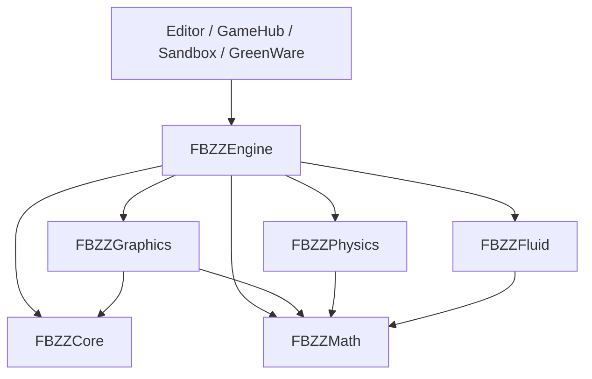

<!-- @file    graphics-library.md -->
<!-- @brief   Graphics ライブラリの責務、描画方式の境界と段階的な分離設計。 -->
<!-- @author  Hasegawa Jin -->
<!-- @date    2026-09-20 -->
# Graphics ライブラリと Forward / Deferred の境界

- 状態: Core / Graphics の物理分離、ライト・環境・機能固有入力の抽出を実装 (2026-09-21)。今回の境界と検証は §8.2。段 F の描画順変更は対象外。
- 決定案: Engine が Scene から描画データを抽出し、Graphics が描画方式・RenderGraph・GPU 実行を所有する。
- 対象: 同一リポジトリ内の `Projects/Graphics` / `FBZZGraphics`。Forward と Deferred は同じライブラリの内部構成とする。

## 1. 分離で保証すること

**Scene / GameObject / Component / AssetDatabase を持たないプログラムでも、Graphics へデータを渡して描画できる。** これを分離完了の基準にする。

Engine 側のシーン構造と、Graphics 側の描画方式を別々に変更できるようにする。単に `Renderer/` を移してリンク対象を増やすだけでは、この境界は成立しない。

初期の対象外は、別リポジトリへの公開、他 OS 対応、DX11 の復活、描画スレッドの新設、RenderGraph の作り直し、GBuffer の拡張、OIT の導入。現行バックエンドは DX12 だけである ([dx11-removal.md](dx11-removal.md))。

## 2. 現状の結合点

2026-09-20 の作業ツリーを調べた結果。既存の未コミット変更を含むため、以下を実装完了の記録とは扱わない。

| 現在の場所 | 分離前に解くこと |
|---|---|
| `Engine/src/Scene/Systems/RenderSystem.cpp` | Scene の走査、アセット解決、GPU 資源準備、方式選択、パス登録、UI・スクリプト呼び出しが集まっている |
| `RenderPassContext.hpp` | `Scene&`、`physics::World*`、WaterComponent、Model、GPU 定数とビュー資源が同居している |
| `Geometry/ForwardPasses.cpp` / `DeferredPasses.cpp` | 両方がコンポーネントを直接走査し、透明キューのソート・提出にも重複がある |
| `GeometryRoute.hpp` | 材質ごとの経路を一意に決める純粋関数が既にある。MaterialSlot から事実を集める overload は Engine 側に残す |
| `Renderer/ResourceManager` | GPU 所有とファイルパスのキャッシュ・ロード、`Time`、全体の `Active()` が結び付いている |
| `Renderer/Platform/DX12/DX12Shader.cpp` | DXC 処理に Engine のアセットルート探索が混ざっている |
| `Engine/CMakeLists.txt` | `FBZZCore` / `FBZZRHI` / バックエンドは OBJECT だが、共通関数が Physics・Fluid・ImGui 等を一律に渡すため、独立性を保証していない |

既存の [pipeline-boundary.md](pipeline-boundary.md) は材質の振り分けを、[render-graph.md](render-graph.md) は依存解決と実行の契約を定める。本書はその上にライブラリ境界・構成の境界を置く。両方の仕組みを置き換えない。

## 3. 依存方向と配置

矢印は利用側から依存先へ向く。Core の独立化も本分離の前提作業に含める。



| モジュール | 所有する責務 | 所有しない責務 |
|---|---|---|
| Engine | Scene 更新、アニメーション評価、Physics / Fluid との結合、アセット形式・GUID 解決、描画データ抽出、Script と UI の実行 | GPU の具体型、方式ごとのライティング実装 |
| Graphics | カリング、描画キュー、シェーディング、GPU スキニング、描画用 GPU シミュレーション、グラフ・資源・履歴、バックエンド | Scene / Component の走査、ゲーム状態更新、プロジェクトのアセット探索 |
| Core | Logger、メモリ計測、Profiler、必要な汎用文字列・ファイル処理 | Application、Input、Scene、Renderer、プロジェクト設定 |
| Math / Physics / Fluid | 既存の数式・物理責務 | Graphics への依存 |

`Projects/Core` は現行 `FBZZCore` を丸ごと移す場所ではない。現行の `src/Input`、`Application`、Scene を使う `SaveStore`、`EngineAssetPath`、ゲーム時刻 `Time` は Engine に残す。Profiler / Memory / Util も依存閉包を調べ、上位機能を使う部分は Engine アダプターへ分ける。

Core を選ぶ理由は、Graphics が既に利用する Logger・メモリ台帳・Profiler の実体を共有するため。Engine と Graphics に同じ OBJECT を二重に取り込まない。Graphics 専用のログ・メモリ計測系をもう一組作る案は採らない。

```text
Projects/
  Core/                         FBZZCore.dll：必要な共通基盤
  Graphics/                     FBZZGraphics.dll：描画ライブラリ
    include/Graphics/
      GraphicsContext.hpp       デバイス・資源の寿命
      RenderScene.hpp            フレームの描画入力
      RenderView.hpp             ビュー入力・永続状態
      RenderSettings.hpp         描画設定 (Scene の参照を含まない)
      RenderExtension.hpp        型付きパスと拡張点
      Renderer/                  IRenderer、資源ハンドルなど
    src/
      Pipeline/                  構成選択、Forward / Deferred の登録
      Passes/                    共通・方式固有パス
      Resources/                 GPU 資源とビュー履歴
      Platform/DX12/             非公開の具体実装
  Engine/
    src/Scene/Rendering/          抽出、Script・UI・デバッグ描画の変換
    src/Asset/                   インポート、解決、ストリーミング
```

これは予定配置であり、本書の追加でディレクトリは作らない。Graphics の namespace は既存の `fbzz::renderer` を維持する。移す `fbzz::scene` のパス型は `fbzz::renderer` へ寄せ、Engine 側の互換ヘッダーだけが旧名を提供できる。Graphics から旧名を include しない。

## 4. Engine → Graphics の入力契約

### 4.1 RenderScene：描画候補のスナップショット

Engine の `RenderSceneExtractor` がフレームの更新後に構築する。カメラ可視物だけに絞らず、別ビュー・シャドウ・プローブから必要になり得る描画候補を保持する。

| データ | 入れるもの |
|---|---|
| RenderItem | 世代付きの不透明な RenderObjectID、メッシュハンドル、submesh 範囲、解決済みマテリアルハンドル・版、現在 / 前回の行列、変形後の境界、表示・影・レイヤー情報 |
| SkinningInput | GPU スキニング対象、現在 / 前回の骨パレット、変形出力の識別子。AnimatorComponent / asset::Model のポインターは渡さない |
| Light / Environment | ワールド空間の値、影設定、解決済み Cookie / IBL / Probe ハンドル |
| 描画機能別の入力 | Terrain のパッチ、Water の描画設定、Particle / Trail / Fiber の描画用データ・GPU 更新要求 |
| Mask / Debug / UI | 階層展開済みの対象 ID、線・三角形などの描画コマンド、レイアウト済み UI の描画データ |

Engine が Transform、MaterialSlot、非アクティブ階層、骨の参照姿勢、GUID、子を含む選択を解決する。Graphics がビュー別カリング・LOD・並べ替え・インスタンシング・シャドウ用カリングを行う。物理クエリーが要る表現は Engine で解決した結果を渡す。

RenderItem は submesh / material slot 単位とする。ひとつのスキンドモデルに不透明・透明・独自材質が混在しても、モデル全体をひとつの経路へ押し込まない。最終 DrawCall を全件複製せず、軽い入力とインデックスを並べ替えて提出時に組む。

### 4.2 RenderView：カメラと出力

`RenderView` はカメラ行列、カリング設定、内部 / 出力解像度、描画設定、外部出力ターゲットを持つ。`RenderViewState` は Graphics がビューごとに所有し、TAA・露出・前回カメラ行列・一時 RT・Plan キャッシュを保持する。

Engine の EntityID と Graphics の RenderObjectID の対応は Engine が管理する。選択・ピッキング結果は ID を返し、Graphics が Scene を引き直さない。ID はオブジェクト世代とシーン世代を区別し、Play の往復で前回行列や選択結果を別のオブジェクトへ流用しない。

### 4.3 時間・所有権・スレッド

- 初期実装は既存の描画呼び出しスレッドで同期的に構築・記録する。GPU の終了を同期的に待つ契約ではない。
- Engine が入力配列を所有し、`RenderFrame` の全ビューの記録終了まで不変で保持する。Graphics は入力の参照をフレーム越しに保持しない。
- ハンドルは非所有参照。GPU 実体は Graphics の ResourceManager が単独所有する。入力に掲載した資源の解放・差し替えは記録中に行わない。
- 非同期アップロード完了・アセット公開・シェーダー差し替えはフレーム境界で処理する。GPU が読む旧実体の退役はフェンスで遅延させる ([asset-streaming.md](asset-streaming.md)、[shader-reload-lifetime.md](shader-reload-lifetime.md))。
- 描画フレーム番号・ゲーム時刻・deltaTime を明示的に渡す。Graphics は `Time::` を読まない。描画フレーム番号は Play リセットで巻き戻さない。
- GPU スキニングと Particle のシミュレーション更新は対象ごとにフレーム 1 回。Scene View / Game View / プローブの数だけ進めない。各ビューは同じ更新済み結果を読む。
- 共有 LUT 等は GraphicsContext、ビュー依存の影・クラスタ・画面履歴は RenderViewState が管理する。関数 static へ GPU ハンドルを隠さない。
- ビュー破棄・リサイズ・カメラカット・描画方式変更・デバイス再生成を履歴無効化の境界にする。別ビューの履歴をコピーしない。

CPU 記録終了と GPU 資源の寿命を別に扱う。入力をフレーム末尾で捨てられても、その入力から作った GPU 転送領域や CB を GPU 完了前に再利用してはならない。

## 5. Forward / Deferred の構成境界

### 5.1 方式とライト供給は別の軸

内部では `OpaqueTechnique = FORWARD / DEFERRED` と `LightListMode = LINEAR / CLUSTERED` を別々に解決する。既存のシリアライズ値は当面維持し、入口で変換する。

| 既存設定 | 不透明ライティング | ライト供給 |
|---|---|---|
| Forward | FORWARD | LINEAR |
| Deferred | DEFERRED | LINEAR |
| ForwardPlus | FORWARD | CLUSTERED |
| DeferredPlus | DEFERRED | CLUSTERED |

`clustered.enabled`、`forceAllLights`、実行能力を含めた実効値を `ResolvedRenderPlan` にまとめる。描画パスが設定を読み直して各々に方式を決めることを禁止する。Unlit 等の診断表示はこの 2 軸と別の表示設定として維持する。

### 5.2 方式ごとの登録関数

内部に `BuildForwardOpaque` と `BuildDeferredOpaque` を置く。両者は同じ RenderPipeline へパスを登録する関数であり、別のグラフを実行しない。方式を選ぶ分岐は構成側の 1 か所に置き、パス側には必要資源・能力だけを渡す。

| 構成 | 入力 | 出力 / 責務 |
|---|---|---|
| 共通準備 | RenderScene、View、ライト | スキニング結果、影、Cookie、ライトリスト |
| ForwardOpaque | 不透明候補、共通照明、必要なら画面空間入力 | 材質のシェーダーで直接 HDR を生成。必要なときだけ DepthNormalPrepass と AO / 接触影を先に登録 |
| DeferredOpaque | GBuffer 対応の不透明候補、共通照明 | GBuffer → AO / 接触影 → DeferredLighting。Forward 専用の不透明材質も共有 ForwardOpaque パスで合成 |
| 共通後段 | 不透明の HDR・深度・画面空間入力 | 空、反射・雲・水・半透明・VFX、ポスト処理、UI・デバッグ表示を明示した段へ登録 |

構成関数の返り値 `OpaqueOutputs` は、HDR、シーン深度、画面空間入力の利用可否・被覆情報を持つ。Deferred 専用の GBuffer は内部に閉じる。後段は「Deferred か」ではなく「必要な入力があるか」で動く。

`RenderPipeline` は登録・グラフ実行、構成関数はどのパスを組むか、個々のパスは Setup / Execute を担当する。この 3 つを別の責務として保つ。現段階で仮想 `IRenderingPipeline` やプラグイン探索機構は増やさない。

### 5.3 材質ごとの経路

既存 `ResolveGeometryRoute` を唯一の色描画先の決定規則として維持する。

1. 半透明 → ForwardTransparent。
2. 実効方式が Forward → ForwardOpaque。
3. GBuffer へ同等に符号化できない材質 → ForwardOpaque。
4. それ以外 → GBuffer。

この排他性は主カラー描画に対するもの。影・深度プリパス・速度・マスクへの同じ物体の描画は禁止しない。スキンドかどうかは振り分け条件に含めない。

現行のシェーダーファイル名による対応判定は移設時に維持する。次の段で、Shader / Material の実行情報に `GBuffer 対応`、`深度・法線対応`、`速度対応` と必要な shader variant を明示する。単なる true フラグで任意シェーダーを GBuffer 相当と認定しない。独自の頂点変形、alpha clip、両面処理が一致する variant とセットで検証する。

GBuffer の表現能力を超えるローブは Forward へ送る。未知シェーダーも Forward とし、勝手に標準 PBR へ置き換えない。ただし、これだけで影・AO・SSR 等の完全な対応を保証したことにはならない。

### 5.4 深度・法線の契約

Forward の DepthNormalPrepass は画面空間効果の入力を作る。DeferredLighting を実行するかどうかとは独立している。同じ内部 RT 形式やシェーダー部品を再利用してよいが、API 上で GBuffer の存在を Forward の条件にしない。

画面空間入力は深度・法線・必要なら roughness、被覆の有効性を表す。カメラ深度は現行の Reversed-Z 契約を維持する。プリパスと本描画では同一の変形・ジッター・alpha clip を使い、別の形の深度を残さない。

Deferred 内の ForwardOpaque も最終シーン深度へ反映する。GBuffer 内の深度だけを最終深度とみなすと、独自材質の手前に奥の SSR / AO が出る。深度・法線に対応する variant が無い画素は有効な入力として扱わない。

被覆マスク等が未実装の移行段階では、未対応材質が見えるビューについて影響する画面空間効果を無効化し、理由を診断へ返す。標準材質で代用して誤った遮蔽を作らない。これは配置変更と分けて検証する機能変更である。

### 5.5 共有 Forward パスと合成の段

`DeferredSkinnedForwardPass` のように呼び出し元の方式を名前へ埋め込まず、共有の ForwardOpaque / ForwardTransparent が、それぞれ渡されたキューを描く。Terrain の描画方式も同じ構成側が決める。Fiber、Water、Particle は固有の必要資源を持つ描画機能として共有する。

目標の段境界は次のとおり。個々のパスの実行順は資源依存と同一資源への世代順で表す。

| 段 | 境界で保証する内容 |
|---|---|
| Opaque 完了 | GBuffer 経路と ForwardOpaque の両方が終わり、不透明色と最終不透明深度が揃う |
| AfterOpaque | 空・雲・不透明向け反射などの背景合成後。水・透明メッシュ・Particle / Trail の前。背景を読む拡張用 |
| Transparent 完了 | Water・Fiber の透過部分・透明メッシュ・VFX を定義済みの合成順で処理済み |
| AfterTransparent | シーンの色合成が揃い、HDR 拡張を実行できる |
| BeforePostProcess | 必要な HDR デバッグ描画も揃う。露出はギズモの影響を避けてその前に測定し、後続の Bloom・Composite 等の依存を個別に保つ |
| Output | トーンマップ・AA・アップスケール後に UI / 深度なしデバッグを合成 |

透明メッシュは static / skinned 共通のキューへ集め、renderQueue、奥行き、安定 ID の順で並べる。水・屈折・加算粒子まで一律に同じ距離ソートへ押し込まない。背景コピーの位置と資源世代を各機能が宣言する。異種透明物の交差を完全に解くことは本分離の範囲外とする。

現行コードでは Deferred の透明メッシュや Water が `AfterOpaque` より前に登録されており、名前どおりの境界になっていない。**ファイル移設の段では現在の順序を保存し、段境界の修正は別の機能変更として行う。** 既存の拡張には Engine 側の互換挿入点を残し、新しい境界への移行時にシナリオを更新する。

SSR の現行の方式別位置、Water / VFX の背景コピー、露出とギズモの順序も同様に扱う。目標では不透明向け SSR は透明合成前に解決する。透明表面への反射は各専用パスの責務とし、旧画像との無差分を主張しない。

### 5.6 失敗と縮退

`ResolvedRenderPlan` に要求方式・実効方式・有効な効果・縮退理由を記録し、Render Pass Viewer とログが同じ結果を表示する。

- Deferred 必須資源の生成失敗は、グラフ登録前にビュー全体を Forward へ切り替える。部分的に GBuffer へ描いてから別経路へ落とさない。
- Clustered の失敗は LINEAR へ落とす。不透明方式を変える理由にはしない。
- AO / SSR 等の任意資源が不足した場合は、その効果を無効化し中立値を束縛する。前フレームの結果を読む状態を残さない。
- Forward を含む必須出力資源も作れない場合は `false` と診断を返し、出力を当該フレームの有効な画像として公開しない。

同一原因を毎フレーム大量にログへ出さず、状態の変化時に報告する。パス側の IsEnabled は機能単位の条件に使い、必須生産者の失敗を隠す用途に使わない。

## 6. GPU 資源・アセット・拡張の境界

### 6.1 ResourceManager と読み込み

Graphics の ResourceManager は GPU 作成・ハンドル解決・アップロード・退役を所有する。Engine の `RenderAssetResolver` が GUID / `.meta` / Model / `.mat` / ストリーミング・パスキャッシュを所有する。

外部アセットは Engine がデコード済みデータまたは解決済みソースを渡す。組み込みシェーダーと include は、Graphics の `ShaderSourceProvider` 契約でバイト列・論理名・依存情報を受ける。Engine 実装は現在のプロジェクト / SDK 探索順を維持し、単独利用側は通常のディレクトリ実装を使える。DXC・GPU テクスチャ形式の処理は Graphics の非公開実装に置く。

既存の LoadShader / LoadTexture 等は移行中 Engine 側の互換窓口として残せるが、Graphics 内部から Engine のロード関数や `ResourceManager::Active()` を呼ばない。GraphicsContext と ResourceManager の参照を明示的に渡す。既存 `AssetPathService` の登録式の入口もこの境界へ統合する。

シェーダーの正本・複製・`.meta` の GUID はこの分離で移動しない。SDK へのシェーダー同梱は維持する。HLSL を変更する段ではエンジン・GreenWare・GameHub テンプレートの全コピーを検索して更新する。

### 6.2 RenderPassContext の解体

GPU 定数レイアウト、機能別資源、View 状態、入力データを別の型へ分ける。Graphics のパス文脈は GraphicsContext、RenderView、RenderScene の読み取り専用入力と、申告済み PassResources だけを提供する。Scene / physics::World / Component / Asset Model は含めない。

巨大な RenderPassHandles を単に別ディレクトリへ移さず、影・画面空間・水・VFX 等の機能別資源に分ける。パスの Setup と Execute は同じファイルで維持し、未申告の資源アクセスを許さない。GPU バリア・キュー・フェンスは現行どおりバックエンドが担当する。

### 6.3 Script・UI・Editor

Script の呼び出し、UI のレイアウト / ヒットテスト、Physics / NavMesh のデバッグ形状収集は Engine / Editor で済ませる。Graphics は値へ変換済みの入力を描く。

型付き IRenderPass とラムダによるパス登録は両方残す。拡張パスは資源アクセスと挿入点を宣言する。Engine アダプターが Scene を捕捉することは移行中に許すが、Graphics の公開型へ Scene を持ち込まない。コールバックは記録スレッドでフレーム内だけ実行し、Scene の構造を変更しない。

スクリプト DLL のアンロード前に登録済みコールバックを破棄する。既存の Script 仮想関数の署名・並びは移設だけで変更しない。新しい仮想口が必要なら末尾へ追加し、`ScriptDllAbi.hpp` の ABI 版を更新する。互換アダプターを経由して段階移行する。

Render Pass Viewer は Graphics のレポート・資源一覧・Capture を読む。Graphics から Editor を呼ばない。ImGui の Win32 初期化はホスト側、同一 GPU デバイスとの橋渡しは任意の非公開バックエンドモジュールに残す。ImGui の型を Graphics の基本入力 API に露出しない。

## 7. ビルド・配布・終了順

- 最終ターゲットは `FBZZCore` / `FBZZGraphics` を SHARED とし、SDK の `FBZZ::Core` / `FBZZ::Graphics` として公開する。Engine がそれらへ依存する。
- Graphics 内部の RHI / パス / DX12 の翻訳単位は SHARED ターゲットへ直接登録し、自己登録 TU を捨てる STATIC アーカイブを挟まない。実体は Graphics DLL だけに取り込む。
- Graphics の include / link 許可先は自身、Math、Core、必要な PRIVATE の ThirdParty / Windows SDK のみ。Engine / Physics / Fluid の include パスを一律に渡さない。
- 既存 `fbzz_engine_module` をそのまま Graphics に使わず、依存を明示できるターゲット定義へ分ける。未所属ソースの検査・標準 PCH・Unity 除外も移行する。
- Core の Logger / Memory / Profiler は一度だけ実体化する。Engine の OBJECT 取り込みから外す段と DLL のリンクを同時に行い、台帳・singleton の二重化を防ぐ。
- DLL export / import 定義、SDK export set、ランタイム DLL コピー、GameHub テンプレート、テストのリンク先を同じ分離段で更新する。C++ ABI は同一 SDK・コンパイラー・CRT を前提とし、異なる版の DLL 混在をサポートしない。
- GraphicsContext、ビュー状態等の所有オブジェクトは生成元 DLL 内で破棄する API / deleter を用意する。GPU 実体の所有は unique_ptr を基本とする。
- 終了は Script / UI 等の利用停止 → ビューと拡張の破棄 → GPU 完了・退役 → ResourceManager → Renderer → Core の順。ImGui の GPU 資源も Renderer より先に破棄する。

Graphics の単独検証アプリは Engine をリンクせず、Math / Core / Graphics と DX12 の必要な配布物だけで作る。DLL が別でも Engine が推移依存に紛れ込んでいれば分離未完了とする。

## 8. 移行順と各段の完了条件

各段でビルド可能にする。配置だけの変更と描画結果が変わる変更は同じ段に入れない。作業開始時に既存変更を確認し、本設計と無関係な差分を巻き戻さない。

| 段 | 変更 | 完了条件 |
|---|---|---|
| A：基準の保存 | Forward / Deferred / Plus、代表ビューの Plan・画像・経路数を保存。材質振り分けの現状を確認 | 方式別に再実行でき、既存不具合と移行の退行を区別できる |
| B：構成の抽出 | RenderSystem から BuildForwardOpaque / BuildDeferredOpaque と共通段の登録を抽出 | 旧パス名・登録順・依存・画像を維持。Scene 依存はこの段では残ってよい |
| C：入力の抽出 | RenderScene / RenderView 導入。メッシュ・ライトから始め、影・地形・水・VFX・キャプチャまで移す | Graphics へ移す全パスが Scene / Component / Physics / Asset Model を参照しない。複数ビューで更新を重複しない |
| D：基盤と資源の切り離し | Core 独立化、Time 明示化、アセット解決・ShaderSourceProvider、拡張アダプター、寿命の整理 | Engine への逆依存なし。再ロード・Play 往復・ビュー破棄で寿命が破綻しない |
| E：Graphics の物理分離 | Projects/Graphics、SHARED / OBJECT 構成、include 移行、SDK・テンプレート・診断の配線 | Engine 非リンクの描画が成功。既存 Engine / Editor / ゲームの画像を維持 |
| F：段境界の是正 | 新 AfterOpaque / AfterTransparent 契約、透明経路の共有、画面空間の被覆・能力情報を導入 | 変わる画像を仕様と照合。互換挿入点の利用元を移行してから旧口を撤去 |

B で不要にパス名を変えない。C で描画条件やソート規則を変えない。最終の共有 Forward パス化・段の移動は F で行い、同等性を確認できる整理だけを先行させる。

Engine の新しい `src/Scene/Rendering` を作る段で CMake のモジュール登録へ追加する。単独検証用プログラムを恒久ツールにする場合は、既存のツール配置・索引承認規約に従って別途追加する。本書では新ツールを追加しない。

### 8.1 最初の実装範囲

`feature/graphics-library` で、ライブラリの物理移動に先立ち以下を実装した。

- `Renderer/OpaqueRenderPlan`：設定と資源の可用性から、Forward / Forward + DepthNormalPrepass / Deferred の実効経路を一度だけ解決する。ライト供給方式は既存のまま独立して扱う。
- `RenderPasses/GeometryPipeline`：共通準備、Forward / Deferred の構成、空と遮蔽の共有登録、水面合成を担当する。実行は同じ RenderPipeline に委ねる。
- `RenderSystem`：資源を確保し、解決済み計画をパス文脈と登録側へ渡す。Scene からの入力抽出やポスト処理・拡張点はまだここに残る。
- `GeometryPipelineTests`：資源欠落時の縮退、画面空間効果の要求、Unlit、ライト供給との独立性、3 経路 × クラスタ有無の登録列、方式切り替え時の旧パス残存を検証する。

この段ではパスの Name / Setup / Execute と透明描画・SSR の位置を変えない。登録列は GPU を使わずに比較できるが、画像・実行 Plan・複数ビューの基準確認を代替しない。段 A の描画基準と B の実機比較が揃うまで、画像の同等性や Graphics 分離の完了とは扱わない。

2026-09-20 の検証記録:

- Development の変更 C++ コンパイル、`FBZZTestsEngineAuto` と `FBZZEditorLauncher` のビルドを実施。Editor ビルドには未変更の AssetBrowserImport / InspectorPanel_Asset の C4834 警告が 7 件ある。
- `GeometryPipelineTest` / `GeometryRouteTest` / `RenderPipeline` / `RenderGraph` / `RenderSettings` の関連テスト 72 件が合格。
- `FiberLifecycle` の最初の比較画像 (1548 × 871、frame 36) は、変更前後の PNG の SHA-256 がともに `51B0D08AC5865D568A5715CF2E96C4580D33CA55FE16FB5796D6A20CFBEC4050` で一致。
- 既存 Golden に対するシナリオは変更前後とも step 6 で失敗 (`meanDiff=0.030930296351484532`、`badPixelRatio=0.11692877295098746`)。基準画像は更新しておらず、シナリオ全体の合格とは扱わない。
- 全方式の実行 Plan、複数ビュー、シナリオ後続の画像は未確認。記録用の画像・レポートは Git 対象外の `Scratch/GraphicsLibrary/` に置く。

### 段 C の着手: 可視性判定の入力境界

`Renderer/RenderVisibility` は `RenderCullingView` と `RenderCullingItem` のみを読み、Scene / GameObject / Component を参照しない。入力はビュー姿勢・射影情報・非所有の視錐台参照と、ワールド境界球・解決済みの描画距離。距離 → 極小 → 視錐台の順に最初の除外理由を返す。

Engine 側の `GeometryPassHelpers` は従来どおり Transform・Animator から境界球を作り、レイヤー別の描画距離を解決する。各判定時点の RenderPassContext からビューを抽出するため、派生ビューでメインカメラの情報を保持し続けない。返された理由から従来の統計を加算し、Forward / Deferred / 共有ヘルパーの呼び出し元へ結果を返す。

半径未確定なら描画する通常判定と、半径未確定でも距離制限だけを評価する補助パスの契約を分けて維持する。境界距離、投影方式、カメラ前方、視錐台との交差、除外理由の優先順を GPU 非依存で検証する。

この時点の変更は可視性判定の分離まで。メッシュ・材質・スキニング資源を持つ RenderScene 抽出は後述の継続工程で実装する。ライト入力の分離、Graphics ライブラリの生成も含めた段 C 完了とは扱わない。

検証: 変更 C++ 3 単位のコンパイルと `FBZZTestsEngineAuto` のビルドは警告なし。`RenderVisibilityTest` 8 件と段 B の関連テスト 72 件、計 80 件が合格。変更 C++ / ヘッダー 4 ファイルの AgentLint はエラー・警告なし。この段の GPU 画像比較は未実施。

### 段 C の継続: 材質能力の抽出

`Renderer/GeometryRoute.hpp` が `GeometryMaterialInput` と純粋な経路判定を持つ。入力はブレンド方式・GBuffer 相当シェーダー・拡張ローブの値だけで、描画方式も Scene / Asset 参照も保持しない。Engine 側の `ExtractGeometryMaterial` が共有材質とインスタンスの上書きを解決し、GUID・シェーダー名・材質パラメーターの解釈を Engine に閉じる。

既存の Forward / Deferred パスは Scene の互換 overload 経由でこの境界を使用する。材質のロードや GPU 同期を抽出処理へ移しておらず、スキニング結果を読む時点や描画順も変えない。未解決の材質は Forward、透明は最優先、空のシェーダーパスは既定 PBR という規則を維持する。

抽出結果は材質の編集・破棄から独立した値として保持でき、同一モデル内の各スロットを異なるビュー方式へ個別に振り分けられる。既存の互換 overload も残すが、下記のメッシュパスは RenderScene に保持した値を使用する。

### 段 C の継続: RenderScene のメッシュ・スキニング入力

`Renderer/RenderScene.hpp` に、オブジェクト配列・submesh 単位のメッシュ配列・解決済み材質・マスク要求を定義した。Scene / GameObject / Component / Model / Mesh / Material のポインターを保持しない。

- `RenderObject`: Entity の index / generation、レイヤー・LOD・影・選択フラグ、現在／前回の world、逆転置、境界球、現在／前回のスキニングパレット。
- `RenderMeshItem`: ローカル材質スロットと元 submesh 添字、VB / IB と要素数、モーフ適用後の VS 入力、当該フレームのコンピュート出力、材質能力・シェーダー・テクスチャ・定数バッファ。
- `RenderMaterial`: GBuffer の 96 バイトへ正規化した定数と描画状態。Surface 材質誤指定時の Forward 用フォールバックも抽出中に解決する。
- `RenderMaskGroup`: 有効な要求を階層展開したオブジェクト添字と payload。描画中に GameObject を解決し直さない。

Engine の `RenderSceneExtractor` は二段階で動く。`ExtractRenderSceneGeometry` が GPU 操作なしに候補・姿勢・資源ハンドルを収集し、`ExtractRenderScene` が材質・テクスチャ・選択／マスク要求を解決して `shared_ptr<const RenderScene>` として公開する。候補はカメラ・レイヤー・LOD で絞らず、非アクティブ階層と無効 Renderer を除く。公開した配列は、その RenderSystem 呼び出しのプローブとグラフ記録が終わるまで不変とする。

Forward、GBuffer、Deferred 内 Forward、Shadow、Velocity、Reflection Probe / Light Probe のメッシュ捕捉、選択輪郭・オブジェクトマスク・Decal 受信レイヤーのメッシュ描画を接続した。スキニング Dispatch と履歴更新は frameStamp により同一フレームで再実行しない。Editor が同じフレームで Scene と Game を描くときは、呼び出し元が所有する `RenderFrameGeometryCache` を渡し、同じ Scene・ResourceManager・資源世代・フレーム・スキニングパレットのメッシュ候補と姿勢を共有する。キャッシュはフレーム末尾で破棄し、描画コールバックで Scene を変更できる ScriptComponent がある場合は使わない。各ビューは候補を複製してから材質・テクスチャ品質・選択／マスク要求・環境・ライトを個別に解決し、カリング・影アトラス・描画パスもそれぞれ実行する。

プローブがグラフより前に動く既存構成に合わせ、スキニングと抽出をプローブより前へ移した。登録済み SkinningCompute パスは入力が既にあれば再実行しない。モーフ・旧モデル・古いフレームの変形済み出力は採用せず、VS スキニング入力へ戻す。前回行列の確定は Velocity から抽出へ移し、カメラ外でも有効な候補の履歴を進める。

GPU ハンドルは非所有のまま。記録中は元資源を差し替えず、GPU 完了前の退役は既存の ResourceManager の契約に従う。snapshotSerial は入力世代の識別子で、Entity の整数 ID だけを別入力へ持ち越さない。永続的な Graphics オブジェクト登録簿を導入したものではない。

このメッシュ抽出段ではライト・環境・機能固有入力を既存文脈に残した。続く §8.2 でそれらを抽出し、Graphics を物理分割した。

2026-09-21 の検証記録:

- 変更した C++ のコンパイルと Development の `FBZZTestsEngineAuto` / `FBZZEditorLauncher` ビルドを実施。Editor の全体再ビルドでは未変更ファイルの C4834 警告 7 件を確認した。
- 抽出テストは submesh の並び替え、モーフ入力、当該フレームの変形済み VB、親 Animator / 参照姿勢 / 単位パレット、複数ビューの前回行列、初回フレーム、材質スロットを検証する。
- 最終ビルドはエラー・警告なし。抽出テスト 9 件を含む関連テスト 111 件が合格 (`build/agent/test-20260921-003034-34932.log`)。変更 37 ファイルの AgentLint もエラー・警告なし。
- `FiberSkinning` は 24 ステップ、`FiberSkinningBindPose` は 18 ステップが合格。アニメーション・参照姿勢・選択輪郭の取得画像も確認した。これらは Golden 比較を含まない。
- `LightProbeGI` は 14 ステップが合格。メッシュ捕捉を含む GI 有効時の取得画像を確認した。このシナリオも Golden 比較を含まない。
- `FiberLifecycle` の frame 36 の PNG は移行前と SHA-256 が一致 (`51B0D08AC5865D568A5715CF2E96C4580D33CA55FE16FB5796D6A20CFBEC4050`)。既存 Golden に対する step 6 の失敗は以前と同じ値で残り、基準画像は更新していない。後続ステップは未検証。
- GPU シナリオは通常のデスクトップ実行で評価した。サンドボックス内では全黒のキャプチャになったため、その画像を合格根拠には使わない。画像とレポートは Git 対象外の `Scratch/RenderScene/` に保存する。

### 8.2 ライト・環境・エフェクト入力と物理分離

`Projects/Core` と `Projects/Graphics` を SHARED ライブラリとして追加した。Graphics の公開依存は Core / Math、DX12・ImGui・画像処理の依存は PRIVATE。Engine / Physics / Fluid の include と link を持たない。Engine の旧ヘッダーは互換 include / alias とし、実装を二重にリンクしない。SDK の export・ヘッダー・DLL 配布と Editor / Sandbox / ゲームビルドの DLL コピーも更新した。

| 入力 | Engine に残した処理 | Graphics へ移した処理 |
|---|---|---|
| Light / Environment | ライト走査、色温度、旧ライトとの対応、Cookie / 空 / 雲 / 水中環境の解決 | ライト定数・影・Cookie アトラス、空・雲・ライティングの描画 |
| Terrain / Water | CPU 地形パッチ、レイヤー・水面材質、波紋と飛沫、アセット解決 | 地形 LOD / カリング・影・選択、水面合成とノイズベイク |
| Particle / Trail / MeshTrail | コンポーネント更新、CPU 粒子・物理結合、生成要求、軌跡サンプルと材質解決 | GPU 粒子 Dispatch、描画ソート、リボン・歪み・自己影・Overdraw |
| Fiber | メッシュ / 地形由来の表面、接触と流れ、材質・マスクの解決 | shell / fin / blade の描画、影・選択・速度履歴 |
| Decal / Custom Post | 寿命・flipbook・パラメーターとテクスチャの解決 | 投影・受信レイヤー・HDR / LDR 合成 |
| Skinning / Probe | Model と骨パレットの準備、Probe の更新要求・保存先管理 | コンピュートスキニング、反射キューブ捕捉・畳み込み、Light Probe ベイク・膨張 |

`RenderScene` はライト・環境と各エフェクトの値配列・非所有 GPU ハンドルを保持する。Graphics の `RenderPassContext` から Scene / Physics を除き、Engine の派生文脈とホストパスアダプターに UI / Script / Debug の接続を閉じた。各ビューの RT 確保と呼び出し順の組み立ては引き続き Engine の RenderSystem が行い、Graphics のパス・資源 API に渡す。

メッシュ候補は従来どおりビュー非依存で抽出する。一方、Particle の予算・距離 LOD・シミュレーションの可視性条件は描画互換性のため今回変更せず、Engine のビュー別抽出に残す。全ビューで同一 RenderScene を再利用する契約にはしていない。Trail / Decal の更新と GPU スキニングは同一フレームで重複させず、GPU 資源用の frameStamp は ResourceManager が持つ単調なカウンターとする。ゲーム時刻は文脈へ明示的に渡す。

シェーダー探索は `ShaderPathResolver` の注入で分離した。Engine は GUID / プロジェクト側の探索を提供し、単独利用時は渡されたファイルパスを使う。バイト列を供給する新しい ShaderSourceProvider API への全面改変は行っていない。DLL は同一ビルド設定・共有 CRT を前提とし、GPU オブジェクトは既存の仮想デストラクターを持つ unique_ptr で所有する。

Engine をリンクしない `FBZZTestsGraphicsStandalone` を追加した。Engine / Physics / Fluid DLL の未ロード、Forward / Deferred パス構成、入力値の独立性、DX12 で赤い三角形を描いて CPU へ読み戻す処理を検証する。この検証で発見した、Shaders 祖先を持たない絶対パスの探索停止不良も修正した。テスト用シェーダーのコンパイル出力は build 配下に置く。

2026-09-21 の検証記録:

- Graphics 単独テスト 3 件が合格 (`build/agent/test-20260921-020253-23724.log`)。
- Core / Graphics のソースと公開ヘッダーに Engine / Physics / Fluid の include・link がないことを確認した。
- Core / Graphics / Engine / Editor と SDK をビルド済み。関連する 369 テストが合格した (`build/agent/test-20260921-021631-49356.log`)。
- GPU シナリオは FiberSkinning (24 step)、FiberSkinningBindPose (18)、LightProbeGI (14)、WaterWireframe (10)、FiberStage4 (29) が合格。粒子は検証中のみ背景球を無効化し、GPU / CPU の実画像と shader diagnostics のエラー 0 を確認した。資産は変更していない。
- FiberLifecycle は初回検証で既存 Golden との差により step 6 が不合格だった。actual 画像 SHA256 は分割前と一致した (`51B0D08AC5865D568A5715CF2E96C4580D33CA55FE16FB5796D6A20CFBEC4050`)。後続の修正で材質・シェーダー更新前の Golden を見直し、同じ解像度・許容値で 93 手順と全 10 枚の完全一致を確認した。詳細は `fiber-rendering.md` の「Lifecycle 基準画像の更新」。
- AgentLint は移動前からの MakeUnique 内 nothrow new 2 件と定数バッファ転送の cast 1 件を検出する。移動に伴う検出であり、アロケーターの失敗時契約は変更していない。

### 8.3 描画構成と資源寿命の移管

`RenderSystem` の関数内 static とビュー登録簿を `Graphics/Pipeline/RenderResources` へ移した。`ResourceManager` が描画状態を単独所有し、Reset と終了で GPU プールより先に破棄する。共有シェーダー・PSO・定数・LUT は Manager ごとに初回だけ確保し、初回初期化とリセット用再生成の重複をなくした。空の球メッシュもこの所有域で生成し、別 Manager の PrimitiveMesh キャッシュを参照しない。

ビューの中間 RT・TAA・露出・霧・Plan キャッシュは個別に保持する。リサイズでは解像度依存資源を返して TAA の有効性を落とし、露出と解像度非依存の状態は維持する。`ReleaseRenderView(key)` はビュー全体を解放し、外部出力 RT の Release もその出力を使用するビューの解放へ接続する。バックバッファを使うホストはビュー終了時に明示解放でき、Manager 終了時は残りも破棄される。

`ViewPipeline` が資源宣言・Geometry 構成・HDR/ポスト処理・アップスケールの登録順を所有する。`ViewPreparation` がカスケードのフィッティングと AdvancedGraphics 定数を生成する。Engine は Scene 走査、アセット解決、Probe の更新要求、Script・UI・選択・デバッグのホスト拡張を担当する。拡張の登録コールバックは同期実行し保持しない。実行パスに渡したホスト参照は同フレーム末尾で破棄してから、Plan/RT キャッシュだけをビューへ戻す。

方向光のカスケードはビューごとに従来の解像度とテクセルスナップを維持する。受光点の担当カスケードはカメラ前方距離と各分割の遠端で決め、分割境界では隣のタイルをクロスフェードする。担当タイルの投影範囲外だけ遠方タイルを順に試す。Scene と Game の視点で影アトラスを共有しない。

本段は従来のパス名・順序・挿入点を維持する。段 F の AfterOpaque 等の意味変更は含めない。

2026-09-21 の検証記録:

- `RenderSystem.cpp` は 2,823 行から 1,147 行へ縮小。Graphics には Engine / Physics / Fluid の include を追加していない。
- 変更 C++ 6 単位のコンパイルはエラー・警告なし。Graphics 単独テスト、Engine 自動テスト、Editor の最終ビルドは成功した。未変更の RagdollRigTests / ImNodes / Editor に既存警告 9 件がある (`build/agent/build-20260921-134203-26552.log`)。
- 関連テスト 88 件が合格 (`build/agent/test-20260921-135238-18680.log`)。Graphics 単独テストで複数ビューの独立性、リサイズ時の履歴保持、明示解放、出力 RT 解放、Manager の分離と Reset、ホスト拡張の登録順を検証した。
- `FiberLifecycle` は変更前後とも全 93 手順に合格し、10 枚すべて既存 Golden と完全一致した。変更前後の PNG の SHA-256 も全 10 枚一致し、Golden は更新していない。
- `WaterWireframe` 全 10 手順、`LightProbeGI` 全 14 手順に合格し、水面・GI の取得画像も確認した。これら 2 シナリオは Golden 比較を含まない。
- GPU シナリオは通常のデスクトップ環境で実行した。サンドボックス内の全黒キャプチャは評価に使わず、画像とレポートは Git 対象外の `Scratch/RenderOwnership/` に保存した。

## 9. 検証と受け入れ基準

### 9.1 構造と単体テスト

- Graphics の翻訳単位・公開ヘッダーは Engine / Scene / Physics / Fluid を include・link せずにコンパイルできる。Core も上位へ依存しない。
- GeometryRoute を blend・材質能力・拡張ローブ・実効方式で組み合わせ、カラー経路がちょうど 1 本になることを検証する。static / skinned と submesh 混在も含める。
- 要求方式 → 実効計画の解決、必須資源不足、CLUSTERED → LINEAR、任意効果の中立値を GPU 非依存で検証する。
- GPU 未完了の資源退役、フレーム内のコールバック寿命、シーン世代変更、複数ビューでの 1 回更新を決定的なテストで検証する。

### 9.2 描画シナリオ

| ケース | 確認する境界 |
|---|---|
| 標準 PBR・Unlit・Toon・拡張ローブ・未知シェーダー | GBuffer への誤投入、消失・二重描画がない |
| static / skinned、参照姿勢、submesh ごとの透明混在 | 変形方法で材質経路が変わらない |
| alpha clip・頂点変形・両面材質 | 影・深度・法線・速度とカラーの形が一致する、未対応は診断される |
| 独自材質の前後にある SSR / AO 対象 | 最終深度と被覆の不一致がない |
| Water・透明メッシュ・Particle・Trail・Fiber・屈折 | 背景コピーと挿入点の内容、透明ソートが仕様どおり |
| Scene / Game の同時表示、異なる解像度・方式、Probe capture | 履歴や RT が混ざらず、シミュレーションを二度進めない |
| リサイズ・カメラカット・Play 往復・シェーダー再ロード・デバイス再生成 | 無効ハンドル、古い履歴、コールバックの残存がない |
| UI・選択・Script パス・ギズモ・Render Pass Viewer | 出力、拡張と診断の契約を維持する |

各方式は自身の移行前画像と比較する。Forward と Deferred の完全な画素一致は受け入れ条件にしない。配置変更では Plan の差分も確認するが、Plan 一致だけでは描画・寿命の正しさを証明できないため、画像と構造検証を併用する。

F の意図的な画像差分は、挿入点・SSR・被覆など原因ごとに記録してから基準画像を更新する。単に失敗を消すための一括更新はしない。

実装時のコンパイル・テストは `Tools/AgentBuild.ps1`、描画は既存 Playtest の入口を使う ([ai-verification-loop.md](ai-verification-loop.md))。ビルドは同時に 1 本とし、DLL の再リンクにエディター停止が必要なら既存の VS Code タスクによるビルドを依頼する。本設計文書だけの変更ではビルドを実行しない。

## 10. 採らない分け方

| 案 | 採らない理由 |
|---|---|
| Renderer ディレクトリだけを別 DLL にする | Scene 側の描画実装と巨大な文脈が残り、描画方式を独立して変更できない |
| Forward.dll / Deferred.dll を分ける | Deferred も Forward の材質・透明描画を使う。資源・影・VFX・履歴の共有境界を増やすだけになる |
| Graphics が Scene を interface 越しに逐次問い合わせる | 型名を隠しても Scene の寿命・走査・更新順へ依存したままになる |
| `IRenderer` を全面的に作り直してから分離する | 既存のバックエンド境界は使える。ライブラリ分離とコマンドモデルの変更を結び付けない |
| 移設と同時に GBuffer / シェーディングを拡張する | 絵の変化と構造変更の退行を切り分けられなくなる |
