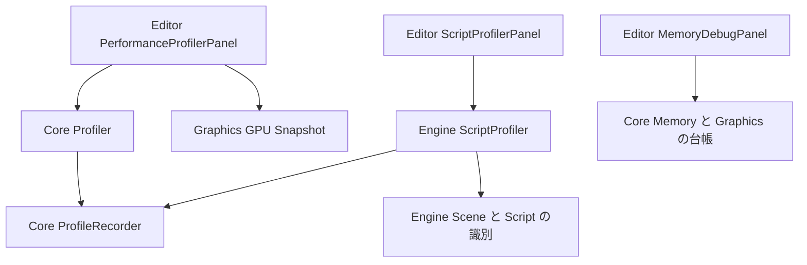

<!-- @file    profiler.md -->
<!-- @brief   Performance Profiler と Script Profiler の責務、計測、表示、互換性の設計。 -->
<!-- @author  Hasegawa Jin -->
<!-- @date    2026-10-03 -->
# Profiler の責務分割と計測契約

- 状態: Draft。設計のみ。収集器の共通化、スクリプト個別計測、パネル分割は未実装 (2026-10-03)。

エンジン全体の負荷を調べる Performance Profiler と、ゲームスクリプトの負荷原因を調べる Script Profiler を独立させる。共通の時間計測は Core に置き、スクリプトの識別と計測入口は Engine、履歴と画面は Editor が持つ。Memory Debug も独立パネルにする。

本書は実装者が責務、数値の意味、障害時の扱い、既存利用者への移行を判断するための契約である。スクリプト内部の任意関数の自動計測、全スレッドのタイムライン、GPU 全体時間の新規計測は初期範囲に含めない。Windows / DX12 の詳細な性能調査は引き続き [PIX Profiling](pix-profiling.md) に従う。

## 現在の構成と不足

2026-10-03 の作業ツリーでは次の構成になっている。

| 実装 | 現在の責務と不足 |
|---|---|
| [Core の Profiler](../../Projects/Core/include/Core/Profiler/Profiler.hpp) | CPU のフレーム収集と入れ子の計測。記録は名前、カテゴリ、経過時間、フレーム、深さ、色で、開始位置と対象識別子がない |
| [Engine の Profiler ヘッダー](../../Projects/Engine/include/Engine/Profiler/Profiler.hpp) | Core への互換 include。別の CPU 収集器ではない |
| [ScriptSystem](../../Projects/Engine/src/Scene/Systems/ScriptSystem.cpp) | ScriptSystem、FixedScriptSystem、LateScriptSystem 全体の計測。個々のスクリプトやコールバックは計測しない |
| [Script の呼び出し入口](../../Projects/Engine/src/Scene/Script.cpp) | ExecuteCallback と ResumeCoroutine で障害を隔離する。個別計測はない |
| [AnalysisPanel](../../Projects/Editor/src/Panels/AnalysisPanel.cpp) | CPU の Profiler、Memory、Rendering の 3 タブと各履歴を一つの実装に保持。Scripts は文字列から推定する分類 |
| [GPU 計測](../../Projects/Graphics/include/Graphics/Renderer/GpuProfiler.hpp) | Graphics の独立した非同期計測。フレームとビューの出自を保持する |
| [profiler.snapshot](../../Projects/Editor/src/Ai/Bus/EditorHandlers.cpp) | CPU、フレーム時間、描画統計、GPU、メモリを一度に返す。スクリプト専用の問い合わせはない |

表示の分割だけではスクリプトの型、インスタンス、OnUpdate などの負荷を復元できない。個別計測と識別情報を先に導入し、画面を分ける。

## 利用者に見せる役割

| 画面 | 答える問い | 主な表示 |
|---|---|---|
| Performance Profiler | どの処理がフレーム予算を使っているか | 実測フレーム間隔、CPU scope の Tree と Flat、システム時間、CPU と GPU の描画パス、描画とカリング統計 |
| Script Profiler | どのスクリプトのどの呼び出しが重いか | 型、コールバック、インスタンス別の時間と回数、呼び出しツリー、履歴、対象オブジェクトへの移動 |
| Memory Debug | 何を確保し、何が増え続けているか | 既存の確保台帳、GPU リソース、追跡範囲、Play 往復のリーク差分 |

Performance の描画パスから画像を確認する操作は既存の [Render Pass Viewer](render-pass-viewer.md) へ渡す。Profiler に画像キャプチャと資源プレビューを複製しない。

## 依存と所有

[Core と Graphics の分離](graphics-library.md) に従い、Core に Scene、Script、Time、ImGui を持ち込まない。

Core に汎用の `ProfileRecorder` を追加する。単調時計、入れ子、開始位置、経過時間、scope token、障害復旧用 checkpoint、フレーム確定だけを扱い、計測対象を不透明な数値 `sampleKey` で受け取る。

既存 `fbzz::profiler::Profiler` は Performance 用の互換 facade として、この収集器の一インスタンスを所有する。`fbzz::scene::ScriptProfiler` は Engine に置き、同じ収集器の別インスタンスとスクリプトのメタデータ表を所有する。計測処理を共有し、収集の有効状態とデータは独立させる。

スクリプト詳細を停止しても Performance の ScriptSystem 合計は残る。Performance を停止しても Script の個別計測は可能である。ScriptProfiler は実行を駆動するシステムではないため、ISystem や新しい Phase を追加しない。

| 配置予定 | 内容 |
|---|---|
| `Projects/Core/include/Core/Profiler/ProfileRecorder.hpp` と対応する `src/Profiler/` | 汎用収集器と値型。公開ヘッダーに実装を集中させない |
| `Projects/Core/include/Core/Profiler/Profiler.hpp` と `src/Profiler/Profiler.cpp` | 既存 API の facade、Performance の descriptor と確定 snapshot |
| `Projects/Engine/include/Engine/Profiler/ScriptProfiler.hpp` と `src/Profiler/ScriptProfiler.cpp` | スクリプト固有の descriptor、収集制御、snapshot |
| `Projects/Engine/src/Profiler/ProfilerFrame.cpp` | Application から呼ぶ両収集器のフレーム境界処理 |
| `Projects/Editor/include/Editor/Panels/` と `src/Panels/` | PerformanceProfilerPanel、ScriptProfilerPanel、MemoryDebugPanel |
| `Projects/Editor/src/Profiler/` | パネル外の履歴採取、集計、選択状態、共通の表とグラフ |

Engine に残る簡易 `ProfilerViewer::Draw` は Performance snapshot の簡易表示に限定し、Editor 型を参照しない。既存入口を残す間も収集器と履歴を二重実装しない。

## フレームと収集状態

Application の両 Run 経路で、両収集器へ同じ `applicationFrameSerial` と単調時計の基準時刻を渡す。Graphics がある場合は既存 `ResourceManager::AdvanceFrame` 後の FrameStamp と一致させる。Graphics がないホストは単調増加するホストの serial を供給する。Core 自体は serial の生成元を知らない。

既存 `Profiler::GetLastFrameIndex()` は有効時にだけ進む内部番号として互換維持する。application serial と同一と仮定しない。新 snapshot は両番号を明示して対応を保持する。Graphics 単独ホストも Core のみで Performance 計測を使える。

BeginFrame、更新と描画、EndFrame を一対にし、通常終了とウィンドウ終了の途中 return でも一度だけ確定する。フレームをまたぐ scope は認めない。初期化、シーンロード、終了などフレーム外の呼び出しは記録せず、有効時の `unframedInvocationCount` に分ける。最初のゲームフレームへ混ぜない。

新しい収集制御は次のフレーム境界で適用する。実行中の scope の状態を UI から変更しない。既存 `Profiler::SetEnabled` の即時クリア契約は互換用に残し、新 UI と Op は境界適用 API を使う。リセットで失効した token の終了は安全に無視し、別世代の scope を閉じない。

| 操作 | 契約 |
|---|---|
| Record | 対象の Performance または Script 収集を開始、停止する。初期値は Performance が既存どおり有効、Script 詳細は無効 |
| Freeze | その画面が選択中の所有 snapshot を固定する。収集、他画面、スパイク検出を変更しない |
| Capture | 最新の確定済み snapshot をその画面で選択し Freeze にする。収集と他画面は変更しない |
| Clear | 対象画面の履歴、保持 snapshot、選択、捕捉済みスパイクを消して Freeze を解除し、新しい captureSessionId を開始する。他画面は変更しない。開いている scope は境界で処理する |

停止中、未収集、空の確定フレームを区別する。停止から再開する場合も captureSessionId を進め、収集していない期間を平均の分母へ入れない。Memory の履歴停止もメモリ台帳自体を無効化しない。収集設定、フィルター、列の状態は個人設定に置き、ゲームのシーンや Project Settings へ保存しない。Freeze、選択フレーム、session ID、実データは設定へ保存しない。

## 汎用収集器の契約

新しい `ProfileSample` は次の値を持つ。旧 `ProfileRecord` のレイアウトは変更しない。

| 値 | 意味 |
|---|---|
| sampleId と parentSampleId | フレーム内の呼び出しと直接の親。最上位の親は無効値 |
| sampleKey | 所有側の descriptor を識別する不透明な ID |
| startOffsetMs と inclusiveMs | 共通のフレーム基準からの開始位置と区間の経過時間 |
| selfMs と selfAvailable | この収集器の直接の子区間を除いた時間と、その値の有効性 |
| depth と status | 深さと COMPLETE、FAULTED、ABORTED の完了状態 |
| sampleKind と startAvailable | TIMED_SCOPE、EXTERNAL_DURATION、INSTANT の別と、開始位置の実測有無 |

Begin は recorder インスタンス、収集世代、フレーム、scope を識別する軽量 token を返す。通常 End は token を検証し LIFO で終了する。Checkpoint は同じ識別情報と現在の stack 境界、追跡上限後の suppression 状態を保持する。Recover は checkpoint より内側の未終了 scope を ABORTED として閉じ、suppression 状態も戻す。別 recorder、別フレーム、失効した世代、二重 End、復旧済み token は別 scope に作用させない。値型だけを SEH 入口へ渡せるようにする。

初期実装は main thread 専用。ワーカーは既存の SystemScheduler と同じく外側で経過時間を測り、join 後に main thread から EXTERNAL_DURATION として追加する。開始位置を観測していなければ startAvailable と selfAvailable は false。表示上の親へ所属させても、その親から並列区間の和を差し引かない。重複区間を確定できない祖先の Self も unavailable とする。INSTANT は子時間へ加算しない。ワーカーの区間は観測できた範囲だけ公開し、main thread 上で順次実行した timeline に偽装しない。並列区間の合計をフレーム経過時間と呼ばない。

Script 詳細の無効時は descriptor 解決、名前複写、時計取得、sample 確保を行わない。障害復旧に必要な有効 Performance recorder の checkpoint は定数時間で取得する。収集有効時も初回の descriptor 登録以外は ID と予約済みの領域を使い、呼び出しごとの文字列生成を避ける。

既存 `FBZZ_PROFILE_SCOPE`、`FBZZ_PROFILE_FUNCTION`、`FBZZ_PROFILE_MARKER` と手動 Begin/End/PushSample を維持する。Performance の文字列は Core の所有 descriptor に複写し、旧 `GetLastFrameRecords` の文字列参照は従来の snapshot 有効期間を満たす。

## スクリプトの識別と計測入口

ScriptProfiler の instance key は `runtimeEpoch`、Scene 世代、既存 `Script::InspectionId()` の組とする。同名のスクリプトや GameObject を統合しない。Scene 世代には現行 `GetRenderSceneGeneration()` を使う。この値は構築、Clear、移動で更新され、通常の描画編集では変わらない。

型名は既存 `GetTypeName()`、対象は GameObject の `instanceId`、名前、世代付き EntityID から採る。内部 ScriptModules も自身の InspectionId で区別し、対象 GameObject を共有できる。型名を Script DLL 世代内の canonical な登録名として Engine の typeId に解決し、型別集計は typeId と世代で区切る。翻訳した表示文字列、GameObject の名前、アドレスを集計キーにしない。

`runtimeEpoch` はプロジェクト切替、Edit と Play の遷移、スクリプト実体の再生成を伴う DLL 再読み込み試行で進める。再読み込みのロールバックでも生成し直した実体を旧 instance と同一視しない。

各 sample の descriptor は不変の executionContextId を持ち、文脈表で runtimeEpoch、実行モード、Script DLL 世代、Scene 世代を解決する。旧実体の破棄は旧文脈、新実体の呼び出しは新文脈へ帰属させる。同じ application frame に旧 OnDestroy と新 OnAwake が入る場合も、一つの確定 snapshot が両文脈を所有する。

transitionFrame は状態変更操作によりフレーム内で runtimeEpoch、実行モード、DLL 世代が変わった場合に立てる。複数 Scene の文脈が並存することだけでは立てない。snapshot の単一 epoch や mode は全対象文脈で一致するときだけ応答する。異なる文脈や収集セッションを一つの平均に混ぜず、transitionFrame は通常のフレーム平均から除外する。

収集有効時は Scene の更新入口でそのフレームの有効な実行文脈を一度登録し、callback が一回もないフレームでも文脈を保持する。行のない収集済みフレームを 0 として平均できるようにし、文脈自体を観測していない Scene を分母へ含めない。

| 入口 | 計測する区間と識別 |
|---|---|
| Script::ExecuteCallback の全 overload | 有効性などの事前判定を通過したコールバック本体。Update、Fixed、Late、ライフサイクル、衝突、アニメーション、ナビゲーション、描画、Gizmo など |
| std::function の ExecuteCallback | Deferred、FrameDelay、Event など明示された種別と、所有した診断ラベル |
| Script::ResumeCoroutine | Coroutine::Step 一回。種別は COROUTINE_STEP、回数は Step 回数 |
| ScriptEventBus の owner 付き購読 | 受信側 Script の EVENT_HANDLER と channel。配信側の呼び出しの子として記録 |

owner 付き Event は kind と channel を指定して共通の guarded callback に渡し、その入口で一度だけ計測する。EventBus と std::function wrapper の双方へ scope を置かない。

現在の診断名には `collision callback` などがあるため、文字列から種類を推定しない。既知のメンバー関数ポインターを通常の比較で分類するか、呼び出し元から `ScriptCallbackKind` を明示する。任意関数には UNKNOWN と複写したラベルを使う。旧非仮想の呼び出し署名は wrapper として維持する。

事前判定でスキップした呼び出しは数えない。呼び出した基底の空コールバックも一回に数える。仮想関数が override されているかを vtable やキャストで調べない。

Coroutine::Step は待機条件の確認だけで終わる場合もあるため、Step 回数を実際の再開回数と呼ばない。待機しているフレーム間の時間は加算しない。初回は `initial_suspend = suspend_never` により生成元で実行されるので、開始元のコールバックに含める。初期範囲ではコルーチン関数名と個別コルーチン ID を提供しない。

owner を持たない EventBus ハンドラーにスクリプトの帰属を捏造しない。囲っている Script の時間には含まれるが、専用のスクリプト行は作らない。普通の C++ 関数や ScriptProxy 呼び出しの内訳は自動では得られず、Performance の既存 scope と PIX で調べる。

## 時間と集計の意味

時間は CPU サイクルではなく、単調時計で測った区間の経過時間である。待機や同期を含み得る。

Script の Inclusive はコールバックの子 Script 呼び出しを含む。Script の Self は Inclusive から直接の子 Script 区間の Inclusive を引く。呼び出した Engine API の時間は Self に残るので、純粋なゲーム C++ コードの実行時間とは呼ばない。

計算例として、親 Script が 5 ms、その中の子 Script が 2 ms なら、親 Self は 3 ms、子 Self は 2 ms、Script の被覆時間は 5 ms である。Inclusive の全行合計 7 ms を Script 合計にしない。被覆時間は最上位区間の合計で、完全な入れ子なら全 Self の合計に一致する。Performance の ScriptSystem 等もこの実行を含むため、Performance と Script の合計を足さない。

| 指標 | 分母と対象 |
|---|---|
| Calls と Faults | 実際に入口を通った回数と、そのうちの障害回数 |
| Total Inclusive と Total Self | 選択範囲の正常に完了した有効区間の合計 |
| Avg per call | 正常に完了した有効呼び出しの時間合計 / その呼び出し数 |
| Avg per frame | 同一セッション、モード、世代の完全な収集フレームの行合計 / 対象フレーム数。行のない収集済みフレームは 0 とする |
| Max call | 単一の正常呼び出しの最大時間 |
| Peak frame | 一フレームの行合計の最大時間 |
| Share | 有効な Self / 全 Script の有効な Self。Inclusive を分母と分子で重複加算しない |

障害と途中打切りの区間は観測された経過時間を別表示し、正常時の平均と最大へ入れない。子の欠落や障害で Self を確定できない祖先には `selfAvailable=false` を付ける。範囲に不完全なフレームがあれば除外件数と有効フレーム数を併記し、全範囲の Share と被覆時間が確定しない場合は unavailable とする。未収集、欠落、障害を 0 ms と扱わない。

新 Performance snapshot は `wallFrameIntervalMs` をフレーム開始間の実測値、`cpuFrameElapsedMs` を BeginFrame から EndFrame の経過時間、`scopeRootSumMs` を観測した最上位 scope の和として分ける。初回で開始間隔が得られない場合は unavailable。lockstep の固定 dt から実測 FPS を計算しない。並列ワーカーを含む scopeRootSumMs は wall time を上回り得る。

## 障害時の復旧

既存のスクリプト障害隔離を維持し、計測の追加で callback の成功条件を変えない。外側の計測処理と、デストラクター付きローカルを置かない内側の SEH 呼び出しを分ける。`__try` 内の RAII だけに終了処理を任せない。MSVC の [C2712](https://learn.microsoft.com/en-us/cpp/error-messages/compiler-errors-2/compiler-error-c2712) と [/EH](https://learn.microsoft.com/en-us/cpp/build/reference/eh-exception-handling-model) の契約に従う。

有効性などの事前判定と識別情報の取得を終え、自身の Script sample を Begin してから、内側の呼び出しの直前に両収集器の checkpoint を取得する。Script の checkpoint は自身の token を含む境界にし、Recover が閉じるのはその子だけとする。Script 詳細が無効なら自身の token は無効値だが、有効な Performance の checkpoint は取得する。Script が Engine API の scope 内で障害を起こすと Performance の scope も未終了になるためである。

正常に戻ったときは自身の token を閉じる。障害が戻ったときは、両収集器で checkpoint より内側の未終了 scope を ABORTED にして閉じ、生きている自身の token を End して FAULTED として確定する。外側の ScriptSystem や配信元 Script の scope は維持する。区間を正常完了と偽らず、次のフレームへ壊れたスタックを持ち越さない。

識別情報は呼び出し前に取得し、計測終了は token だけで行う。callback の後で Script、Scene、GameObject を再参照しない。計測対象の障害診断処理は区間終了後に行う。

owner 付き EventBus ハンドラーは受信側の保護された入口へ通す。これには、購読ハンドラーの障害を配信元でなく受信側 Script に帰属させる変更を含む。受信側を fault 状態にし、配信中の次の購読の扱いは既存の有効性判定に従う。owner なしのハンドラーには新たな Script の隔離規則を適用しない。

## 履歴と DLL の寿命

確定 snapshot は値として所有し、文字列と descriptor も snapshot の寿命に収める。保持した履歴に Script、Scene、GameObject のポインター、コールバック関数ポインター、Script DLL 内の文字列参照を残さない。名前の複写と ID 解決は Engine の外部表で行い、毎回の呼び出しで文字列を組み立てない。

DLL 更新、対象削除、Play 終了後も古い履歴は表示できる。対象選択は現在の runtimeEpoch、Scene 世代、GameObject UUID と EntityID、Script InspectionId が一致するときだけ行う。見つからなければ「対象は現在存在しない」と表示する。同名の新しいオブジェクトへ移動しない。

新しい profiler メンバーや仮想関数を Script、Scene、ScriptEntry へ追加しない。既存識別子と Engine 側の外部表を使い、[Script DLL ABI](../../Projects/Engine/include/Engine/Scene/ScriptDllAbi.hpp) のレイアウトを維持する。公開署名や値型を変える必要が出た場合は、該当 ABI の世代更新と SDK 配布を別途実施する。再読み込み失敗時は [既存の DLL 復帰契約](script-dll-recovery.md) を維持する。

履歴採取とスパイク判定は Editor の毎フレーム処理で行い、OnRenderContent の外に置く。収集器、captureSessionId、application serial の組ごとに確定 snapshot を一度だけ採り、そのフレームの文脈表を丸ごと保持する。非表示パネルや背面タブでも採取を続け、表示更新間隔を計測間隔にしない。Freeze した snapshot と現在のデータを混ぜない。

初期の容量は各収集器 8,192 samples / frame、128 段の active stack、各画面の履歴 240 frames 以内とする。Editor の保持 snapshot は Freeze 分を含め全体 64 MiB を上限に、未選択の古いフレームから退役する。固定したフレームで上限を満たせなければ新規採取を停止し、理由を表示する。

実行側も Editor の有無に関係なく、収集器ごとの descriptor 表を 8,192 件、所有文字列を合計 4 MiB 以内とする。現フレームと最新 snapshot に必要な descriptor を保持し、Editor へ複写した履歴の descriptor と文字列は Editor の 64 MiB 予算へ数える。解放済み DLL の表へ参照しない。一フレームに必要な descriptor が予算を超えた場合は後続の詳細を欠落として扱う。これらは初期の上限であり、実測後に調整する。

sample の出力枠は Begin 時に予約し、保存済みの子の親が出力から欠落しないようにする。出力上限後も、上限内の active stack では終了と子時間の集計を継続する。深さ上限では subtree 全体を suppression 状態にして深さと対応する End を追跡し、追跡しない子の End が保存済みの親を閉じないようにする。この状態は checkpoint にも含め、子時間を確定できない祖先の Self を unavailable にする。`recordedSampleCount`、`droppedSampleCount`、`complete`、`historyEvictedFrameCount` を公開する。容量超過はゲームの実行を止めず、完全な計測値とは表示しない。

## 画面と既存設定の移行

Performance の CPU タブへ現行 Profiler の Tree、Flat、フィルター、履歴、スパイク捕捉を移す。Rendering タブへ描画統計、GPU パス、RenderGraph 構成を移す。Memory は独立パネルへ移し、追跡対象外と追跡中の値を区別する既存表示を保持する。

Script は Type、Callback、Instance の集計表と Call Tree を持ち、Scene、実行モード、型、対象オブジェクト、callback、名前で絞り込める。既定の並び順は Self の降順。表は Inclusive、Self、Calls、Faults、Avg per call、Avg per frame、Max call、Peak frame を区別する。Type と Callback の履歴キーは groupBy、収集セッション、実行文脈、typeId、callback の組とし、行から対応する Instance の一覧へ進める。Instance の履歴と対象への移動は instance key を使い、直接の対象移動は Instance 行だけで有効にする。

Performance のウィンドウ安定キーは旧 `Analysis` を継承し、表示名と View メニュー名だけを `Performance Profiler` にする。IPanel に既定値が GetWindowName の GetWindowTitle を追加し、ImGui に渡す名前を `std::string(LOCT(GetWindowTitle())) + "###" + GetWindowName()` とする。組み立て済み文字列全体へ LOC を適用しない。

この構成で旧 imgui_layout.ini の docking ID、panelVisibility、Analysis 指定の focus を維持する。既存の名前検索は安定キーとメニュー名の双方を扱える。Script Profiler と Memory Debug は新しいキーで登録し、初期状態は非表示。使用者の既存配置をリセットしない。

開く操作は Op 登録簿へ置く。既存 `tools.analysis` の ID を維持して表示名を変更し、新しく `tools.script_profiler` と `tools.memory_debug` を追加する。新旧 Performance 操作を二重登録してパレットの候補を重複させない。

## CPU と GPU の対応

GPU の収集器と backend の timestamp 契約は今回変更しない。Performance には CPU の application serial と、完了済み GPU 計測の application serial、physical serial、view、device epoch、scene、plan、resource、output の世代と寸法を併記する。

CPU と GPU の同名パスだけで同一フレームの値として結合しない。厳密に対応付ける場合は CPU 描画パス側にも同じ view metadata を記録し、serial と全世代が一致したものを使う。CPU 側に出自がない間は別観測として表示する。遅延結果を使う場合は出自と age を示す。

GPU の `complete` は要求したパス区間の完全性である。パス時間の合計を GPU 全体、AS 準備、別キューの時間へ置き換えない。GPU 計測不能と 0 ms を区別し、Script と GPU を直接の因果関係として表示しない。

## 診断 API

既存 `profiler.snapshot` はキーと意味を維持する。`frameMsSource`、lockstep、CPU、描画、GPU の出自、Memory を残し、現行 Playtest と MCP の利用を壊さない。Script 詳細をその CPU samples に混ぜず、旧集計を変化させない。

新しい Query は `profiler.performance.snapshot`、`profiler.script.snapshot`、`profiler.memory.snapshot` とし、実体を Op 登録簿に置く。MCP は `editor.op.query` の投影を使う。Performance と Script の収集操作も `profiler.performance.set_recording` と `profiler.script.set_recording` の Action に置き、UI と AI が同じ境界適用 API を呼ぶ。

Query の既定対象は最新の確定 snapshot とし、画面の Freeze や選択に依存させない。過去フレームを指定する場合は captureSessionId と applicationFrameSerial の組を使う。退役済みなどで保持していない場合は not-found を返し、最新データへ置き換えない。

共通の応答は schemaVersion、recording、available、complete、captureSessionId、applicationFrameSerial、欠落件数を持つ。Script は文脈表、transitionFrame、descriptor と個別 sample または集計行を返す。集計行も実行文脈を区別する。個別 sample の parentSampleId は同一応答内で解決できる形にし、limit がある場合は祖先も含めるか、集計行モードを使う。

行の limit は収集欠落と区別して `truncated` を示す。sort、集計の groupBy、scene、mode、type、instance、callback の filter を検証し、未知の値はエラーにする。未収集の値は null と available の組で表し、数値 0 を返して計測済みと見せない。

旧 profiler.snapshot は常に Performance の互換 facade を読む。Script だけ有効の場合も旧 CPU samples をスクリプト詳細で埋めない。新 Query の正常値には実測の定義と対象フレームを付け、旧 API の lockstep FPS を性能証拠として利用しない。

## 実装順序と受入条件

1. Core の ProfileRecorder と Performance facade を導入する。既存 API、マクロ、停止時のクリア、フレーム確定のテストを維持し、token 失効、checkpoint、容量上限を検証する。
2. Engine の ScriptProfiler とフレーム境界を導入する。全 callback overload、Deferred、FrameDelay、COROUTINE_STEP、owner 付き Event を計測し、異なる instance の帰属と入れ子を検証する。
3. Editor の三画面とパネル外の履歴へ分割する。旧 Analysis の設定、個別 Record、Freeze と Capture、非表示時の採取を検証する。
4. 専用 Op と Query を追加する。既存 profiler.snapshot と既存 Playtest の互換、filter、limit、欠落と unavailable の表現を検証する。
5. Play、Edit、DLL 更新と失敗復帰、対象削除、Scene 切替、GPU 遅延を含む Playtest で統合確認する。

数値の自動テストは TestKit と注入した時計または確定済み区間を使い、sleep、乱数、実機時間の大小に依存させない。最低限、親 5 / 子 2 の Self、同型二個体、同名 GameObject、複数 Fixed 呼び出し、空 callback、待機のみの Coroutine::Step、Event 一回が一回だけ数えられることを検証する。

SEH の統合試験は既存の障害隔離テスト方式に合わせ、Script から Performance scope 内で障害を起こす。Script 詳細の有効、無効それぞれで両収集器が次フレームへ正常に戻り、囲っている scope と障害 attribution を保つことを確認する。

履歴について、DLL を解放した後に旧型名を読めること、同一フレームに旧実体の破棄と新実体の開始を保持できること、再生成した同名実体を選択しないこと、容量超過と深さ超過が完全性を下げても parent と End の対応が壊れないこと、独立した収集の四通りの有効状態を検証する。GPU は同名別ビュー、別フレーム、出自不明の結果が厳密結合されないことを確認する。

C++ の変更検証は [AI 検証ループ](ai-verification-loop.md) の AgentBuild を使う。新規テストの SOURCES 登録、Engine のモジュール定義、Core と Engine の SDK 配布、必要なホストの再リンクも各段階の完了条件とする。起動中の DLL を掴むフルビルドと再起動は既存運用に従う。本書作成時点ではこれらを実施していない。

## 参考と採用しない前提

RE ENGINE の用途別 profiler は [NavigationProfiler の公式紹介](https://www.docswell.com/s/CAPCOM_RandD/K987DX-RE2023) と [Effect Profiler の公式紹介](https://www.docswell.com/s/CAPCOM_RandD/Z8GQ31-RE2023) を参考にする。ScriptProfiler と PerformanceProfiler という正確な二名称や内部構造は公開資料で確認できていないため、本書の名称と分割は FBZZ の設計判断である。

実装時は SEH、時計、GPU の API 契約を参照する箇所の直近にも、対応する公式資料を Doxygen の @see で残す。本書だけの参考リンクで代用しない。
