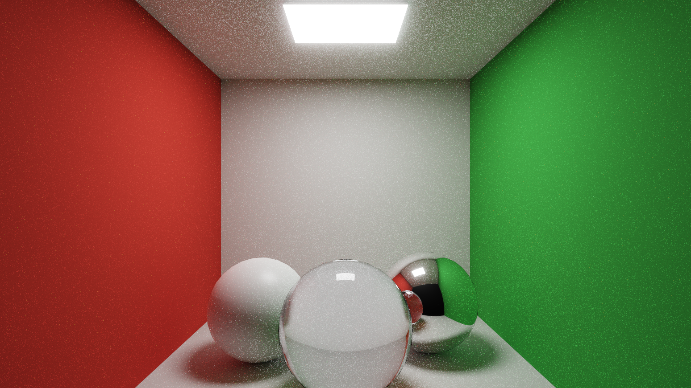

<!-- @file    rt-experiment.md -->
<!-- @brief   DeveloperMode に保持する RT 実験の成果・撮影条件・再開条件。 -->
<!-- @author  Hasegawa Jin -->
<!-- @date    2026-10-02 -->
# DeveloperMode の RT 実験と成果の保持

- 状態: RT / PathTracing を DeveloperMode 限定の実験として保持し、追加の品質・性能開発を保留。
- 判断日: 2026-10-02。
- 理由: 求める性能と画質に到達するための工数が現在の優先順位に見合わない。通常の Editor と GreenWare のゲーム制作を優先する。最適化が不可能という判断ではない。
- 詳細: [RayTracing.md](RayTracing.md)、[developer-mode.md](developer-mode.md)、[PIX profiling](pix-profiling.md)。

## 実行と保存の契約

既存の `--developer`、`FBZZ_DEVELOPER_MODE=1`、Editor の DeveloperMode 設定を使う。通常起動では Raster で実行し、RT のシーン収集・BLAS / TLAS 構築・専用資源の確保を行わない。DeveloperMode を解除した場合は保持していた RT 資源と履歴を退役させる。GPU が使用中の実体は既存のフェンスによる寿命管理に従う。

保存済みの `PathTracing` / `Hybrid` と品質の要求を Raster で上書きしない。UI は実効 Raster と DeveloperMode が必要な理由を示し、DeveloperMode を有効にしたときに同じ要求を再評価する。通常のゲーム用設定と、実験の要求と実効結果を区別する。

## 動作するデモと公開画像

正本は [CornellBox.scene](../../GreenWare/Assets/Scenes/Test/CornellBox.scene)。赤・緑の側壁、拡散球・金属球・ガラス球、発光灯具と Area Light を持つ。対応範囲は Reference PathTracing の光輸送、確率的 BSDF sampling、NEE / MIS、Russian roulette、蓄積、ガラスの反射・屈折・媒体吸収などである。実装・回帰検証の範囲は [RayTracing.md](RayTracing.md) の現在契約を正本にする。

再開用の [CornellReference.playtest.json](../../GreenWare/Tests/Playtests/CornellReference.playtest.json) は当時の 24 手順を保持する。既存 GreenWare のシーン・材質・PostProcess・シェーダーを使うため、`Scratch/` の隔離プロジェクトを必要としない。DeveloperMode で起動し、Project Settings > Graphics の保存済み要求を `PathTracing` / `Reference` にした状態で実行する。シナリオ自身は描画モードや project settings を変更せず、通常起動や別 profile では Trace の表明が失敗する。再開に伴う設定変更は既存 project settings の通常保存として扱い、デモ保存時には元設定を変更しない。

2026-10-01 の完成した Development バイナリと production HLSL / CSO による画像を、追跡外の `Scratch/` から [Docs/media/path-tracing/](../media/path-tracing/) へ無加工で複製した。元データは `Scratch/CornellGlassCapture/OutputExpansionCompleteReference20261001/`。原本を隔離コピーし、有効な Area Light (強度 18)、発光灯具、ガラス、ReflectionProbe、black Sky を維持した。

| 画像 | 撮影フレーム | 寸法 | 用途 |
|---|---:|---|---|
| [初期](../media/path-tracing/cornell-reference-early.png) | 14 | 1548 × 871 | 蓄積前の粒状ノイズを示す |
| [蓄積後](../media/path-tracing/cornell-reference-accumulated.png) | 550 | 1548 × 871 | 色壁からの間接光、金属反射、ガラスの屈折境界を示す |

[撮影レポート](../media/path-tracing/capture-report.json) は当時の出力をそのまま保持する。[manifest.json](../media/path-tracing/manifest.json) に元画像とレポートの SHA-256、撮影条件、限定した GPU snapshot を記録する。24 手順成功、frame 550 まで Scene View 操作前後の Trace → Color → Resolve、shader errorCount=0 と原本 9 ファイルの SHA-256 一致を当時確認した。画像のフレーム番号は厳密な spp ではない。

ポートフォリオには実出力を掲載し、Reference の描画成果と通常ゲーム向け機能の完成を区別する。画像を加工してノイズを除いたり、未確認の性能値を付けたりしない。

## 計測条件と観測値

撮影環境は NVIDIA GeForce RTX 4070 / DirectX 12 / Development、D3D12 debug layer 有効、GPU-Based Validation 無効。Game View は 1548 × 871、Editor は二ビューを含む。

| 当時の profiler frame | RayPathTrace | RayPathColor | RayPathResolve |
|---:|---:|---:|---:|
| 11 | 10.025984 ms | 0.033792 ms | 0.039936 ms |
| 547 | 9.106432 ms | 0.026624 ms | 0.035840 ms |

これは撮影中の 2 回の GPU 単発 snapshot であり、反復計測・フレーム全体・ゲーム単独の定常時間ではない。シナリオの固定 dt は `0.016666667` で、レポートの `frameMs` / `fps` は実性能を表さない。1920 × 1080 / 60 fps の目標達成、最適化の改善率、一般シーンの実用性は未認定。PIX の Hybrid baseline とこの Reference の snapshot を比較して改善率を出さない。

## 制限の検証 (2026-10-03)

2026-10-02 の Debug コンパイル検証は、共有ビルドとの C1041 競合で保留した ([当時のログ](../../build/agent/check-20261002-213748-17448.log))。2026-10-03 に共有ビルドの終了を確認し、同じ Debug 構成で検証を再開した。

- 変更した [37 cpp](../../build/agent/check-20261003-081637-26220.log) と、後述の [fixture 修正 1 cpp](../../build/agent/check-20261003-082616-37736.log) のコンパイルは、エラー・警告ともに 0。
- [FBZZTestsGraphicsStandalone](../../build/agent/build-20261003-082629-31940.log) と [FBZZTestsEngineAuto](../../build/agent/build-20261003-082836-12332.log) のビルドは成功。
- 異なる 301 テストが最終的に全件合格。内訳は [方針・保存・収集・Shader の 81 件](../../build/agent/test-20261003-082058-4100.log)、[通常拒否・再開などの 10 件](../../build/agent/test-20261003-082128-47448.log)、[RT 回帰の 117 件](../../build/agent/test-20261003-082223-2452.log)、反射の [前半 34 件](../../build/agent/test-20261003-082451-35248.log) / [後半 35 件](../../build/agent/test-20261003-082722-15868.log)、[pipeline asset の 24 件](../../build/agent/test-20261003-082846-39408.log)。
- RT 回帰の初回 5 失敗は、検証用 GBuffer shader の 3 出力に fixture が 2 色しか用意していない警告 ID 679 が原因だった。fixture の色数指定 1 行を `GBUFFER_COLOR_COUNT` に合わせ、[失敗 5 件と直接の gate 検証を含む 17 件](../../build/agent/test-20261003-082649-53332.log) が合格した。品質・光輸送の実装は変更していない。
- Editor のリンク・起動・バッチシナリオは今回未実行。上記の回帰検証は、撮影画像や性能測定を更新するものではない。

## 既知の問題

- 蓄積後にも Monte Carlo ノイズが残り、ガラスの曲面にはメッシュの平面近似による残差がある。
- 動く鏡像の再構成、低解像度追跡、履歴のメモリ使用量、CPU scene / emitter の収集、加速構造の更新・scratch 再利用は追加計測と実装の対象。Reference の正確さと Game / Hybrid の近似を混同しない。
- 未対応形状・材質・照明は既存の被覆診断で Raster へ縮退する。全シーン対応は主張しない。
- 当時の隔離撮影には、既存 orphan meta、Script DLL 未構成、HDR clear 性能メタデータ警告 ID 820 が残る。shader errorCount=0 と、D3D12 警告の不存在は同じ主張ではない。

## 再開条件

通常の Editor と GreenWare の優先課題が落ち着き、対象シーン・GPU・画質の許容範囲と作業時間を決めた段階で再開する。最初に Raster / Hybrid / Reference / Game を同じ条件で反復計測し、起動・shader compilation・Editor 二ビュー・readback とゲームの定常描画を分ける。

GPU 時間、CPU 収集、AS build / update、ピークと退役中の GPU メモリを記録してから、ボトルネックを一つ選ぶ。サンプル削減・低解像度化・履歴圧縮などを試す場合は、同じ Cornell デモの RAW / 蓄積画像と transport 回帰テストで品質変化を確認する。計測で必要工数と改善幅を評価し、ゲーム制作の優先順位に合う範囲だけ進める。
