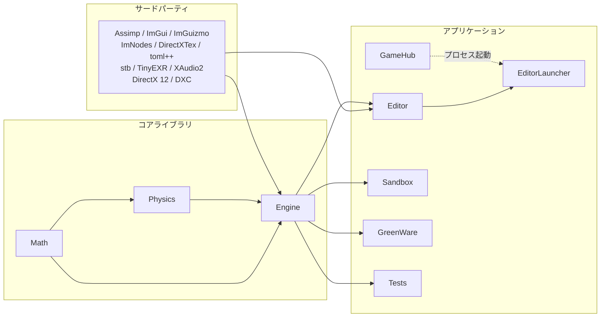
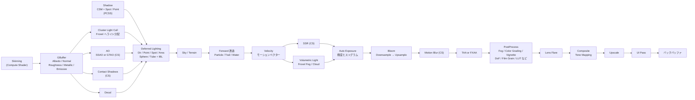

# FBZZ Engine

**C++20 で書いている自作 3D ゲームエンジン (Windows)。**
数学と物理をゼロから実装し、レンダラーを `IRenderer` 抽象の裏に隠している。**DirectX 11 / 12 の 2 バックエンドを同居させた上で、DX11 を v1.0 で撤去した** — 上位レイヤーを 1 行も変えずにバックエンドを 1 つ落とせたことが、この境界が機能している証拠になっている ([設計文書](Docs/design/dx11-removal.md))。RenderGraph ベースの Deferred + Forward ハイブリッド、クラスタードライティング、スクリプト DLL のホットリロード、ノードベースのアニメーショングラフ、NavMesh、地形・水面・天候、VFX / 流体オーサリング、37 パネルの ImGui エディター、そして MCP 経由の AI 連携までを 1 つのリポジトリに収めている。

エンジンだけでは「動くもの」にならないので、**サンプルゲーム 2 本**を同梱している。エディター既定プロジェクトの TPS サンプルと、エンジンの全機能を使って制作中の剣戟アクション **GreenWare**。

| | |
|---|---|
| 言語 / 規格 | C++20 (一部 TypeScript / HLSL / PowerShell) |
| プラットフォーム | Windows 10 / 11・DirectX 12 (SM 6.x) |
| 名前空間 | `fbzz::` (`math` / `physics` / `renderer` / `scene` / `editor`) |
| 依存方向 | `Editor / GameHub / Sandbox / GreenWare → Engine → Physics → Math` |
| 外部数学・物理ライブラリ | **不使用** (GLM / GLFW / Bullet / PhysX / Box2D いずれも不採用) |

---

## 目次

- [規模](#規模)
- [設計の芯](#設計の芯)
- [アーキテクチャ](#アーキテクチャ)
- [レンダラー](#レンダラー)
- [数学ライブラリ](#数学ライブラリ)
- [物理エンジン](#物理エンジン)
- [シーンとコンポーネント](#シーンとコンポーネント)
- [スクリプティング](#スクリプティング)
- [アセットパイプライン](#アセットパイプライン)
- [アニメーション](#アニメーション)
- [ナビゲーションと AI](#ナビゲーションと-ai)
- [地形・水面・天候](#地形水面天候)
- [VFX と流体](#vfx-と流体)
- [オーディオ](#オーディオ)
- [UI](#ui)
- [エディター](#エディター)
- [AI 連携 (MCP)](#ai-連携-mcp)
- [GameHub と配布](#gamehub-と配布)
- [サンプルゲーム](#サンプルゲーム)
- [ビルド方法](#ビルド方法)
- [テスト](#テスト)
- [ドキュメント](#ドキュメント)
- [使用ライブラリ](#使用ライブラリ)
- [ライセンス](#ライセンス)

---

## 規模

リポジトリの実測 (2026-09 時点、`ThirdParty/` と生成物を除く)。

| 領域 | ファイル数 | 行数 |
|---|---:|---:|
| `Projects/Engine` | 715 | 146,478 |
| `Projects/Editor` | 331 | 115,125 |
| `Projects/Physics` | 76 | 10,911 |
| `Projects/Math` | 23 | 1,346 |
| `Projects/Tests` | 183 | 39,176 |
| HLSL シェーダー (`.hlsl` 135 / `.hlsli` 55) | 190 | 19,208 |
| GreenWare スクリプト (`.hpp`) | 145 | — |

主要な内訳: コンポーネント **69 種** / システム **34 種** / ScriptProxy **53 種** / エディターパネル **37 枚** / MCP ツール **139 個**。

---

## 設計の芯

ここだけ読めば、他のエンジンと何が違うかが分かるように書く。

### 1. 数学と物理は自作

Vector2/3/4・Matrix3/4・Quaternion・Ray・Segment・Frustum・Plane を GLM に頼らず実装している。物理も GJK + EPA の衝突検出、BVH ブロードフェーズ、インパルスソルバー、XPBD ソルバー、CCD、7 種のコンストレイントまでゼロから書いた。

**目視では壊れたことに気づけない領域**なので、ここだけはテストを厚くしている ([テスト](#テスト))。左手座標系・行優先・`v * M` の合成順といった規約は、テストが仕様書を兼ねる。

### 2. バックエンドは上位から見えない

`IRenderer` / `IBuffer` / `ITexture` / `IShader` / `IPipelineState` のインターフェース層 (`FBZZRHI`) があり、バックエンド実装は別の OBJECT ライブラリに閉じる。**DX ヘッダーは各バックエンドの PRIVATE include にしか無く**、バックエンドが外へ出すのは `BackendEntry.hpp` の生成関数 1 つだけ。これを CMake が強制していて、`DX12Renderer*` へダウンキャストしようとしても include が通らない。

DX12 が唯一のバックエンド (`ProjectSettings::rendererBackend = DX12`)。DirectX 11 サポートは v1.0 で終了し、`v0.9` が DX11 を含む最後のリリースになる。`renderer = "dx11"` が残った設定ファイルは起動を止めずに DX12 へ倒し、倒したことを警告で名指しする。

### 3. リフレクションはヘッダーに閉じる

`FBZZ_FIELD` を宣言と同じ場所に 1 行足すと、**Inspector の表示・TOML シリアライズ・Undo・AI バスへの公開**が同時に追従する。コード生成ファイル (`.generated.hpp`) は廃止済みで、ビルド前ステップもマクロ展開だけ。

```cpp
class DashComponent : public Script {
    FBZZ_SCRIPT(DashComponent)

public:
    FBZZ_GROUP("動き")
    FBZZ_FIELD_RANGE(float, speed,    12.0f,  "速度",   1.0f, 40.0f)
    FBZZ_FIELD_RANGE(float, duration, 0.18f,  "持続 [s]", 0.05f, 1.0f)
    FBZZ_TOOLTIP("押してから止まるまでの時間")

    void OnUpdate() override;
};

FBZZ_REFLECT(DashComponent)
```

`SceneSerializer` は各コンポーネントの `Reflect()` を唯一の真実として往復する。手書きの分岐は畳み終えている。

### 4. エディターの「操作」は登録簿の投影

メニュー項目・ホットキー・コマンドパレット・検索・AI バス・スクリプトからの呼び出し——**6 つの面に同じ操作が出る**。これを面ごとに書くと、片方だけ条件が古くなる。

`Editor/Op/` の `EditorOperator` に 1 件登録すると、6 面すべてに同じ実行条件で現れる。各面はその**投影**であり、実体も `CanExecute` も持たない。

### 5. スクリプトは DLL 境界を越えない

ゲームスクリプトは `Assets/Scripts/Xxx.hpp` に**ヘッダー 1 枚**書くだけ。`.cpp` も登録コードも要らない。エンジン機能へは `transform` / `input` / `physics` … といった **ScriptProxy のメンバー**経由で触り、Engine の実装型を直接 include しない。

おかげで Play 中にスクリプト DLL を再ビルドして差し替えられる。ABI の版が合わなければ `ScriptDllAbi` が起動時に弾く。

---

## アーキテクチャ

```
FBZZ_Engine/
├── Projects/
│   ├── Math/           自作数学ライブラリ (依存なし)
│   ├── Physics/        自作物理エンジン (Math のみ)
│   ├── Engine/         コアエンジン → FBZZEngine.dll
│   ├── Editor/         ImGui フルエディター
│   ├── EditorLauncher/ スタンドアロン起動ラッパー
│   ├── EditorMcp/      TypeScript 製 MCP サーバー (fbzz-editor-mcp)
│   ├── GameHub/        Electron / React 製プロジェクトランチャー
│   ├── Sandbox/        エンジン検証用の最小アプリ
│   └── Tests/          GoogleTest スイート + TestKit + 目視ベンチ
├── Assets/             エディター既定プロジェクト (Shaders / Scenes / Models / Fonts …)
├── GreenWare/          デモゲーム (独立プロジェクト)
├── SDK/                版ごとに publish されたエンジン SDK
├── ThirdParty/         Assimp / DirectXTex / ImGui / ImGuizmo / ImNodes / toml++ / stb / TinyEXR / GoogleTest
├── CMake/              ビルド基盤 (PCH / Unity / SDK publish / カバレッジ / テスト登録)
├── Tools/              ビルド入口・カバレッジ・Blender エクスポート・各種ジェネレーター
└── Docs/               規約・設計ドキュメント
```



### Engine 内部のモジュール分割

`FBZZEngine.dll` は 1 本だが、内部は 5 つの OBJECT ライブラリへ割り、依存の向きを CMake で固定している。

```
FBZZCore → FBZZRHI → FBZZRenderPlatform → FBZZRenderDX12 → FBZZEngine
```

- **OBJECT であって STATIC ではない** — `__declspec(dllexport)` を持つ翻訳単位を STATIC に畳むと、リンカーがエクスポートを落とす
- **どのモジュールにも属さないソースが出ると configure 時に落ちる** — 新しい `.cpp` を黙って取りこぼさないため
- `FBZZ_ENABLE_DX12` (既定 ON) を OFF にすると描画バックエンドを持たない構成になる (カバレッジ計測専用)

### コアエンジン

| システム | 概要 |
|---|---|
| `Application` | メインループ。固定 Update (物理) + 可変 Update (ゲーム) + Render |
| `Window` / `Cursor` | Win32 API によるウィンドウ・入力・カーソル管理 (GLFW 不使用) |
| `Time` | `deltaTime` / `fixedDeltaTime` / `timeScale` |
| `Logger` / `ILogSink` | ログレベル付きログ。`ILogSink` で Console パネルへ転送 |
| `Input` | キーボード・マウス・ゲームパッドと `.inputactions` によるアクションマップ |
| `Signal` / `ScriptEvent` / `EventBus` | 型安全なイベント通知 |
| `TaskSystem` | スレッドプールによる非同期タスク |
| `SystemScheduler` | Phase と ComponentAccess に基づく実行順序・並列実行の安全性管理 |
| `ProjectSettings` / `ProjectResolver` | プロジェクト設定の読み書きとパス解決 |
| `IModule` | エンジンサブシステムの登録と初期化順序 |

**メモリ**: `FrameAllocator` / `LinearAllocator` / `PoolAllocator` / `StackAllocator` の 4 種と、`MemoryTracker` / `MemoryDebug` によるリーク検出。`new` / `delete` の直接使用は規約で禁止している。

**プロファイラー**: `Profiler` + `ProfileScope` / `ProfilerMarker` で計測し、`ProfilerViewer` が ImGui に描く。**スパイク捕捉モード**で「前フレームしか残らない」問題を回避する。GPU 側は `PipelineDiagnostics` / `RenderDebugOverlay` がパス単位の統計とオーバードローを出す。

---

## レンダラー

### RenderGraph

描画パスを DAG として登録し、**未使用パスを自動でカリング**、一時リソースの寿命を解析して使い回す。実行計画は外部から差し替え (`InjectPlan`) でき、CPU / GPU 双方のプロファイラーフックを持つ。

### ジオメトリパス

| パス | 概要 |
|---|---|
| `ShadowPass` | Directional の CSM (カスケード) + Spot / Point シャドウ。光源を手前順に詰めるアトラス。PCSS ソフトシャドウ |
| `LightCookiePass` | ライトクッキー (投影テクスチャ) をアトラスへ |
| `ClusterLightPass` | Froxel クラスタへライトを分配 (クラスタードライティング) |
| `SkinningComputePass` | Compute シェーダーによる GPU スキニング |
| `DeferredPasses` | GBuffer 生成 → 遅延ライティング。Forward プリパスと透過も含む |
| `ForwardPasses` | Forward マテリアル・透過・スキンド Forward |
| `DecalPass` | スクリーンスペースデカール投影 |
| `SkyPass` / `SkyCapturePass` / `SkyLightBakePass` | 空の描画と、実行時キャプチャからの環境光ベイク |
| `TerrainRenderPass` / `WaterRenderPass` / `CausticsPass` | 地形 (GBuffer / Forward)・水面・コースティクス |
| `ParticlePass` / `ParticleForces` | CPU / GPU パーティクル描画と力場の解決 |
| `TrailRenderPass` / `MeshTrailRenderPass` | トレイル・メッシュ残像 |
| `VelocityPass` | モーションベクター生成 (TAA / Motion Blur 用) |
| `ObjectMaskPass` | 輪郭・マスク系エフェクト用のオブジェクトマスク |
| `ReflectionProbeCapturePass` | リフレクションプローブのキャプチャ |

### ポストプロセスパス

| パス | 概要 |
|---|---|
| `SSAOPass` / `GTAOPass` | スクリーンスペース AO (排他選択、いずれも CS) |
| `ContactShadowsPass` | コンタクトシャドウ (CS) |
| `SSRPass` | Screen Space Reflection (CS) |
| `VolumetricLightPass` / `FroxelFogPass` | 体積光とフロクセルフォグ (クラスタ経路) |
| `VolumetricCloudPass` / `CloudNoiseBake` | 3D ノイズをベイクしてレイマーチするボリュメトリッククラウド |
| `AutoExposurePass` | 輝度ヒストグラムによる自動露出 |
| `BloomPass` | Downsample → Upsample (CS) |
| `MotionBlurPass` | モーションベクターによるブラー (CS) |
| `TAAPass` / `FxaaPass` | アンチエイリアシング (排他選択) |
| `LensFlarePass` | スクリーンスペースレンズフレア |
| `CustomPostProcessPass` | スクリプトから挿入するユーザー定義パス (`.mat` + 多段 + 反復) |
| `IBLBakePass` | HDRI から Irradiance / Prefiltered EnvMap / BRDF LUT をベイク |
| `CompositePass` | トーンマップ + カラーグレーディング |
| `UpscalePass` | 解像度スケールの復元 (UI の直前) |
| `UIPass` | UI 描画 |

デバッグ用に `ScriptDebugDrawPass` / `SelectionMaskPass` / `SelectionOutlinePass` と、コライダー・NavMesh・ラグドール・制約・ライト範囲・VFX ギズモの各オーバーレイパスがある。

### パイプライン概略



### ライティング

- **クラスタードライティング** — Froxel クラスタへ点光源・スポットを分配し、大量のライトを扱う
- **ライトの種類** — Directional / Point / Spot / Area / Sphere / Tube。強度は「intensity = 1 で albedo と同じ明るさ」を基準に逆二乗で減衰させる
- **IBL** — HDRI の Irradiance Convolution と Prefiltered EnvMap を CS でベイク。加えて**実行時の空をキャプチャして環境光へ反映**する
- **影** — 2048² のアトラスにカスケードと Spot / Point を手前順で詰める。PCSS・Contact Shadows・ライトクッキー

### そのほか

| 機能 | 概要 |
|---|---|
| `OcclusionCuller` | CPU ソフトウェアラスタライザーによるオクルージョンカリング |
| `RenderLayer` | 描画レイヤー分離 |
| `DebugDraw` / `Gizmo` | 線・矩形・球・カプセルの即時描画とエディターギズモ |
| `FontAtlas` / `DynamicFontSource` | `stb_truetype` による実行時ラスタライズとアトラス配置 |
| `DynamicBufferPool` | フレームを跨いで安全に使い回す動的頂点 / 定数バッファ (3 列輪番) |
| `RenderState` | ブレンド・深度・ラスタライザー状態の正本。バックエンド間の差を埋める |
| PostProcess 効果 | Fog / Color Grading / Vignette / Film Grain / Lens Distortion / Chromatic Aberration / Sharpen / Depth of Field / LUT (32³) |

### シェーダー (HLSL)

`Assets/Shaders/` 以下をカテゴリで分けて置く。エディターと CMake が自動収集し、`compile_shaders.ps1` が **include 依存を含む差分だけ**を DXC でコンパイルする (SM 6.8 / DXIL)。

| カテゴリ | 内容 |
|---|---|
| `Material/Surface` | PBR / Lit / BlinnPhong / Phong / Toon / Unlit / RimLight / Subsurface / Anisotropic / Dissolve |
| `Material/Skinned` | 上記の Skinned バリアント |
| `Material/Effects` | Particle (CPU) / ParticleGPU / ParticleGpuSim (CS) / ParticleGpuSort 3 段 (CS) / ParticleReactive / ParticleSelfShadowDensity / Trail / MeshTrail / VFXLine / RainDrop |
| `Material/Sky` `Material/Decal` `Material/Custom` | 空・デカール・ユーザー拡張テンプレート |
| `Pipeline/` | Deferred (GBuffer / DeferredLighting) / Lighting / Shadow / Clustered / Skinning / Mask |
| `PostProcess/` | AmbientOcclusion / AntiAliasing / Bloom / Cloud / Color / Flare / Lighting / Motion / Outline / Reflections / Shadow / Upscale / Water / Custom |
| `IBL/` | EquirectToCubemap / IrradianceConvolution / PrefilteredEnvMap (すべて CS) |
| `Bake/` | Fluid ソルバー / VolumeFlipbook ベイク (CS) |
| `Motion/` `Terrain/` `Water/` `UI/` `Debug/` | 速度・地形・水面・UI・デバッグ表示 |
| `Rendering/` `Common/` | `BRDF` / `Lighting` / `ClusteredLights` / `Shadow` / `IBL` / `Atmosphere` / `Cloud` / `Fog` / `ToneMap` / `ParticleCommon` などの共通 `.hlsli` |
| `Platform/` | `Backend.hlsli` / `DX12.hlsli` — バックエンド機能フラグを 1 か所へ集約する薄い層 |

---

## 数学ライブラリ

`Projects/Math` は他のどこにも依存しない。左手座標系・行優先・`v * M` 合成。

| 型 | 内容 |
|---|---|
| `Vector2` / `Vector3` / `Vector4` | 基本演算・内積 / 外積・射影・補間 |
| `Matrix3` / `Matrix4` | 合成・逆行列・TRS 分解・ビュー / 投影 (深度 0..1) |
| `Quaternion` | オイラー変換・Slerp・Look 回転・軸角 |
| `Ray` / `Segment` / `Plane` / `Frustum` | 交差判定とカリング |
| `MathUtils` / `Mathf` | 補間・イージング・角度ユーティリティ |
| `MathContract` | 契約違反 (長さ 0 の正規化など) の通報。`assert` で落とさず (0,0,0) を返して**通報**する |

## 物理エンジン

`Projects/Physics` は `Math` にだけ依存する。

| 機能 | 概要 |
|---|---|
| 衝突形状 | AABB / OBB / Sphere / Capsule / Cylinder / ConvexHull / TriangleMesh / HeightField |
| ブロードフェーズ | BVH (Bounding Volume Hierarchy) |
| ナローフェーズ | GJK + EPA。接触は `ContactCache` で安定化 |
| CCD | 連続衝突検出 (`CCDSolver`) |
| コンストレイント | Distance / Hinge / Spring / Rope / Chain / Fixed / Slider |
| ソルバー | インパルスベース (半陰的オイラー) と **XPBD** (Joint / Contact / PlaneContact / PoseAnchor) の 2 系統 |
| `BodyHandle` / `ColliderHandle` | world の再構築を跨いで有効な独自ハンドル |
| `Layer` | レイヤー衝突行列。**「当たらない組」だけ**を宣言する |
| `PhysicsMaterial` (`.physmat`) | 摩擦・反発の合成規則と density からの質量算出 |
| `Volume` / `ColliderVolume` | 浮力・領域判定 |

---

## シーンとコンポーネント

Unity 同様の GameObject / Component パターン。型 ID と密な配列 (`ComponentArray`) で格納する。

| クラス | 概要 |
|---|---|
| `Scene` / `SceneManager` | エンティティ管理・システム実行・シーン遷移 |
| `GameObject` | `AddComponent<T>` / `GetComponent<T>` |
| `Transform` | 位置・回転・スケール。親子階層とワールド行列キャッシュ |
| `SceneSerializer` | TOML (`.scene` / `.prefab`) の往復。各コンポーネントの `Reflect()` が唯一の真実 |
| `Script` / `ScriptComponent` | MonoBehaviour 相当。`OnStart` / `OnUpdate` / `OnFixedUpdate` / `OnLateUpdate` / `OnDestroy` |
| `Coroutine` / `Invoke` | 遅延実行とコルーチン (自作。C++20 コルーチン不使用) |
| `EntityRef` / `PrefabRef` / `Ref<T>` / `DataAssetRef` | エンティティ・プレハブ・コンポーネント・データアセットへの安全な参照 |
| `PrefabInstantiate` / `PrefabPool` | プレハブ生成と、解析済み TOML を取り置くプール |
| `MeshBuilder` / `ProceduralMeshComponent` | 実行時に頂点を組み立てる手続きメッシュ |
| `SocketAttach` | 骨・ノードへの追従取り付け |

### コンポーネント (69 種)

| 領域 | コンポーネント |
|---|---|
| 描画 | `MeshRenderer` / `SkinnedMeshRenderer` / `MaterialComponent` / `ProceduralMeshComponent` / `LODGroupComponent` / `DecalComponent` |
| カメラ | `CameraComponent` / `CameraRigComponents` |
| ライティング | `LightComponent` (Directional / Point / Spot / Area / Sphere / Tube) / `EnvironmentLightComponent` / `ReflectionProbeComponent` |
| 空・天候 | `SkyRenderer` / `SunMoonRenderer` / `AtmosphericScatteringComponent` / `VolumetricCloudComponent` / `WeatherComponent` |
| ポストプロセス | `VolumeComponent` (グローバル) / `PostProcessVolumeComponent` (ローカル) |
| 物理 | `ColliderComponent` (8 形状) / `RigidBodyComponent` / `CharacterControllerComponent` / `ConstraintComponents` / `JointComponent` / `RagdollComponent` |
| アニメーション | `AnimatorComponent` / `BoneComponent` / `IKSolverComponent` / `MotionWarpComponent` / `SpringBoneComponent` / `SequencePlayerComponent` |
| エフェクト | `ParticleEmitter` (CPU / GPU) / `ParticleGpuSimulation` / `ParticleLightSelection` / `ParticleColorSpace` / `VFXComponent` / `VFXElement` / `VFXBeamComponent` / `VFXLineComponent` / `VFXScreenEffect` / `VFXAudioEnvelope` / `TrailComponent` / `MeshTrailComponent` / `ForceField` |
| 地形・水 | `TerrainComponent` / `TerrainGridComponent` / `WaterComponent` |
| ナビ・AI | `NavMeshAgent` / `NavMeshSurface` / `NavMeshModifier` / `NavMeshOffMeshLink` / `NavMeshPatrol` / `NavMeshSensor` / `BehaviorTreeComponent` |
| 音 | `AudioSourceComponent` / `AudioListenerComponent` / `AudioSpatialComponents` |
| UI | `UICanvas` / `UICanvasGroup` / `UIElement` / `UIRect` / `UIImage` / `UIText` / `UIButton` / `UIControls` / `UILayoutGroup` / `UIAnimator` |
| その他 | `LifetimeComponent` / `SplineComponents` / `PresentationComponents` |

### システムと実行順序

`SystemScheduler` が Phase ごとに実行する。各システムは `ComponentAccess` (読む / 書くコンポーネント) を申告し、**同じ Phase で衝突しないものは並列に走る**。`RunMode` で「編集中のみ」「Play 中のみ」も選別する。

| Phase | システム |
|---|---|
| `PreScript` | `TransformEditorPreview` / `NavMeshBakeSystem` |
| `Script` | `ScriptSystem` (`OnUpdate`) |
| `PrePhysics` | `TransformPrePhysics` |
| `Physics` ※固定ステップ | `PhysicsSystem` / `FixedScriptSystem` (`OnFixedUpdate`) |
| `PostPhysics` | `TransformPostPhysics` / `WaterSystem` |
| `Navigation` | `NavMeshSensorSystem` → `NavMeshPatrolSystem` → `NavigationSystem` / `BehaviorTreeSystem` |
| `LateScript` | `LateScriptSystem` (`OnLateUpdate`) / `VFXSystem` / `VFXBeamSystem` / `VFXLineSystem` / `SequenceSystem` / `AudioSystem` / `UIAudioSystem` / `LightFlickerSystem` |
| `Cleanup` | `LifetimeSystem` / `FlushDestroyQueueSystem` |
| `LateUpdate` | `TransformLateUpdate` / `AnimatorSystem` / `IKSystem` / `SpringBoneSystem` / `RagdollSystem` / `ParticleSimulationSystem` / `RuntimeMeshSystem` / `LODSystem` / `WeatherSystem` / `UIAnimatorSystem` / `GameplayComponentSystems` (5 種) |

```mermaid
graph LR
    IN["Input 更新"]
    PRS["PreScript\nTransform (編集プレビュー)\nNavMeshBake"]
    SC["Script\nOnUpdate"]
    PRE["PrePhysics\nTransform (物理前同期)"]
    PH["Physics ※固定ステップ\nPhysicsSystem / OnFixedUpdate"]
    POST["PostPhysics\nTransform (書き戻し) / Water"]
    NV["Navigation\nSensor → Patrol → Agent\nBehaviorTree"]
    LS["LateScript\nOnLateUpdate / VFX\nSequence / Audio / LightFlicker"]
    CL["Cleanup\nLifetime / 破棄キュー"]
    LU["LateUpdate\nTransform / Animator / IK\nSpringBone / Ragdoll / Particle\nLOD / Weather / UIAnimator"]
    RE["Render\nRenderSystem → RenderGraph\nUISystem"]

    IN --> PRS --> SC --> PRE --> PH --> POST --> NV --> LS --> CL --> LU --> RE
```



`Physics` だけが固定ステップで、1 フレーム内に複数回回ることがある (上限は `maxCatchUp`)。`RenderSystem` / `UISystem` はスケジューラーではなく描画側から駆動する。

---

## スクリプティング

### 1 スクリプト = 1 ヘッダー

```cpp
/// @file    DashComponent.hpp
/// @brief   回避ダッシュ。無敵時間と移動を持つ。
/// @author  Hasegawa Jin
/// @date    2026-09-01
#pragma once
#include <Engine/Scene/Script.hpp>

using namespace fbzz::scene;
using namespace fbzz::math;

namespace sandbox {

class DashComponent : public Script {
    FBZZ_SCRIPT(DashComponent)
    FBZZ_REQUIRE_COMPONENT(CharacterControllerComponent)

public:
    FBZZ_FIELD_RANGE(float, speed, 12.0f, "速度", 1.0f, 40.0f)

    void OnUpdate() override
    {
        if (input.GetActionDown("Dodge")) {
            character.Move(transform.forward * speed);
        }
    }
};

FBZZ_REFLECT(DashComponent)

} // namespace sandbox
```

| 機能 | 概要 |
|---|---|
| `ScriptCodeGen` | `FBZZ_SCRIPT` / `FBZZ_DATA_ASSET` を走査して登録リスト (`ScriptList.inl` / `DataAssetList.inl`) を同期 |
| `ScriptDllLoader` | スクリプトを別 DLL としてビルド・ロード |
| ホットリロード | Play 中に DLL を再ビルドして差し替え。`ScriptDllAbi` が版の不一致を検出して弾く |
| `FBZZ_REQUIRE_COMPONENT` | 必要なコンポーネントを宣言。Inspector の赤帯 + `Fix` ボタン・Play 開始時の検証・実行時警告が同じ宣言を共有する |
| `FBZZ_EXECUTE_ALWAYS` | 編集中も動かす (HUD やレイアウトの組み立て用) |
| `FBZZ_REF(...)` | 他のコンポーネントやオブジェクトへの参照フィールド |
| `DataAsset` (`.fzdata`) | 複数スクリプトで共有する調整値をアセット化 |

### ScriptProxy (53 種)

DLL 境界を越えてエンジン実装型へ直接依存しないためのプロキシ層。スクリプト側は**メンバー名**で呼ぶ (`transform.position` / `input.GetKeyDown(...)`)。

| 領域 | プロキシ (メンバー名) |
|---|---|
| 基本 | `transform` `scene` `app` `time` `input` `cursor` `random` `lifetime` `memory` `debug` |
| 物理 | `physics` `collider` `character` `ragdoll` `springBone` `joint` |
| 描画 | `camera` `light` `material` `mesh` `graphics` `display` `postprocess` `volume` `reflectionProbe` `objectMask` `decal` |
| アニメーション | `animator` `ik` `motionWarp` `sequence` `tween` |
| エフェクト | `particle` `particleForceField` `vfx` `trail` `meshTrail` |
| 環境 | `environment` `water` `terrain` `wind` `cloud` `sunMoon` |
| UI / 音 | `ui` `uiAnimator` `audio` |
| ゲーム | `gameplay` `save` `config` `events` `navigation` `patrol` |
| エディター | `gizmo` |

正本は [`ScriptProxyMembers.inl`](Projects/Engine/include/Engine/Scene/ScriptProxy/ScriptProxyMembers.inl)。ABI のオフセットを保つため、新規プロキシは末尾に追加する。

---

## アセットパイプライン

| 機能 | 概要 |
|---|---|
| `AssetDatabase` | `.meta` に持つ **GUID** でアセットを同定。改名・移動しても参照が切れない |
| `AssetManager` | モデル・テクスチャ・マテリアル・アニメーションのキャッシュ管理 |
| `ResourceManager` / `ResourcePool` | GPU リソース (`IBuffer` / `ITexture` / `IShader`) のプール管理 |
| `AssetFileWatcher` | ファイル変更を監視して自動再インポート・ホットリロード |
| `ModelImporter` / `FbxImportTool` | Assimp 経由で FBX を Model / Skeleton / AnimationClip / Material / Texture のサブアセットへ分解 |
| `ImportCacheStore` | 指紋による差分インポート (起動のたびに焼き直さない) |
| `Library/Baked` | ベイク済みバイナリの隔離置き場。ソースアセットと混ざらない |

**独自フォーマット**: `.fzasset` (汎用バイナリ) / `.mesh` / `.scene` / `.prefab` / `.mat` / `.tex` / `.terrain` / `.animcontroller` / `.anim` / `.skel` / `.mask` / `.physmat` / `.sequence` / `.synth` / `.fluid` / `速度場 PNG` / `.curve` / `.gradient` / `.ibl` / `.fzdata`

FBX をドラッグ & ドロップすると自動インポートし、`.mat` をドロップしてマテリアルを差し替え、Collider を自動フィットできる。

---

## アニメーション

| 機能 | 概要 |
|---|---|
| `Skeleton` / `AnimationClip` | ボーン階層とキーフレーム列 (位置・回転・スケール) |
| `AnimatorControllerAsset` (`.animcontroller`) | ノードベースのステートマシン。レイヤー・ブレンド・パラメーター |
| `AvatarMaskAsset` (`.mask`) | 部位マスク。上半身レイヤーでの抜刀などに使う |
| GPU スキニング | Compute シェーダーでボーン行列を適用 |
| IK | `IKSolverComponent` + `IKSystem`。Look-At / Foot IK / 任意チェーン |
| Motion Warping | `MotionWarpComponent` によるルートモーション補正 |
| 二次モーション | `SpringBoneComponent` (揺れもの) / `RagdollComponent` (Verlet 質点系。部位単位で落とせる) |
| `SequencePlayerComponent` (`.sequence`) | カットシーン / タイムライン再生 |
| 外部ポーズ | スクリプトから骨を直接並べる `externalPose` 経路 |

## ナビゲーションと AI

| 機能 | 概要 |
|---|---|
| NavMesh ベイク | `NavMeshSurfaceComponent` の定義から実行時ベイク (最大登坂角・侵食幅を指定) |
| 経路探索 | `NavMeshAgentComponent` に目標を設定し自動追跡 |
| オフメッシュリンク | ジャンプ・梯子などの特殊接続 |
| 通行コスト調整 | `NavMeshModifierComponent` で領域ごとに変更 |
| パトロール / センサー | ウェイポイント巡回と視野・感知判定 |
| ビヘイビアツリー | `BehaviorTreeAsset` + `Blackboard`。エディターにノードエディターを持つ |

## 地形・水面・天候

| システム | 概要 |
|---|---|
| テレイン | ハイトマップ編集・レイヤーテクスチャのペイント・`HeightFieldCollider` の自動生成・タイル分割 (`TerrainGridComponent`) |
| 水面 | 水の種類 (Ocean / Lake / River / Flat) を `.mat` で切り替え。環境風で波が育ち、川は物体を押し流す。浮力・着水の波紋・コースティクス・SSR 反射 |
| 天候 | 降雨と濡れ表現、雲との連動。風は `ForceField` に統一してワールド解決する |

## VFX と流体

| 機能 | 概要 |
|---|---|
| パーティクル | CPU / GPU 両対応。GPU 経路は**シミュレーションとソートを CS** で実行する |
| 見た目の分離 | 発光・6-way ライティング・フリップブック・歪みなどの表現は `.mat` の `[particle]` が正本 (34 項目) |
| ライティング | セルフシャドウ・点光源の自動選択・6-way マップ |
| 力場 | `ForceField` に統一 (風・渦・引力)。`channels` マスクで効く相手を選ぶ |
| 速度場 (`速度場 PNG`) | 32³ タイルの速度場を Texture3D として供給 |
| ビーム / ライン | `VFXBeamComponent` / `VFXLineComponent`。雷や斬撃を純関数で形作り、VS でカメラへ向ける |
| トレイル | `TrailComponent` (帯) / `MeshTrailComponent` (メッシュ残像) |
| 流体ベイク (`.fluid`) | 気体は格子ソルバー、液体は PBF。GPU ソルバーの結果をフリップブック / ボリュームへ焼く |
| フリップブック | モーションベクター付きのアトラス生成とミップ (DDS) 対応 |
| スクリーンエフェクト | `VFXScreenEffect` による全画面演出、`VFXAudioEnvelope` で音と同期 |

## オーディオ

| 機能 | 概要 |
|---|---|
| `XAudio2Device` | `IAudioDevice` 実装。3D サウンド再生とボイスプール |
| `AudioBus` | バス階層と音量の積。マスター / BGM / SE などを束ねる |
| `Synth` (`.synth`) | 手続き生成 SFX。エディターの SfxEditor で編集する |
| `AudioSpatialComponents` | 距離減衰・オクルージョン・リバーブゾーン |

## UI

| 機能 | 概要 |
|---|---|
| レイアウト | `UIRect` の anchor + pivot に統一。`UILayoutGroup` で自動整列 |
| 表示 | `UIImage` / `UIText` (リッチテキスト) / `UIButton` / `UIControls` (スライダー・トグル等) |
| 合成 | `UICanvasGroup` で不透明度・入力可否をまとめて切る |
| マテリアル | `UICommon.hlsli` を include するのが契約。パラメーターは `b2` |
| アニメーション | `UIAnimator` + `UIAnimatorSystem` |
| 入力 | `UIPointer` によるレイキャストとドラッグ & ドロップ |

---

## エディター

ImGui 製。**37 パネル**を持つ。

| パネル | 概要 |
|---|---|
| Hierarchy | GameObject ツリーの表示・選択・作成・削除。`Add Object > Script Object` は必須コンポーネント宣言から一式を組み立てる |
| Inspector | 全コンポーネントの編集。カテゴリ別実装 (Animation / Core / Effects / Environment / Lighting / Material / Navigation / Physics / Rendering / TerrainWater / UI) + 複数選択の同時編集 |
| AssetBrowser | インポート・プレビュー・ドラッグ & ドロップ・`Create > C++...` テンプレート。UE 風の拡張子別カラー |
| Viewport | シーン / ゲームビュー・Gizmo 操作・ピッキング |
| AnimationGraph (+ Inspector) | ノードベースのアニメーションステートマシンエディター |
| AnimationMaskPreview | アバターマスクの骨単位プレビュー |
| BehaviorTree | ビヘイビアツリーエディター |
| VFXTimeline | VFX のタイムライン編集 (実シミュレーション直結) |
| Sequence | カットシーン / シーケンス編集 |
| FluidEditor / VolumeFlipbookBake | 流体レシピの編集と、ボリューム / フリップブックへのベイク |
| SfxEditor / SpriteEditor / IblBake | 手続き SFX・スプライトスライス・IBL ベイク |
| MapEditor | マップレイアウト編集 (オーバーレイ表示) |
| Navigation | NavMesh ベイク設定と可視化 |
| DependencyView / AssetMaintenance | アセット依存関係の可視化と、GUID 重複などの修復 |
| Console / BuildOutput | ログ表示と、`file:line` へジャンプできるビルド出力 |
| Analysis / StatusBar / UndoHistory / HotkeyEditor | プロファイル分析・ツールバー・Undo 履歴・キーバインド編集 |
| BuildSettings / ProjectSettings / AiSettings | ビルド・プロジェクト・AI 連携の設定 |
| SearchEverything | パネル・アセット・操作の横断検索 |
| Preview | メッシュ・マテリアル・アニメーションのプレビュー |

| 基盤 | 概要 |
|---|---|
| `EditorOperator` | エディターの「操作」を第一級オブジェクト化した登録簿。メニュー・ホットキー・コマンドパレット・検索・AI バスはすべてこの**投影** |
| `UndoStack` / `SceneDirtyTracker` | 任意操作の Undo / Redo と未保存変更の追跡 |
| `PlayModeController` | Play / Stop によるシーン状態のスナップショット復元 (`SceneSerializer` 往復) |
| `BuildPipeline` / `Compiler` / `ToolchainLocator` | アセットパッキングを含むゲームビルドと MSVC ツールチェーンの呼び出し |
| `ScriptDllLoader` | スクリプト DLL のビルドとホットリロード |
| `ImGuiReflector` | `TypeSchema` から Inspector UI を自動生成する |
| ローカライズ | 鍵は英語原文。`"訳###原文"` 形式で日英を切り替える |

---

## AI 連携 (MCP)

エディターに **Named Pipe のコマンドバス**を立て、JSON プロトコルで状態取得と操作を外へ公開している。`Projects/EditorMcp` はそこへ繋ぐ TypeScript 製 **MCP サーバー** (`fbzz-editor-mcp`) で、Claude などの AI エージェントからエディターを直接操作できる。

**139 個のツール**を公開している。内訳の多い順:

| 領域 | ツール数 | 例 |
|---|---:|---|
| `animation_*` | 22 | ステート / 遷移 / パラメーター / レイヤーの CRUD |
| `bt_*` | 19 | ビヘイビアツリーのノード編集・自動レイアウト |
| `fluid_*` | 12 | 流体レシピの生成・プリセット適用・ベイク |
| `editor_*` | 11 | カタログ取得・Operator 実行・スクリーンショット |
| `scene_*` / `node_*` | 18 | 階層取得・検索・生成・複製・リネーム |
| `terrain_*` `asset_*` `material_*` `prefab_*` `navmesh_*` `sprite_*` … | 57 | 各ドメインの照会と編集 |

読み取り専用ツールには `readOnlyHint` を付け、書き込みは権限モードで dry-run に落とせる。エディター側の実体は `EditorOperator` の投影なので、**AI から実行できる操作と、人がメニューから実行できる操作は常に一致する**。

---

## GameHub と配布

### GameHub

Unity Hub に相当する Electron / React / TypeScript 製プロジェクト管理ランチャー。エディターとは独立したアプリケーションとして動く。

| 機能 | 概要 |
|---|---|
| `renderer.tsx` / `ui` | プロジェクト一覧・作成・設定画面の React UI |
| `main` | プロジェクト検証・サムネイル取得・エディター起動 (`EditorLauncher`) |
| テンプレート | プロジェクトテンプレートからの新規作成 |
| `ConfigStore` | C++ 版と互換性のある TOML 設定の永続化 |
| `preload` / `ipc` | Renderer と OS 権限を分離する安全な API 境界 |

### SDK publish とスタンドアロン

エンジンは**版ごとの SDK** として `SDK/<version>/` へ publish し、ゲームプロジェクトは CMake の IMPORTED package として参照する。VS Code タスクの `Distribution: Assemble` が、実行ファイル・`Library/Baked`・EngineAssets・DXC ランタイム (`dxcompiler` / `dxil`) を含むスタンドアロンパッケージを組み立てる。

---

## サンプルゲーム

### TPS サンプル (エディター既定プロジェクト・`Assets/`)

| シーン | 内容 |
|---|---|
| `Title.scene` | タイトル画面。ボタン入力でゲームシーンへ遷移 |
| `Load.scene` | ロード画面 |
| `Main.scene` | ゲームプレイ。TPS カメラ + キャラクター操作 + テレイン |
| `Result.scene` | リザルト画面 |

シーン遷移はフェード付き (`SceneManagerScript`)。操作は `PlayerControllerComponent`、カメラは `TpsCameraComponent`。エンジンの導線を一通り踏む最小構成になっている。

### GreenWare — デモゲーム (`GreenWare/`)

エンジンの全機能を使って制作中の、二刀の剣戟ボスアクション。**弾いて崩す**——敵の攻撃を弾いて体勢を崩し、部位を破壊して決着させる。

| 要素 | 内容 |
|---|---|
| 構成 | Title → ステージ選択 → ステージ → リザルトの 1 本道。評価とランクを持つ |
| ボス | 4 足歩行の「ポラリティ・コア」と、節を折って進める蛇型の「ポラリティ・サーペント」 |
| 戦闘 | 5 連撃・溜め斬り・ロックオン・ジャスト回避・ジャストパリィ。拍 (リズム) に乗ると手応えが返る |
| 演出 | 刀身が通った面を張る軌跡・当たりの一閃・ヒットストップ・部位破壊の増悪・ラグドール撃破 |
| 規模 | スクリプト 145 ファイル・シーン 8 本 |
| 独立性 | `Assets/` `Src/` `ProjectSettings/` を持つ独立プロジェクト。設計文書は [`GreenWare/Assets/Docs/`](GreenWare/Assets/Docs/) |

プレイヤーモデル (MiniBot C) は Blender で自作し、`Tools/BlenderExport/` のスクリプトで LOD 3 段・54 骨・22 クリップを書き出している。

---

## ビルド方法

### 要件

| ツール | バージョン |
|---|---|
| OS | Windows 10 / 11 |
| Visual Studio | 2022 以降 (C++20 対応) |
| CMake | 3.20 以上 |
| Windows SDK | DirectX 12 / DXC 同梱版 |
| Node.js | GameHub / EditorMcp をビルドする場合のみ |

### 手順

```powershell
git clone https://github.com/HasegawaJin/FBZZ_Engine.git
cd FBZZ_Engine
```

VS Code または Visual Studio で開き、CMake の構成プリセット (`debug` / `development` / `release` / `coverage` / `sdk`) を選んでビルドする。
VS Code なら `Ctrl+Shift+P` → `Tasks: Run Task` から `CMake: Configure (Debug)` → `CMake: Build All (Debug)`。

シェーダーはエディターと CMake が自動収集し、`Assets/Shaders/compile_shaders.ps1` が include 依存を含む差分だけをコンパイルする。

> **注意:** ターミナルから `ninja` / `cmake --build` を直接実行しないこと。MSVC の環境変数が設定されていないためコンパイルエラーになる。VS の場所を知っているのは `Tools/VcBuild.ps1` だけで、VS Code のビルドタスクはすべてそこを通る。

`ThirdParty/` はすべてベンダー済み (FetchContent 不使用) なので、clone 直後にネットワークなしでビルドできる。

### VS 更新後に Configure が失敗する場合

`CMAKE_CXX_COMPILER` のフルパスがキャッシュに残るため、MSVC ツールセットを更新すると古いパスを参照して落ちる。`build/Debug/` と `build/Release/` を削除して再 Configure する (VS Code CMake Tools なら `...` → **Delete Cache and Reconfigure**)。

---

## テスト

GoogleTest / GoogleMock による自動テスト。規約は [`Docs/conventions/test.md`](Docs/conventions/test.md)。

### 構成

| 層 | 置き場所 | CTest 登録 | 判定 |
|---|---|---|---|
| **Auto** | `Projects/Tests/<Domain>/Auto/` | する | コードが自動判定 |
| **Manual** | `Projects/Tests/<Domain>/ManualTest/` | しない | 開発者が目で判定 (OS 状態を書き換えるため) |
| **Bench** | `Projects/Tests/Bench/` | しない | 絵を見て判定 (`FBZZTestBench.exe`) |

テスト対象は**自作した部分**に絞っている。数学・物理・メモリ・シリアライズはゼロから実装しており、壊れても目視では気づけないため。

| スイート | 対象 |
|---|---|
| `FBZZTestsMathAuto` | Vector3 / Quaternion / Matrix4 — 左手座標系の規約、合成順、投影の深度範囲 |
| `FBZZTestsPhysicsAuto` | GJK / EPA / Collider / AABB / BVH / XPBD |
| `FBZZTestsCoreAuto` | アロケーター 4 種 / Scheduler / TaskSystem / Signal / Logger / Time |
| `FBZZTestsEngineAuto` | RenderGraph / SceneSerializer / AssetDatabase / GUID / Transform / パーティクル・流体・フリップブックの各コーデックとソルバー / ラグドール |
| `FBZZTestsEditorAuto` | AI バスのプロトコル / import 指紋判定 / Undo / プレハブオーバーライド / 地形ブラシ / ScriptCodeGen |
| `FBZZTestsCoreManual` | Window / Cursor (OS 状態を書き換える) |

共通の土台は `FBZZTestKit`。数学型の近似比較マクロ、失敗メッセージ用の `PrintTo`、テスト名から決まる固定シード乱数、一時ディレクトリ、Logger の fake と mock を持つ。

### 実行

VS Code から `Ctrl+Shift+P` → `Tasks: Run Task`：

| タスク | 内容 |
|---|---|
| `Tests: Build & Run Suite (Debug)` | スイートを選んでビルド → 実行 |
| `Tests: Shuffle Suite (Debug)` | 順序を混ぜて 10 回。実行順依存の炙り出し |
| `CMake: Build Tests (Debug)` | 全スイート + ベンチをビルド |
| `Tests: Coverage (Debug)` | 行 (C0) カバレッジ計測 |
| `Coverage: Branch + MC/DC (clang-cl)` | 分岐 (C1) / 条件・MC/DC (C2) カバレッジ計測 |
| `Bench: Build & Run (Debug)` | ビジュアル検証ベンチ |

```powershell
ctest --test-dir build/Debug -C Debug --output-on-failure
ctest --test-dir build/Debug -C Debug -R Physics          # 名前で絞る

# 実行順に依存したテストの炙り出し (定期的に回す)
.\build\Debug\Binaries\Debug\Tests\FBZZTestsPhysicsAuto.exe --gtest_shuffle --gtest_repeat=10
```

デバッガーを付けるときは `F5` から `Physics — GJK / EPA / Collider / AABB / BVH / XPBD` 等を選ぶ (`--gtest_filter` を対話入力)。exe を直接起動した場合、結果のコンソールは**終了時に自動で閉じない**。文字サイズは画面の DPI に合わせて調整され、`FBZZ_CONSOLE_FONT_SIZE` で上書きできる。

### ビジュアル検証ベンチ

`FBZZTestBench.exe` は、数値では判定できない挙動を目で確かめる層。ImGui の 2D 直交ビューに物理をそのまま描く。

- **XPBD: 刻みと静止位置** — substep 2 / 8 / 32 を並走させ、静止位置が一致するか
- **XPBD: 関節の鎖** — 可動域で止まるか、トルク上限で力負けするか
- **GJK / EPA: 接触の法線と深さ** — 形状を動かしたときに法線が飛ばないか
- **BVH: 木の形と問い合わせ** — 枝刈りの効き具合 (総当たり件数を常時併記)
- **CCD / ConvexHull / Ragdoll** — 各シーンで挙動を確認

### カバレッジ

網羅基準ごとに 2 系統ある。**普段は C0 の方だけを回す。**

| | 計測 | 網羅基準 | ツールチェーン |
|---|---|---|---|
| **C0** | `Tools\RunCoverage.ps1` | 命令網羅 | MSVC + OpenCppCoverage |
| **C1 / C2** | `Tools\RunCoverageLLVM.ps1` | 分岐・条件網羅 + MC/DC | clang-cl + llvm-cov |

計測対象はどちらも `Projects/Math` / `Projects/Physics` / `Projects/Engine/src/Core` に限定している。テストを書かないと決めた Renderer / Editor を分母に入れると、数値が実態を表さなくなるため。両者の分母を揃えてあるので、C0 と C1 の数字はそのまま並べて読める。

#### C0 — 行カバレッジ (CI が回すのはこちら)

```powershell
winget install OpenCppCoverage.OpenCppCoverage
dotnet tool install -g dotnet-reportgenerator-globaltool   # HTML / バッジ / lcov 用 (任意)

.\Tools\RunCoverage.ps1
```

| 出力 | 中身 |
|---|---|
| `Artifacts/Coverage/summary.md` | CI のしきい値判定が読む**正の数字** |
| `Artifacts/Coverage/report/index.html` | ReportGenerator の HTML。**履歴グラフ**付き |
| `Artifacts/Coverage/report/badge_*.svg` | README へ貼れるバッジ |
| `Artifacts/Coverage/report/lcov.info` | VS Code の Coverage Gutters が読む |
| `Artifacts/Coverage/html/index.html` | OpenCppCoverage 素の HTML (ReportGenerator 未導入時の保険) |

#### C1 / C2 — 分岐・条件・MC/DC

MSVC には分岐を数える機構が無いため、こちらだけ clang-cl でビルドし直す (`build/Coverage`、Ninja + clang-cl)。Visual Studio インストーラーの **「C++ Clang compiler for Windows」** が要る。

```powershell
# VS Code タスク "Coverage: Build (clang-cl)" でビルドしてから
.\Tools\RunCoverageLLVM.ps1
```

clang は `&&` / `||` の**項ごと**に分岐リージョンを作るため、`branch` は判定単位 (C1) だけでなく条件単位 (C2) まで数えている。`mcdc` はさらに厳しく、「各条件が単独で結果を変える組み合わせを通ったか」を見る。

`ryanluker.vscode-coverage-gutters` を入れると、行番号の横に到達 / 未到達が色で出る (`Coverage Gutters: Watch`)。

### CI

[`.github/workflows/tests.yml`](.github/workflows/tests.yml) が `windows-latest` で configure → テスト exe のみビルド → `ctest` → カバレッジ計測 → PR コメント / ジョブサマリー / HTML レポートのアーティファクト添付までを行う。

リポジトリ変数 `FBZZ_COVERAGE_MIN` を設定すると、その値を下回った時点で CI が落ちる (未設定なら素通り)。

---

## ドキュメント

| ファイル | 内容 |
|---|---|
| [`Docs/`](Docs/README.md) | ドキュメント全体の索引 |
| [`AGENTS.md`](AGENTS.md) | コーディング規約・アーキテクチャ方針・禁止パターン (人にも AI にも同じものを渡す) |
| [`CLAUDE.md`](CLAUDE.md) | ディレクトリ地図とタスク別の入口 |
| [`Docs/conventions/`](Docs/conventions/) | ビルド時間・Git 運用・テストの規約 |
| [`Docs/design/`](Docs/design/) | 機能単位の設計文書 (ラグドール・オーディオ・シーケンス・流体ベイク・Blender パイプラインなど) |
| [`GreenWare/Assets/Docs/`](GreenWare/Assets/Docs/) | デモゲームの企画書と仕様 |
| [`LICENSE`](LICENSE) / [`THIRD-PARTY-NOTICES.md`](THIRD-PARTY-NOTICES.md) | 本体のライセンスと、サードパーティの告知一覧 |

### 主な規約

- 数学・物理は自作 (GLM / Bullet / PhysX / Box2D 不使用)。ウィンドウ・入力は Win32 直 (GLFW 不使用)
- ヘッダーは `.hpp` + `#pragma once`。全ファイルに `@file` / `@brief` / `@author` / `@date` の 4 行ヘッダー
- `new` / `delete` の直接使用は禁止 (`make_unique` / `make_shared`)
- `throw` / `std::exception` は禁止。回復可能は `bool`、回復不可能は `assert()`
- コメントは「コードから読み取れないこと」だけ。`.hpp` は Doxygen で API のみ、`.cpp` は WHY のみ
- サードパーティは `ThirdParty/` へベンダーする (FetchContent 不使用)

---

## 使用ライブラリ

| ライブラリ | 用途 |
|---|---|
| DirectX 12 SDK | レンダリング API |
| DXC | シェーダーコンパイラー (SM 6.8 / DXIL) |
| Microsoft::WRL (ComPtr) | COM リソース RAII |
| XAudio2 | 3D オーディオ |
| Assimp | FBX / OBJ メッシュ・スケルタルデータ読み込み |
| ImGui | エディター UI |
| ImGuizmo | エディター Gizmo |
| ImNodes | ノードエディター (アニメーショングラフ / ビヘイビアツリー) |
| toml++ | シーン・設定のシリアライゼーション |
| stb_image | テクスチャ読み込み |
| stb_truetype / stb_rect_pack | フォントの実行時ラスタライズとアトラス配置 |
| DirectXTex | テクスチャ処理 (DDS / ミップ生成) |
| TinyEXR | HDR / EXR テクスチャ読み込み (IBL 用 HDRI) |
| GoogleTest / GoogleMock | 単体テスト |
| Electron / React (GameHub) | プロジェクトランチャー |
| Model Context Protocol SDK (EditorMcp) | AI エージェント連携 |

**使用していない**: GLM / GLFW / Bullet / PhysX / Box2D — 数学・物理・ウィンドウ管理は自作方針のため。

## 使用アセット

- 一部テレインテクスチャ: [ambientCG](https://ambientcg.com/) (CC0)
- エディター既定プロジェクトのデバッグキャラクター・アニメーション: [Mixamo](https://www.mixamo.com/) (Adobe 無償ライセンス)
- GreenWare のキャラクター・ボス・武器・マップ: Blender で自作

---

## ライセンス

**MIT License** — 詳細は [LICENSE](LICENSE) を参照。

適用範囲は、このリポジトリで自作したソースコード (`Projects/` `Assets/Shaders/` `CMake/` `Tools/` `Docs/`) と GreenWare のスクリプト・アセット。

`ThirdParty/` のベンダー済みライブラリと、上記「使用アセット」の外部アセットは対象外で、それぞれの提供元の条件に従う。一覧とライセンス全文は [THIRD-PARTY-NOTICES.md](THIRD-PARTY-NOTICES.md) にまとめてある (各ライブラリの `ThirdParty/<Name>/LICENSE` にも同じものを置いている)。

スタンドアロンパッケージを配るときは、`LICENSE` と `THIRD-PARTY-NOTICES.md` を必ず添えること。BSD-3-Clause と MIT はどちらもバイナリ配布時の告知同梱を条件にしている。
