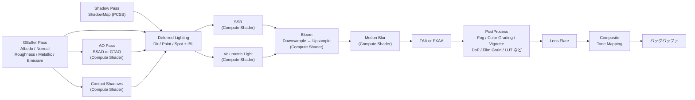
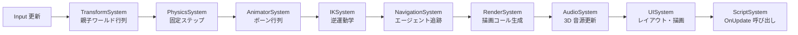

# FBZZ Engine

C++20 で自作する 3D ゲームエンジン。数学・物理エンジンをゼロから実装し、DirectX 11 レンダラーを抽象インターフェースで隠蔽する設計。スクリプト DLL のホットリロード、ノードベースのアニメーショングラフ、ナビゲーションメッシュ、地形・水面・フォリッジ編集を備えたフルセット開発環境。TPS サンプルゲーム (Title / Load / Main / Result の 4 シーン) を同梱。

---

## 特徴

- **数学ライブラリ自作** — Vector2/3/4・Matrix3/4・Quaternion・Ray・Frustum・Plane を GLM に頼らず実装
- **物理エンジン自作** — GJK + EPA 衝突検出・BVH ブロードフェーズ・インパルスソルバー・CCD・各種コンストレイント。Bullet / PhysX 不使用
- **抽象レンダラー** — `IRenderer` インターフェースで DX11 実装を隠蔽。DX12 / レイトレーシングへ差し替え可
- **Deferred + Forward ハイブリッドレンダリング** — RenderGraph が依存 DAG を静的解析し、一時リソースをフレーム間でエイリアシング
- **PBR 遅延レンダリング** — GBuffer → 遅延ライティング → SSAO / GTAO → Bloom → FXAA / TAA → Composite パイプライン
- **IBL (Image-Based Lighting)** — HDRI からキューブマップをベイク。Irradiance Convolution + Prefiltered Environment Map で PBR に統合
- **高品質シャドウ** — PCSS (Poisson Disk Blocker Search) によるソフトシャドウ、Contact Shadows
- **スクリーンスペースエフェクト** — SSR / SSAO / GTAO / Motion Blur / Volumetric Light / Lens Flare
- **スケルタルアニメーション + アニメーショングラフ** — FBX インポート・GPU スキニング・ノードベースのステートマシン
- **ナビゲーションメッシュ** — NavMesh ベイク・エージェント・パトロール・センサー・オフメッシュリンクを実装
- **地形・フォリッジ・水面** — ハイトマップ編集・フォリッジ GPU カリング・リアルタイム水面 (SSR 対応)
- **スクリプト DLL ホットリロード** — Play 中にスクリプトを再コンパイルして即時反映
- **ScriptProxy システム** — 27 種のプロキシ経由でスクリプトからエンジン全機能に型安全アクセス
- **カスタムメモリシステム** — Frame / Linear / Pool / Stack アロケーターとリークトラッカー
- **GameHub** — Unity Hub 相当のプロジェクト管理・起動ランチャー
- **ImGui フルエディター** — 地形・フォリッジ・水面ツール・アニメーショングラフ・アセット依存関係ビューを搭載
- **カスタムポストプロセス** — スクリプトからユーザー定義レンダーパスを RenderGraph に挿入可能
- **Win32 ネイティブ** — GLFW に依存せず Win32 API でウィンドウ・入力を管理
- **C++20** — `std::span`・Concepts・Designated initializers を活用

---

## ロードマップ

| バージョン | マイルストーン | 状態 |
|-----------|--------------|------|
| v0.8 | Advanced Rendering Pipeline + TPS サンプルゲーム同梱 | ✅ 完了 |
| v0.9 | Demo Game — エンジン全機能を活かした完成品デモ | 🔧 実装中 |
| v1.0 | DirectX 12 完全移行 — DX12Renderer による IRenderer 差し替え | 🔲 予定 |

### v0.8 — Advanced Rendering Pipeline
RenderGraph ベースの Deferred + Forward ハイブリッド。IBL / PCSS / GTAO / SSR / TAA / Volumetric Light / Contact Shadow / Lens Flare を実装。TPS サンプルゲーム (Title / Load / Main / Result) を同梱。

### v0.9 — Demo Game
エンジンの各システム (物理・NavMesh・アニメーション・スクリプト DLL・ポストプロセス) をフル活用した、公開可能な完成品デモゲームを制作。

### v1.0 — DirectX 12 完全移行
`IRenderer` インターフェース経由で DX12Renderer を差し替え、DX12 の明示的なリソース管理・マルチキューを活用。レイトレーシング対応も視野に入れる。

---

## 実装済みシステム

### コアエンジン

| システム | 概要 |
|---------|------|
| `Application` | メインループ。固定 Update (物理) + 可変 Update (ゲーム) + Render の 3 フェーズ |
| `Window` | Win32 API によるウィンドウ生成・リサイズ・フルスクリーン |
| `Time` | `deltaTime` / `fixedDeltaTime` / `timeScale` 管理 |
| `Logger` / `ILogSink` | ログレベル付きログ。`ILogSink` で Console パネルへ転送 |
| `Input` | キーボード・マウスの状態管理 (`GetKey` / `GetKeyDown` / `GetKeyUp`) |
| `EventBus` | 型安全なグローバルイベントバス |
| `TaskSystem` | スレッドプールによる非同期タスク実行 |
| `SystemScheduler` | Phase・ComponentAccess に基づくシステム実行順序管理 |
| `ProjectSettings` | プロジェクト設定の読み書き |

### メモリシステム

| クラス | 概要 |
|--------|------|
| `FrameAllocator` | フレーム単位でリセットされる線形アロケーター |
| `LinearAllocator` | 前端から積み上げ式に確保するアロケーター |
| `PoolAllocator` | 固定サイズブロックのプールアロケーター |
| `StackAllocator` | マーカーによるスタック式アロケーター |
| `MemoryTracker` / `MemoryDebug` | 確保・解放の追跡とリーク検出 |

### プロファイラー

| クラス | 概要 |
|--------|------|
| `Profiler` | フレームごとのタイミング計測とデータ収集 |
| `ProfileScope` / `ProfilerMarker` | スコープ単位の自動計測マーカー |
| `ProfilerViewer` | ImGui によるプロファイル結果の可視化 |

---

### シーン管理 (GameObject / Component パターン)

| クラス | 概要 |
|--------|------|
| `Scene` | エンティティ管理・システム実行 |
| `GameObject` | エンティティのラッパー。`AddComponent<T>` / `GetComponent<T>` |
| `Transform` | 位置・回転・スケール。親子階層・ワールド行列キャッシュ |
| `SceneManager` | シーン遷移・ロード管理 |
| `SceneSerializer` | TOML (.scene) 形式でシーンを保存・読み込み |
| `Script` / `ScriptComponent` | MonoBehaviour 相当。`OnStart` / `OnUpdate` をオーバーライドして使う |
| `ScriptFactory` | スクリプト DLL から型を動的生成 |
| `EntityRef` / `PrefabRef` | エンティティ・プレハブへの安全な参照 |

### ScriptProxy システム

スクリプトからエンジン各機能に型安全にアクセスするためのプロキシ層。DLL 境界を超えてエンジン実装に直接依存しない設計になっている。

| プロキシ | 提供機能 |
|---------|---------|
| `ScriptTransformProxy` | 位置・回転・スケールの取得・設定 |
| `ScriptPhysicsProxy` | 力の印加・RigidBody 操作 |
| `ScriptAnimatorProxy` | アニメーターパラメーターの読み書き |
| `ScriptCameraProxy` | カメラ FOV・ターゲット設定 |
| `ScriptInputProxy` | キー・マウス入力の取得 |
| `ScriptSceneProxy` | GameObject 検索・生成・破棄 |
| `ScriptAudioProxy` | サウンドの再生・停止 |
| `ScriptLightProxy` | ライトパラメーターの変更 |
| `ScriptMaterialProxy` | マテリアルプロパティの動的書き換え |
| `ScriptParticleProxy` | パーティクルの発生制御 |
| `ScriptNavigationProxy` | NavMesh エージェントの目標設定 |
| `ScriptTrailProxy` / `ScriptMeshTrailProxy` | トレイルエフェクト制御 |
| `ScriptUIProxy` | UI テキスト・画像の更新 |
| `ScriptPostProcessProxy` | ポストプロセスパラメーターの変更 |
| `ScriptDebugProxy` | デバッグ描画 |
| `ScriptMemoryProxy` | カスタムアロケーター経由のメモリ確保 |
| `ScriptCharacterProxy` | CharacterController の移動・ジャンプ操作 |
| `ScriptMeshProxy` | メッシュの動的差し替え・可視制御 |
| `ScriptIKProxy` | IK ターゲット位置・重みの設定 |
| `ScriptWaterProxy` | 水面パラメーター (波高・速度) の変更 |
| `ScriptEnvironmentProxy` | 環境光・大気パラメーターの変更 |
| `ScriptDecalProxy` | デカールのサイズ・マテリアル変更 |
| `ScriptVolumeProxy` | ポストプロセスボリュームのブレンド重み変更 |
| `ScriptReflectionProbeProxy` | リフレクションプローブの再ベイク要求 |
| `ScriptLifetimeProxy` | GameObject の残り寿命の取得・設定 |
| `GizmoProxy` | Gizmo のエディター描画 |

---

### コンポーネント

| コンポーネント | 概要 |
|--------------|------|
| `MeshRenderer` | スタティックメッシュの描画 |
| `SkinnedMeshRenderer` | スキンドメッシュ + GPU スキニング描画 |
| `AnimatorComponent` | `AnimationClip` の再生・ブレンド |
| `CameraComponent` | カメラ FOV / Near / Far 管理 |
| `LightComponent` | Directional / Point / Spot ライト |
| `EnvironmentLightComponent` | IBL 環境光 (HDRI キューブマップ参照) |
| `ReflectionProbeComponent` | ローカル反射キューブマップのベイクと適用 |
| `AtmosphericScatteringComponent` | 大気散乱シミュレーション (空・霞) |
| `ColliderComponent` | AABB / OBB / Sphere / Capsule / ConvexHull / TriangleMesh / HeightField コライダー |
| `RigidBodyComponent` | 物理剛体アタッチ |
| `CharacterControllerComponent` | 物理ベースのキャラクター移動 |
| `AudioSourceComponent` | XAudio2 サウンド再生 |
| `MaterialComponent` | マテリアル参照 |
| `ParticleEmitter` | CPU / GPU パーティクルシステム |
| `SkyRenderer` | スカイボックス / スカイドーム描画 |
| `VolumeComponent` | ポストプロセスボリューム (グローバル) |
| `PostProcessVolumeComponent` | ローカルポストプロセスボリューム (ブレンド範囲指定) |
| `TerrainComponent` | ハイトマップに基づくテレイン描画 |
| `TerrainGridComponent` | テレイングリッド管理 |
| `WaterComponent` | リアルタイム水面描画 |
| `DecalComponent` | デカール投影 |
| `TrailComponent` | モーション軌跡トレイル |
| `MeshTrailComponent` | メッシュベーストレイル |
| `IKSolverComponent` | インバースキネマティクス |
| `BoneComponent` | 個別ボーン操作 |
| `LifetimeComponent` | 一定時間後に GameObject を自動破棄 |
| `NavMeshAgentComponent` | NavMesh エージェント (目標追跡) |
| `NavMeshSurfaceComponent` | NavMesh ベイク面の定義 |
| `NavMeshModifierComponent` | NavMesh 領域の通行コスト変更 |
| `NavMeshOffMeshLinkComponent` | ジャンプ・梯子などのオフメッシュ接続 |
| `NavMeshPatrolComponent` | ウェイポイント巡回パトロール AI |
| `NavMeshSensorComponent` | 視野・感知センサー |
| `UICanvas` / `UIImage` / `UIText` / `UIButton` / `UILayoutGroup` / `UIAnimator` | UI コンポーネント群 |

### システム (毎フレーム実行)

| システム | 概要 |
|---------|------|
| `TransformSystem` | 親子階層のワールド行列を更新 |
| `PhysicsSystem` | 固定ステップ物理シミュレーション |
| `AnimatorSystem` | アニメーションクリップを進行し骨格行列を更新 |
| `RenderSystem` | メッシュ描画コールを生成し IRenderer に送信 |
| `AudioSystem` | 3D サウンド位置更新 |
| `UISystem` | UI レイアウト計算・描画 |
| `UIAnimatorSystem` | UI アニメーションの再生 |
| `ScriptSystem` | ユーザースクリプトの OnUpdate 呼び出し |
| `IKSystem` | ボーン IK の解決 |
| `NavigationSystem` | NavMesh エージェントの経路追跡 |
| `NavMeshBakeSystem` | NavMesh のランタイムベイク |
| `NavMeshPatrolSystem` | 巡回 AI の更新 |
| `NavMeshSensorSystem` | 感知センサーの判定 |
| `LifetimeSystem` | 期限切れ GameObject の自動破棄 |

---

### レンダラー (DX11 実装)

RenderGraph ベースの **Deferred + Forward ハイブリッド**。パス間の依存 DAG を静的解析し、一時 RenderTarget をフレームをまたいでエイリアシングすることでメモリを節約する。

| 機能 | 概要 |
|------|------|
| GBuffer パス | Albedo+Alpha / Normal (RGBA16F) / Roughness・Metallic・AO・Emissive |
| 遅延ライティング | Directional / Point / Spot ライトを GBuffer から解決 |
| IBL | HDRI → Irradiance Convolution + Prefiltered Cubemap (各 CS ベイク) を Deferred Lighting に統合 |
| シャドウマップ | Directional / Spot ライトの深度マップ |
| PCSS | Poisson Disk Blocker Search によるソフトシャドウ |
| Contact Shadows | スクリーンスペースのコンタクトシャドウ (CS) |
| SSAO | コンピュートシェーダーによるスクリーンスペース AO + ブラー |
| GTAO | Ground Truth Ambient Occlusion (CS)。SSAO と排他選択 |
| SSR | Screen Space Reflection (CS)。水面・光沢面の映り込み |
| Motion Blur | カメラ・オブジェクトのモーションベクターによるブラー (CS) |
| Volumetric Light | 体積光 (ゴッドレイ) のコンピュートシェーダー実装 |
| Bloom | Downsample / Upsample コンピュートシェーダー |
| FXAA | ファストアンチエイリアシング |
| TAA | Temporal Anti-Aliasing。FXAA と排他選択 |
| Lens Flare | スクリーンスペースレンズフレア |
| 選択アウトライン | エディター上の選択オブジェクトをアウトライン強調 |
| PostProcess | Fog / Color Grading / Vignette / Film Grain / Lens Distortion / Chromatic Aberration / Sharpen / Depth of Field / Sepia / Invert / Posterize / Pixelate / LUT (32³ Color LUT) など |
| カスタム PostProcess | スクリプトから `UserRenderPassDesc` を登録し AfterOpaque / AfterTransparent / BeforePostProcess に挿入 |
| 水面 / 焦散 | リアルタイム水面シミュレーション + 水中コースティクス + SSR 反射 |
| DebugDraw | 線・矩形・球・カプセルのワイヤーフレーム即時描画 |
| `RenderGraph` | 描画パスをグラフ構造として依存関係管理。未使用パスを自動カリング |
| `OcclusionCuller` | CPU Software Rasterizer によるオクルージョンカリング |
| `RenderLayer` | 描画レイヤー分離 |
| `FontAtlas` | フォントアトラス生成 |

### シェーダー (HLSL)

| カテゴリ | 内容 |
|---------|------|
| Surface マテリアル | PBR / Lit / BlinnPhong / Phong / Toon / Unlit / RimLight / Subsurface / Anisotropic / Dissolve |
| Skinned マテリアル | 上記すべての Skinned バリアント |
| カスタムマテリアル | CustomSurface / CustomSkinned (ユーザー拡張テンプレート) |
| Sky | Skybox / Skydome |
| Decal | Decal / DecalMask |
| エフェクト | Particle (CPU) / ParticleGPU (GPU) / ParticleGpuSim (CS) / Trail / MeshTrail / SkinnedMeshTrail |
| パイプライン | GBuffer / DeferredLighting / ShadowMap / SkinnedShadowMap / DepthCopy |
| IBL ベイク | EquirectToCubemap (CS) / IrradianceConvolution (CS) / PrefilteredEnvMap (CS) / BRDFIntegration (CS) |
| PostProcess — AO | SSAO (CS) / SSAOBlur (CS) / GTAO (CS) / GTAOBlur (CS) |
| PostProcess — AA | FXAA / TAA |
| PostProcess — 反射 | SSR (CS) |
| PostProcess — シャドウ | ContactShadows (CS) |
| PostProcess — ライティング | VolumetricLight (CS) |
| PostProcess — モーション | MotionBlur (CS) |
| PostProcess — フレア | LensFlare |
| PostProcess — カラー | Composite (ToneMap + Color Grading) / CopyColor |
| PostProcess — カスタム | CustomPostProcess / CustomPostProcessTemplate |
| 地形 | Terrain |
| 水面 | Water / Caustics |
| UI | UISprite / UIText |
| 共通ライブラリ | Atmosphere / BRDF / Cloud / Fog / IBL / Lighting / PostProcess / Shadow / ToneMap |

---

### 物理エンジン

| 機能 | 概要 |
|------|------|
| 衝突形状 | AABB / OBB / Sphere / Capsule / ConvexHull / TriangleMesh / HeightField |
| ブロードフェーズ | BVH (Bounding Volume Hierarchy) |
| ナローフェーズ | GJK + EPA |
| CCD | 連続衝突検出 |
| コンストレイント | Distance / Hinge / Spring / Rope / Chain / Fixed / Slider |
| ソルバー | インパルスベース・半陰的オイラー積分 |
| `PhysicsMaterial` | 摩擦・反発係数設定 |

### スケルタルアニメーション

| 機能 | 概要 |
|------|------|
| `Skeleton` | ボーン階層データ |
| `AnimationClip` | キーフレーム列 (位置・回転・スケール) |
| `AnimatorControllerAsset` | ノードベースのアニメーションステートマシン |
| `ModelImporter` | Assimp 経由で FBX からスケルタルデータをインポート |
| GPU スキニング | `SkinnedPBR.hlsl` / `SkinnedLit.hlsl` 等でボーン行列を GPU 適用 |
| IK | `IKSolverComponent` + `IKSystem` でリアルタイム逆運動学 |

### ナビゲーションシステム

| 機能 | 概要 |
|------|------|
| NavMesh ベイク | `NavMeshSurfaceComponent` で定義した面を実行時にベイク |
| 経路探索 | `NavMeshAgentComponent` に目標を設定し自動追跡 |
| オフメッシュリンク | ジャンプ・梯子など接続可能な特殊リンク |
| 通行コスト調整 | `NavMeshModifierComponent` で領域ごとにコストを変更 |
| パトロール AI | `NavMeshPatrolComponent` でウェイポイント巡回 |
| センサー | `NavMeshSensorComponent` で視野・感知判定 |

### 地形 / フォリッジ / 水面

| システム | 概要 |
|---------|------|
| テレイン | ハイトマップ読み込み・表示・`HeightFieldCollider` で物理コライダー自動生成 |
| 水面 | ノーマルアニメーション + 焦散エフェクト + SSR 反射 |

### スクリプティングシステム

| 機能 | 概要 |
|------|------|
| `ScriptCodeGen` | コンポーネント定義から `.generated.hpp` を自動生成 |
| `ScriptDllLoader` | スクリプトを別 DLL としてビルド・ロード |
| ホットリロード | Play 中に DLL を再ビルドして差し替え可能 |
| `Script` 基底 | `OnStart` / `OnUpdate` に加え ScriptProxy 経由で全サブシステムへアクセス |

### アセット管理

| 機能 | 概要 |
|------|------|
| `AssetManager` | モデル・テクスチャ・マテリアル・アニメーションのキャッシュ管理 |
| `ResourceManager` | GPU リソース (`IBuffer` / `ITexture` / `IShader`) のプール管理 |
| `AssetHandle` | 型安全なアセット参照 |
| `AssetFileWatcher` | ファイル変更を監視して自動再インポート |
| カスタム形式 | `.fzasset` (汎用) / `.mesh` (メッシュサブアセット) / `.scene` (シーン) / `.terrain` / `.mat` / `.tex` / `.fzpp` (PostProcess プロファイル) |
| `FbxImportTool` | FBX を複数サブアセット (Model / Skeleton / AnimationClip / Material / Texture) に分解するインポートパイプライン |

---

### エディター (ImGui)

| パネル | 概要 |
|--------|------|
| Hierarchy | シーン内の GameObject ツリー表示・選択・作成・削除 |
| Inspector | 選択オブジェクトの全コンポーネント編集。カテゴリ別実装 (Animation / Audio / Core / Effects / Environment / Lighting / Material / Navigation / Physics / Rendering / TerrainWater / UI) |
| AssetBrowser | プロジェクトアセットのファイルブラウザ。インポート・プレビュー・ドラッグ & ドロップ対応 |
| Viewport | ゲームビュー描画・Gizmo 操作・ピッキング・シーンギズモ |
| AnimationGraph | ノードベースのアニメーションステートマシンエディター |
| Console | `Logger` のログ出力表示 |
| StatusBar | 再生・停止・Gizmo 切り替えツールバー |
| MapEditor | マップレイアウト編集 |
| DependencyView | アセット間依存関係のビジュアライゼーション |
| BuildSettings | ビルドターゲットと出力設定 |
| ProjectSettings | プロジェクト全体設定 |
| UndoHistory | アンドゥスタックの履歴一覧 |
| HotkeyEditor | キーバインドのカスタマイズ |
| Analysis | パフォーマンス分析 |
| PlayModeController | Play / Stop によるシーン状態のスナップショット復元 |

| エディターツール | 概要 |
|----------------|------|
| TerrainTool | ハイトマップ・テクスチャ・法線のペイント |
| WaterTool | 水面領域の定義とパラメーター調整 |

| ユーティリティ | 概要 |
|--------------|------|
| `UndoStack` | 任意操作のアンドゥ・リドゥ |
| `HotkeyManager` | カスタマイズ可能なキーバインド管理 |
| `SceneIO` | シーンの保存・読み込みフロー |
| `SceneDirtyTracker` | 未保存変更の追跡 |
| `PrefabSerializer` | プレハブの保存・ロード |
| `ModelPlacement` | ビューポート上へのモデル配置支援 |
| `EditorTheme` | ImGui テーマのカスタマイズ |
| `BuildPipeline` | アセットパッキングを含むゲームビルドパイプライン |
| `Compiler` | MSVC ツールチェーンの呼び出し制御 |
| `StandaloneLauncher` | スタンドアロンゲームの起動 |

### GameHub

Unity Hub に相当する Electron / React / TypeScript 製プロジェクト管理ランチャー。エディターとは独立したアプリケーションとして動作する。

| 機能 | 概要 |
|------|------|
| `App.tsx` | プロジェクト一覧・作成・設定画面の React UI |
| `ProjectService` | プロジェクト検証・サムネイル取得・エディター起動 |
| `TemplateService` | プロジェクトテンプレートからの新規作成 |
| `ConfigStore` | C++ 版と互換性のある TOML 設定の永続化 |
| `preload` / `ipc` | Renderer と OS 権限を分離する安全な API 境界 |

### オーディオ

| 機能 | 概要 |
|------|------|
| `XAudio2Device` | `IAudioDevice` 実装。XAudio2 による 3D サウンド再生 |

---

## サンプルゲーム

TPS (三人称視点) ゲームが同梱されており、エンジンの各機能を実際のゲームロジックとして確認できる。

| シーン | 内容 |
|--------|------|
| `Title.scene` | タイトル画面。ボタン入力でゲームシーンへ遷移 |
| `Load.scene` | ロード画面。アセット読み込み中に表示 |
| `Main.scene` | ゲームプレイシーン。TPS カメラ + キャラクター操作 + テレイン |
| `Result.scene` | リザルト画面 |

シーン遷移はフェードイン / アウト付き (`SceneManagerScript`)。キャラクター操作は `PlayerControllerComponent`・カメラは `TpsCameraComponent` で実装。

---

## モジュール構成

```
FBZZ_Engine/
├── Projects/
│   ├── Math/           独立ライブラリ。GLM 不使用の自作数学ライブラリ
│   ├── Physics/        独立ライブラリ。Math をリンク (Bullet / PhysX 不使用)
│   ├── Engine/         コアエンジン。Physics / Math をリンク
│   ├── Editor/         ImGui フルエディター。Engine をリンク
│   ├── EditorLauncher/ エディター起動用スタンドアロンランチャー
│   ├── GameHub/        Electron 製プロジェクト管理ランチャー (Unity Hub 相当)
│   ├── Sandbox/        動作確認・サンプルアプリ
│   └── Tests/          単体テスト
├── Assets/
│   ├── Shaders/        HLSL シェーダー群 (compiled/ に事前コンパイル済み .cso)
│   ├── Scenes/         シリアライズ済みシーン (.scene / .animgraph)
│   ├── Materials/      マテリアルアセット (.mat)
│   ├── Scripts/        スクリプトコンポーネント (+ コード生成済み .generated.hpp)
│   └── Terrain/        テレインアセット (.terrain)
├── ThirdParty/         Assimp / DirectXTex / ImGui / ImGuizmo / ImNodes / toml++ / stb / TinyEXR
└── Docs/               規約・アーキテクチャドキュメント
```

依存方向: `Sandbox / Editor / GameHub → Engine → Physics → Math`

### モジュール依存関係図

```mermaid
graph LR
    subgraph サードパーティ
        TP["Assimp / ImGui / ImGuizmo\nImNodes / DirectXTex / toml++\nstb / TinyEXR / XAudio2 / DirectX11"]
    end

    subgraph コアライブラリ
        Math
        Physics
        Engine
    end

    subgraph アプリケーション
        Editor
        EditorLauncher
        GameHub
        Sandbox
        Tests
    end

    Math --> Physics
    Math --> Engine
    Physics --> Engine
    TP --> Engine
    TP --> Editor
    Engine --> Editor
    Engine --> Sandbox
    Engine --> Tests
    Editor --> EditorLauncher
    GameHub -. プロセス起動 .-> EditorLauncher
```



### レンダリングパイプライン



### システム実行順序 (1 フレーム)



---

## ビルド方法

### 要件

| ツール | バージョン |
|--------|----------|
| OS | Windows 10 / 11 |
| Visual Studio | 2022 以降 (C++20 対応) |
| CMake | 3.20 以上 |
| Windows SDK | DirectX 11 同梱版 |

### 手順

```powershell
git clone https://github.com/Ungoi18/FBZZ_Engine.git
cd FBZZ_Engine
cmake -B build -G "Visual Studio 17 2022" -A x64
```

VSCode または Visual Studio でソリューションを開いてビルド。  
シェーダーは Editor/CMake が自動収集し、`Assets/Shaders/compile_shaders.ps1` がinclude依存を含む差分だけをコンパイル。

> **注意:** ターミナルから `ninja` / `cmake --build` を直接実行しないこと。MSVC 環境変数が設定されていないためコンパイルエラーになる。VSCode / Visual Studio からビルドすること。

---

## テスト

GoogleTest / GoogleMock による自動テスト。GoogleTest は `ThirdParty/GoogleTest/` に vendor 済みで、clone 直後にそのままビルドできる (ネットワーク取得なし)。

規約は [`Docs/conventions/test.md`](Docs/conventions/test.md)。

### 構成

| 層 | 置き場所 | CTest 登録 | 判定 |
|---|---|---|---|
| **Auto** | `Projects/Tests/<Domain>/Auto/` | する | コードが自動判定 |
| **Manual** | `Projects/Tests/<Domain>/ManualTest/` | しない | 開発者が目で判定 (OS 状態を書き換えるため) |
| **Bench** | `Projects/Tests/Bench/` | しない | 絵を見て判定 (`FBZZTestBench.exe`) |

テスト対象は **自作した部分**に絞っている。数学・物理・メモリはゼロから実装しており、壊れても目視では気づけないため。

| スイート | 対象 |
|---|---|
| `FBZZTestsMathAuto` | Vector3 / Quaternion / Matrix4 — 左手座標系の規約、合成順、投影の深度範囲 |
| `FBZZTestsPhysicsAuto` | GJK / EPA / Collider / AABB / BVH / XPBD |
| `FBZZTestsCoreAuto` | アロケーター 4 種 / Scheduler / TaskSystem / Signal / Logger / Time |
| `FBZZTestsEngineAuto` | RagdollRig |

共通の土台は `FBZZTestKit` (静的ライブラリ)。数学型の近似比較マクロ、失敗メッセージ用の `PrintTo`、テスト名から決まる固定シード乱数、一時ディレクトリ、Logger の fake と mock を持つ。

### 実行

VS Code から `Ctrl+Shift+P` → `Tasks: Run Task`：

| タスク | 内容 |
|---|---|
| `Tests: Build & Run Suite (Debug)` | スイートを選んでビルド → 実行 |
| `Tests: Shuffle Suite (Debug)` | 順序を混ぜて 10 回。実行順依存の炙り出し |
| `CMake: Build Tests (Debug)` | 全スイート + ベンチをビルド |
| `Tests: Coverage (Debug)` | カバレッジ計測 |
| `Bench: Build & Run (Debug)` | ビジュアル検証ベンチ |

デバッガーを付けるときは `F5` から `Tests: Physics Auto (Debug)` 等を選ぶ（`--gtest_filter` を対話入力）。

exe を直接起動した場合、結果のコンソールは**終了時に自動で閉じません**（自分だけがそのコンソールに繋がっているときに入力待ちで止まる）。文字サイズは画面の DPI に合わせて調整され、`FBZZ_CONSOLE_FONT_SIZE` で上書きできる。

```powershell
ctest --test-dir build/Debug -C Debug --output-on-failure
ctest --test-dir build/Debug -C Debug -R Physics          # 名前で絞る

# 実行順に依存したテストの炙り出し (定期的に回す)
.\build\Debug\Binaries\Debug\Tests\FBZZTestsPhysicsAuto.exe --gtest_shuffle --gtest_repeat=10
```

### ビジュアル検証ベンチ

`FBZZTestBench.exe` は、数値では判定できない挙動を目で確かめる層。ImGui の 2D 直交ビューに物理をそのまま描く。

- **XPBD: 刻みと静止位置** — substep 2 / 8 / 32 を並走させ、静止位置が一致するか
- **XPBD: 関節の鎖** — 可動域で止まるか、トルク上限で力負けするか
- **GJK / EPA: 接触の法線と深さ** — 形状を動かしたときに法線が飛ばないか
- **BVH: 木の形と問い合わせ** — 枝刈りの効き具合 (総当たり件数を常時併記)

### カバレッジ

行カバレッジを [OpenCppCoverage](https://github.com/OpenCppCoverage/OpenCppCoverage) で計測し、CI が PR にコメントする。

```powershell
choco install opencppcoverage
.\Tools\RunCoverage.ps1              # Artifacts/Coverage/html/index.html に出力
```

計測対象は `Projects/Math` / `Projects/Physics` / `Projects/Engine/src/Core` に限定している。テストを書かないと決めた Renderer / Editor を分母に入れると、数値が実態を表さなくなるため。

> MSVC + OpenCppCoverage が出せるのは**行カバレッジ (C0 相当)** で、分岐 (C1) カバレッジは含まない。分岐まで測るには clang-cl + llvm-cov による 2 本目のツールチェーンが必要になる。

### CI

[`.github/workflows/tests.yml`](.github/workflows/tests.yml) が `windows-latest` で configure → テスト exe のみビルド → `ctest` → カバレッジ計測 → PR コメント / ジョブサマリー / HTML レポートのアーティファクト添付までを行う。

リポジトリ変数 `FBZZ_COVERAGE_MIN` を設定すると、その値を下回った時点で CI が落ちる (未設定なら素通り)。

---

## 使用ライブラリ

| ライブラリ | 用途 |
|-----------|------|
| DirectX 11 SDK | レンダリング API |
| Microsoft::WRL (ComPtr) | COM リソース RAII |
| XAudio2 | 3D オーディオ |
| Assimp | FBX / OBJ メッシュ・スケルタルデータ読み込み |
| ImGui | エディター UI |
| ImGuizmo | エディター Gizmo |
| ImNodes | ノードエディター (アニメーショングラフ) |
| toml++ | シーンシリアライゼーション |
| stb_image | テクスチャ読み込み |
| DirectXTex | テクスチャ処理 |
| TinyEXR | HDR / EXR テクスチャ読み込み (IBL 用 HDRI) |

## 使用アセット

- 一部テレインテクスチャ: [ambientCG](https://ambientcg.com/) (CC0)
- キャラクターモデル・アニメーション: [Mixamo](https://www.mixamo.com/) (Adobe 無償ライセンス)

---

## ライセンス

MIT License — 詳細は [LICENSE](LICENSE) を参照。
